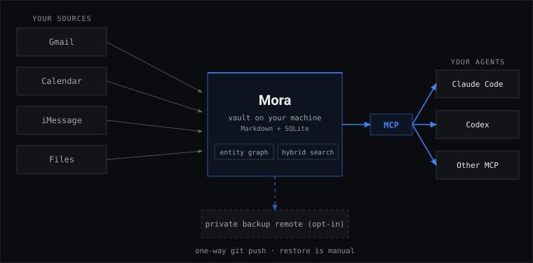

<div align="center">


# Mora

**Give every AI agent one local, searchable memory of your mail, messages, calendars, files, and GitHub issues.**

[](https://github.com/pyranthus-hq/mora/actions/workflows/ci.yml)
[](https://github.com/pyranthus-hq/mora/releases)
[](LICENSE)
[](go.mod)
[](#privacy-boundary)

</div>

> [!WARNING]
> Mora is alpha software. We use it every day, and its main paths have tests.
> It has not been tested on many other people's real data. Read the cited source
> before you act on a result. A failed or old sync can make the local copy stale.

Mora copies six kinds of data into readable Markdown on your computer:

- Gmail
- Google Calendar
- iMessage on macOS
- Apple Calendar on macOS
- folders and files that you choose
- GitHub Issues from repositories that you choose

The source connectors are read-only. Mora builds a local SQLite search index
from the Markdown. Claude Code, Codex, and other agents can use the same memory
through MCP, a standard way for an agent to call local tools.

By default, Mora does not run a language model. It finds evidence, keeps stable
IDs, and builds cited briefs. Your agent reads that evidence and writes the
answer. You can optionally use a local Ollama embedding model to improve
semantic search.

<p align="center">
  
</p>

## Set up Mora in about five minutes

### 1. Install the signed macOS app

New macOS users should install `Mora.app`. It is signed, notarized, and used as
the stable target for Full Disk Access.

```bash
(
  set -e
  mora_installer="$(mktemp -t mora-install)"
  trap '/bin/rm -f "$mora_installer"' EXIT
  curl -fsSLo "$mora_installer" https://raw.githubusercontent.com/pyranthus-hq/mora/main/install-app.sh
  sh "$mora_installer"
)
```

The installer checks the release before it installs
`~/Applications/Mora.app`. It links the `mora` command to the app. It does not
clear quarantine or sign the app again.

Homebrew installation is not public yet. The repository can deterministically
generate a signed-app Cask, but publishing remains blocked on the scheduled
update policy in [#291](https://github.com/pyranthus-hq/mora/issues/291) and the
release canary in [#294](https://github.com/pyranthus-hq/mora/issues/294). Do
not use the private legacy Cask; it installs the obsolete raw-binary shape.

Linux and older standalone installs can use:

```bash
curl -fsSL https://raw.githubusercontent.com/pyranthus-hq/mora/main/install.sh | sh
```

Windows users should see the [Windows guide](docs/windows.md). To build from
source with Go 1.25 or later:

```bash
go install github.com/pyranthus-hq/mora/cmd/mora@latest
```

Source builds report version `dev`. They do not update themselves. Google also
needs your own OAuth client when you build from source.

### 2. Start with one source

Mora is the local evidence store; your agent is the conversational interface. After
connecting a source, try: **“what did Sam and I decide about the launch?”** or
**“what's on my calendar next week?”** Reading and search retrieve local evidence;
saving a durable memory requires explicit write consent. You can disable a connector
or delete a saved memory at any time.

A folder is the quickest start. It needs no account login.

```bash
mora init
mora connect filesystem ~/Documents/notes
mora search "a project or person"
```

Then add only the sources you want:

```bash
mora connect google                         # Gmail and Google Calendar
mora connect github --repo owner/repository # GitHub Issues
mora connect imessage                       # macOS; needs Full Disk Access
```

For Apple Calendar:

```bash
mora connectors enable applecalendar
mora ingest run --source applecalendar
```

These words have different meanings:

| Command | What it does |
| --- | --- |
| `connect` | Sets up a source, enables it, and gets its first data. |
| `connectors enable` | Gives Mora permission to use a connector. It does not promise a data pull. |
| `ingest run` | Reads enabled sources and writes their current data into the vault. Use it for a first load or a backfill. |
| `sync` | Refreshes a source that is already set up. |

### 3. Give Mora to your agent

```bash
claude mcp add mora -s user -- mora mcp serve
codex mcp add mora -- mora mcp serve
```

Other MCP clients can start the same command:

```json
{
  "mcpServers": {
    "mora": { "command": "mora", "args": ["mcp", "serve"] }
  }
}
```

Mora has 12 MCP tools for search, reading, writing, briefs, meetings, and the
person graph. The command line covers the same core jobs and also manages setup
and maintenance.

Mora also publishes an experimental [Agent Plugins 1.0 package](plugins/mora/README.md)
that bundles the stdio MCP declaration with portable Agent Skills. It does not
install Mora, grant source permissions, or sandbox the client. Enabling it may
auto-start the local MCP server, so review the client's data policy and choose
`mora config mcp-write-policy propose` or `readonly` before first use.

### 4. Check health and add a schedule

```bash
mora doctor
mora schedule install ingest-hourly
mora schedule install pulse-daily
mora schedule list
```

On macOS, jobs from a signed app launch through `Mora.app`. This lets macOS use
the app's Full Disk Access identity. Mora records its own sync result because
the macOS app launcher does not return the inner command's exit code.

## Full Disk Access on macOS

iMessage and Apple Calendar are local, but macOS still protects their files.
Mora cannot grant this permission for you.

1. Install the signed `Mora.app` first.
2. Open **System Settings**.
3. Open **Privacy & Security**, then **Full Disk Access**.
4. Press **+** and choose `~/Applications/Mora.app`. You may need to press
   Command-Shift-G and type that path.
5. Turn Mora on. If macOS asks, quit and reopen the app or terminal.
6. Run `mora doctor`.
7. Run `mora sync imessage` or `mora sync applecalendar`.

If an old Mora entry is present, keep it until both checks pass through the new
app. Then remove the old entry yourself. Mora can report whether a protected
read worked. It cannot claim that you clicked a setting.

Mora.app v0.12.1 and later replace the whole signed app bundle during
`mora upgrade` and check the result. If you still use v0.12.0, rerun the app
installer once instead of using that version's upgrade command. Do not replace
only `Mora.app/Contents/MacOS/mora`; that breaks the app signature.

One real signed v0.12.3 to v0.12.4 update preserved iMessage and Apple Calendar
access without another grant on one tested Mac. This is useful evidence, not a
guarantee for every Mac. After an update, run `mora doctor` and a protected
sync. Re-grant access if macOS asks.

## Ask an agent to set it up

Copy this prompt into an agent that can run local shell commands:

```text
Install Mora from the official pyranthus-hq/mora repository and set up a small,
safe first run. On macOS, use the signed Mora.app installer, not the standalone
installer. Verify `mora version` and run `mora doctor`. Ask me before any Google
OAuth approval, GitHub token use, Full Disk Access change, backup, sharing, or
schedule install. Do not say you clicked or approved a system screen. I will do
those steps myself. Start with one folder that I choose, connect it, run a test
search, then offer to wire `mora mcp serve` into my agent. Report every command,
what it changed, and any check that did not pass.
```

## Use Mora every day

```bash
mora brief                                      # what changed and what matters
mora search "What is open with Sam?"           # direct recall
mora think "What did we decide about pricing?" # evidence plus gaps for an agent
mora write --scope project:acme --type decision \
  --title "OAuth" --text "Use PKCE."            # save a decision
mora brief --event-id calendar_event/abc        # cited meeting prep
mora tasks list                                 # open local tasks
mora doctor                                     # source and index health
```

Useful flows:

- Start a work session with `mora brief`.
- Search for a person, project, issue, or decision with `mora search`.
- Use `mora think` when the answer needs several pieces of evidence.
- Save a note, fact, decision, or insight that you want agents to remember with
  `mora write`.
- Use `mora brief --event-id <id>` before a meeting.
- Capture and close small local tasks with `mora tasks add`, `list`, and `done`.
- Run `mora doctor` when results look old or incomplete.

Mora can install Claude Code hooks too:

```bash
mora hook install
mora hook status
```

The `SessionStart` hook adds the brief. The `UserPromptSubmit` hook adds a small
set of related memories for each prompt. Mora keeps existing valid Claude
hooks. It refuses to rewrite a settings file that it cannot parse.

## Correct or remove memory

Mora can propose that two addresses belong to the same person. It never accepts
the match on its own.

```bash
mora teach identity list
mora teach identity confirm --handle <phone> --email <address> --yes
mora teach identity reject --handle <phone> --email <address>
```

You can correct a cited commitment or a note that you wrote:

```bash
mora teach commitment wrong-direction --memory-id <id> --direction owed_by_self --yes
mora teach commitment already-closed --memory-id <id> --yes
mora teach memory correct --id <id> --title "Correct title" --text "Correct text" --yes
mora teach history --memory-id <id>
mora teach undo <ledger-id>
```

`mora delete` removes one memory now. A later source sync can restore connector
data. Use `mora forget` when the removal must remain after sync:

```bash
mora forget --chat <stable-id> --dry-run
mora forget --chat <stable-id> --yes
mora forget list
mora unforget <entry-id> --yes
```

Forget changes only Mora's local copy. It never deletes the source message,
event, or issue.

## Backup and sharing are separate choices

Mora offers three different paths:

| Path | Leaves this computer? | Encryption added by Mora? | Use |
| --- | --- | --- | --- |
| `mora backup` | No | No | Make a local `.tar.gz` copy in Mora's state directory. |
| `mora sync git` | Yes, if the remote is off-device | No | Push the plaintext vault to a private git remote you control. |
| `mora share` | Yes | Yes, with age | Send only authored memories from one scope through private git or your S3/R2 bucket. |

The vault contains plaintext. A private git remote is private by access rules,
not by Mora encryption. `mora share` encrypts before upload, but the remote can
still reveal file sizes and update timing. A person who already downloaded a
share keeps that copy.

See the [guide](docs/guide.md#backup-and-sharing) before you enable a network
path.

## Browser access on this computer

An agent that cannot start a local process can use Mora's loopback HTTP server:

```bash
mora serve http
# or keep it running as a user service
mora serve http install
mora serve http status
```

It binds only to `127.0.0.1`, uses a bearer token, and does not enable CORS.
Loopback means this computer only. It is still a local security boundary: any
process that gets the token can call the allowed routes. The generic HTTP call
route does not expose `delete_memory`.

## Control writes from MCP

```bash
mora config mcp-write-policy open
mora config mcp-write-policy propose
mora config mcp-write-policy readonly
```

- `open` lets the connected agent write and delete. This is the default.
- `propose` stores write proposals for local approval. It refuses deletes.
- `readonly` refuses writes and deletes.

Review proposals with `mora mcp proposals list`, `approve`, and `reject`.

## Durable loops

Long-running automation can record a lease and a result. This prevents two
workers from doing the same scheduled work at once.

```bash
mora loop register daily-report --cadence daily --command "my-report-command"
mora loop begin daily-report
mora loop heartbeat daily-report --run <run-id>
mora loop done daily-report --run <run-id> --ok
mora loop status daily-report
mora loop list
```

The built-in daily brief uses this system. A crash can leave a run marked
uncertain. Inspect it before you repeat an outside action.

## Update or uninstall

```bash
mora upgrade --policy auto|notify|off
mora upgrade --status --json
mora upgrade --check
mora upgrade
mora schedule list
mora schedule uninstall <each-job-name-shown>
mora hook uninstall
mora serve http uninstall
```

The internal scheduled-check path now honors the selected policy: `notify`
checks and posts restrained reminders, `off` performs no network, notification,
or state write, and `auto` may replace only a writable, verified `Mora.app` after
strict health and a second identity check. It records rollback/rebuild outcomes
locally. No update schedule is installed yet, so bare `mora upgrade` remains the
normal explicit update command until the scheduling PR lands.

For the signed macOS app, use the checked `uninstall-app.sh` command in the
[guide](docs/guide.md#uninstall). The uninstaller keeps the vault, settings,
state, and standalone migration backup. It does not remove scheduled jobs, so
remove every job shown by `mora schedule list` first.

## Data layout

| Path | Holds | Can Mora rebuild it? |
| --- | --- | --- |
| `~/vault/mora` | Markdown memories | No. Back it up. |
| `~/.local/share/mora` | SQLite index and received shares | Yes, except received share data must be pulled again. |
| `~/.local/state/mora` | Sync state, local usage log, local backups | Usually. |
| `~/.config/mora` | Settings, OAuth tokens, share keys | No. Reconnect or restore it. |

Run `mora config` to see the active paths. `MORA_VAULT` can select another
absolute vault path for one process. It does not change `config.toml`.

## Privacy boundary

- Source access is read-only. Google uses `gmail.readonly` and
  `calendar.readonly`. iMessage uses `mode=ro`. Apple Calendar uses `mode=ro`
  plus SQLite `query_only(1)` so it can read the live write-ahead log safely.
- The vault, index, tokens, sync state, and usage log stay local by default.
- Mora uses the network for source APIs, GitHub release checks, and any backup
  or share target that you choose.
- Optional Ollama embeddings are allowed only on a loopback address.
- Mora's local usage log leaves out query text by default. Turn it off with
  `mora usage off` or `DO_NOT_TRACK=1`.
- A cloud agent is a separate boundary. After it reads a Mora result, its model
  provider and data rules apply.
- Files are plaintext on disk. Use FileVault, BitLocker, or other disk
  encryption. Do not put the vault in an unencrypted remote.

## Search and proof

With the default static embedder, Mora searches parent memories and bounded
Gmail/iMessage message segments with full-text search. With an active semantic
Ollama embedder, it combines full-text, vector, person-graph, and message-segment
results with Reciprocal Rank Fusion. That name means it joins ranked lists by
position instead of comparing unrelated raw scores.

Mora's frozen test corpora start from a written answer key. Tests render mail,
messages, and events from that key, pin every byte, run the real brief and
meeting code, and check citations and commitment fields. Mutation tests also
break each important gate on purpose and require a test to fail. This is strong
proof against known regressions. It is not proof that every real inbox or
calendar will work.

The fixtures and scores are in [`internal/mora/eval/`](internal/mora/eval/).
The method is in [evaluation and testing](docs/architecture/09-eval-and-testing.md).

Source receipts include the observation and attempt times, last success, next
expected run, duration, freshness budget, consecutive failures, and a
correlation ID. A source cannot report `fresh` unless its observation and last
success both fall inside that budget. Search evidence manifests carry the
ingest correlation ID for each cited memory plus a deterministic query ID;
sanitized stage events live only in Mora's state directory under
`observability/traces.jsonl`. Doctor uses the same ID as its diagnostic evidence
link. Trace events never contain source content or local paths.

## More

- [Guide](docs/guide.md) — commands, connectors, and upkeep.
- [Architecture](docs/architecture/00-overview.md) — current design and code map.
- [Contributing](CONTRIBUTING.md) — build and review rules.
- [Security](SECURITY.md) — report a problem privately. Never paste vault data
  or credentials into a public issue.

---

<div align="center">
<sub>Named for <strong>Hermaeus Mora</strong>, keeper of knowledge and memory.</sub>
</div>
