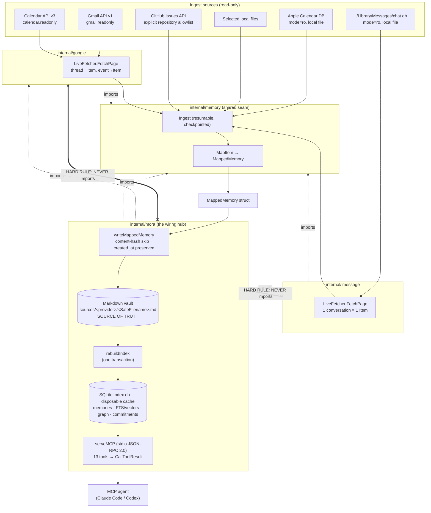

# Mora — Architecture Spec

Mora is a local-first memory CLI for any agent. One pure-Go binary ingests
Gmail, Google Calendar, selected files, iMessage, Apple Calendar, and GitHub
issues into readable Markdown. It indexes the
Markdown in an embedded `modernc.org/sqlite` database. The index has FTS5,
per-row vectors, and a derived person graph. Mora serves the data to any MCP
agent through a stdio JSON-RPC server.

This document starts the AS-BUILT spec. It states what current `main` does.
The linked subsystem documents give more detail. Roadmap work
stays in the LLM wiki, not this repo.

## Files

The overview owns no code. The system-wide claims below come from these main
files. Generated `dist/` output is not part of this source-of-truth surface.

| File | Responsibility |
|---|---|
| `cmd/mora/main.go` | Entrypoint: stamps `-ldflags` version/commit/date into `mora.BuildVersion`, then delegates to `mora.Run(ctx, args, stdout, stderr, stdin)` with streams as parameters (the byte-clean test seam). |
| `go.mod` | Module `github.com/pyranthus-hq/mora`, `go 1.25.8`; `modernc.org/sqlite v1.29.0` is the **only** SQL engine (no cgo driver in the graph) — this is what keeps `CGO_ENABLED=0` possible. |
| `AGENTS.md` | Agent/reviewer charter: hard rules (no-cycle, pure-Go, read-only/zero-egress, honest-snapshot). |
| `internal/mora/mora.go` | The hub: CLI dispatch (`Run`) and the static connector catalog. Cohesive subsystems live in same-package siblings including `ingest.go`, `index.go`, `mcp.go`, `search.go`, `digest.go`, and `doctor.go`. |

## What it is, end to end

Eight core internal Go packages form one binary (plus `cmd/mora`).
**`internal/memory` is the shared seam.** It
defines the connector-neutral `MappedMemory`, `Ingest`, `StableID`,
`ContentHash`, and `SafeFilename` contracts.

The connector packages depend on `internal/memory`. Google and iMessage
re-export small aliases, such as
`type MappedMemory = memory.MappedMemory` in `internal/google/map.go`. This
keeps their call sites local. `internal/mora` is the wiring boundary that
knows about every connector.

**The HARD no-cycle rule:** `internal/google` and `internal/imessage` MUST NOT import `internal/mora` (`internal/google/types.go:2`, `internal/imessage/types.go:7`). The connectors return plain `MappedMemory`. Conversion to `mora`'s `Memory` happens only at the wiring boundary in `writeMappedMemory` (ingest.go). `internal/imessage` additionally imports neither `internal/google` nor any network package (`fda_test.go:41` enforces this), and `internal/memory` has no `net/http`/`net/rpc` import — zero-egress is structural at the seam, not just policy.

### Data flow, stage by stage

1. **Ingest** — `LiveFetcher.FetchPage` pulls one page from a provider into `Item`s (Gmail = one thread per item, `internal/google/gmail.go`; Calendar = one expanded event. IMessage = one **conversation** per item, `internal/imessage/chatdb.go:146`). `Ingest` (`internal/memory/ingest.go:32`) is resumable and checkpointed: per-page checkpoint advance, crash resumes, page-fetch errors stop-and-preserve, per-item write failures counted not fatal. See [Google connector](./04-connectors-google.md) and [iMessage connector](./05-connectors-imessage.md).
2. **Store** — `MapItem`→`MappedMemory`→`writeMappedMemory` (ingest.go) renders one Markdown file to `sources/<provider>/<SafeFilename(StableID)>.md`. Idempotent: unchanged `ContentHash` skips the write and **preserves the original `created_at`** (ingest.go). The Markdown vault is the source of truth. See [data model & storage](./01-data-model-and-storage.md).
3. **Index** — `rebuildIndex` (index.go) reads every Markdown file and repopulates the derived SQLite projections inside **one transaction** (DDL → destructive DELETEs → `memories`+FTS inserts → graph → vectors → typed commitments), so a mid-rebuild failure rolls back to the last good index. The DB is a fully-rebuildable cache. See [data model & storage](./01-data-model-and-storage.md).
4. **Retrieve** — Search has two paths. `defaultSearch` (`hybrid.go`) routes to the **static keyword surface (parent FTS + bounded Gmail/iMessage message-segment FTS)** under the static-hash embedder and to **hybrid (RRF-fused parent FTS + vector + 1-hop graph + bounded message-segment FTS) only when a semantic embedder is genuinely active**. The semantic gate preserves the measured static baseline because the ungated graph arm would still perturb its ranking. See [retrieval & search](./02-retrieval-search.md) and [entity graph](./03-entity-graph.md).
5. **Synthesize** — `think`, `digest`, and `context_memory` are deterministic, **model-free** (Mora holds no API key): `think` emits a `SynthesisPrompt` + gap analysis the caller's model runs; `digest`/`context_memory` assemble byte-stable briefs. See [synthesis: think/digest](./07-synthesis-think-digest.md).
6. **Serve** — `serveMCP` (mcp.go) is a line-oriented stdio JSON-RPC 2.0 server exposing thirteen tools. Every `tools/call` return is wrapped in a spec `CallToolResult`. See [MCP server](./06-mcp-server.md). The same data is reachable from the CLI. See [CLI & UX](./08-cli-and-ux.md). Freshness is honest-snapshot, surfaced as a first-class output. See [sync & freshness](./11-sync-and-freshness.md).

<!-- generated-contract: module=github.com/pyranthus-hq/mora mcp-tools=13 connectors=6 rrf-k=10 segment-k=10 -->

## Package & responsibility map

| Package | Imports | Responsibility |
|---|---|---|
| `internal/atomicio` | (leaf — no internal deps) | Crash-safe file write primitives: `Write`/`AppendFile` (atomic, torn-write-safe), `WriteDurable` (adds an fsync + parent-dir-sync barrier for markers that must survive a power loss), `RenameReplaceWithRetry`, `SyncDir`, `SharingViolationRetryable`. Stage B extraction #1 from the `internal/mora` god package. |
| `internal/genericutil` | (leaf — no internal deps) | Small unrelated pure helpers with zero shared theme beyond having no dependency on anything else: `Ptr`, `IsInteractive`, `TruncateRunes`, `FileExists`, `SplitCSV`, `ExpandHome`, `IsHelpFlag`. Stage B extraction #1 from the `internal/mora` god package. |
| `internal/config` | `internal/atomicio`, `internal/genericutil` | Process configuration contract plus defaults, config.toml parsing and atomic read-modify-write persistence, runtime environment overrides, and durable policy validation. Stage B extraction; CLI mutation/initialization remains in `internal/mora`. |
| `internal/doctor` | (leaf — no internal deps) | Reusable diagnostics: real-path safety, cloud-sync path recognition, strict failure summaries, stable age formatting, and injected iMessage readiness presentation. Stage B extraction; the rich health kernel and `doctor` CLI orchestration remain in `internal/mora`. |
| `internal/appbundle` | (leaf — no internal deps) | Deterministic Homebrew Cask and `.icns` generation plus the repository-level `install-app.sh` / `uninstall-app.sh` contract and integration tests. Stage B test-ownership correction: installer tests run outside the `internal/mora` binary and in parallel with it. |
| `internal/storage` | `internal/atomicio` (Windows only) | Whole-product and vault-only storage accounting, budget classification/formatting, canonical-root and hard-link deduplication, and cross-platform file identity. Stage B extraction #2a; `internal/mora` translates `Config` into the package-neutral `storage.Roots` at the composition boundary. |
| `internal/schedule` | `internal/atomicio`, `internal/config`, `internal/google` | Cross-platform launchd/schtasks/cron rendering, installation, listing, and removal. Stage B extraction; the composition root injects OS/executable/command/App-bundle/output seams while retaining the non-idempotent scheduled pulse orchestration. |
| `internal/search` | `internal/config`, `internal/genericutil`, `internal/memory`, `modernc.org/sqlite` | Query/CLI and injected-catalog filter parsing, canonical pre-rank FTS reads, previews, clustering, JSON budgets, and context assembly. Stage B extraction; connector catalog data, index auto-heal/rebuild, segment/hybrid fusion, visibility governance, later-related annotation, and CLI/MCP wiring remain in `internal/mora`. |
| `internal/tasks` | `internal/atomicio` | Human-readable `live-tasks.md` ledger: P0 reconciliation, exact-name add/dedup, lifecycle closure, listing, and stale-open detection. Stage B extraction; `internal/mora` owns CLI/health presentation and translates `Config` to the package-neutral vault path. |
| `internal/usage` | `internal/atomicio` | Local-only, content-free usage JSONL recording, privacy opt-ins, and aggregate reports. Stage B extraction; it accepts only a state-dir config and preserves `DO_NOT_TRACK` / query-redaction policy below the composition root. |
| `internal/memory` | (leaf — no internal deps, no `net/*`) | Shared connector and domain contracts: connector `Item`/`MappedMemory`/`SyncStatus`, canonical `Memory` API record, decision/evidence refs, persisted `Source`, mapping, identity/hash/safe-filename helpers. Connector and lower-layer packages depend on these records without importing `internal/mora`. |
| `internal/memoryfile` | `internal/config`, `internal/genericutil`, `internal/memory` | Canonical Markdown rendering/parsing, deterministic vault path construction, cross-platform safe filenames, and sorted memory-file discovery. Stage B extraction; `internal/mora` retains the broader API model and decision-governance normalization. |
| `internal/mcp` | (leaf — no internal deps) | MCP protocol mechanics: newline-delimited JSON-RPC framing, request caps/notification suppression, spec-compliant result envelopes, strict tool input-schema construction, and JSON-decoded argument coercion. Initialization, registry/dispatch, governance, and handlers remain in `internal/mora`. |
| `internal/google` | `internal/memory`, `gmail/v1`, `calendar/v3`, `golang.org/x/oauth2` | Gmail + Calendar connector: installed-app loopback OAuth (read-only scopes), `LiveFetcher`, thread/event → `Item` → `MappedMemory`, identity capture. **Never imports `internal/mora`.** |
| `internal/imessage` | `internal/memory`, `modernc.org/sqlite` (read-only DSN) | macOS iMessage connector: read-only `chat.db` + AddressBook, `attributedBody` typedstream decode, one-memory-per-conversation, inverted truncation. **Imports neither `internal/mora` nor any network package.** |
| `internal/index` | `internal/atomicio`, `internal/config`, `internal/memory` | Embedded SQLite index storage and consistency boundary: DSNs/schema probes, deterministic manifests, failure metadata, and the crash-durable pending-op ledger with fail-closed listing/retirement/delete suppression. Stage B extraction; rebuild/upsert transactions, auto-heal policy, graph/vector construction, and CLI wiring remain in `internal/mora`. |
| `internal/ingest` | `internal/atomicio`, `internal/config`, `internal/google`, `internal/memory`, `internal/memoryfile` | Connector-ingest mechanics: journal/lease lifecycle, sync-status honesty, planning/window policy, and mapped-memory publication preparation (canonical conversion/path, unchanged skip, evidence migration). Governance leases, rendering/writes, fetch/dispatch, and commands remain in `internal/mora`. |
| `internal/registry` | `internal/atomicio`, `internal/config`, `internal/genericutil`, `internal/memory` | Connector/source catalog mechanics: static descriptors, instance identity, atomic `sources.json`, consent normalization, type/list/account helpers, enabled-ingesting enumeration, display metadata, upcoming capability, and platform filtering. Mutations, locking, CLI, and dispatch remain in `internal/mora`. |
| `internal/applecal` | `internal/memory`, `modernc.org/sqlite` (read-only DSN) | macOS Apple Calendar connector: read-only `Calendar.sqlitedb`, one-memory-per-event, Core Data timestamp conversion. |
| `internal/githubissues` | `internal/memory`, stdlib HTTP | Read-only GitHub Issues connector over an explicit repository allowlist; emits stable issue memories and immutable local receipts. |
| `internal/mora` | connector packages + extracted `internal/{appbundle,atomicio,config,doctor,genericutil,index,ingest,memory,memoryfile,mcp,registry,schedule,search,storage,tasks,usage}` + UI/update dependencies | Composition root: CLI dispatch, connector/source persistence and dispatch, filesystem ingestion, cross-subsystem rebuild/auto-heal and governance, derived graph/vector/synthesis policy, MCP/HTTP servers, rich doctor orchestration, scheduled pulse, eval harness, and self-update. |
| `cmd/mora` | `internal/mora` | Thin entrypoint. Stamps build vars and calls `mora.Run`. |

Filesystem ingestion is implemented inside `internal/mora`; it has no separate
connector package. The hard no-cycle rule and the `writeMappedMemory` conversion
boundary apply to every connector package.

## Cross-cutting invariants

These span subsystems. Each subsystem doc enforces its own. These are the rules that fail the *whole system* if broken.

1. **The vault is the source of truth; `index.db` is a disposable cache.** Every derived SQLite projection is `CREATE IF NOT EXISTS` then `DELETE`'d and repopulated on every full `rebuildIndex` (index.go), in one all-or-nothing transaction. Typed commitments are included: guarded lifecycle, closure citations, and provenance-gated dedup are recomputable evidence projections, not SQLite-only truth. Stale/absent source health marks commitment state uncertain rather than creating authoritative cache state. Store **no** SQLite-only state. *Why:* lets the index be deleted and rebuilt from Markdown at any time. A mid-rebuild crash rolls back to the prior committed index.
2. **Byte-identical graph rebuilds.** `buildGraph` (`graph.go:302`) is pure and recomputed from scratch each rebuild. It MUST be byte-identical run to run: sort before every tie-break, no map-iteration-order dependence, union-find canonical chosen **after** all unions. *Why:* a non-deterministic graph means a diff-noisy index and an unauditable merge step where a wrong person-merge (the worst error) hides. Precision-first. See [entity graph](./03-entity-graph.md).
3. **Determinism before every tie-break.** The same rule extends to retrieval (every arm has a secondary sort by id. The fused sort tie-breaks on id. The gazetteer resolves ambiguous names by smallest id) and synthesis (gap rules and freshness keys sort inputs before emit. Staleness compares parsed RFC3339 instants, never lexical strings). See [retrieval & search](./02-retrieval-search.md), [synthesis](./07-synthesis-think-digest.md).
4. **Byte-clean machine output.** ANSI styling never reaches `--json`, the MCP stdio path, or any pipe. `colorEnabled` gates every styled write; `isTTYWriter` uses `go-isatty` (NOT `os.ModeCharDevice`, which `/dev/null` would falsely pass — Codex caught this). The `--json` branch marshals with no styler at all. The same `renderDigest` string feeds both the MCP `digest` tool and the TTY `pulse --digest`. Styling is a removable TTY-only skin layered after. See [CLI & UX](./08-cli-and-ux.md).
5. **Honest-snapshot sync — never swallow a sync error.** Sync is not live and not incremental: every run clears the checkpoint and re-pulls the full configured window. `Ingest` records `LastError` and **returns** it. Callers aggregate into "N source(s) failed to sync; data may be stale." *Why:* a silently-stale snapshot the agent trusts as current is a correctness failure — the agent cannot distinguish old data from new. Reserved cursor fields (`GmailHistory`/`CalSyncToken`) are dead-for-now. See [sync & freshness](./11-sync-and-freshness.md).
6. **Explicit network boundary.** The corpus stays local by default. Connector and maintenance egress is limited to read-only Google APIs, read-only GitHub Issues API calls, GitHub releases, and an opt-in loopback-only Ollama embedder. User-invoked `mora sync git` can push the plaintext vault to a remote the user controls; `mora share` can publish age-encrypted authored memories to a user-controlled access-controlled git remote or S3/R2 bucket. Mora itself makes no model call, but a downstream cloud MCP client can send retrieved text to its own model provider; that action is controlled by the agent and its group policy. Usage logging is local JSONL and honors `DO_NOT_TRACK=1` and an `OFF` sentinel. This wording matches the canonical [README privacy boundary](../../README.md#privacy-boundary). See [distribution & ops](./10-distribution-and-ops.md), [sharing](./13-sharing.md), and [retrieval](./02-retrieval-search.md).
7. **Pure-Go, single static binary, CGO=0.** `modernc.org/sqlite` is the only SQL engine (`go.mod:12`); `CGO_ENABLED=0` on every build/release path. cgo is enabled **only** for `go test -race` (the race detector needs it). Never add a cgo SQLite driver. See [distribution & ops](./10-distribution-and-ops.md).
8. **`StableID` is provider identity only, never content** (`<kind>/<providerID>`). Files are named via `SafeFilename` (`/ : space → _`), so any id→file lookup must match both `id+".md"` and `SafeFilename(id)+".md"`. *Why:* guarantees idempotent re-sync overwrites instead of duplicating. See [data model & storage](./01-data-model-and-storage.md).

## Document index

| Doc | One line |
|---|---|
| [01 — Data Model & Storage](./01-data-model-and-storage.md) | The Markdown memory file (hand-rolled frontmatter + body), `StableID`/`SafeFilename`/`ContentHash`, rebuildable SQLite projections, and the single-transaction `rebuildIndex`. |
| [02 — Retrieval & Search](./02-retrieval-search.md) | Two search paths, the embedder gate (`defaultSearch`), bounded Gmail/iMessage segment retrieval, four-arm RRF fusion, the static-hash vs Ollama embedders, and FTS stopword handling. |
| [03 — Person Entity Graph](./03-entity-graph.md) | The derived people graph: the A2→A1→A3 fixed pipeline (trust → classify → merge), the gazetteer, byte-identical rebuilds, and precision-first non-merging. |
| [04 — Google Connector](./04-connectors-google.md) | Gmail (thread-grained) + Calendar over read-only scopes. Installed-app loopback OAuth. Resumable `Ingest`. The no-cycle / non-secret placeholder rules. |
| [05 — iMessage Connector](./05-connectors-imessage.md) | Read-only `chat.db` + AddressBook. The `attributedBody` typedstream decoder (and its historical bugs). One-memory-per-conversation. Inverted truncation; FDA. |
| [06 — MCP Server](./06-mcp-server.md) | The stdio JSON-RPC 2.0 server, thirteen-tool catalog, the `CallToolResult` wrapping (and the bare-result bug it fixes), snippeting, and the token budget. |
| [07 — Synthesis: think / digest / context_memory](./07-synthesis-think-digest.md) | Model-free synthesis: `think`'s deterministic gap analysis + emitted prompt, the windowed `digest`, and `context_memory`'s starvation guard. |
| [08 — CLI & Terminal UX](./08-cli-and-ux.md) | `Run` dispatch, the `colorEnabled`/styler byte-clean layer, `init`/`doctor`, the banner, and stream-as-parameter test seam. |
| [09 — Evaluation & Testing](./09-eval-and-testing.md) | The T2 retrieval attribution histogram (COVERAGE/RETRIEVAL/FUSION/HIT), the T0 MCP budget gate, `wantRED` quarantine, and cross-model TDD fixtures. |
| [10 — Distribution, Build & Ops](./10-distribution-and-ops.md) | Pure-Go cross-compile, GoReleaser archives + cosign + SBOM + Homebrew cask, `mora upgrade` self-update, `install.sh`, CI gates, license. |
| [11 — Sync & Freshness](./11-sync-and-freshness.md) | Honest-snapshot model, `SyncStatus` files, checkpoint resume, the never-swallow-errors rule, freshness as a first-class MCP output, the OS-scheduler periodicity. |
| [12 — Apple Calendar Connector](./12-connectors-applecal.md) | Read-only `Calendar.sqlitedb` (group container, live-WAL-aware open). One-memory-per-event; Core Data epoch. The 180-day forward flood guard; FDA. |
| [13 — Sharing](./13-sharing.md) | `mora share`: scoped, age-encrypted, read-only sharing of authored memories over a dedicated private git remote. Subscriptions as separately-indexed, owner-attributed corpora unioned into search/think. |
| [14 — Share transports](./14-share-transports.md) | The transport seam behind `mora share`: a signed content-addressed manifest lets a share travel over a user-owned S3/R2 bucket (`--via r2`) with the same authenticity/freshness/egress guarantees git got from its ACL + `--ff-only` + `ls-files`. |
| [15 — Concurrency contract](./15-concurrency-contract.md) | What stays correct when writers (`cmdWrite`/`write_memory`), readers, a full `rebuildIndex`, and a sync collide on one host: per-memory atomic files, create-exclusive ids, tiny upsert txns, serialized rebuilds, the `sources.json` lease, `busy_timeout`, and the index's bounded eventual-consistency window. |
| [16 — Forgettability](./16-forgettability.md) | Read-only dry-run/preview paths and the privacy boundary around forgetting without accidental mutation or network use. |
| [17 — Governance ledger](./17-governance-ledger.md) | `mora forget`: the vault-resident, stable-atom-keyed suppression ledger consulted at `writeMappedMemory` so a deletion survives the hourly sync (#52). The 1:1-vs-group cut, fail-closed on corruption, and the reconciliation with the fetch-time iMessage deny-list. |
| [18 — Merge confidence](./18-merge-confidence.md) | `mora merge`: tiered person unification (AUTO / one-tap-CONFIRM / REFUSE-to-gap) with provenance on every fusion. The email↔phone join via address-book corroboration + address signature, applied only on an explicit source-atom-keyed confirm (#52-safe). |
| [19 — Meeting brief assembly](./19-meeting-brief-assembly.md) | Deterministic, cited unfinished-business assembly, attendee selection, materiality, and health-aware uncertainty. |
| [20 — Index health](./20-index-health.md) | Dirty/fresh index state, generation markers, ingest journals, recovery, and the fail-closed read contract. |
| [21 — Teach and human correction](./21-teach.md) | The local human-review plane: typed identity proposals, reversible commitment verdicts, authored-memory revision history, decision validity, consent-gated examples, and deterministic governance rebuilds. |

## Glossary

- **StableID** — A memory's provider identity, `<kind>/<providerID>` (e.g. `gmail_thread/<id>`, `imessage_chat/<guid>`), derived from immutable provider identity and **never content**. Stored verbatim as the frontmatter `id`. (`internal/memory/ids.go`)
- **SafeFilename** — `StableID` with `/`, `:`, and space mapped to `_`, used as the on-disk filename. Lossy, so any id→file lookup must check both `id+".md"` and `SafeFilename(id)+".md"`.
- **MappedMemory** — The connector-agnostic struct (`internal/memory/mapped.go:12`) that connectors return and `writeMappedMemory` converts to `mora`'s `Memory` at the wiring boundary. Crossing it is the only place the no-cycle rule is bridged.
- **embedder-gated routing** — Search routes via `defaultSearch`, which inspects the *actually-active* embedder (`chooseEmbedder`): the static keyword surface (parent FTS + bounded Gmail/iMessage segment FTS) under static-hash, hybrid only when semantic. Because a vector-omitting hybrid still perturbs RRF via its graph arm, the gate is on the resolved embedder, not raw `MORA_EMBEDDER`.
- **COVERAGE / RETRIEVAL / FUSION / HIT** — The four attribution buckets in the T2 eval (`classifyBucket`): COVERAGE = doc not in index (connector gap), RETRIEVAL = in index but no arm surfaced it (embedder gap), FUSION = an arm found it but RRF buried it below the cutoff, HIT = returned. COVERAGE is checked first so connector vs embedder misroutes can't slip.
- **RRF (Reciprocal Rank Fusion)** — How hybrid fuses its four arms (`rrfWeighted`, `hybrid.go`, production k=10): parent FTS, vector, graph, and Gmail/iMessage segment rankings contribute by rank, so unbounded BM25 and [0,1] cosine scores need no normalization.
- **salience** — The implemented relationship-importance ranking that normalizes per-channel volume so iMessage's one-memory-per-conversation shape does not lose to Gmail's one-memory-per-thread fanout.
- **A1 / A2 / A3** — The fixed-order entity-graph pipeline: **A2** = provenance trust (which display names are trusted aliases — self-presented senders/organizer, or iMessage), **A1** = classification (`person` vs `service`, token-exact denylist), **A3** = identity-merge (collapsing one human's many addresses, precision-first, full-name-anchored). A1 and A3 consume only the A2-trusted name. See [entity graph](./03-entity-graph.md).
