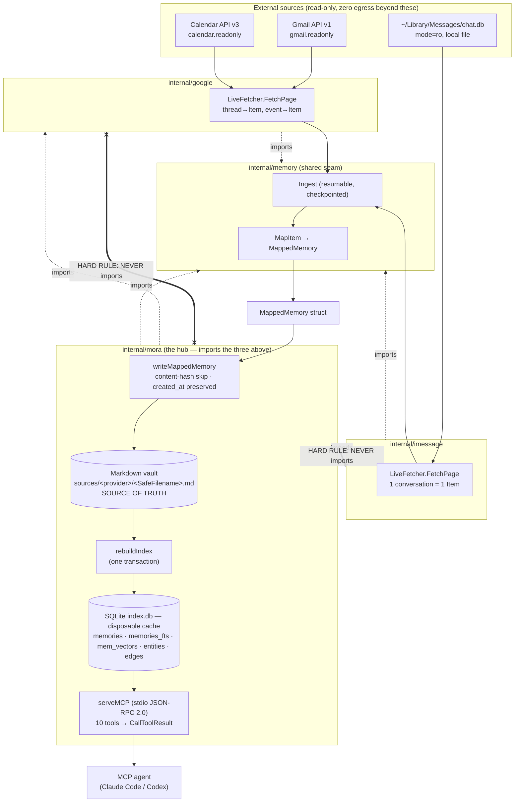

# Mora — Architecture Spec

Mora is a local-first, agent-agnostic memory CLI: a single pure-Go binary that ingests Gmail / Google Calendar / iMessage into human-readable Markdown, indexes that Markdown in an embedded `modernc.org/sqlite` database (FTS5 + per-row vectors + a derived person graph), and serves it to any MCP-capable agent over a stdio JSON-RPC server. This document is the AS-BUILT front door to the spec — it describes what the code does **today** (as of v0.10.0), and links out to fifteen subsystem docs for the detail. Nothing here is roadmap; aspiration lives in the LLM wiki, not the repo.

## Files

The overview owns no implementation; the system-wide claims below are grounded in these canonical files (the `.claude/worktrees/mora-demo/` duplicate and `dist/` are stale — never cite them):

| File | Lines | Responsibility |
|---|---|---|
| `cmd/mora/main.go` | 28 | Entrypoint: stamps `-ldflags` version/commit/date into `mora.BuildVersion`, then delegates to `mora.Run(ctx, args, stdout, stderr, stdin)` with streams as parameters (the byte-clean test seam). |
| `go.mod` | 84 | Module `github.com/pyranthus/mora`, `go 1.25.8`; `modernc.org/sqlite v1.29.0` is the **only** SQL engine (no cgo driver in the graph) — this is what keeps `CGO_ENABLED=0` possible. |
| `AGENTS.md` | — | Agent/reviewer charter: hard rules (no-cycle, pure-Go, read-only/zero-egress, honest-snapshot). |
| `internal/mora/mora.go` | 5325 | The hub: CLI dispatch (`Run`), wiring boundary (`writeMappedMemory`), index pipeline (`rebuildIndex`), MCP server (`serveMCP`). Cohesive subsystems are progressively split into same-package sibling files (e.g. `doctor.go`, `schedule.go`, `vaultops.go`, `usage.go`, `tasks.go`). |

## What it is, end to end

Four Go packages sit under one binary. **`internal/memory` is the shared seam** — it defines the connector-agnostic shapes (`MappedMemory` at `internal/memory/mapped.go:12`, `Ingest` at `internal/memory/ingest.go:32`, `StableID`/`ContentHash`/`SafeFilename`). The two connectors (`internal/google`, `internal/imessage`) depend on `internal/memory` and re-export thin aliases (e.g. `type MappedMemory = memory.MappedMemory`, `internal/google/map.go:7`) so their call-sites read locally. `internal/mora` imports all three (`mora.go:29-31`) and is the only package that knows about the others.

**The HARD no-cycle rule:** `internal/google` and `internal/imessage` MUST NOT import `internal/mora` (`internal/google/types.go:2`, `internal/imessage/types.go:7`). The connectors return plain `MappedMemory`; conversion to `mora`'s `Memory` happens only at the wiring boundary in `writeMappedMemory` (mora.go:2515). `internal/imessage` additionally imports neither `internal/google` nor any network package (`fda_test.go:41` enforces this), and `internal/memory` has no `net/http`/`net/rpc` import — zero-egress is structural at the seam, not just policy.

### Data flow, stage by stage

1. **Ingest** — `LiveFetcher.FetchPage` pulls one page from a provider into `Item`s (Gmail = one thread per item, `internal/google/gmail.go`; Calendar = one expanded event; iMessage = one **conversation** per item, `internal/imessage/chatdb.go:146`). `Ingest` (`internal/memory/ingest.go:32`) is resumable and checkpointed: per-page checkpoint advance, crash resumes, page-fetch errors stop-and-preserve, per-item write failures counted not fatal. See [Google connector](./04-connectors-google.md) and [iMessage connector](./05-connectors-imessage.md).
2. **Store** — `MapItem`→`MappedMemory`→`writeMappedMemory` (mora.go:2515) renders one Markdown file to `sources/<provider>/<SafeFilename(StableID)>.md`. Idempotent: unchanged `ContentHash` skips the write and **preserves the original `created_at`** (mora.go:2524-2530). The Markdown vault is the source of truth. See [data model & storage](./01-data-model-and-storage.md).
3. **Index** — `rebuildIndex` (mora.go:2010) reads every Markdown file and repopulates the five SQLite tables inside **one transaction** (DDL → destructive DELETEs → `memories`+FTS inserts → `writeGraph` → `writeVectors`), so a mid-rebuild failure rolls back to the last good index. The DB is a fully-rebuildable cache. See [data model & storage](./01-data-model-and-storage.md).
4. **Retrieve** — Search has two paths. `defaultSearch` (`hybrid.go:70`) routes to **FTS-only under the static-hash embedder** and to **hybrid (RRF-fused FTS + vector + 1-hop graph) only when a semantic embedder is genuinely active**, because hybrid *regresses* recall under static-hash. See [retrieval & search](./02-retrieval-search.md) and [entity graph](./03-entity-graph.md).
5. **Synthesize** — `think`, `digest`, and `context_memory` are deterministic, **model-free** (Mora holds no API key): `think` emits a `SynthesisPrompt` + gap analysis the caller's model runs; `digest`/`context_memory` assemble byte-stable briefs. See [synthesis: think/digest](./07-synthesis-think-digest.md).
6. **Serve** — `serveMCP` (mora.go:2820) is a line-oriented stdio JSON-RPC 2.0 server exposing ten tools; every `tools/call` return is wrapped in a spec `CallToolResult`. See [MCP server](./06-mcp-server.md). The same data is reachable from the CLI; see [CLI & UX](./08-cli-and-ux.md). Freshness is honest-snapshot, surfaced as a first-class output; see [sync & freshness](./11-sync-and-freshness.md).

## Package & responsibility map

| Package | Imports | Responsibility |
|---|---|---|
| `internal/memory` | (leaf — no internal deps, no `net/*`) | Shared connector seam: `Item`, `Fetcher`, `Ingest`, `MapItem`, `MappedMemory`, `SyncStatus`, `StableID`/`ContentHash`/`SafeFilename`. The contract both connectors implement. |
| `internal/google` | `internal/memory`, `gmail/v1`, `calendar/v3`, `golang.org/x/oauth2` | Gmail + Calendar connector: installed-app loopback OAuth (read-only scopes), `LiveFetcher`, thread/event → `Item` → `MappedMemory`, identity capture. **Never imports `internal/mora`.** |
| `internal/imessage` | `internal/memory`, `modernc.org/sqlite` (read-only DSN) | macOS iMessage connector: read-only `chat.db` + AddressBook, `attributedBody` typedstream decode, one-memory-per-conversation, inverted truncation. **Imports neither `internal/mora` nor any network package.** |
| `internal/mora` | all three above + lipgloss, go-isatty, go-selfupdate | The hub (≈5.3 KLOC `mora.go` + ~40 sibling files): CLI dispatch, wiring boundary, Markdown render/parse, SQLite index + search (`hybrid.go`, `embed*.go`), derived entity graph (`graph.go`/`classify.go`/`gazetteer.go`), synthesis (`think.go`/`digest.go`), MCP server, doctor (`doctor.go`), scheduler (`schedule.go`), eval harness, self-update. |
| `cmd/mora` | `internal/mora` | 28-line entrypoint; stamps build vars, calls `mora.Run`. |

> The as-built reality is **five** packages: `internal/mora`, `internal/memory`, `internal/google`, `internal/imessage`, `internal/applecal`. The hard no-cycle rule and the `writeMappedMemory` conversion boundary apply to every connector.

## Cross-cutting invariants

These span subsystems. Each subsystem doc enforces its own; these are the rules that fail the *whole system* if broken.

1. **The vault is the source of truth; `index.db` is a disposable cache.** All five SQLite tables are `CREATE IF NOT EXISTS` then `DELETE`'d and repopulated on every `rebuildIndex` (mora.go:2047-2051), in one all-or-nothing transaction. Store **no** SQLite-only state. *Why:* lets the index be deleted and rebuilt from Markdown at any time; a mid-rebuild crash rolls back to the prior committed index.
2. **Byte-identical graph rebuilds.** `buildGraph` (`graph.go:302`) is pure and recomputed from scratch each rebuild; it MUST be byte-identical run to run: sort before every tie-break, no map-iteration-order dependence, union-find canonical chosen **after** all unions. *Why:* a non-deterministic graph means a diff-noisy index and an unauditable merge step where a wrong person-merge (the worst error) hides. Precision-first. See [entity graph](./03-entity-graph.md).
3. **Determinism before every tie-break.** The same rule extends to retrieval (every arm has a secondary sort by id; the fused sort tie-breaks on id; the gazetteer resolves ambiguous names by smallest id) and synthesis (gap rules and freshness keys sort inputs before emit; staleness compares parsed RFC3339 instants, never lexical strings). See [retrieval & search](./02-retrieval-search.md), [synthesis](./07-synthesis-think-digest.md).
4. **Byte-clean machine output.** ANSI styling never reaches `--json`, the MCP stdio path, or any pipe. `colorEnabled` gates every styled write; `isTTYWriter` uses `go-isatty` (NOT `os.ModeCharDevice`, which `/dev/null` would falsely pass — Codex caught this); the `--json` branch marshals with no styler at all. The same `renderDigest` string feeds both the MCP `digest` tool and the TTY `pulse --digest`; styling is a removable TTY-only skin layered after. See [CLI & UX](./08-cli-and-ux.md).
5. **Honest-snapshot sync — never swallow a sync error.** Sync is not live and not incremental: every run clears the checkpoint and re-pulls the full configured window. `Ingest` records `LastError` and **returns** it; callers aggregate into "N source(s) failed to sync; data may be stale." *Why:* a silently-stale snapshot the agent trusts as current is a correctness failure — the agent cannot distinguish old data from new. Reserved cursor fields (`GmailHistory`/`CalSyncToken`) are dead-for-now. See [sync & freshness](./11-sync-and-freshness.md).
6. **Zero egress / read-only scopes.** Memory bytes never leave the machine except: read-only Google APIs (`gmail.readonly` + `calendar.readonly`, hardcoded and test-pinned, `internal/google/oauth.go:32`), GitHub releases (self-update), the **opt-in, loopback-only** Ollama embedder (refuses any non-loopback URL), and the opt-in git paths — `mora sync git` (plaintext vault backup, disclosed loudly) and `mora share` (age-encrypted publish/subscribe to a dedicated private remote; see [sharing](./13-sharing.md)). Usage logging is local JSONL in the state dir, honors `DO_NOT_TRACK=1` and an `OFF` sentinel. See [distribution & ops](./10-distribution-and-ops.md), [retrieval](./02-retrieval-search.md).
7. **Pure-Go, single static binary, CGO=0.** `modernc.org/sqlite` is the only SQL engine (`go.mod:12`); `CGO_ENABLED=0` on every build/release path. cgo is enabled **only** for `go test -race` (the race detector needs it). Never add a cgo SQLite driver. See [distribution & ops](./10-distribution-and-ops.md).
8. **`StableID` is provider identity only, never content** (`<kind>/<providerID>`); files are named via `SafeFilename` (`/ : space → _`), so any id→file lookup must match both `id+".md"` and `SafeFilename(id)+".md"`. *Why:* guarantees idempotent re-sync overwrites instead of duplicating. See [data model & storage](./01-data-model-and-storage.md).

## Document index

| Doc | One line |
|---|---|
| [01 — Data Model & Storage](./01-data-model-and-storage.md) | The Markdown memory file (hand-rolled frontmatter + body), `StableID`/`SafeFilename`/`ContentHash`, the five-table SQLite schema, and the single-transaction `rebuildIndex`. |
| [02 — Retrieval & Search](./02-retrieval-search.md) | Two search paths, the embedder gate (`defaultSearch`), RRF-fused FTS + vector + graph hybrid, the static-hash vs Ollama embedders, FTS stopword handling, and zero-egress. |
| [03 — Person Entity Graph](./03-entity-graph.md) | The derived people graph: the A2→A1→A3 fixed pipeline (trust → classify → merge), the gazetteer, byte-identical rebuilds, and precision-first non-merging. |
| [04 — Google Connector](./04-connectors-google.md) | Gmail (thread-grained) + Calendar over read-only scopes; installed-app loopback OAuth; resumable `Ingest`; the no-cycle / non-secret placeholder rules. |
| [05 — iMessage Connector](./05-connectors-imessage.md) | Read-only `chat.db` + AddressBook; the `attributedBody` typedstream decoder (and its historical bugs); one-memory-per-conversation; inverted truncation; FDA. |
| [06 — MCP Server](./06-mcp-server.md) | The stdio JSON-RPC 2.0 server, ten-tool catalog, the `CallToolResult` wrapping (and the bare-result bug it fixes), snippeting, and the token budget. |
| [07 — Synthesis: think / digest / context_memory](./07-synthesis-think-digest.md) | Model-free synthesis: `think`'s deterministic gap analysis + emitted prompt, the windowed `digest`, and `context_memory`'s starvation guard. |
| [08 — CLI & Terminal UX](./08-cli-and-ux.md) | `Run` dispatch, the `colorEnabled`/styler byte-clean layer, `init`/`doctor`, the banner, and stream-as-parameter test seam. |
| [09 — Evaluation & Testing](./09-eval-and-testing.md) | The T2 retrieval attribution histogram (COVERAGE/RETRIEVAL/FUSION/HIT), the T0 MCP budget gate, `wantRED` quarantine, and cross-model TDD fixtures. |
| [10 — Distribution, Build & Ops](./10-distribution-and-ops.md) | Pure-Go cross-compile, GoReleaser archives + cosign + SBOM + Homebrew cask, `mora upgrade` self-update, `install.sh`, CI gates, license. |
| [11 — Sync & Freshness](./11-sync-and-freshness.md) | Honest-snapshot model, `SyncStatus` files, checkpoint resume, the never-swallow-errors rule, freshness as a first-class MCP output, the OS-scheduler periodicity. |
| [12 — Apple Calendar Connector](./12-connectors-applecal.md) | Read-only `Calendar.sqlitedb` (group container, immutable open); one-memory-per-event; Core Data epoch; the 180-day forward flood guard; FDA. |
| [13 — Sharing](./13-sharing.md) | `mora share`: scoped, age-encrypted, read-only sharing of authored memories over a dedicated private git remote; subscriptions as separately-indexed, owner-attributed corpora unioned into search/think. |
| [14 — Share transports](./14-share-transports.md) | The transport seam behind `mora share`: a signed content-addressed manifest lets a share travel over a user-owned S3/R2 bucket (`--via r2`) with the same authenticity/freshness/egress guarantees git got from its ACL + `--ff-only` + `ls-files`. |
| [15 — Concurrency contract](./15-concurrency-contract.md) | What stays correct when writers (`cmdWrite`/`write_memory`), readers, a full `rebuildIndex`, and a sync collide on one host: per-memory atomic files, create-exclusive ids, tiny upsert txns, serialized rebuilds, the `sources.json` lease, `busy_timeout`, and the index's bounded eventual-consistency window. |

## Glossary

- **StableID** — A memory's provider identity, `<kind>/<providerID>` (e.g. `gmail_thread/<id>`, `imessage_chat/<guid>`), derived from immutable provider identity and **never content**. Stored verbatim as the frontmatter `id`. (`internal/memory/ids.go`)
- **SafeFilename** — `StableID` with `/`, `:`, and space mapped to `_`, used as the on-disk filename. Lossy, so any id→file lookup must check both `id+".md"` and `SafeFilename(id)+".md"`.
- **MappedMemory** — The connector-agnostic struct (`internal/memory/mapped.go:12`) that connectors return and `writeMappedMemory` converts to `mora`'s `Memory` at the wiring boundary. Crossing it is the only place the no-cycle rule is bridged.
- **embedder-gated routing** — Search routes via `defaultSearch`, which inspects the *actually-active* embedder (`chooseEmbedder`): FTS-only under static-hash, hybrid only when semantic. Because a vector-empty hybrid still perturbs RRF via its graph arm, the gate is on the resolved embedder, not raw `MORA_EMBEDDER`.
- **COVERAGE / RETRIEVAL / FUSION / HIT** — The four attribution buckets in the T2 eval (`classifyBucket`): COVERAGE = doc not in index (connector gap), RETRIEVAL = in index but no arm surfaced it (embedder gap), FUSION = an arm found it but RRF buried it below the cutoff, HIT = returned. COVERAGE is checked first so connector vs embedder misroutes can't slip.
- **RRF (Reciprocal Rank Fusion)** — How hybrid fuses its three arms (`rrf`, `hybrid.go:18`, k=60): rank-based, so it combines unbounded BM25 scores with [0,1] cosine and graph hits without normalization.
- **salience** — The (designed, see memory notes) relationship-importance ranking that must account for the chunking asymmetry: iMessage = one memory per conversation vs Gmail = one per thread, so naive memory-count ranking inverts importance.
- **A1 / A2 / A3** — The fixed-order entity-graph pipeline: **A2** = provenance trust (which display names are trusted aliases — self-presented senders/organizer, or iMessage), **A1** = classification (`person` vs `service`, token-exact denylist), **A3** = identity-merge (collapsing one human's many addresses, precision-first, full-name-anchored). A1 and A3 consume only the A2-trusted name. See [entity graph](./03-entity-graph.md).
