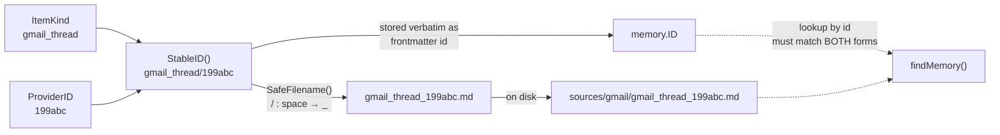
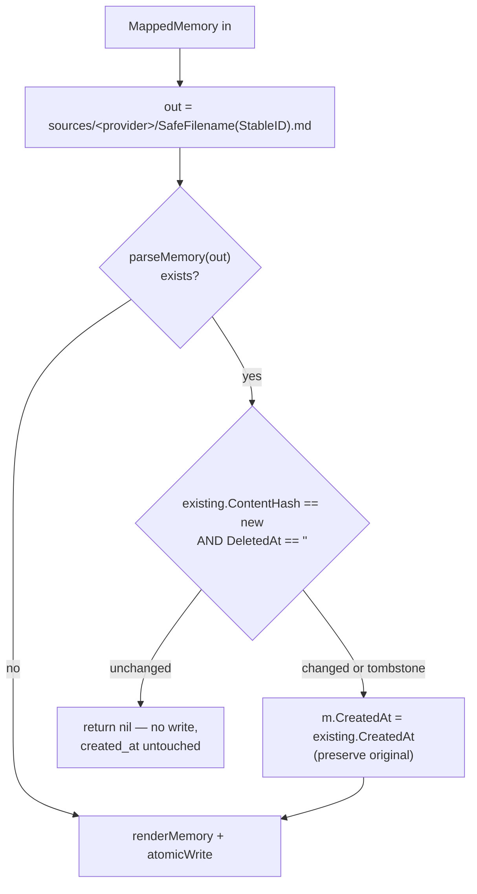
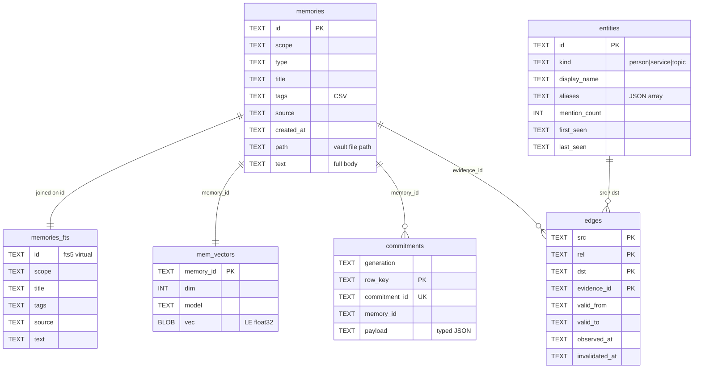
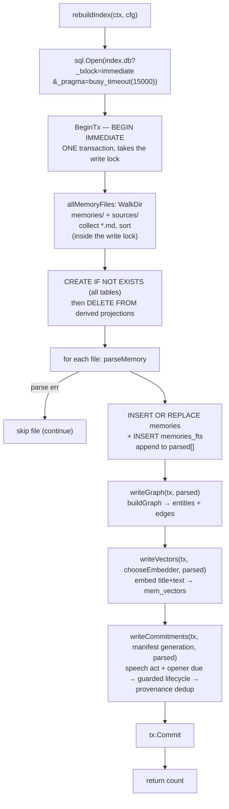

# Data Model & Storage

The on-disk Markdown memory format, the identity rules that keep re-syncs idempotent, and the rebuildable SQLite index derived from it — the vault is the source of truth; the database is a cache.

## Files

| File | Lines | Responsibility |
|---|---|---|
| `internal/mora/mora.go` | 3933 | `Memory`/`Source`/`Config` model; `createMemory`; `atomicCreate` |
| `internal/mora/atomicio.go` | 53 | Atomic file primitives: `atomicWrite` (temp file + `os.Rename`); `appendFile` |
| `internal/mora/ingest.go` | 1104 | Connector ingest/sync wiring & the write boundary: `writeMappedMemory`; `cmdIngest`/`cmdConnect`/`cmdSync`/`cmdReingest`; `ingestGoogle`/`ingestIMessage`/`ingestAppleCal`/`ingestFilesystem`; `persistSyncStatus`; `sourceFreshness`; `curatedExtractExt`/`extractDocxText` |
| `internal/mora/index.go` | 364 | `rebuildIndex`/`rebuildIndexWithPolicy` + SQLite DDL; `cmdIndex`; `dbPath`/`roIndexDSN`/`openIndexRO`/`checkIndexSchema`; `writeGraph`/`writeVectors` |
| `internal/mora/config.go` | 496 | `Config` load/parse/write (`defaultConfig`/`loadConfig`/`parseConfigValue`/`cmdConfig`/`writeConfig`); `init` scaffolding (`cmdInit`/`scaffoldControlFiles`/`confirmVaultRepoint`); retrieval-weight accessors (`Config.fusion`/`Config.mmr`) |
| `internal/mora/memfile.go` | — | Memory-file render/parse/path: `renderMemory`/`parseMemory`/`writeMemory`; `findMemory`/`allMemoryFiles`/`listMemories`; the `memoriesRoot`/`sourcesRoot`/`memoryPath`/`osSafeBase` path helpers; `newID`; the mora-local `ContentHash` (filesystem ids only) |
| `internal/memory/mapped.go` | 154 | `MappedMemory` hand-off struct; `MapItem` (Item→MappedMemory, byte budget, content-hash fold); `CanonicalMeta`; kind→(type,provider) registry |
| `internal/memory/ids.go` | 25 | `StableID` (provider identity), `ContentHash` (provider change-detect, sha256/16), `SafeFilename` (`/`,`:`,` ` → `_`) |
| `internal/memory/types.go` | 70 | `Item`, `ItemKind`, `Attachment` (metadata + in-transit `Path`), `FetchWindow`, `Page`, `Fetcher` — the connector-agnostic fetch types feeding `MapItem` |
| `internal/mora/pdf.go` | 129 | `extractPDFText` (pinned `ledongthuc/pdf`, recover-wrapped, capped); `writeAttachmentMemories` — one derived `att_…` memory per readable iMessage PDF attachment |
| `internal/mora/render.go` | 122 | Human-facing TTY styling (`colorEnabled`, `styler`, `styleDigestTTY`). **Not** part of the persisted data path — gated so ANSI never reaches `--json`/MCP/files |

## The `Memory` model

A memory is one Markdown file: YAML-ish frontmatter then a free-text body. The in-memory shape is `Memory` (`internal/mora/mora.go:50-71`):

```go
type Memory struct {
    ID, Scope, Type, Title string
    Tags                   []string
    Source, CreatedAt, Path, Text string
    Score                  float64        // populated by search only
    Provider, ProviderID, ContentHash, LastSynced string
    Truncated              bool
    DeletedAt              string
    Meta                   map[string]any // structured identity; feeds the entity graph
}
```

`MappedMemory` (`internal/memory/mapped.go:12-31`) is the **parallel hand-off struct** the connector layer produces. It mirrors the frontmatter field-for-field but lives in `internal/memory` so connectors never import `internal/mora` (the import-cycle hard rule — see AGENTS.md). `writeMappedMemory` (`ingest.go`) is the single wiring boundary that copies a `MappedMemory` into a `Memory` and persists it.

### On-disk Markdown format

`renderMemory` (`memfile.go`) emits the canonical bytes:

```
---
id: gmail_thread/199abc
scope: global
type: email
title: "Re: launch plan"
tags: [inbox, work]
source: 199abc
created_at: 2026-05-30T14:02:11Z
provider: gmail
provider_id: 199abc
content_hash: 9f1c2a3b4d5e6f70
last_synced: 2026-06-06T09:00:00Z
truncated: true
meta: {"from":"a@x.com","participants":["a@x.com","b@y.com"]}
---

<body text>
```

Render rules that the parser depends on:
- **Conditional fields**: `provider`/`provider_id`, `content_hash`, `last_synced`, `truncated`, `deleted_at`, and `meta` are only written when non-empty (`memfile.go`). A hand-written `mora write` memory has no provider block.
- **`quoteYAML`** (`memfile.go`) wraps `title`/`source`/`provider_id` in Go-quoted form only if they contain `:#[]`, so a colon in a subject line cannot break the line parser.
- **`meta` is one canonical JSON line.** `CanonicalMeta` (`mapped.go:48-57`) is `json.Marshal` of the map, which emits **sorted keys on a single line** — stable bytes independent of insertion order, and no raw newline to break the line-split parser.

`parseMemory` (`memfile.go`) is the inverse and is deliberately hand-rolled (no YAML lib):
- It requires a leading `---\n` and splits on the **first** `\n---\n` (`memfile.go`).
- Each frontmatter line is split on the **first** colon via `strings.Cut`. For the `meta` line it decodes the **raw substring after the first colon** with `json.NewDecoder` + `UseNumber()` (`memfile.go`) — `UseNumber` keeps a 19-digit thread id from decoding to a lossy `float64`.
- A corrupt `meta:` line is **not** silently dropped — it logs `warn: … meta frontmatter is corrupt` to stderr and continues (`memfile.go`), because losing a memory's structured identity silently would corrupt the entity graph.
- A missing `id` is a hard error (`memfile.go`).

`writeMemory` (`memfile.go`, function `writeMemory`) renders then `atomicWrite`s (temp file + `os.Rename`, function `atomicWrite`) so a partial write never leaves a torn frontmatter file. Directories are created `0o700`, files `0o644`.

**Brand-new user memories publish create-exclusively.** `mora write` and MCP `write_memory` go through `createMemory` (function `createMemory`), not `writeMemory`: it mints an id, renders, and `atomicCreate`s (function `atomicCreate`) — a temp file published with `os.Link`, which fails `EEXIST` instead of replacing an existing file. `atomicWrite`'s final `os.Rename` REPLACES the target (last-writer-wins), so two concurrent writers that mint the *same* `newID()` (same-second timestamp + identical random bytes) would silently clobber each other; `atomicCreate` makes that impossible — exactly one writer wins the link and the loser gets `os.ErrExist`, on which `createMemory` re-mints a fresh id and retries (bounded by `maxCreateAttempts`). This mirrors the loop lock's proven `publishLockFile` (`loop.go`); on Windows `os.Link` is `CreateHardLinkW`, which likewise fails on a present target. **Connector re-writes go through `writeMappedMemory` → `atomicWrite`** — re-rendering an existing provider memory onto its own stable path is an idempotent overwrite, not a collision, so the replacing `os.Rename` is correct there. (`writeMemory` itself — the plain render-then-`atomicWrite` helper — is no longer on the new-user-memory path; it writes a memory at a known caller-supplied id, e.g. test seeding.)

*No-hardlink fallback.* `vault_dir` is user-configurable, and some filesystems (exFAT/FAT32 USB sticks, some SMB/NFS mounts) do not support hard links, so `os.Link` returns `EPERM`/`ENOTSUP`/`EOPNOTSUPP` (POSIX) or `ERROR_NOT_SUPPORTED` (Windows) — never `os.ErrExist`. A hard failure there would regress `mora write`/`write_memory` below where the old plain-`atomicWrite` worked, so `atomicCreate` (function `atomicCreate`) classifies that error class (`linkUnsupported`, a build-tagged `link_windows.go`/`link_notwindows.go` split like `renameReplaceRetryable`) and falls back WITHOUT losing the no-clobber guarantee: it claims the path with `os.OpenFile(O_CREATE|O_EXCL)` (still fails `EEXIST` on a racer/collision → re-mint), then renames its own staged temp onto its own empty placeholder. A link error that is neither `os.ErrExist` nor link-unsupported surfaces as-is (never masked). The one honest trade-off: on those filesystems a concurrent reader can briefly observe an empty placeholder between the claim and the rename; `parseMemory` returns `"missing frontmatter"` on it and every index/list/find caller skips a parse error (`continue`), so it is ignored (no crash) and picked up once the rename lands. POSIX/NTFS never reach the fallback.

## Identity: `StableID` vs `SafeFilename` (the critical distinction)

This is the single most footgun-prone area of the data model.



- **`StableID`** (`ids.go:11-13`) = `kind + "/" + providerID`. Derived from **immutable provider identity only, never content** — re-syncing an edited thread overwrites the same logical memory instead of forking a new one. It is stored verbatim as the frontmatter `id`.
- **`SafeFilename`** (`ids.go:22-25`) replaces `/`, `:`, and space with `_`, so `gmail_thread/199abc` files as `gmail_thread_199abc.md`. Provider memories live at `sources/<provider>/<SafeFilename>.md` (`writeMappedMemory`, `ingest.go`).
- **Therefore the on-disk basename is NOT the id.** `findMemory` (`memfile.go`) must check **both** shapes: it builds `base := id + ".md"` and `safeBase := SafeFilename(id) + ".md"`, matches either (plus a `strings.Contains` fallback), then confirms by re-parsing and comparing `m.ID == id`. If you write any new id-based lookup, you must match the `SafeFilename` form too or Gmail/Calendar/iMessage ids silently won't resolve.

Two other id shapes exist on disk:
- **Manual memories** (`mora write`, MCP `write_memory`) get `newID()` (`memfile.go`, function `newID`): `mem_<local-timestamp>_<8 hex>` — the timestamp is `time.Now().Format("20060102_150405")`, **local time, not UTC** (only the provider `created_at` is UTC) — filed under `memories/<scope-as-path>/<id>.md` via `memoryPath` (function `memoryPath`, which turns scope `a:b` and `/` into path separators). The 8 hex are 4 `crypto/rand` bytes; because the timestamp is only second-granular, an id collision between two concurrent writers is possible, which is why manual memories publish create-exclusively (see `createMemory` above) instead of trusting the id to be unique. `newID` also handles a `crypto/rand` failure explicitly — it falls back to `math/rand/v2` entropy (emitting one non-fatal `warn:` line to stderr, never failing the write) rather than an all-zero suffix (which would collide every time within a second and stall the re-mint retry); the id is a uniqueness token, not a secret.
- **Filesystem source files** get `src_<ContentHash(name:relpath)>` (`ingest.go`) using the **mora-local** `ContentHash` (`memfile.go`, a small FNV — distinct from the provider `ContentHash` in `ids.go`). This is the only place the FNV hash is used for an id.

## Content-hash idempotency & `created_at` preservation

`MapItem` (`mapped.go:93-154`) computes `ContentHash` over `(it.Title, it.Body, canonicalMeta)` — using the **original, untruncated** `it.Body` (`mapped.go:143`), not the byte-budgeted body it persists — but folds Meta in **only when non-empty** (`contentHashWithMeta`, `mapped.go:36-41`), so pre-Meta legacy files keep their exact two-part hash and aren't spuriously rewritten on the next sync. A new participant or recovered address therefore *does* change the hash and trigger a rewrite; cosmetic Meta-absence does not.

`writeMappedMemory` (`ingest.go`) is the idempotent write:



Two invariants live here: (1) an unchanged, non-deleted item is a **no-op** (the hash skip at `ingest.go`), so re-running a backfill is free; (2) when content *did* change, the **original `created_at` is preserved** (`ingest.go`) — the new fetch's recomputed timestamp never overwrites the first-seen time. A tombstone (`DeletedAt != ""`) always forces the rewrite even if the body hash matches.

## Document extraction & attachment-derived memories (`.docx` / `.pdf`)

### Filesystem sources: extract-don't-read formats

`curatedExtractExt` (`ingest.go`) names the non-plain-text formats a filesystem source ingests by **extracting** text rather than indexing raw bytes — today `.docx` and `.pdf`. `ingestFilesystem` branches on it (`ingest.go`): `.pdf` goes through `extractPDFText`, everything else in the set through `extractDocxText`; an extraction error or empty result skips the file — unreadable/empty/oversized is never indexed as garbage. The extracted text then flows through the normal filesystem path: ids stay `src_<FNV>` (`ingest.go`), nothing else about filesystem identity changes.

`extractPDFText` (`pdf.go:32-77`) uses the pinned, audited `ledongthuc/pdf` (pure Go — the no-CGO constraint holds). The library panics on malformed input by design, so the entire parse is **recover-wrapped**: any panic becomes an error and the caller skips the file — a bad PDF must never crash a sync (`pdf.go:33-37`). Caps (`pdf.go:20-23`, package vars so tests can lower them):

| Cap | Value | Where enforced |
|---|---|---|
| File size | 20 MiB (`pdfMaxFileSize`) | rejected pre-parse, `pdf.go:42-44` |
| Pages | 500 (`pdfMaxPages`) | extraction truncates, `pdf.go:52-55` |
| Extracted text | 512 KiB | the existing index bound at every call site — over ⇒ the whole file is skipped (`pdf.go:72-74`, `pdf.go:102`) |

A scanned/image-only PDF extracts to `""` with a nil error and is skipped — there is no OCR (it would break the single-binary/no-CGO constraint), and Mora never fabricates text it can't read. A single garbled page is skipped without losing the rest of the document (`pdf.go:66-69`).

### `Attachment.Path` and the derived-memory shape

`Attachment` (`types.go:16-27`) is **metadata-plus-location**: `Filename`/`MimeType`/`Size`, plus — when the body already exists on local disk (iMessage) — the absolute `Path` to it. Connectors never open the file; bytes are never carried on the struct; neither `Path` nor bytes ever appear in rendered vault output (the IMSG-07 amendment — see [iMessage connector](./05-connectors-imessage.md)). For Gmail, attachments remain metadata-only and `Path` stays empty — the field is the future seam, not a fetch.

`writeAttachmentMemories` (`pdf.go:88-129`) consumes `Path` at the wiring boundary, immediately after the parent's `writeMappedMemory` in the iMessage write closure (`ingest.go`). For each attachment that has a `Path` and is a PDF by MIME **or** extension (`isPDFAttachment`, `pdf.go:79-86` — chat.db rows sometimes carry one without the other), it derives one `MappedMemory` (`pdf.go:109-122`):

- **`StableID`** = `"att_" + ContentHash(parent.StableID + ":" + a.Path)` (`pdf.go:110`) — the **provider** sha256 `ContentHash` (`ids.go:16`), not the mora-local FNV. Hashing parent id + path keeps the id stable across re-syncs, so an unchanged PDF is a no-op via the `writeMappedMemory` hash skip.
- **`Type`** = `"source"`; **`Tags`** = the parent's tags plus `"attachment"`; **`Source`** = the attachment's on-disk path; **`Title`** = the attachment filename (basename fallback).
- **Parent provenance**: `Provider`/`ProviderID`/`Account`/`Scope` and the parent's **`CreatedAt`** are copied verbatim — the derived memory files under the same `sources/<provider>/` and inherits the conversation's timestamp.
- **`ContentHash`** = `ContentHash(title, text)`, so an edited-in-place PDF rewrites and an untouched one skips.

Every extraction failure — missing file, malformed, encrypted, empty/scanned, past the caps — skips that attachment and keeps the metadata marker on the parent transcript; a body Mora can't read is not a sync error. Only a vault **write** failure propagates (`pdf.go:88-104, 123-125`).

## SQLite index (rebuilt, never authoritative)

The database at `<DataDir>/index.db` (`dbPath`, `index.go`) is a derived cache. Every table is `CREATE … IF NOT EXISTS` and fully `DELETE`d + rebuilt on each `rebuildIndex` (`index.go`), so deleting `index.db` loses nothing.



DDL is at `mora.go:2036-2051`:
- **`memories`** — the row-store keyed by frontmatter `id`. `tags` stored CSV (`strings.Join(m.Tags, ",")`, `mora.go:2076`). Holds the full `text` and the vault `path` so search can return bodies and read can locate the file.
- **`memories_fts`** — an FTS5 virtual table over `id, scope, title, tags, source, text`. Note **`type`, `created_at`, and `path` are deliberately NOT in FTS** (they're metadata, not searchable prose); search joins back to `memories` on `id` to recover them (`searchMemories`, `search.go`).
- **`mem_vectors`** — one static-hash (or Ollama) embedding per memory, written by `writeVectors` (`index.go`) over `m.Title + "\n" + m.Text`; `vec` is little-endian float32 bytes (`encodeVec`, `embed.go:96-102`). `model` is stored per-row (`emb.ModelID()` at `mora.go:2156`; static floor is `static-hash-v1`, `embed.go:31`) so the embedder behind each vector is attributable. Every rebuild re-embeds all memories unconditionally (`INSERT OR REPLACE`, `mora.go:2149`); the retrieval path is what consults the stored `model`. See [retrieval](./02-retrieval-search.md).
- **`commitments`** — the typed obligation inventory derived by `writeCommitments` from the whole honest vault snapshot. `generation` binds the vault-manifest digest, the injected rebuild instant, and the sorted source-health snapshot; it is also stamped as `index_meta.commitments_generation`, and readers select only that generation. Health is included because `state_uncertain` is a material input: two different freshness snapshots must not share one generation id. `row_key` equals the evidence-derived `CommitmentID` when immutable message/block refs exist. A legacy pre-PR1 memory may be classified for owner/direction/lifecycle but receives an internal `legacy:` row key and a NULL `commitment_id` rather than a fabricated identity. The JSON payload carries owner, counterparty, the named shared `Direction` type, opening span, typed due value, lifecycle/closure state, evidence-preserving typed citations, dedup provenance, and a fail-closed `state_uncertain` signal. The same `Direction` vocabulary is used by task-ledger and evidence open-loop lanes; it is not independently redefined at each surface. Due classification reads only the authored opening span: a parsed month-name or ISO calendar date is `explicit_date` stored as `YYYY-MM-DD`, a relative anchor such as `tomorrow`, `next week`, a weekday, or `before …` is `relative`, and everything else is the explicit `none` sentinel. It never infers a clock — even when a clock appears near a dated phrase — because the opener does not provide the event-linked semantics needed to attach that clock to the obligation. Urgency and meeting placement likewise never create a deadline. No commitment field is added to Markdown.

Meeting briefs and daily digests both read this table through `readCommitmentSnapshot`; neither independently reclassifies its clipped presentation text. The daily join copies `Owner`, `Direction`, `DueAt`, `Lifecycle`, and `ClosureRef` onto the surfaced `DigestItem` only when its memory has exactly one materialized commitment. Multiple independently anchored commitments remain untyped at artifact grain instead of being collapsed by guesswork.

Lifecycle is a guarded transition over authored evidence strictly later than the opener. Delivery by the owner or acknowledgement by the asker must share action/object evidence; questions, future modality, negation, staged work, quoted/forwarded text, service mail, and timestamp ties cannot close an item. A changed action/deadline becomes `superseded` with `superseded_by`, never `closed`. When one closure fits multiple open candidates equally, every candidate stays open with an ambiguity gap. Closing evidence appends a `closure` citation after the retained `opener` citation.

Dedup uses normalized text only to generate candidates. It marks a copy automatically only with immutable same-message/block provenance or explicit quoted ancestry, plus matching owner, counterparty, due, direction, and lifecycle instance. Text-equal obligations without that provenance stay distinct. The earliest immutable opening is canonical; supporting-copy citations are retained with a typed `supporting` role. If any enabled source is stale, failed, or never synced at rebuild time, the materialization keeps its evidence-derived state but marks it `state_uncertain` instead of presenting a partial snapshot as complete.
- **`entities` / `edges`** — the deterministically-derived person graph. `edges` PK is the composite `(src, rel, dst, evidence_id)` so duplicate edges are idempotent; empty bi-temporal timestamps persist as SQL NULL via `nullStr` (`graph.go:50-57`). Inserted `OR IGNORE`. See [entity-graph](./03-entity-graph.md).

### `rebuildIndex` pipeline



The whole rebuild — schema, the destructive `DELETE`s, every memory/FTS/graph/vector/commitment write, and the commitment-generation stamp — runs inside **one transaction** (`rebuildIndexWithPolicy`, `index.go`). A mid-rebuild failure rolls back to the prior committed index rather than leaving a half-empty one; this is why a graph, embedder, or commitment-materialization error returns before `Commit`. The DSN sets `_txlock=immediate`, so `BeginTx` issues `BEGIN IMMEDIATE` and takes the SQLite writer lock up front (the `busy_timeout` lets a contending rebuild wait rather than fail fast). The vault directory listing (`allMemoryFiles`) therefore runs **after** `BeginTx`, inside the write lock — never before it. Snapshotting the directory before the lock allowed two concurrent rebuilds to interleave: rebuild A lists, rebuild B (fired by a newer write) lists + commits, then A commits *last* carrying its *older* list, silently omitting the just-written memory until a later rebuild. Because the immediate lock serializes rebuilds, whichever commits later necessarily listed later, so a committed index can no longer be clobbered by an older rebuild's stale snapshot (a memory written *after* the surviving rebuild's listing is ordinary until-next-rebuild staleness, not this race). The vault-identity guard (`assessRebuild`) still runs after the listing, so its block-on-empty/foreign semantics are unchanged. `allMemoryFiles` is a pure filesystem walk (it takes no DB lock), so holding the write lock across it cannot deadlock. A file that fails to `parseMemory` is skipped, not fatal. `searchMemories` lazily triggers a rebuild if `index.db` is missing. The same transaction stamps `PRAGMA user_version = indexSchemaVersion`; every read-open goes through `openIndexRO` (`index.go`), which **refuses a mismatched index** with an actionable "run `mora index rebuild`" error rather than serving a stale schema silently (the pre-stamp failure: a swapped binary read zeroed salience off a pre-column index). On the static-hash floor a stale index **self-heals inline** (`indexAutoHeal` — a rebuild is seconds, same philosophy as rebuild-on-missing, and it covers every user's first upgrade across the stamp's introduction); under a semantic embedder the read errors instead — a re-embed takes minutes and must not stall an MCP call; `mora upgrade` runs that rebuild at the consented moment.

### Incremental upsert on the user-write path (`indexUpsert`)

An authored write (`mora write` / `cmdWrite`, MCP `write_memory`) does **not** rebuild the whole vault. It calls `indexUpsert` (`internal/mora/index_upsert.go`), which reflects **only that one memory** into the index inside one tiny immediate transaction: `DELETE`-then-`INSERT` the single id's row in `memories` and its `memories_fts` row, using the exact insert shapes `rebuildIndex` uses (so an incrementally-added row is byte-identical to a fully-rebuilt one). It then keeps `index_meta.memory_count` consistent (`SELECT COUNT(*)`), and reuses the same identity DSN (`_txlock=immediate` + `busy_timeout(15000)`) as the full rebuild.

WHY: every user write previously triggered a full `DELETE`-and-reinsert of the entire vault. N concurrent agent writers therefore serialized `O(N × vault)` work, thrashed the writer lock, and overran `busy_timeout` — surfacing as degraded-success `index_stale` warnings. `indexUpsert` reprocesses only the one written memory (no whole-vault re-parse, graph rebuild, or re-embed), a large **constant-factor** win — ≈ **1.7 ms vs ≈ 98 ms** for a full rebuild at ~1k memories on an Apple M1 Pro (~59×; see `BenchmarkIndexUpsert1k` / `BenchmarkRebuildIndex1k`), dominated by the fsync/commit. It is **not** asymptotically `O(1)`: the per-write `DELETE FROM memories_fts WHERE id=?` is a full FTS vtable SCAN and the `COUNT(*)` walks the PK index (both EXPLAIN QUERY PLAN-verified), so the cost still grows linearly with vault size — just with a tiny constant, so the win over a full rebuild *widens* as the vault grows.

Deliberate scope — `indexUpsert` touches memories + FTS only, **not** the entity graph (`entities`/`edges`), `mem_vectors`, or `commitments`:

- The entity graph is a whole-corpus product: `buildGraph` derives structural entities (scope / tag / `[[wikilink]]` / category, plus a per-memory hub) from **every** memory *Meta-independently*, and `canonicalizePersons` merges person identities *across* memories while `writeGraph`'s `INSERT OR REPLACE` recomputes an entity's `mention_count` from the rows it sees. So an authored write genuinely adds graph nodes (at minimum its `scope:` entity and hub) — but a *correct* single-memory graph delta is not a local operation, and rebuilding the graph per write is the `O(vault)` cost this change avoids.
- Vectors feed only the **hybrid** retrieval path, which `defaultSearch` enables **only** when a semantic embedder (Ollama) is configured; under the default static-hash embedder search is FTS-only, so a missing vector has no effect there. Under a semantic embedder the new memory is a **real but bounded, self-healing recall gap** on the hybrid arm — fully searchable via FTS immediately, and it gains its vector at the next full rebuild.

Consequence: after an authored write, FTS **search is immediately fresh**, but the entity graph (`list_entities`, `get_entity`, `mora graph`), `mem_vectors` (hybrid recall under a semantic embedder), and typed commitment inventory reflect the new memory only after the **next full rebuild** — the scheduled `index-hourly` job, `mora index rebuild`, a connector sync, or a delete. Meeting and future daily obligation surfaces therefore read one common last-good commitment generation rather than recomputing different windowed views. The lag is **bounded by the rebuild cadence** (hourly by default), not indefinite; the vault stays the source of truth, and the index is a derived, eventually-consistent cache.

Identity safety is preserved end-to-end. `indexUpsert` applies the **same** vault-identity guard as `rebuildIndex` (`assessRebuild` in `vaultid.go`): a write against a vault whose `.mora-vault.json` marker does not match the index rolls back and returns `errRebuildBlocked` **without touching the index**, so `cmdWrite`/`write_memory` keep today's degraded-success handling (CLI: warn + exit 0; MCP: `index_stale:true` + warning, never `isError`). Cold-start and legacy/unbound states (no index yet, stale schema version, or an index that never recorded a `vault_id`) **delegate to the full `rebuildIndex`**, which creates the complete schema and binds identity — the readiness check runs on a read connection so the delegated rebuild's own immediate transaction is never blocked. The full `rebuildIndex` remains the path for `mora index rebuild`, connector sync, and delete.

## Config & paths

`defaultConfig` (`config.go`) seeds XDG-style defaults under `$HOME`; `loadConfig` (`config.go`) overlays a tiny hand-parsed `config.toml` (only `vault_dir`, `data_dir`, `state_dir` keys; `~` expanded via `expandHome`). `ConfigDir` is **not** overridable — it's always where `config.toml` lives.

| Var / path | Default | Purpose |
|---|---|---|
| `VaultDir` | `~/vault/mora` | Markdown memories: `memories/` (manual), `sources/<provider>/…`, control files (`index.md`, `priority-map.md`, `live-tasks.md`, …) |
| `ConfigDir` | `~/.config/mora` | `config.toml`, `sources.json`, `tokens/google.json` (0600) — fixed, never repointed |
| `DataDir` | `~/.local/share/mora` | `index.db` (the rebuildable SQLite cache) |
| `StateDir` | `~/.local/state/mora` | `sync/google-<source>.json`, `usage/events.jsonl`, `usage/OFF` sentinel |
| `config.toml` keys | — | `vault_dir`, `data_dir`, `state_dir` (quote-stripped, `~`-expanded) |

`mora init` (`mora.go:346-382`) deliberately **loads existing config first** so a re-run never repoints a custom vault and orphans it (`mora.go:353-360`); it then creates the dir tree, writes config, scaffolds control files (skipping any that exist, `mora.go:396-398`), and rebuilds the index.

### Vault identity and the rebuild guard

`vault_dir` is the only precious directory: it holds the Markdown source files every other directory is derived from. The SQLite index, sync watermarks, and config are all rebuildable or re-creatable; the vault is not (without a `mora sync git` backup).

On `mora init`, Mora writes a `.mora-vault.json` marker inside `vault_dir`. This marker lets Mora recognize the vault on subsequent runs. Before rebuilding the index, Mora checks the vault against the marker: if the vault looks empty or the marker is missing or foreign (a common sign that `vault_dir` has moved or been remounted), the rebuild refuses with an actionable error rather than silently stamping an empty or mismatched index. Run `mora doctor` to diagnose, or pass `--force` to `mora index rebuild` to override the guard.

## Invariants & gotchas

- **`index.db` carries a schema stamp (`PRAGMA user_version`).** Bump `indexSchemaVersion` whenever the rebuilt shape changes meaning; readers refuse a mismatch (actionable error), and `mora upgrade` re-stamps by rebuilding with the new binary.
- **The vault is the source of truth; `index.db` is a disposable cache.** Every SQLite table is rebuilt from scratch on `rebuildIndex` (`index.go`). Never store state that lives *only* in SQLite — it will not survive a rebuild. WHY: a corrupt or deleted DB must be recoverable from the Markdown alone.
- **`StableID` is provider identity, never content** (`ids.go:9-13`). Re-syncing an edited item must overwrite the same file, not duplicate it. WHY: idempotent backfills.
- **Files are named by `SafeFilename`, not by id.** Any id→file lookup MUST match both `id+".md"` and `SafeFilename(id)+".md"` (`findMemory`, `memfile.go`). WHY: `gmail_thread/x` files as `gmail_thread_x.md`; a naive `id+".md"` match silently misses every provider memory.
- **Content-hash skip + `created_at` preservation are paired** (`writeMappedMemory`, `ingest.go`). Unchanged → no write; changed → keep the original `created_at`. WHY: re-backfill must be free and must not rewrite first-seen timestamps.
- **Meta folds into the content hash only when non-empty** (`contentHashWithMeta`, `mapped.go:36-41`). WHY: a legacy pre-Meta file must keep its exact two-part hash, or every old source file gets spuriously rewritten on the next sync.
- **`meta:` is exactly one canonical JSON line.** `CanonicalMeta` relies on `json.Marshal` emitting sorted keys with no embedded newline (`mapped.go:48-57`); the parser splits frontmatter by lines and `meta` by the first colon. WHY: a multi-line or unsorted meta breaks the hand-rolled parser and makes the content hash non-deterministic.
- **A corrupt `meta:` line is surfaced (stderr warn), never swallowed** (`memfile.go`). WHY: silently dropping it erases the memory's entire entity-graph contribution.
- **`rebuildIndex` is one all-or-nothing transaction** (`index.go`). WHY: the `DELETE`s are destructive; a partial rebuild would otherwise leave a half-empty index live.
- **Authored writes upsert incrementally, not by full rebuild** (`indexUpsert`, `internal/mora/index_upsert.go`). `mora write` / MCP `write_memory` reflect only the one written memory into `memories` + `memories_fts` — a large constant-factor win (~59× at 1k memories), **not** asymptotically `O(1)` (the per-write FTS delete-scan and `COUNT(*)` still grow linearly with vault size). The entity graph and `mem_vectors` are **not** updated on write and reconcile on the next full rebuild (hourly job, `mora index rebuild`, sync, delete), so the graph/hybrid-recall lag is bounded by the rebuild cadence. WHY: a full rebuild per write serialized `O(N × vault)` work across concurrent agent writers and overran `busy_timeout`. FTS search is fresh immediately; `list_entities`/`get_entity` and semantic-embedder vector recall lag until the next rebuild. The same `assessRebuild` identity guard applies — a blocked vault returns `errRebuildBlocked` and leaves the index untouched (degraded-success, not a failed write).
- **Writes are atomic** (`atomicWrite` = temp + rename, function `atomicWrite`). WHY: a crash mid-write must not leave torn frontmatter that fails `parseMemory`.
- **New user memories are create-exclusive, not last-writer-wins** (`createMemory`/`atomicCreate`, functions `createMemory`/`atomicCreate`). `mora write` and MCP `write_memory` publish via `os.Link` (fails `EEXIST`) rather than `atomicWrite`'s replacing `os.Rename`; on a colliding `newID()` the loser re-mints and retries (bounded, `maxCreateAttempts`). WHY: two concurrent writers can mint the same second-granular id, and `os.Rename` would silently clobber one — real data loss. Connector re-writes stay on `writeMappedMemory` → `atomicWrite` (idempotent overwrite of a stable provider path is correct there). Mirrors `loop.go`'s `publishLockFile`; portable to Windows (`os.Link` = `CreateHardLinkW`, fails on a present target). On filesystems without hard links (exFAT/FAT32, some SMB/NFS) `os.Link` reports unsupported (never `EEXIST`); `atomicCreate` falls back to an `O_CREATE|O_EXCL` claim + rename-onto-own-placeholder, which keeps no-clobber at the cost of a brief empty-placeholder reader window that `parseMemory`/index callers skip gracefully.
- **`type`/`created_at`/`path` are not in FTS** (`mora.go:2037` vs `2036`). WHY: they are metadata; search joins back to `memories` to recover them. Adding a column to one table without the other will desync the search projection.
- **ANSI styling never reaches the data path.** `colorEnabled` (`render.go:21-32`) returns false on `--json`, `NO_COLOR`/`MORA_NO_COLOR`, empty-or-`dumb` `TERM`, or a non-TTY writer; the TTY test `isTTYWriter` (`render.go:38-44`) uses go-isatty (not `os.ModeCharDevice`, which is true for `/dev/null`). WHY: stray escape codes corrupt MCP stdio JSON and `--json` output. `render.go` styles human display only; it is *not* part of persisted bytes.
- **Document extraction never indexes garbage** (`pdf.go:88-104`, `ingest.go`). An unreadable, empty (scanned, no OCR), or over-cap extraction skips the file or attachment entirely. WHY: a scanned PDF extracting to `""` must not create an empty searchable memory, and a hostile PDF must not crash a sync (the parse is recover-wrapped, size/page/text-capped).
- **Two different `ContentHash` functions exist.** `internal/memory/ids.go:16` = sha256, first 16 hex chars, for provider change-detection. `internal/mora/memfile.go` = small FNV, used only to mint filesystem-source `src_…` ids (`ingest.go`). Don't confuse them.

## Related

- [overview](./00-overview.md)
- [retrieval & search](./02-retrieval-search.md) — FTS5 + `mem_vectors` hybrid scoring
- [entity graph](./03-entity-graph.md) — how `entities`/`edges` are derived from `Meta`
- [Google connector](./04-connectors-google.md) — produces `MappedMemory` via `MapItem`
- [iMessage connector](./05-connectors-imessage.md) — custom mapper, `KindIMessageChat`
- [MCP server](./06-mcp-server.md) — `read_memory`/`write_memory`/`search_memory` over this model
- [sync & freshness](./11-sync-and-freshness.md) — `SyncStatus`, `last_synced`, resumable ingest

## Open questions / unverified

- `Memory.LastSynced` is rendered/parsed and carried from `MappedMemory`, but `MapItem` (`mapped.go`) never sets `LastSynced` on the struct it returns — it appears populated downstream in the ingest write path (`ingestGoogle`/`Ingest`), which lives outside the files I own. Confirm in [Google connector](./04-connectors-google.md) where `LastSynced` is actually stamped.
- The mora-local FNV `ContentHash` (`memfile.go`) is used for filesystem-source ids; whether filesystem ingest is reachable in shipped v1 (vs. the deferred `gdrive` stub) is a connector-layer question, not a storage one.
