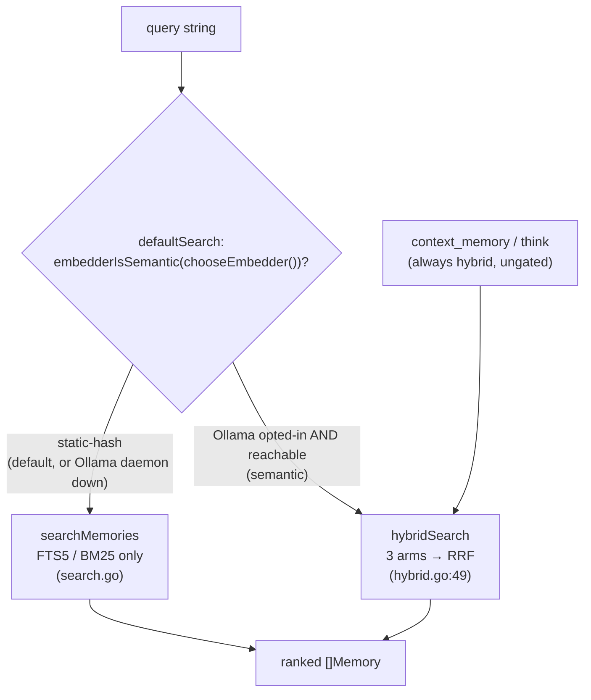
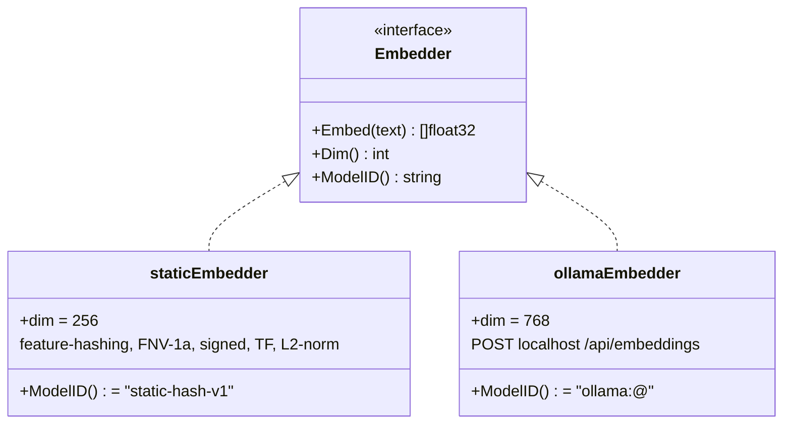
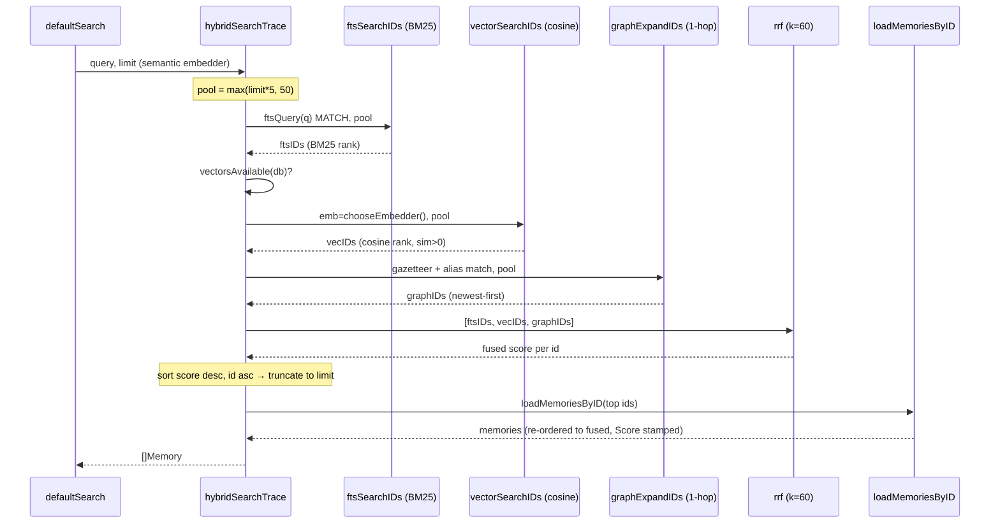

# Retrieval & Search Engine

How Mora turns a query string into a ranked list of memories: an FTS5/BM25 exact-match anchor, two embedders (a deterministic static-hash floor and an opt-in Ollama semantic upgrade), 1-hop graph expansion, RRF fusion, and an embedder-gated router that picks FTS-only or hybrid based on what recall actually measured.

## Files

| File | Lines | Responsibility |
|---|---|---|
| `internal/mora/hybrid.go` | 382 | The three-arm hybrid engine: `hybridSearch`/`hybridSearchTrace`, the `defaultSearch` router + `embedderIsSemantic` gate, the three arms (`ftsSearchIDs`, `vectorSearchIDs`, `graphExpandIDs`), `rrf` fusion, `vectorsAvailable`, the query-time gazetteer loader, the `retrievalTrace` attribution seam, pool sizing |
| `internal/mora/embed.go` | 113 | The `Embedder` interface, the static-hash feature-hashing embedder (`staticEmbedder`), `defaultEmbedder`, `normalize`, `cosine`, `encodeVec`/`decodeVec` BLOB codec |
| `internal/mora/embed_ollama.go` | 117 | The opt-in `ollamaEmbedder` (localhost-only), `chooseEmbedder` selection logic, `isLoopbackURL` egress guard, daemon `reachable` probe |
| `internal/mora/search.go` | n/a | The CLI/MCP search plumbing: `searchMemories` (FTS-only path), `ftsQuery`/`ftsToken`/`ftsIsStopword` (query construction + stopword filtering), `snippetMemories`, `budgetSearchResults`, `buildContext`, `parseSearchArgs`. (The `ftsStopwords` var and the `mcpSearchDefaultLimit`/`searchSnippetLen` consts remain in `mora.go`; the FTS5/`mem_vectors` schema DDL and `writeVectors` index-time embedding live in `index.go`, part of the `rebuildIndex` pipeline.) |

Cross-arm helpers `loadMemoriesByID` (`graph_read.go:152`), `gazetteerScan`/`normalizeGazName`/`tokenizeWords` (`gazetteer.go`), and `snippet`/`matchSnippet` (`think.go`) are owned by sibling docs but called here; they are described only at the boundary.

---

## The router: `defaultSearch` and the embedder gate

There are **two** search code paths, and the choice between them is the single most important design decision in this subsystem. `defaultSearch` (`hybrid.go:70`) backs both `mora search` (CLI, `mora.go:497`) and the `search_memory` MCP tool (`mora.go:2979`):

```go
func defaultSearch(ctx context.Context, cfg Config, query, scope string, limit int) ([]Memory, error) {
	if embedderIsSemantic(chooseEmbedder()) {
		return hybridSearch(ctx, cfg, query, scope, limit)
	}
	return searchMemories(ctx, cfg, query, scope, limit)
}
```

`embedderIsSemantic` (`hybrid.go:59`) is a one-liner: `e.ModelID() != defaultEmbedder().ModelID()`. The static-hash embedder reports `"static-hash-v1"` (`embed.go:31`); anything else (Ollama reports `"ollama:<model>@<digest>"`, `embed_ollama.go`) is "semantic."

**Why gate at all — the empirical regression.** The T2 recall eval (2026-06-06) measured, on Adit's real-query golden set, that hybrid retrieval beats FTS-only **only when a real semantic embedder is active**. Under the static-hash floor, hybrid *regresses* recall: **0.591 → 0.394 @5** (cited in the `embedderIsSemantic` doc comment, `hybrid.go:55-58`). The static-hash vector arm is lexical-feature cosine, not prose semantics, so it injects ranking noise that drags the BM25 anchor down. So the router sends static-hash searches to **FTS-only** and reserves hybrid for the case where it was proven to help.

**Why gate on `chooseEmbedder()`, not just `MORA_EMBEDDER`** (`hybrid.go:61-69`): a vector-empty hybrid is **not** equivalent to FTS-only. The graph-expansion arm still feeds IDs into RRF and shifts the ranking, so a hybrid call with `MORA_EMBEDDER=ollama` but the daemon **down** would not reproduce the measured FTS-only baseline. `chooseEmbedder` resolves the *actually active* embedder (Ollama opted-in **and** reachable), so "Ollama configured but daemon dead" correctly degrades to FTS-only. (This was a Codex-review catch, noted in the comment.)

**The double-probe footgun:** in the Ollama-up path, `chooseEmbedder()` runs once in `defaultSearch` and again inside `hybridSearchTrace` (`hybrid.go:125`). The second probe is a fast localhost check; threading the instance through would ripple into the eval signatures, so it is deferred (`hybrid.go:66-69`).

**`context_memory` / `think` do not gate** — they call `hybridSearch` unconditionally (`mora.go:551` for the `mora context` CLI, `mora.go:2997` for the MCP `context_memory`). They are still safe under static-hash because `hybridSearchTrace` now **drops the vector arm entirely when the embedder is not semantic** (`useVec = embedderIsSemantic(emb)`, `hybrid.go`): the static-hash vectors are deterministic noise, and fusing a noise arm via RRF *demotes* strong FTS hits (the FUSION-dominant regression where hybrid scored BELOW FTS-only on the live recall eval). So under static-hash these surfaces fuse FTS + graph only; the vector arm joins only when Ollama is active. See `docs/design/2026-06-10-retrieval-ranking.md`.



---

## Arm 1 — FTS5 / BM25 (the correctness anchor)

The index is an FTS5 virtual table `memories_fts(id, scope, title, tags, source, text)` (`mora.go:2037`) over the projected `memories` table. Both the FTS-only path (`searchMemories`, `search.go`) and the hybrid FTS arm (`ftsSearchIDs`, `hybrid.go:209`) `MATCH` against it and order by the BM25 score then `m.id` — `searchMemories` writes it as `ORDER BY score, m.id` where `score` aliases `bm25(memories_fts)` (`search.go`), and `ftsSearchIDs` writes `ORDER BY bm25(memories_fts), m.id` (`hybrid.go:222`). The secondary `m.id` sort is **load-bearing for determinism**: BM25 alone leaves equal-score rows in undefined order, which would jitter the pool boundary run-to-run (`hybrid.go:220-222`).

### `ftsQuery` — query construction and OR-dilution history

`ftsQuery` (`search.go`) turns a natural-language query into an FTS5 MATCH string. The evolution baked into its comments matters:

1. **Original bug — implicit AND.** Space-joining tokens made FTS5 treat the query as an implicit AND of *every* token, so "what did neil say about the offsite" required every word (stopwords included) and matched nothing (`mora.go:3451-3455`).
2. **First fix — OR-join.** OR-joining lets any term match while BM25 ranks the best matches first.
3. **Second bug — OR-dilution.** A pure OR of *every* token lets stopwords ("the/with/what"), which match nearly everything, balloon the candidate pool so that docs hitting several common words (while missing the rare, meaningful ones) outrank the true match (`mora.go:3457-3460`, and the `ftsStopwords` doc at `mora.go:3396-3399`).
4. **Current fix — drop content-free function words before the OR-join.** Measured: dropping function words lifted FTS recall@5 **0.591 → 0.667**, and the hybrid surface **0.394 → 0.439**, with no query regressing inside the top-5 cutoff (`mora.go:3460-3463`).

Construction, in order (`mora.go:3467-3490`):
- Split on whitespace; `ftsToken` each field.
- Filter out stopwords (`ftsIsStopword`).
- **All-stopword fallback:** if every token was a stopword, keep them all (`content = toks`, `mora.go:3483-3484`) — never emit an empty MATCH, because FTS5 errors on `""` (`fts5: syntax error near ""`).
- Double-quote each term, escaping `"`→`""`, so operators/specials (`AND OR NOT * : -`) inside a term can't raise a syntax error (`mora.go:3488`).
- Join with `" OR "`.

`ftsToken` (`search.go`) normalizes a raw field into `(term, key)`: it trims surrounding punctuation `"':;,.!?()[]{}<>-`, lowercases for the `key`, and **takes the part before any apostrophe** (straight `'` or curly `’`) so contractions collapse to their head: `what's`→`what`, `it's`→`it`, `what’s`→`what` (`search.go`). The `IndexAny(..., "'’") > 0` guard (strictly `> 0`) means a *leading* apostrophe doesn't truncate to empty.

`ftsIsStopword` (`search.go`) is **deliberately case-aware** — this is the subtle part:
- Not in `ftsStopwords`? Never a stopword (`mora.go:3441`).
- **Single-character** function word (`"a"`, `"i"`)? Always dropped regardless of case — pure noise (`mora.go:3444-3446`).
- Otherwise, drop **only if written in all-lowercase** (`term == strings.ToLower(term)`, `mora.go:3447`). An explicit capital or all-caps form (`Will`, `WHO`, `IT`, `CAN`, `AM`) signals a proper noun or acronym that's discriminative in a real query, so it survives. This generalizes past a hand-picked collision list to protect every name/acronym (Mora, Neil, GEO, MFA, IP, SF, …) (`mora.go:3433-3439`).

`ftsStopwords` (`mora.go:3403`) is deliberately conservative: only true English function words, **no** question-content or borderline-topical words (`actually`/`most`/`now`/`latest`/`plan`/…) which can be discriminative in a real query (`mora.go:3400-3402`).

When `ftsQuery` returns `""` (empty or all-punctuation query), both `searchMemories` (`search.go`) and `ftsSearchIDs` (`hybrid.go:211`) short-circuit to zero results rather than crashing on an empty MATCH.

---

## The two embedders



The `Embedder` interface (`embed.go:12`) is `Embed/Dim/ModelID`. `ModelID()` is **stored per vector** so a model change triggers re-embed and a query in a different model never reads the wrong vectors (`embed.go:15`, enforced in the vector arm — see below).

The Ollama model id carries the resolved **content digest** — `"ollama:<model>@<digest>"` — not just the bare name. Ollama tags are *mutable*: `ollama pull nomic-embed-text` can re-resolve the same name to new weights (a new digest). Keying only on the name would let those new-digest **query** vectors silently match already-stored **old-digest** vectors (same name, same 768-dim → `cosine` returns a garbage-but-nonzero score, no error) — two different embedding spaces compared as if one. Stamping the digest makes a re-pull change `ModelID()`, so the stored vectors no longer match the query model and the vector arm **cleanly empties** (FTS + graph still answer) until a re-index. The digest comes from the `/api/tags` probe that already runs at embedder construction (no extra request, no new egress); if the daemon lists no digest the id degrades to the bare `"ollama:<model>"` form, keeping older indexes compatible. **Migration:** after upgrading to a digest-stamping binary, an existing Ollama vault's vectors (stored under the bare id) won't match the new digest-stamped query id, so semantic retrieval stays off (FTS + graph only) until a one-time `mora index rebuild` re-embeds them — expected, not corruption.

### Static-hash (the default, deterministic, zero-dep floor)

`staticEmbedder` (`embed.go:24`, dim 256, `defaultEmbedder` at `embed.go:28`) is a deterministic **feature-hashing** embedder — the "hashing trick":
- Tokenize via `tokenizeWords`; for each token, add the token itself **plus** its boundary-padded character trigrams (`charNGrams`, `embed.go:35`) so `launching` and `launch` share subword features.
- Each feature is FNV-1a hashed (`embed.go:46-48`); `sum % dim` picks the bucket; a **high bit of the hash sets the sign** (`+1`/`-1`) to keep buckets unbiased (`embed.go:50-55`). TF accumulates via repeated `+1`/`-1`.
- L2-normalize in place; a zero vector (no tokens) stays zero so a token-less memory has a defined embedding (`normalize`, `embed.go:67`).

It is weaker than a transformer but **$0, pure-Go, single-binary, no model download, no CGO**, and the FTS5/BM25 anchor carries exact matching (`embed.go:18-23`). It is the *floor*; Ollama is the prose-grade upgrade.

### Ollama (opt-in semantic upgrade)

`ollamaEmbedder` (`embed_ollama.go:23`, dim 768) POSTs to a local daemon's `/api/embeddings` (`embed_ollama.go:35`), default model `nomic-embed-text`. Robustness invariants:
- On any HTTP/decode error or empty embedding, it returns a **zero vector** (`embed_ollama.go:37,44`) — never crashes indexing.
- Ollama returns unnormalized vectors, so `Embed` calls `normalize` (`embed_ollama.go:50`) — RRF/cosine assume unit vectors.

**Zero-egress is a hard security invariant.** This is the *only* path in Mora that touches a network socket (`embed_ollama.go:18`). An explicit `ollama` opt-in pointed at a non-loopback `MORA_OLLAMA_URL` **fails closed** — `embedderForPref` returns `errEmbedderUnavailable`, never a silent static substitute — and `isLoopbackURL` accepts only `localhost` or a loopback IP. Memory text must never leave the machine (Codex I2 review).

**Fail-closed embedder resolution (HEALTH-12, Packet D).** `Embed` returns `([]float32, error)`: an unreachable daemon or a transport/decode failure is a real error, and `ollamaEmbedder.Embed` **never fabricates a zero vector** (the recorded incident: a daemon that died mid-rebuild committed zero vectors stamped with the real model id while `mora index rebuild` exited 0). `embedderForPref("ollama")` returns Ollama only when the daemon answers a 2s `GET /api/tags` `probe()` (that single probe doubles as reachability and digest resolution); an explicit ollama opt-in whose daemon is down returns `errEmbedderUnavailable`, **not** a static fallback. Callers propagate it with an asymmetry: **write paths** (all rebuild triggers funnel through `rebuildIndexWithPolicy`, which resolves the embedder before `BeginTx`) **hard-fail** — a doomed rebuild refuses rather than re-embedding the whole vault with the static floor, and the previous vectors are preserved by the deferred `tx.Rollback`. **Read paths** (search, hybrid routing) **degrade visibly** — they answer from FTS and the index health arm reads `degraded`/`dirty` so the banner discloses it — and they refuse to trigger a rebuild (both the unconditional rebuild-on-missing door and the schema-stale auto-heal door) while the embedder is unresolvable, so a `mora search` can no longer silently re-embed the vault with the static fallback. **Production callers use `chooseEmbedderFor(cfg)`**, which resolves the preference in precedence order: the `MORA_EMBEDDER` env var when SET (incl. `""` → static, the CI-determinism knob), else the durable `embedder = "ollama"` key in `config.toml`, else the static floor. This is what makes a one-time `config.toml` opt-in turn on semantic retrieval for BOTH the CLI and the MCP server (no per-host env wiring). **Index-time and query-time both call it with the same cfg** so the model id stored per vector matches the query model; a mismatch just makes the vector arm empty — FTS + graph still answer. (`chooseEmbedder()` is the env-only shim retained for call sites/tests without a Config; it too returns `(Embedder, error)`.)

---

## Arm 2 — vector cosine search

Vectors live in `mem_vectors(memory_id PK, dim, model, vec BLOB)` (`mora.go:2046`). `writeVectors` (`index.go`) embeds `title + "\n" + body` per memory at index time, storing `Dim()`, `ModelID()`, and the little-endian float32 BLOB (`encodeVec`, `embed.go:96`). Because the static embedder is deterministic, the same vault produces **byte-identical vectors across rebuilds** (`mora.go:2144-2146`).

`vectorSearchIDs` (`hybrid.go:230`):
- Embeds the query with the chosen embedder.
- Selects `(memory_id, vec)` **filtered by `v.model = emb.ModelID()`** (`hybrid.go:232`) — this is what makes a model mismatch a clean empty arm rather than a dim-mismatch corruption.
- Brute-force cosine over all rows (`<100ms to ~250k vectors`, `hybrid.go:228`). `cosine` (`embed.go:84`) is a plain dot product (both sides unit-normalized) and **returns 0 on dim mismatch** — defensive against a stray cross-model vector.
- **Drops zero-similarity rows** (`sim > 0`, `hybrid.go:254`) so a query never pulls wholly unrelated memories on vector alone.
- Sorts by sim desc, then id asc (deterministic tie-break, `hybrid.go:261-266`); returns up to `pool` ids.

`vectorsAvailable` (`hybrid.go:196`) checks the table exists **and is populated**, so a pre-I2 index degrades to FTS-only gracefully (`hybrid.go:42-44`).

---

## Arm 3 — graph expansion (GraphRAG-lite, no LLM)

`graphExpandIDs` (`hybrid.go:277`) resolves the **people named in the query** and pulls their 1-hop evidence memories into the pool:
1. `loadPersonGazetteer` (`hybrid.go:330`) builds, from `entities WHERE id LIKE 'person:%'`, a multi-token-name `gazetteer` plus an exact `aliasToID` map (emails/handles/single tokens). The two maps resolve collisions by **different rules**: the multi-token gazetteer keeps the **smallest id** on a name clash (`hybrid.go:351-352`), while `aliasToID` is **first-wins** — the first id to claim a token keeps it (`if _, exists := aliasToID[tok]; !exists`, `hybrid.go:356-358`). The gazetteer's min-id rule is commutative (order-independent); the alias-map first-wins depends on the row order of the `entities` SELECT, which has no `ORDER BY` (`hybrid.go:331`) — see Open questions.
2. `gazetteerScan(gaz, query)` matches multi-token names; a second loop matches each query token exactly against `aliasToID` (precise queries like `neil@x.com`) (`hybrid.go:283-291`).
3. For each matched person id (sorted, `hybrid.go:299`), select `DISTINCT evidence_id` from `edges` where `dst = person AND invalidated_at IS NULL`, **newest-first** (`ORDER BY m.created_at DESC, e.evidence_id ASC`), deduped across people (`hybrid.go:303-323`).

No matched people → nil arm (`hybrid.go:292`). This is what makes "what did Neil say" pull Neil's whole thread even when the query words don't lexically appear in the body.

---

## RRF fusion + pool sizing

`rrfWeighted` (`hybrid.go`) is **weighted rank-based Reciprocal Rank Fusion**: `score(id) = Σ wᵢ/(k + rank+1)` across the three arm lists. Rank-based fusion is deliberate — it fuses BM25's unbounded scores and cosine's `[0,1]` **without normalization**. The weights + damping live in `defaultFusion = {fts:1.5, vec:1, graph:1, k:10}` (overridable per-`Config` via `fusionOv` for the `TestEvalWeightSweep` tuning grid). **The damping `k` is the load-bearing knob, not the weights:** the textbook `k=60` is far too flat for a ~50-doc pool — a rank-50 also-ran contributes `1/110`, nearly the `1/61` of a rank-0 hit — so weak cross-arm agreement demoted strong FTS hits. Dropping to `k=10` sharpens the head and migrated FUSION→HIT; a gentle `fts=1.5` anchors the exact-match arm (heavier FTS regressed — it buries the vector arm's vocabulary-mismatch rescues). `rrf` remains as the equal-weight wrapper. Tuned on the live golden set; see `docs/design/2026-06-10-retrieval-ranking.md`.

**Pool sizing** (`hybrid.go:101-104`): each arm is queried at `pool = limit * 5`, floored at 50. The whole arm list is fed to RRF — never capped before fusion. The graph arm's per-person LIMIT is `pool`, but its deduped union across people may *exceed* pool and is fused whole; capping it would change the fused ranking for multi-person queries and break byte-identity (`hybrid.go:106-110`).

After fusion (`hybrid.go:158-173`): collect ids, sort by **fused score desc, then id asc** (stable tie-break), record the full ranking into `tr.Fused`, then truncate to `limit`. `loadMemoriesByID` (`graph_read.go:152`) hydrates full memories (it returns newest-first, so the result is **re-ordered back to the fused ranking** and each `m.Score` is stamped with its fused score, `hybrid.go:179-191`).

If all three arms are empty, the function returns nil before fusion (`hybrid.go:154`).



---

## The trace seam: `hybridSearchTrace` (FUSION vs RETRIEVAL attribution)

`hybridSearch` (`hybrid.go:49`) is a thin wrapper over `hybridSearchTrace(..., tracePool=0)` (`hybrid.go:50`) — **one production code path**, the trace discarded. The `retrievalTrace` struct (`hybrid.go:32`) exposes the per-arm ranked lists (`FTS, Vec, Graph`) and the full pre-limit `Fused` ranking so the T2 eval can bucket every gold-doc miss as COVERAGE / RETRIEVAL / FUSION / HIT.

The clever bit is `PreTruncPool` and the `tracePool` parameter (`hybrid.go:33-38`, `136-152`). Production always fuses arms queried at `pool` (limit\*5) so the fused result is **byte-identical** to the pre-trace implementation regardless of `tracePool` (`hybrid.go:77-87`). When the eval passes `tracePool > pool`, the *trace* arms are re-queried deeper (never fused) so a gold doc at arm-rank #55 surfaces as FOUND-BUT-BEYOND-POOL (**FUSION** — fix the pool/RRF) instead of being misread as "no arm found it" (**RETRIEVAL** — which would falsely blame the embedder). At `tracePool<=0` the production arms *are* the trace arms — zero extra queries on the hot path (`hybrid.go:149-152`).

One subtlety: when `vecOK`, the embedder is resolved **once** (`emb, embErr := chooseEmbedderFor(cfg)`) and reused for both production and deep-trace vector arms, because a daemon dropping between two resolutions would query an Ollama-keyed index with a static vector (dim/model mismatch → empty arm), silently corrupting the trace. If that single resolution fails (the daemon is down), the vector arm is simply **skipped** — FTS + graph still answer — rather than hard-failing the read.

---

## Snippet + limit + budget coupling

The MCP `search_memory` surface is token-budgeted; three constants are coupled (`mora.go:2163-2173`):
- `mcpSearchDefaultLimit = 8` — bumped from 5 because the T2 live eval showed gold docs landing at FTS ranks **#5–#7**, just outside the old top-5 window.
- That bump is **safe only because** the MCP path now snippets bodies: `snippetMemories(mems, query)` (`search.go`) flattens each body to one line, clips to a `searchSnippetLen = 240`-rune window **centered on the earliest query-term match** (`matchSnippet`, `think.go` — a deep hit used to be found yet invisible in the head-clipped preview), sets `Truncated`, and **drops the `Meta` map** (unbounded entity-graph frontmatter — agents fetch it via `get_entity`/`read_memory`, not a search preview). 8 *full* bodies would blow the T0 MCP token ceiling (`search.go`).
- **Only the MCP surface snippets.** The CLI (`mora search` → `emit`, `mora.go:501`) keeps full bodies + meta. `snippetMemories` is applied after `defaultSearch` only in the MCP handler (`mora.go:2984`).

`searchSnippetLen` deliberately matches `think`'s `thinkSnippetLen` (`mora.go:2171`) so the two budgeted surfaces clip identically.

---

## Invariants & gotchas

- **Retrieval determinism: every ranking is byte-identical across rebuilds.** Every arm has an explicit secondary sort by id (`ftsSearchIDs` `hybrid.go:222`; `vectorSearchIDs` `hybrid.go:265`; graph arm `hybrid.go:311`), the fused sort tie-breaks on id (`hybrid.go:164-168`), and the multi-token gazetteer resolves ambiguous names by smallest-id (`hybrid.go:351`). **Why:** BM25 ties and Go map iteration are otherwise undefined-order and would jitter the pool boundary and the eval run-to-run.
- **Never feed an empty MATCH to FTS5.** `ftsQuery` returns `""` for empty/punctuation-only queries and both callers short-circuit (`mora.go:2211`, `hybrid.go:211`); the all-stopword fallback keeps every token rather than emit `""` (`mora.go:3483`). **Why:** FTS5 raises `fts5: syntax error near ""` on an empty MATCH — a crash, not a no-result.
- **Stopword dropping is case-aware.** Only **all-lowercase** function words drop (single-char ones always drop); `Will`/`WHO`/`IT` survive (`mora.go:3447`). **Why:** capitalization signals a discriminative proper-noun/acronym; dropping it would silently lose names from the query.
- **Search routes via `defaultSearch`, gated on the *actually active* embedder.** FTS-only under static-hash (including Ollama-opted-but-down); hybrid only when `chooseEmbedder()` returns a semantic embedder (`hybrid.go:70`). **Why:** hybrid regresses recall 0.591→0.394 under static-hash, and a vector-empty hybrid ≠ FTS-only because the graph arm still perturbs RRF.
- **Zero-egress: the Ollama path is localhost-only.** `embedderForPref` refuses non-loopback URLs by **failing closed** (`errEmbedderUnavailable`), never a silent static fallback; it is the only network socket in Mora. **Why:** the whole product thesis is that no memory text leaves the machine, and an opt-in pointed off-machine must be visible, not quietly downgraded.
- **`ModelID()` is stored per vector and filtered at query time** (`hybrid.go:232`); `cosine` returns 0 on dim mismatch (`embed.go:84`). **Why:** switching embedders without a re-index must yield an empty (clean) vector arm, never a corrupted cross-model ranking. The Ollama id embeds the model **digest** (`"ollama:<model>@<digest>"`) so a same-name re-pull (`ollama pull`) — which keeps the dim at 768, evading the `cosine` dim-mismatch guard — is still caught: the digest changes the id, the query no longer matches the stored vectors, and the arm empties instead of silently mixing two embedding spaces.
- **The production fused result is independent of `tracePool`.** Deep-trace arms are recorded but never fused (`hybrid.go:106-110, 136-152`). **Why:** the eval must observe production behavior, not alter it.
- **The `mcpSearchDefaultLimit=8` ↔ `searchSnippetLen=240` ↔ `Meta=nil` triad is coupled** (`mora.go:2164-2193`). **Why:** raising the limit or un-snippeting bodies on the MCP surface re-breaks the T0 token-budget ceiling. Change one and re-run the T0 budget gate.
- **The graph arm's per-person results are deduped but the union is fused uncapped** (`hybrid.go:106-110`). **Why:** capping the multi-person union would change the fused ranking and break byte-identity.

---

## Related

- [data model & storage](./01-data-model-and-storage.md) — the `memories`, `memories_fts`, `mem_vectors`, `entities`, `edges` schema and `rebuildIndex`
- [entity graph](./03-entity-graph.md) — how `person:` entities, aliases, and `edges` (consumed by the graph arm + gazetteer) are derived
- [synthesis: think & digest](./07-synthesis-think-digest.md) — the always-hybrid `context_memory`/`think` callers and `snippet`/`thinkSnippetLen`
- [MCP server](./06-mcp-server.md) — the `search_memory` / `context_memory` tool handlers and `snippetMemories` token budgeting
- [CLI & UX](./08-cli-and-ux.md) — `cmdSearch`, `parseSearchArgs`, `emit`
- [eval & testing](./09-eval-and-testing.md) — the T2 recall harness, `retrievalTrace` attribution, and the T0 token-budget gate

---

## Open questions / unverified

- **The recall progression 0.591 → 0.667 → 0.727.** Two of these are code-anchored: FTS recall@5 **0.591 → 0.667** from dropping stopwords (`mora.go:3460-3461`), and the static-hash hybrid regression **0.591 → 0.394** (`hybrid.go:57`). The hybrid-static-with-stopword-fix figure **0.394 → 0.439** is also in `mora.go:3461`. The **0.727** figure (presumably FTS-or-hybrid recall@5 with Ollama on) does **not** appear in the code comments. The live-vault Ollama A/B verdict is recorded in the project notes as a histogram shift (**RETRIEVAL 2→0, HIT 10→13**, the `TestEvalAB` verdict), not a recall scalar . Treat 0.727 as unverified from this subsystem's code until a numeric Ollama-on recall@5 is located in the eval output.
- **Live Ollama recall win is asserted by docs, not reproducible from a static checkout.** The win requires `ollama pull nomic-embed-text` + `MORA_EMBEDDER=ollama` + re-index + `MORA_EVAL_LIVE=1` against a real vault; it cannot be confirmed from the committed synthetic corpus, which is too small / lexically leaky to produce a true static-hash RETRIEVAL miss.
- **`aliasToID` first-wins is only as deterministic as the `entities` SELECT row order.** `loadPersonGazetteer` populates `aliasToID` with a first-wins rule (`hybrid.go:356-358`) over a `SELECT id, display_name, aliases FROM entities WHERE id LIKE 'person:%'` that carries **no `ORDER BY`** (`hybrid.go:331`). The multi-token gazetteer's min-id rule (`hybrid.go:351-352`) is commutative and therefore order-independent, but the alias map's winner on a token collision depends on which row SQLite emits first. In practice modernc.org/sqlite scans this single-table query in rowid/PK order so it is stable run-to-run, but the retrieval determinism invariant for `aliasToID` is **not enforced in code** the way the other tie-breaks are — verify before relying on it (e.g. if a future query gains a `JOIN` or the table gains a covering index that changes scan order).
