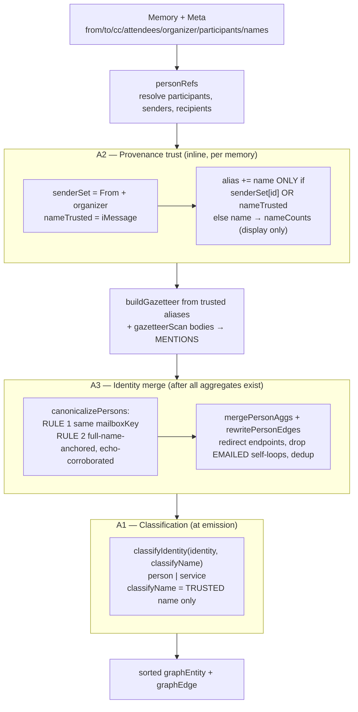
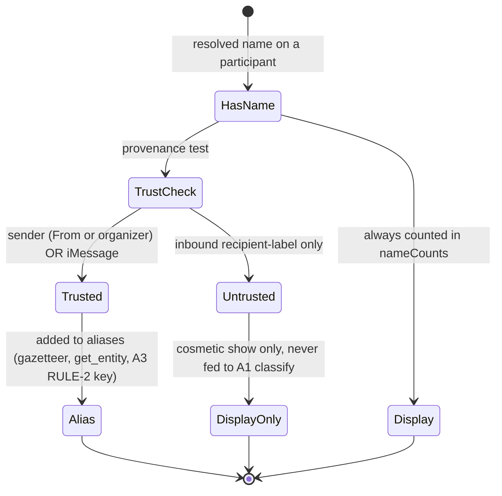
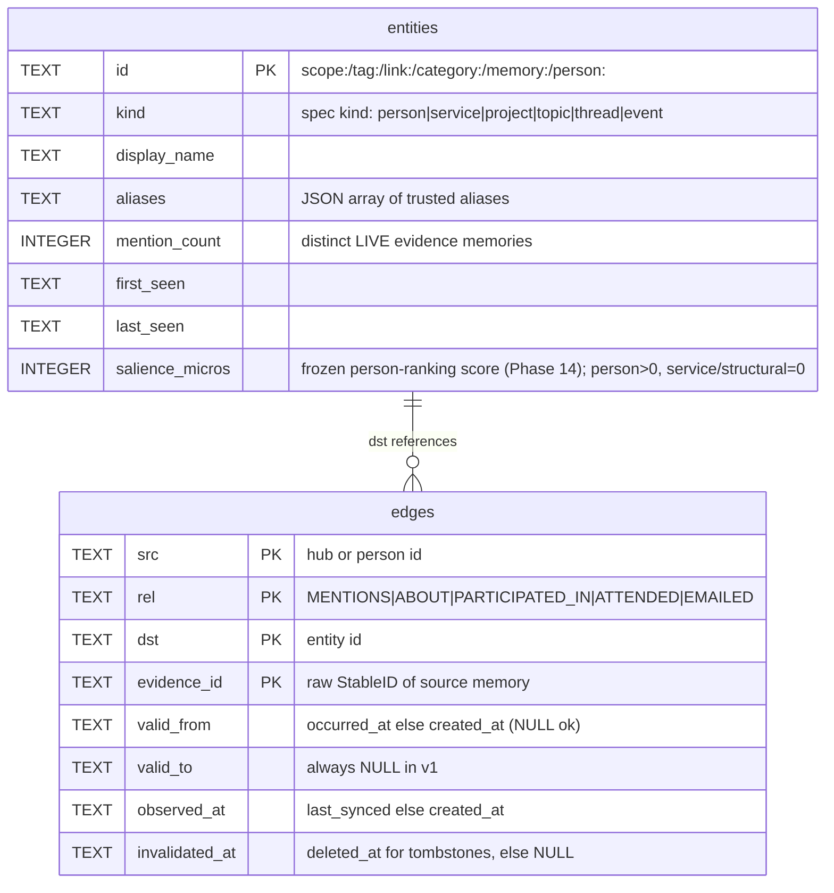

# Person Entity Graph

The deterministic, model-free pipeline that derives a person/topic entity graph from connector metadata and message bodies, classifies each identity as `person` or `service`, and merges the multiple addresses of one human into a single canonical node — precision-first, byte-identical across rebuilds.

## Files

| File | Lines | Responsibility |
|---|---|---|
| `internal/mora/graph.go` | 887 | `buildGraph` and the 3-rule layered pipeline: A2 provenance trust (`resolvePersonName`, `senderSet`, `personAgg`/`aliases`), A3 identity-merge (`canonicalizePersons`, `mailboxKey`, `mergePersonAggs`, `rewritePersonEdges`, `maxNameMergeClusters`), structural-entity + hub-node emission, fan-out cap, deterministic union-find |
| `internal/mora/classify.go` | 182 | A1 classification (`classifyIdentity`): `person` vs `service` from token-exact local-part denylist, bulk-ESP host labels, display-name suffixes, plus-addressing handling; Phase-14 precision fixes (`isShortcode`, `notify`/`alerts` host labels) + the deferred reciprocity-override rationale |
| `internal/mora/salience.go` | 294 | **Phase 14** — the pure, clock-free person-ranking kernel: `S = HumanGate × Recency × Core` (D14-1..D14-4). `sat`/`channelScale`/`recencyDecay`/`salienceMicros` primitives, `scoreSalience`, `metaMessageCount`, and the shared `aggregatePersonSalience([]Memory) map[string]int64` seam BOTH `buildGraph` (here) and the digest consume. No I/O, no `time.Now`, no new deps. |
| `internal/mora/gazetteer.go` | 252 | S5 body-matching: build a gazetteer from trusted person aliases (`buildGazetteer`), scan message/email bodies on word boundaries (`gazetteerScan`, `tokenizeForScan`), emit `MENTIONS` edges; high-precision stoplists and join-only matching |
| `internal/mora/entities.go` | 212 | Structural entity extraction (`extractEntities`: scopes/tags/`[[wikilinks]]`/`- [categories]`), the `mora entities` CLI command, MCP entity adapters |
| `internal/mora/graph_read.go` | 376 | Read path over the materialized tables: `listKind` (person/service surfacing), `graphListEntities`, `graphGetEntity` (provenance, aliases, degree, co-occurring neighbors) |
| `internal/mora/graph_cmd.go` | 193 | `mora graph` CLI: terminal overview with mention bars (`renderGraphOverview`) + per-entity drill-down (`graphDetailView`) |

The graph is **derived**, not stored — it is recomputed from scratch on every `rebuildIndex`. `buildGraph` is pure (no I/O); `writeGraph` (`internal/mora/index.go`) inserts its output into the `entities`/`edges` tables inside the same transaction as the FTS/memories index, so a graph failure rolls back the whole rebuild (atomic). Connector metadata (`Meta["from"]`, `["to"]`, `["cc"]`, `["attendees"]`, `["organizer"]`, `["participants"]`, `["names"]`) is the only input; the connectors populate it (`internal/google/calendar.go:82`, `internal/google/identity.go:129`) and `mora` reads it at the wiring boundary — see [connectors-google](./04-connectors-google.md) and [connectors-imessage](./05-connectors-imessage.md).

## The 3-rule pipeline, in FIXED order

The whole subsystem is three rules layered in a **fixed order**, and the order is load-bearing. A name's *trust* (A2) is decided first, because both classification (A1) and merging (A3) consume only trusted names — feed them an untrusted label and they make the wrong call.



### A2 — Provenance trust (graph.go, inline in `buildGraph`)

A2 runs inside the per-memory participant loop (`internal/mora/graph.go:382-447`). It decides whether a display name is trustworthy enough to become a *match key*.

A `personAgg.aliases` entry is a **trusted alias** — the keys that feed the gazetteer and `get_entity`'s alias resolution. A name is added to `aliases` ONLY when its bearer **presented it for themselves**:

- The bearer was an email/event **sender** — `senderSet`, built from `personRefs`' `from` senders plus the calendar **organizer** (`internal/mora/graph.go:235-243`, `388-391`, `414-416`). The organizer owns/created the event, so its display name is event-side self-presentation, exactly like an email From-name. Attendees, who are labeled *by* the organizer, are NOT senders and stay untrusted.
- OR the memory is **iMessage** (`nameTrusted := m.Type == "imessage"`, `internal/mora/graph.go:392`) — the name comes from the user's own address book / chat.db, which the user controls.

The address/handle itself is **always** a trusted alias (`agg.aliases[p.identity] = true`, `internal/mora/graph.go:411`). Inbound recipient-labels — a sender labeling *you* "Acme Receipts" in a To: header, or spam mail-merge mislabeling you — are counted in `nameCounts` for **display only** (`internal/mora/graph.go:413`), never trusted.

`resolvePersonName` (`internal/mora/graph.go:559-575`) returns two names from this split:

```go
func resolvePersonName(counts map[string]int, aliases map[string]bool, identity string) (show, classify string)
```

- `show` — the cosmetic display name: most-frequent **trusted** name, else most-frequent any-provenance name (a name beats a raw address), else the identity itself.
- `classify` — the most-frequent **trusted** name only, else empty. This is the only name handed to A1.

WHY the split: if A1's display-suffix rule (e.g. "… Receipts") saw an untrusted inbound label, a real person whom a spammer labeled "Acme Receipts" would flip to `service`. By feeding A1 only `classify`, an untrusted label can't misclassify a human.



### A1 — Classification (classify.go)

`classifyIdentity(identity, displayName) → "person" | "service"` (`internal/mora/classify.go:16-27`) demotes automated/transactional senders so the People view stays human while keeping them searchable. It is pure and deterministic.

- **No `@` ⇒ always `person`** (`internal/mora/classify.go:19-21`). iMessage phone handles are real people by construction.
- An email is `service` if `localPartIsService(local) || hostIsBulkESP(host) || displayIsService(displayName)`.

**Local-part matching is token-exact, never substring** (`localPartIsService`, `internal/mora/classify.go:82-105`). A denylist token must *be* a whole `.`/`-`/`_`-delimited token, or the entire local part. So `gmail`, `automotive`, `newsom` stay people — they merely *contain* a denylist substring. The only substring matches are the `serviceLocalSubstrings` no-reply family (`noreply`, `donotreply`, …, `internal/mora/classify.go:78`), distinctive enough to match anywhere and catch concatenated forms like `noreplypatientbilling`.

**Plus-addressing**: matching analyzes the **base** before the first `+` (`internal/mora/classify.go:88-90`). The tag after `+` is a user-chosen label (`jane+support@`, `adit+news@`) and must not read as a service token, while the base still catches real bots (`noreply+jobs@` → base `noreply`).

**`mail`, `email`, and `bot` are deliberately NOT denylist entries** (`internal/mora/classify.go:49-52`):
- `mail`/`email` mirror the host-label exclusion — `mail.<domain>` is ordinary routing and `my.email@x` is a real human (e.g. `andrea@mail.notte.cc`).
- `bot` as a bare token hits human handles (`the.bot`); real bots are caught by `robot`/`daemon`/`no-reply` markers and ESP host labels instead.

**Host matching uses explicit bulk-ESP labels** (`serviceHostLabels`, `internal/mora/classify.go:61-65`), not single letters like `t`. It excludes `mail`/`email` for the same reason — a real person can live at `mail.notte.cc`. **Display-suffix matching** (`displayIsService`, `internal/mora/classify.go:116-130`) catches role names ending in ` receipts`, ` alerts`, ` team`, ` digest`, etc., plus `job alerts`/`no-reply`/`do not reply` substrings.

Note: A1 is computed **twice** with identical logic — once pre-merge inside `canonicalizePersons` via `personKindOf` (`internal/mora/graph.go:686-690`) to decide RULE-2 eligibility, and once at final emission (`internal/mora/graph.go:501`). Both pass the trusted `classify` name.

### A3 — Identity merge (graph.go)

A3 runs **after** every per-address aggregate and edge exists (including gazetteer `MENTIONS`), so the merge sees complete aliases and rewrites every endpoint (`internal/mora/graph.go:488-490`). It collapses the multiple identities of one human into a single canonical node via a deterministic union-find (`internal/mora/graph.go:622-651`).

**RULE 1 — same provider mailbox.** `mailboxKey` (`internal/mora/graph.go:605-620`) collapses provably-equivalent addresses: for Gmail-owned domains (`gmail.com`/`googlemail.com`) it strips `+tags`, removes dots from the local part, and normalizes `googlemail.com == gmail.com`. Every other provider is left byte-exact (only Gmail has these semantics); phone handles key to themselves. All ids sharing a `mailboxKey` are unioned (`internal/mora/graph.go:708-718`).

**RULE 2 — full-name-anchored, echo-corroborated shared name** (`internal/mora/graph.go:720-792`). Only `person`-classified identities (A1 result) participate. A shared **distinctive trusted name** can bridge mailbox clusters, but under three guards that all must hold:

1. **Multi-token + trusted only.** `trustedPersonNames` (`internal/mora/graph.go:656-668`) returns aliases that are display names (not address/handle) with ≥2 tokens. Single-token names ("Alex") and `"Last, First"` forms are never merge keys — too ambiguous.
2. **Echo corroboration.** Each bridged cluster must contain an address whose local-part tokens (`addrTokens`, split on `. - _`, `internal/mora/graph.go:672-683`) echo at least one token of the shared name. An address that doesn't echo the name at all is not corroborated and is skipped (`internal/mora/graph.go:756-758`).
3. **Full-name anchor.** At least one bridged cluster must have a member address that spells the **whole** name (every name token echoed: `c.full`, `internal/mora/graph.go:767-769`, `774-783`). A shared first name alone must not fuse two people who merely share a full display name — this is the fix for the "two different Alex Morgans" / three-way "Maria Garcia" false merge.

Bounded by `maxNameMergeClusters = 4` (`internal/mora/graph.go:598`, `771`): a name borne by more than 4 distinct mailbox clusters is treated as a common (ambiguous) name and left **unmerged**. Precision over recall.

After clustering, the canonical id is chosen **independently of union order**: most evidence, then lexicographically smallest id (`internal/mora/graph.go:794-808`). Then:
- `mergePersonAggs` (`internal/mora/graph.go:823-850`) folds each aggregate into its canonical: union of aliases/`nameCounts`/evidence, min/max time bounds.
- `rewritePersonEdges` (`internal/mora/graph.go:854-877`) redirects every edge endpoint to its canonical id, **drops EMAILED self-loops** created when two addresses of one person emailed each other across a thread, and dedups on `src \x00 rel \x00 dst \x00 evidence_id` — which **mirrors the `edges` table primary key** `(src, rel, dst, evidence_id)` (`internal/mora/mora.go:2040`). The table is written `INSERT OR IGNORE` (`internal/mora/mora.go:2131`), so the in-memory dedup and the DB constraint agree.

### Salience pass — frozen person ranking score (Phase 14)

Immediately **after** A3 (`rewritePersonEdges`, `internal/mora/graph.go:496`) and **before** emission (`internal/mora/graph.go:528`), `buildGraph` freezes a person-ranking score onto each canonical person — the `sal := aggregatePersonSalience(mems)` pass (`internal/mora/graph.go:511`). The math lives in **one** place — `internal/mora/salience.go` — and is consumed unchanged by both the graph here and the digest ordering (see [synthesis-think-digest](./07-synthesis-think-digest.md)), so the two surfaces can never disagree on who matters.

**The model** (`salience.go:15-25`, D14-1, verbatim from the 2026-06-04 design memo):

```
S(p)  = HumanGate(p) × Recency(p) × Core(p)
Core  = 0.70·Volume + 0.15·Reciprocity + 0.10·ChannelAffinity + 0.05·Breadth
```

- **HumanGate** (`salience.go:168-174`): `person → 1`, `service → 0`. A service short-circuits to exactly `0` micros regardless of volume/recency. This is the ranking arm of the same A1 person/service split classify.go computes.
- **Volume** — `min(1, Σ_ch sat(perChannelVolume[ch], channelScale(ch)))` (`salience.go:184-196`). Each channel's raw fanout-weighted message count is saturated against a **per-channel scale** — `imsgSatScale=250`, `emailSatScale=12`, `eventSatScale=6` (`salience.go:48-52`) — because an iMessage relationship carries vastly more messages than an email thread, so a heavy texter must not re-invert the ranking. The per-channel saturated values are summed then clamped to `1`, so a multi-channel person reaches parity/exceeds a single-channel one while `Volume ∈ [0,1]`. The clamp is the project's own `min(1,·)` idiom (a literal, never data-derived → determinism preserved).
- **ChannelAffinity** = the person's strongest single channel's saturated value; **Breadth** = `sat(distinctChannels, 3)` (`salience.go:198`) — 1 channel low, 3 channels ~1.
- **Recency** — **vault-relative**, never wall-clock (`recencyDecay`, `salience.go:113-132`): `max(0.40, 2^(-Δdays/180))` where `Δdays` is the gap from the person's last instant to the **vault's max `lastSeen`** (passed in as an argument, D14-3). The 180-day half-life and 0.40 floor mean a long-dormant-but-real contact is decayed, not zeroed. Because the anchor is the vault max (not `time.Now`), the frozen score has **zero clock dependence** — the load-bearing fact for byte-identical rebuilds.
- **Reciprocity** — `0` in v1 (`salience.go:199`): there is no `self` config, and one wrong self-guess poisons every directed edge. The `0.15` term is kept **literal** (weights are NOT renormalized) so a future `self` slots in without rebalancing.
- The `[0,1]` score is frozen to an integer sort key: **`salience_micros = round(S · 1e6)` int64** (`salienceMicros`, `salience.go:137-139`). The integer is what makes rebuilds byte-identical — a float would churn the last bits.

**Volume reads REAL per-memory counts today — no re-ingest needed.** `aggregatePersonSalience` reads each memory's `message_count` via `metaMessageCount` (`salience.go:213-226`), which both connectors already emit as a quoted JSON string (`internal/google/gmail.go:92` `fmt.Sprintf`, `internal/imessage/map.go:141` `strconv.Itoa`, committed `a8269ef` in Phase 12). So Volume reflects the actual conversation/thread size for every gmail/imessage memory in the vault right now. The `1/memory` fallback (`salience.go:221-225`) fires only for OLDER filesystem memories that predate the connector capture — not the steady state. (Any "`message_count` is forward-looking / inert until re-ingest" framing from the Phase-14 context is stale: it reaches `buildGraph` for existing data.)

**Mechanics of the pass** (`internal/mora/graph.go:511-553`):

- The kernel keys by **pre-merge** person id, so its output is remapped through `canon` (the A3 union-find map), **max-folding** any collision (`internal/mora/graph.go:517-526`): two mailboxes of one human are the strongest single signal, never the sum (per-channel volume is already saturated, so summing would reward identity fragmentation past the `[0,1]` ceiling).
- The graph's A1 classification is **authoritative for the HumanGate** (`internal/mora/graph.go:540-543`): a `service`-classified entity keeps `Salience = 0` even when its address-only kernel score was positive — a *trusted display-name suffix* (e.g. "… Receipts") can flip an address-only "person" to a `service` at emission, and that service must never carry a positive ranking score (D14-1/D14-6). Structural/hub entities keep 0.
- **Byte-identical invariant extended to salience:** the fold iterates **sorted** keys (`internal/mora/graph.go:512-516`), the score is an `int64`, recency is vault-relative, and `max` is order-independent — `grep` confirms `graph.go` has no `time.Now` in the pass. The final entity sort is still by `id` — `salience_micros` is a **stored column, not a `buildGraph` sort key** (the read/ranking surface sorts on it). This is proven end-to-end by `TestSalienceRebuildAuditByteIdentical` (`internal/mora/mora_salience_audit_test.go`), which runs `rebuildIndex` **twice** over a seeded multi-source vault and diffs the ordered person rows + every `salience_micros` straight from the persisted table — the full file→parse→buildGraph→persist→read pipeline, not just `buildGraph` in memory.
- `salience_micros` is **additive-by-rebuild**: the entities `CREATE` carries it for fresh DBs (`internal/mora/mora.go:2151`) and a duplicate-column-tolerant `ALTER TABLE entities ADD COLUMN salience_micros INTEGER` (`internal/mora/mora.go:2175-2178`, tolerating ONLY "duplicate column name", fatal on anything else) upgrades a pre-column DB on its next `index rebuild` inside the atomic tx — no manual migration. `writeGraph` binds `e.Salience` in the INSERT (`internal/mora/index.go`); every rebuild does `DELETE FROM entities` then reinserts, so the column is always freshly written.

### A1 precision fixes (Phase 14) — shortcodes + brand send-subdomains

Phase 14 tightened `classifyIdentity`'s HumanGate with two **address-SHAPE** precision fixes (D14-5), both demoting unambiguous non-humans to `service` without flipping a single real person (guarded by `TestClassifyFalsePositiveCorpus`):

- **SMS shortcodes** (`isShortcode`, `internal/mora/classify.go:122-132`): a whole run of 1–6 ASCII digits with no `+` prefix → `service`. Wired into the **no-`@` phone-handle branch only** (`internal/mora/classify.go:25-27`), so email classification is untouched. The `≤6`-digit cut is safe because no real phone is ≤6 digits — a 10/11-digit US number or any `+`-prefixed international number stays `person` (the `6`-vs-`7` boundary is pinned). Shortcodes like `262966`/`22395` demote.
- **Brand send-subdomains**: `notify` and `alerts` were added to `serviceHostLabels` (`internal/mora/classify.go:78-83`) — unambiguous bulk-send labels (`notify.acme.com`, `alerts.bank.com`) that appear in no real-human corpus address. **`email`/`mail` were deliberately NOT added** (`internal/mora/classify.go:66-77`): `email.<x>.<tld>` collides with real humans at small domains (`john@email.startup.io`), so demoting it would flip a real person — the worst error. The `email.brand.com` recall miss is accepted; precision-first.

The **`is_from_me` reciprocity-override is DEFERRED, not guessed** (documented in a code block at `internal/mora/classify.go:85-98`). D14-5 calls for force-keeping anyone the user demonstrably replied to as a `person`. The direction signal does not reach this seam: `is_from_me`/`fromMe` is read per-message in `internal/imessage/chatdb.go`, but `conversationMeta` (`internal/imessage/map.go:129`) emits only `participants`/`message_count`/`occurred_at` — there is no per-handle replied-to flag in `Meta`, so it never reaches `classifyIdentity`. Wiring the override needs a connector `Meta` change AND a re-ingest (forbidden by the phase's "defer reingest" constraint). Per D14-5's own "defer rather than guess — precision-first" instruction, it is deferred with the rationale recorded so it lands cleanly once the connector carries direction.

### Structural entities, hubs, and edges (the rest of `buildGraph`)

Beyond people, `buildGraph` also emits the structural graph already present in the Markdown:
- `extractEntities` (`internal/mora/entities.go:31-89`) pulls scopes, tags, `[[wikilinks]]`, and `- [Category]` lines (skipping `- [x]` checkboxes and `- [Title](url)` Markdown links). Each becomes a prefixed entity (`scope:` / `tag:` / `link:` / `category:`) with a hub→entity edge (`MENTIONS` for links, `ABOUT` otherwise).
- One **hub node** per memory (`hubID` = `memory:<raw StableID>`, NOT `SafeFilename` — `internal/mora/graph.go:18-20`), so distinct memories never collapse to one node.
- Person edges: `PARTICIPATED_IN` (or `ATTENDED` for events) hub→person for every participant; `EMAILED` sender→recipient for mail only, within the fan-out-capped set (`internal/mora/graph.go:431-446`).

**Fan-out cap**: `maxParticipantFanout = 64` (`internal/mora/graph.go:13`). A 200-recipient blast is truncated to 64, a warning is emitted (honesty rule: never silently drop), and `capParticipants` (`internal/mora/graph.go:530-550`) guarantees self-presenters (`senderSet`) are retained — they are the highest-value nodes. Co-occurrence is **never materialized**; it's a query-time self-join (`coOccurringPeople`, `internal/mora/graph_read.go:203-229`), so an N-participant memory costs O(N) rows, not O(N²).

Bi-temporal stamps come from free signals only: `valid_from` = `occurred_at` else `created_at` (`validFromOf`), `observed_at` = `last_synced` else `created_at` (`observedAtOf`), `invalidated_at` = `deleted_at` for tombstones. Tombstoned edges are still emitted but excluded from live stats (`internal/mora/graph.go:418`, `332`).

### Materialized tables (erDiagram)



The read path filters `invalidated_at IS NULL` everywhere (`liveEvidenceByEntity`, `internal/mora/graph_read.go:88-110`; `graphGetEntity`, `internal/mora/graph_read.go:297`), so stats mirror live reads. An entity with zero live evidence is dropped (`internal/mora/graph_read.go:138`, `327-329`) so `list_entities` and `get_entity` agree.

### person vs service surfacing (graph_read.go)

The public entity kind is computed by `listKind` (`internal/mora/graph_read.go:28-33`):

```go
func listKind(id, storedKind string) string {
    if strings.HasPrefix(id, "person:") {
        return storedKind   // person | service (the A1 result)
    }
    return legacyKindFromID(id) // scope|tag|link|category from the id prefix
}
```

Person ids all carry the `person:` prefix, but their *stored* `kind` column holds the A1 result (`person` or `service`). So `listKind` surfaces the stored kind for them — `service` identities are filtered out of the surfaced views: neither `renderGraphOverview` (which **explicitly skips `Kind=="service"`** when building its `byKind` map, `internal/mora/graph_cmd.go:81-83`) nor `printEntities` (its `order` is `person`/`scope`/`link`/`category`/`tag`, `internal/mora/entities.go:144`) has a `service` section, so a `service`-kind person is never rendered — yet it stays fully searchable in the index. Structural ids keep deriving their legacy kind from the id prefix. `graphGetEntity` mirrors this for the single-entity case (`internal/mora/graph_read.go:365`).

**The People overview ranks by salience, not raw mention count (Phase 14).** `graphListEntities`'s SELECT now reads `salience_micros` into `Entity.Salience` via `sql.NullInt64` (NULL/structural → 0, `internal/mora/graph_read.go:130`, `:138-146`), and `renderGraphOverview` routes the person section to `renderPersonSection` (`internal/mora/graph_cmd.go:118-145`), which sorts **Salience desc → Count desc → Name → evidence-id join** (the existing deterministic tie-break preserved after salience) and draws the bar on the int64 salience (the printed numeric column keeps the human-legible mention `Count`; raw micros are an opaque sort key). This fixes the **bills/barbershop-over-friends inversion**: a recent high-salience friend (low Count) now outranks an old high-Count `bills@vendor.com`. The change is **person-section-only** — `sortEntitiesLegacy` (shared by the search-facing list / `list_entities` / MCP) stays Count-ordered, so the entity-list surface is byte-identical to before. Services are excluded from the overview as a **render-time filter** (the skip above) while `graphListEntities` still returns them, so they remain resolvable via `list_entities`/`get_entity` (searchable, not surfaced).

## Invariants & gotchas

- **`buildGraph` MUST be byte-identical across rebuilds — INCLUDING `salience_micros`.** Same vault → same `entities`/`edges` rows (and same frozen scores), in the same order. Every collection is sorted before any tie-break (`sortedUnique`, `sortedKeys`, `sortedPersonIDs`, `sortedStringKeys`, the salience canon-fold's sorted `salKeys` at `internal/mora/graph.go:512-516`, the final `sort.Slice` on entities/edges), there is **no map-iteration-order dependence**, the union-find canonical is chosen *after* all unions (`internal/mora/graph.go:794-808`) — never from `uf` root choice, which is order-sensitive — and the salience score is a vault-relative `int64` (no `time.Now`, `max` order-independent). WHY: the graph is recomputed on every `rebuildIndex`; non-determinism would churn the DB and break tests/audits. Verify with `go test -race ./internal/mora` plus the real two-pass `index rebuild` audit `TestSalienceRebuildAuditByteIdentical` (`internal/mora/mora_salience_audit_test.go`), which diffs the persisted person order + `salience_micros` across two full rebuilds — the column round-trip the in-memory `TestBuildGraphSalienceDeterministic` cannot reach.

- **Precision over recall — a wrong merge of two real people is the worst error.** Two real humans fused into one node silently corrupts every downstream read (search, `get_entity`, digest). So A3 RULE 2 layers three guards (multi-token, echo-corroborated, full-name-anchored) and the `maxNameMergeClusters=4` bound; single-token names and `"Last, First"` forms are left unmerged on purpose. Recall loss (a name that *could* have merged but didn't) is recoverable and benign; a false merge is not. Never auto-merge on a weak signal.

- **Order is fixed: A2 trust → A1 classify → A3 merge, and A1/A3 consume only the TRUSTED name.** `resolvePersonName` returns `(show, classify)`; only `classify` reaches `classifyIdentity` (`internal/mora/graph.go:498-501`, `internal/mora/graph.go:688-689`). WHY: an untrusted inbound label (`"Acme Receipts"` slapped on you by a sender) must never flip a real person to `service` or seed a bad merge key. Adding any new name source must classify its provenance first.

- **A trusted alias requires self-presentation.** Only senders (`from` + calendar `organizer`) and iMessage names become `aliases`; recipient-labels go to `nameCounts` (display) only. WHY: the alias set is the gazetteer + lookup key — letting an inbound label in lets a spammer's mislabel bleed into a real identity. The organizer-as-sender mapping (`internal/mora/graph.go:235-243`) is the event-side equivalent of a From-name; don't reclassify it as an attendee.

- **`mail`/`email`/`bot` are NOT denylisted; local-part matching is token-exact.** Re-adding them, or switching to substring matching, false-positives real humans (`andrea@mail.notte.cc`, `the.bot`, `gmail`, `automotive`). The only substring matches are the no-reply family in `serviceLocalSubstrings`. Plus-addressing always analyzes the base before `+`.

- **`hubID` uses the RAW StableID, not `SafeFilename`.** `SafeFilename` is lossy (`/`, `:`, ` ` → `_`), so two distinct memories could collapse to one hub node and cross-link unrelated people. Hub ids are graph keys, not filenames (`internal/mora/graph.go:15-20`). See [data-model-and-storage](./01-data-model-and-storage.md).

- **The in-memory edge dedup key mirrors the `edges` table PK.** `rewritePersonEdges` dedups on `src|rel|dst|evidence_id` (`internal/mora/graph.go:869`); the table PK is `(src, rel, dst, evidence_id)` written `INSERT OR IGNORE`. If you change one, change the other or the DB silently swallows rows the in-memory pass thought were distinct.

- **`mailboxKey` Gmail normalization is provider-specific by design.** Dot-strip + `+tag`-strip + `googlemail==gmail` is applied ONLY to Gmail-owned domains because only Gmail guarantees those semantics. Applying it broadly would merge distinct mailboxes at providers that treat dots as significant. Phone handles key to themselves.

- **A3 runs AFTER the gazetteer.** Merge must see the complete alias set and rewrite gazetteer `MENTIONS` endpoints too (`internal/mora/graph.go:484-490`). Moving the merge earlier would leave dangling pre-merge ids on later edges.

- **Gazetteer is high-precision, model-free, built from trusted aliases only.** Only multi-token names ≥`minGazNameLen` survive (`normalizeGazName`, `internal/mora/gazetteer.go:103-142`); two stoplists screen generic/role tokens and English function words; a multi-token name matches a body only when every internal gap was plain space/tab — `gazetteerScan` enforces the per-token `joinable` flag (`internal/mora/gazetteer.go:164-173`) computed by `tokenizeForScan` (`internal/mora/gazetteer.go:210-243`) — so `john.doe@example.com` never matches the person "John Doe". Loosening any guard risks a polluting `MENTIONS` edge. See [retrieval-search](./02-retrieval-search.md) for how `MENTIONS` feeds graph-expanded retrieval.

## Related

- [data-model-and-storage](./01-data-model-and-storage.md) — `StableID`/`SafeFilename`, the `entities`/`edges`/`memories` schema, `rebuildIndex`
- [retrieval-search](./02-retrieval-search.md) — how person edges + `MENTIONS` feed graph-expanded hybrid retrieval
- [connectors-google](./04-connectors-google.md) — origin of `Meta["from"/"to"/"cc"/"attendees"/"organizer"/"names"]`
- [connectors-imessage](./05-connectors-imessage.md) — origin of `Meta["participants"]` and the `imessage` type that makes names trusted
- [mcp-server](./06-mcp-server.md) — `list_entities` / `get_entity` MCP tools backed by `graphListEntities` / `graphGetEntity`
- [overview](./00-overview.md)

## Open questions / unverified

- `edges.valid_to` is declared in the schema (`internal/mora/mora.go:2040`) but `writeGraph` always inserts it `NULL` (`internal/mora/index.go`) and no read path I own consults it — it appears reserved for a future bi-temporal close, unused in v1.
- The `link`/`scope`/`tag`/`category` count surfaced by `mora graph`/`mora entities` is the **live distinct-evidence** count from `liveEvidenceByEntity` (`internal/mora/graph_read.go:141`), which can differ from the stored `mention_count` written by `buildGraph` (the stored value excludes tombstones too, so they should agree, but only the live-query value is displayed). Not a correctness bug, but worth confirming the two never diverge after partial tombstoning.
