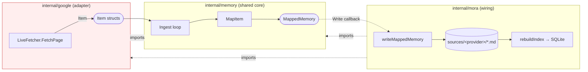
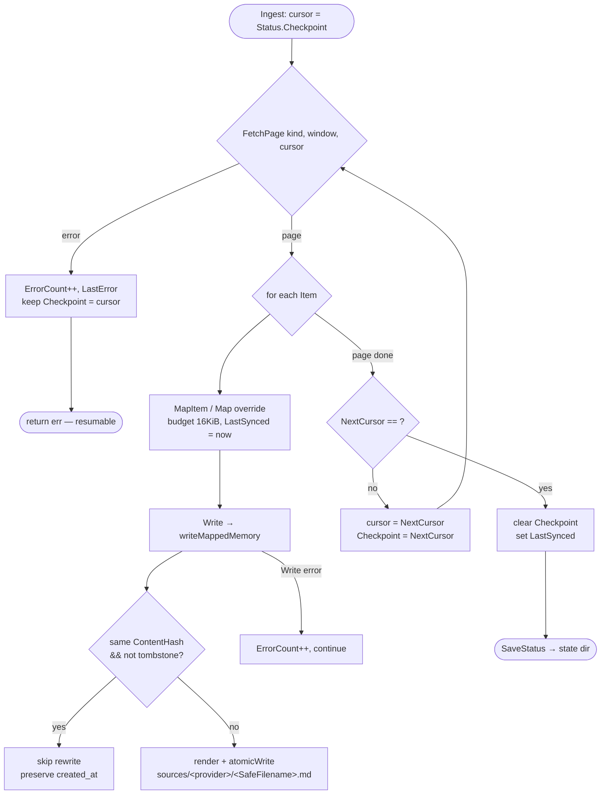

# Google Connector (Gmail + Calendar)

This connector reads Gmail threads and Calendar events. It uses an installed-app
OAuth consent flow. Tests use the `Fetcher` seam. Live runs use `LiveFetcher`
over `gmail/v1` and `calendar/v3`. A saved checkpoint lets backfill resume.
Backfill maps provider objects to plain `MappedMemory` structs.
`internal/mora` converts them at one wiring boundary.

## Files

| File | Lines | Responsibility |
|---|---|---|
| `internal/google/oauth.go` | 235 | OAuth config resolution (BYO vs embedded placeholder), loopback consent flow, token store (0600), revoke, WSL detection |
| `internal/google/client.go` | 69 | `LiveFetcher` (gmail+calendar services from a token), `FetchPage` dispatch, `AuthedLabels`, base64url body decode |
| `internal/google/gmail.go` | — | One page of threads → `Item` (thread-grained), MIME body walk, quote stripping, attachment metadata, and thread-level plus ordered per-message sender/recipient evidence |
| `internal/google/calendar.go` | 117 | One page of events (recurrence-expanded) → `Item`, attendee/organizer capture, cancelled→tombstone |
| `internal/google/identity.go` | 131 | `addrSet`: RFC 5322 address-list parsing, lowercase/dedup, display-name aliases, deterministic sorted Meta output |
| `internal/google/client.json` | 1 | Committed **NON-SECRET** placeholder so `//go:embed` compiles on a fresh clone |
| `internal/google/types.go` | 27 | `package google` doc + thin aliases for the seam shapes (`Item`, `Fetcher`, …) defined in `internal/memory`; Gmail/Cal kind constants |
| `internal/google/{ids,ingest,map,status}.go` | 11/12/10/12 | Re-export aliases for `StableID`/`ContentHash`/`SafeFilename`, `Ingest`, `MapItem`/`MappedMemory`, `SyncStatus`/`Load/SaveStatus` (real code in `internal/memory`) |
| `internal/mora/ingest.go` | (`writeMappedMemory`; `ingestGoogle`; `cmdConnect`) | The wiring boundary: drives the consent flow, runs `Ingest`, converts `MappedMemory`→`Memory`, writes files |

The connector-agnostic core — `Item`, `Fetcher`, `Ingest`, `MapItem`, `MappedMemory`, `SyncStatus`, the ID helpers — lives in `internal/memory` and is shared with the iMessage connector. `internal/google` is now a thin *adapter*: it produces `Item`s and re-exports the shared shapes so its call-sites read unchanged (`internal/google/types.go:1`, `internal/google/ingest.go:1`).

## The HARD RULE: no import cycle

`internal/google` MUST NOT import `internal/mora`. `mora` imports `google`, so the reverse would cycle. The connector returns plain `memory.MappedMemory` structs and knows nothing about Mora's `Memory` type, frontmatter rendering, or the SQLite index. The boundary is documented at the top of the package (`internal/google/types.go:2`) and verified mechanically — the only occurrence of the string `internal/mora` under `internal/google/` is that comment, not an import.

The conversion happens in exactly one place, `writeMappedMemory` (`internal/mora/ingest.go`), which copies the flat `MappedMemory` fields into a `Memory`, computes the destination path, and renders. `internal/google` never touches the filesystem layout or the index.



## OAuth: installed-app loopback consent

`Scopes` is two read-only scopes only — `gmail.readonly` and `calendar.readonly` (`internal/google/oauth.go:32`). Mora can never send, delete, or modify. Nothing egresses. The consent preamble states this verbatim to the user (`internal/mora/mora.go:1175`).

### Credential resolution (BYO over embedded)

`ResolveOAuthConfig` (`internal/google/oauth.go:36`) prefers `MORA_GOOGLE_CREDENTIALS` (a path to the user's own installed-app client JSON) over the embedded `client.json`. The embedded file is a committed **non-secret placeholder** whose `client_id` is `DEV_PLACEHOLDER…` (`internal/google/client.json:1`). It exists only so `//go:embed client.json` compiles on a fresh clone (`internal/google/oauth.go:28`) — committing real creds there is forbidden.

`configFromInstalledJSON` (`internal/google/oauth.go:68`) **fails fast** when the client ID is empty or `DEV_PLACEHOLDER`-prefixed, returning a plain-language "one-time setup" message rather than building a config that yields Google's opaque `Error 401: invalid_client` in the browser. `IsConfigured()` (`internal/google/oauth.go:54`) reuses the *same* guard — it opens no browser and does no loopback — so the guided setup menu can skip Google cleanly when creds are still a placeholder. The placeholder-rejection and BYO-preference are pinned by tests (`internal/google/oauth_test.go:13`, `:38`).

### The loopback flow

`StartLoopbackAuth` (`internal/google/oauth.go:165`) listens on `127.0.0.1:0` (a random free port), sets `RedirectURL` to `http://127.0.0.1:<port>/callback` for that one run, and builds the auth URL with `AccessTypeOffline` + `prompt=consent` so Google issues (and re-issues on re-consent) a **refresh token** (`internal/google/oauth.go:174`). A CSRF `state` is generated via `ContentHash(now, redirectURL)` and verified on the callback (`:184`). A state mismatch or an `error=` query param aborts. The browser is auto-opened (`open`/`xdg-open`) except under WSL, where the URL is printed for manual paste (`IsWSL` reads `/proc/version` for "microsoft", `:143`). The handler waits up to **5 minutes** then exchanges the code. If the exchange returns no refresh token it errors with "re-run with --reauth" (`:219`).

```mermaid
sequenceDiagram
  participant U as User
  participant CLI as mora connect google
  participant LB as loopback 127.0.0.1:&lt;port&gt;
  participant G as Google OAuth

  CLI->>CLI: ResolveOAuthConfig(Scopes) (BYO or embedded)
  Note over CLI: placeholder creds → fail fast with setup guidance
  CLI->>LB: net.Listen 127.0.0.1:0, set RedirectURL
  CLI->>CLI: AuthCodeURL(state, AccessTypeOffline, prompt=consent)
  CLI->>U: print URL + auto-open browser (not WSL)
  U->>G: grant read-only gmail + calendar
  G->>LB: redirect /callback?code=…&state=…
  LB->>LB: verify state == expected (CSRF)
  LB-->>U: "Mora connected. You can close this tab."
  CLI->>G: cfg.Exchange(code)
  G-->>CLI: access + refresh token
  Note over CLI: refresh token empty → error "re-run with --reauth"
  CLI->>CLI: SaveToken(~/.config/mora/tokens/google.json, 0600)
```

### Token storage and refresh durability

`SaveToken` (`internal/google/oauth.go:100`) writes `~/.config/mora/tokens/google.json` via a `.tmp`+rename atomic write at **0600** (dir 0700). The 0600 mode is asserted by `TestTokenStoreRoundtrip` (`internal/google/oauth_test.go:60`). At fetch time, `NewLiveFetcher` wraps the stored token in `cfg.TokenSource(ctx, tok)` (`internal/google/client.go:23`), so the `oauth2` library auto-refreshes access tokens from the refresh token — there is no manual refresh code.

**Production-vs-Testing durability gotcha:** the refresh token survives indefinitely only if the OAuth app is in **Production** mode. Google's **Testing** mode expires refresh tokens after ~7 days, after which every sync fails with an auth error. `isGoogleAuthError` (`internal/mora/setup.go`) pattern-matches `oauth`/`token`/`invalid_grant`/`unauthorized`/`401`/`expired`/`refresh` (`internal/mora/setup.go`) and the sync path then prints the specific recovery: re-run `connect google`, and if it recurs every ~7 days, switch the app to Production (`internal/mora/ingest.go`).

`RevokeToken` (`internal/google/oauth.go:128`) best-effort POSTs the refresh token to Google's revocation endpoint; `cmdDisconnect` (`internal/mora/setup.go`) calls it then removes the token file.

## Fetcher (test seam) vs LiveFetcher

`Fetcher` is a one-method interface — `FetchPage(kind, window, cursor) (Page, error)` (`internal/memory/types.go:61`). It is the unit-test seam: the generic `Ingest` loop drives *any* `Fetcher`, so tests substitute a fake that returns canned pages (no network). `LiveFetcher` (`internal/google/client.go:15`) is the real implementation, holding a `*gmail.Service` and `*calendar.Service`. Its `FetchPage` dispatches on kind to `fetchGmailPage` / `fetchCalendarPage` (`internal/google/client.go:35`). An unknown kind errors.

### Gmail: thread-level

`fetchGmailPage` (`internal/google/gmail.go:15`) lists threads (`Users.Threads.List("me")`, page size **50**) with a built-in query that excludes `category:promotions` and `category:social`, plus an `after:` date filter and any user query/label IDs (`buildGmailQuery`, `:41`). For each listed thread it fetches the **full** thread and maps it. A per-thread `Get` failure is *skipped*, not fatal (`:33`).

`gmailThreadToItem` (`internal/google/gmail.go`) collapses a whole thread into **one** `Item` (capture stays thread-grained) while retaining both the legacy thread union and ordered per-message evidence:
- Subject = the first non-empty `Subject` header in thread order; `OccurredAt` = the latest message `InternalDate`.
- Body = `From: …` + each message's `text/plain` part, quote-stripped, joined with `---`.
- `Meta["messages"]` is an ordered array carrying each message's immutable `message_ref`, normalized `sender`/`to`/`cc`, RFC3339 `at`, and connector-visible `block_refs`; `Meta["last_sender"]` is the final message's normalized sender. The one-memory-per-thread storage contract does not change.
- The existing sorted `from`/`to`/`cc` union remains present for graph and backward compatibility. It must not be used to infer direction inside a two-way thread. Direction consumes the ordered message entry that owns the authored evidence.
- `decodeGmailBody` (`:113`) recursively walks the MIME tree for the first `text/plain` part; `decodeBase64URL` (`internal/google/client.go:59`) handles both padded and unpadded base64url.
- `stripQuoted` (`:142`) drops `>`-prefixed lines and truncates at an `On … wrote:` attribution — a cheap heuristic to keep bodies lean.
- Attachment **metadata only** (filename/mime/size), never bytes (`gmailAttachments`, `:128`).
- **Actionability labels (issue #62).** `gmailUrgencyLabels` captures the union of `UNREAD`/`IMPORTANT`/`STARRED` across the thread's messages into `Meta["labels"]` (routing labels like `INBOX` are ignored), giving the brief's [urgent lane](./07-synthesis-think-digest.md) a first-class signal. These are **volatile state** — a read/star toggle flips them — so `memory.MapItem` strips them BEFORE the content hash (`hashMeta`, `internal/memory/mapped.go`) while still persisting them. A toggle therefore never churns the delta, and a pre-#62 ingest (no labels) keeps its exact legacy hash. Populating existing vaults needs a Gmail re-ingest. Until then the deadline-phrase gate is unchanged.

### Calendar: events

`fetchCalendarPage` (`internal/google/calendar.go:15`) lists events on `CalendarID` (default `primary`), page size **100**, with `SingleEvents(true)` (recurrence expanded into instances), `ShowDeleted(true)`, ordered by start time, bounded by `TimeMin`/`TimeMax`. `calEventToItem` (`:45`) renders a `When/Where/Attendees/Description` body. A cancelled event becomes a **tombstone** (`Deleted: ev.Status == "cancelled"`, `:97`), which `MapItem` stamps with `DeletedAt`. `recurring_event_id` is added to Meta only when present (an empty value would pollute the content hash, `:79`).

**`source_created_at`** records `Event.Created` — when the event came into existence *at Google*, a clock genuinely distinct from `occurred_at` (when it starts): an invite accepted in March for a December meeting has both, months apart, and the browse row surfaces them as separate fields (see [data model](./01-data-model-and-storage.md#the-three-clocks-on-a-memory-218)). It is validated rather than trusted — the field is absent on some event kinds (birthdays, some imported feeds) — and an empty or non-conforming value is **omitted**, both because a published stamp must be machine-parseable downstream and because an empty one would be hash material on every such event, the same reason `recurring_event_id` is conditional. Stored normalized to UTC RFC3339, like `occurred_at`, so Meta bytes stay byte-stable across runs. The gate is a strict RFC 3339 syntax-and-range check (`strictRFC3339`, `internal/google/rfc3339.go`) ahead of `time.Parse`, not `time.Parse` alone — and on this write path the difference is not cosmetic, because what lands in Meta is the *normalized render*, so a stamp Go tolerates does not produce a malformed value, it produces a well-formed value holding the **wrong instant**: `…+00:60` reads as `+01:00` and `…+24:00` as a 24-hour zone, putting the persisted creation time an hour or a day off with nothing downstream able to detect it. This connector must not import `internal/mora` (mora imports google), so the seam is an intentional duplicate of `internal/mora/recency.go`'s and the two are kept equivalent — change one, change the other. Populating existing calendar memories needs a re-ingest: the new key changes the content hash, so the first sync after this lands rewrites each still-live event once — a **one-time** delta blip (those events surface as updated, and their `last_synced` refreshes, which is accurate: Mora did just rewrite them), not a recurring churn like the volatile labels above. Events already outside the sync window are never rewritten and keep omitting the field; Apple Calendar rows omit it always.

### Identity capture (feeds the entity graph)

Both adapters populate `Item.Meta` with structured identity for the [entity graph](./03-entity-graph.md). Gmail parses `From`/`To`/`Cc` headers with `addrSet.addHeader` (`internal/google/identity.go:26`), which uses `net/mail.ParseAddressList` and — because that parser is all-or-nothing — falls back to a quote/angle-bracket-aware comma split (`splitAddrList`, `:50`) so one malformed address never drops the rest. Calendar attendees/organizer arrive pre-parsed and are added directly (`internal/google/calendar.go:69`). Calendar also records **`self_email`** from the authenticated user's own `Attendee.Self` entry — the authoritative answer to "which of these invitees is the user", and frequently *not* the mailbox OAuth was granted on (a Workspace alias, a custom domain). The [meeting brief](./19-meeting-brief-assembly.md) needs it to exclude the user from their own meeting. Without it an unrecognized alias is admitted as a counterparty and the user's own records are cited back as that person's unfinished business (wrong-person attribution, severity-1). Addresses are lowercased and deduped. Display names are kept per address as graph aliases. **All output lists are sorted** (`addrSet.list`, `:99`) so Meta bytes are byte-stable across runs — a determinism requirement for the graph. `mergeNames` folds aliases into a `names` map, omitted when empty (`:119`).

## The resumable Ingest loop

`ingestGoogle` (`internal/mora/ingest.go`) wires it up: resolve creds, load the token, build the `LiveFetcher`, load prior `SyncStatus`, compute the window, then call the shared `memory.Ingest` with a `Write` callback that delegates to `writeMappedMemory` and prints a running count every 500 **successfully written** items (the counter increments only after `writeMappedMemory` returns nil, `ingest.go`). The body budget is **16 KiB** (`ingest.go`).

`memory.Ingest` (`internal/memory/ingest.go:32`) pages from the checkpoint cursor:
1. `FetchPage(kind, window, cursor)`. On error: bump `ErrorCount`/`LastError`, **keep `Checkpoint = cursor`** so the next run resumes this page, and return the error (page-fetch errors stop the run but preserve resume state).
2. For each item: `MapItem` (or a connector's `Map` override), stamp `LastSynced = now`, call `Write`. A per-item `Write` failure is counted and skipped — **never fatal**.
3. After a page, advance `Checkpoint = NextCursor`. Empty cursor → done.
4. On clean completion, **clear the checkpoint** and set `LastSynced`.

`writeMappedMemory` (`internal/mora/ingest.go`) does the **content-hash skip**: if a file already exists with the same `ContentHash` and this is not a tombstone, it returns early without rewriting and **preserves the original `created_at`** (`ingest.go`). The destination is `sources/<provider>/<SafeFilename(StableID)>.md` (`ingest.go`). `StableID` is `<kind>/<providerID>` — provider identity only, never content (`internal/memory/ids.go:11`) — so re-syncing an edited thread overwrites the same file rather than duplicating. The content hash folds in the canonical Meta only when non-empty (`contentHashWithMeta`, `internal/memory/mapped.go:36`), so adding a recovered participant rewrites the file while pre-Meta memories keep their legacy two-part hash.



### Windows and the connect convenience

`windowForSource` (`internal/mora/ingest.go`) defaults Gmail to a lean **90-day** lookback (a year is mostly low-signal for a memory index), overridable via `connect google --since-days N` which is **persisted** on the source (`setSourceSinceDays`) so future `sync google` reuses it. Calendar uses a fixed `[-6 months, +3 months]` window (`ingest.go`).

`cmdConnect` (`internal/mora/ingest.go`) is the one-command convenience: print the read-only preamble, run the loopback consent, save the token, validate by listing labels (`AuthedLabels`, `internal/google/client.go:47`), ensure the gmail/calendar sources exist (created **disabled**), **flip them enabled before** the backfill, run ingest for both, then `rebuildIndex`. The backfill loop here is deliberately **ungated** — it is the named, consented path, not a silent background backfill (`ingest.go`).

## Invariants & gotchas

- **`internal/google` MUST NOT import `internal/mora`.** mora imports google. The reverse cycles. The adapter returns plain `MappedMemory`. Conversion happens only in `writeMappedMemory`. (`internal/google/types.go:2`)
- **Read-only scopes, zero egress.** Only `gmail.readonly` + `calendar.readonly` (`internal/google/oauth.go:32`). Never widen scopes without an explicit decision — write access changes the product's threat model and the consent preamble's promise.
- **The embedded `client.json` is a non-secret placeholder.** It must exist for `//go:embed` to compile, must never hold real creds, and `configFromInstalledJSON` fails fast on the `DEV_PLACEHOLDER` ID so users get setup guidance, not a 401. (`internal/google/oauth.go:77`)
- **Token file is 0600 (dir 0700), atomic write.** It holds a refresh token = standing read access to the user's mail. (`internal/google/oauth.go:100`, asserted by `oauth_test.go:60`)
- **Refresh-token durability needs Production mode.** Testing mode expires refresh tokens in ~7 days. Recurring auth failures every week mean the app is in Testing. Surface this, don't swallow it. (`internal/mora/ingest.go`)
- **`StableID` is provider identity only**, never content (`<kind>/<providerID>`). Files are named with `SafeFilename` (`/`,`:`,` `→`_`), so any later ID lookup must match the SafeFilename form. (`internal/memory/ids.go:11`)
- **Content-hash skip preserves `created_at`.** An unchanged thread is not rewritten, and rewrites keep the original creation time. The hash folds in Meta only when non-empty, so pre-Meta files don't spuriously rewrite. **Volatile state keys (Gmail `labels`, issue #62) are stripped before hashing** (`hashMeta`) so a read/star toggle never rewrites the file or churns the delta. (`internal/mora/ingest.go`, `internal/memory/mapped.go`)
- **Ingest is resumable, not live.** The checkpoint advances per page and survives a crash. Cursors are stored in `SyncStatus` (`internal/memory/status.go:13`) but the `GmailHistory`/`CalSyncToken` incremental fields are **unused in v1** — sync is an honest full re-snapshot. See [sync & freshness](./11-sync-and-freshness.md).
- **Never swallow sync errors.** Page-fetch errors stop the run but preserve resume state. Per-item write errors are counted and skipped. Failures are surfaced to the user so a stale snapshot is always distinguishable from a fresh one. (`internal/memory/ingest.go:43`, `internal/mora/ingest.go`)
- **Gmail storage is thread-grained. Evidence is message-grained.** One thread → one `Item` → one memory, but `Meta["messages"]` preserves Gmail order and each message's sender/recipients/time/evidence refs, with `last_sender` pinned separately. The sorted thread union remains backward-compatible identity data and is never a substitute for message direction. (`internal/google/gmail.go`)
- **Identity Meta must be byte-stable.** Addresses are sorted and lowercased. Empty lists/names maps are omitted. This is load-bearing for the deterministic [entity graph](./03-entity-graph.md) — do not introduce map-iteration-order output. (`internal/google/identity.go:99`, `:111`)
- **Attachments are metadata-only.** v1 never ingests attachment bodies. (`internal/google/gmail.go:128`)
- **The `kindRegistry` already hardcodes gmail/calendar.** Unlike the iMessage connector (which calls `RegisterKind` in an `init`), the gmail/calendar (type, provider) mappings are baked into `internal/memory/mapped.go:69`, so the google adapter does not register them. (`internal/memory/mapped.go:69`)

## Related

- [data model & storage](./01-data-model-and-storage.md) — `Memory`, frontmatter render/parse, `sources/<provider>/` layout, SQLite index
- [entity graph](./03-entity-graph.md) — consumes the `Item.Meta` identity data this connector captures
- [iMessage connector](./05-connectors-imessage.md) — the other `Fetcher`, sharing the same `Ingest` loop and `Map` override hook
- [sync & freshness](./11-sync-and-freshness.md) — `SyncStatus`, honest-snapshot semantics, `sync status` staleness
- [CLI & UX](./08-cli-and-ux.md) — `connect google`, `disconnect google`, `connectors` group, setup menu
- [overview](./00-overview.md)

## Open questions / unverified

- `RevokeToken` ignores the HTTP response status (it only closes the body, `internal/google/oauth.go:139`), so a revoke that Google rejects is silently treated as success — by design ("best effort"), but unverified whether any caller depends on real revocation.
