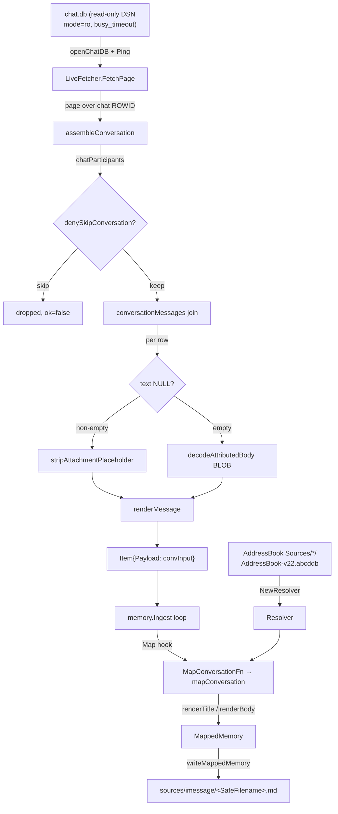
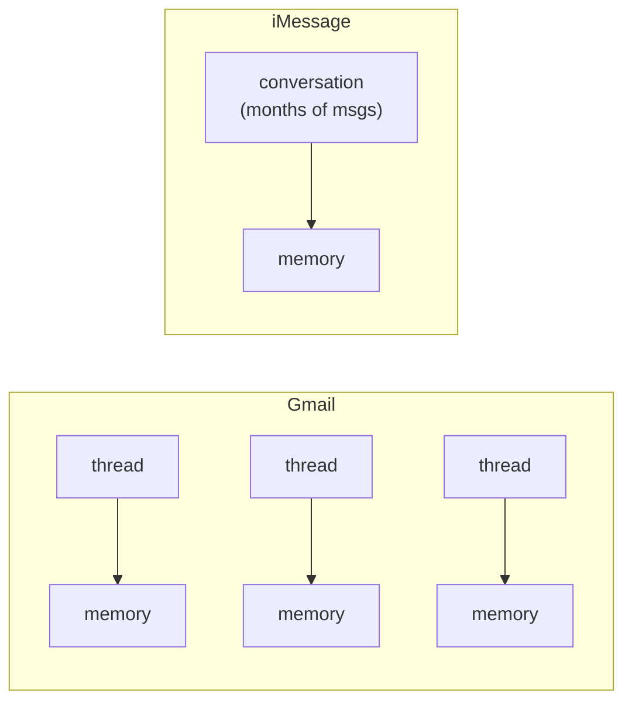
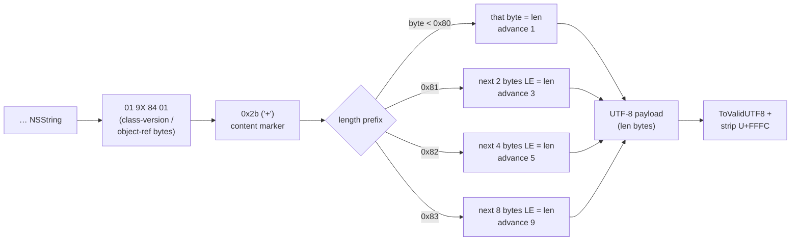
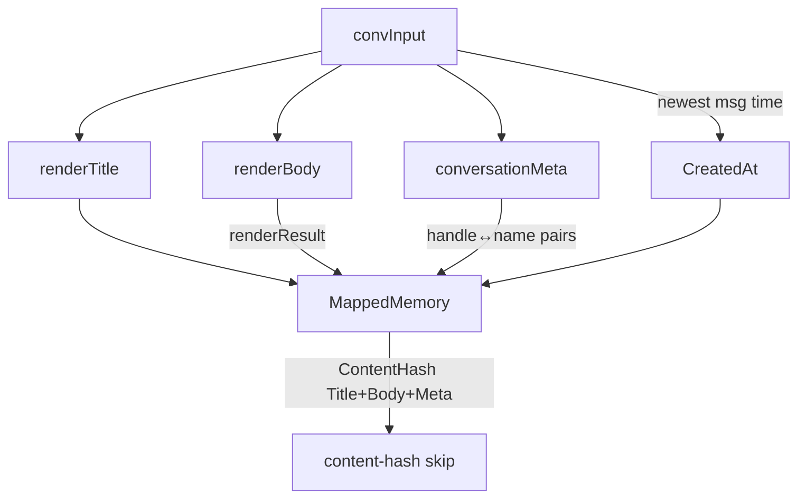

# iMessage Connector

This connector reads the local macOS `chat.db`. It writes one Markdown memory
for each conversation. It decodes Apple's `attributedBody` typedstream and maps
handles to AddressBook names. The shared resumable ingest loop returns the
result.

## Files

| File | Lines | Responsibility |
|---|---|---|
| `internal/imessage/chatdb.go` | 487 | `LiveFetcher`: opens `chat.db` read-only, schema-probes, pages chats, runs the message join, collapses message×attachment rows (threading the attachment's on-disk path via `expandHome`), applies the deny-list, builds the per-conversation `convInput` |
| `internal/imessage/typedstream.go` | 129 | `decodeAttributedBody`: bounds-checked NSString-run extractor for the Apple typedstream BLOB. The 0x2b-marker anchor, the 0x81/0x82/0x83 length-prefix decode, and the U+FFFC strip |
| `internal/imessage/addressbook.go` | 310 | `Resolver`: builds a normalized handle→name map once from every `AddressBook-v22.abcddb` source (schema-defensive). Raw-handle fallback |
| `internal/imessage/render.go` | 273 | Title synthesis, day-grouped transcript rendering, recency-first byte budgeting (inverted truncation), attachment markers |
| `internal/imessage/map.go` | 159 | `mapConversation` / `MapConversationFn`: turns one `convInput` into a `memory.MappedMemory` with identity, content hash, truncation fields, and entity-graph Meta |

Supporting (not owned here, cited for context): `types.go` (seam aliases + `DenyList` + `KindIMessageChat`), `fda.go` (`chatDBDSN` / `openChatDB` / `ProbeReadable`), `timestamp.go` (Cocoa-epoch conversion), `ids.go` (`StableID` notes). The wiring boundary `ingestIMessage` lives in `internal/mora/ingest.go`.

## Pipeline overview

The connector is a thin, resolver-free reader. `LiveFetcher` produces `memory.Item`s carrying a structured `convInput` `Payload`. The shared `memory.Ingest` loop drives it; `MapConversationFn` (bound to a `Resolver`) renders each `convInput` into a `MappedMemory` at the mapping hook. Name resolution, day-grouping, and inverted truncation all happen in the mapper, **not** the fetcher — so the connector stays a thin DB reader and the seam carries raw handles (`internal/imessage/chatdb.go:30-33`).

### FetchPage: chat-paged, one memory per conversation

`FetchPage` pages over chats ordered by `chat.ROWID` (`chatPageSize = 50`, `internal/imessage/chatdb.go:11`). The cursor is the next chat ROWID to start from — `""` for the first page, `""` returned when the last chat is reached (`chatdb.go:141-211`). Each surviving chat becomes **exactly one `Item`** (`chatdb.go:305-316`). A per-conversation assembly failure is skipped, never aborting the page — honest-snapshot, schema-defensive (`chatdb.go:196-205`).

The roster comes from `chat_handle_join` (`chatParticipants`, `chatdb.go:217-241`), which is authoritative independent of who spoke in the window; `len(participants) > 1` classifies a group. The message join (`conversationMessages`, `chatdb.go:323-461`) joins `message → chat_message_join → handle → message_attachment_join → attachment`, filtered by `cmj.chat_id = ? AND m.date >= ?` and ordered `m.date ASC, m.ROWID ASC`.

A message with N attachments yields N join rows. They are collapsed to one logical message keyed by `m.ROWID`, preserving first-seen order (`chatdb.go:350-433`). Tapbacks/reactions (`associated_message_type != 0`) are filtered out entirely (`chatdb.go:385-388`).

### Conversation chunking model (1 memory per conversation)

This is the connector's defining shape and the most consequential contrast with Google. Gmail emits **one memory per thread** (`internal/google`, `04-connectors-google.md`). IMessage emits **one memory per conversation** — the entire chat history (within the window) is a single Markdown file (`IMSG-03`, `chatdb.go:144-145`, `map.go:32-40`).

**Salience implication (the chunking inversion).** Because one busy iMessage conversation = 1 memory while a busy email correspondent spans many thread-memories, naive memory-count ranking inverts importance: a close friend's single dense conversation looks "smaller" than a noisy mailing list with one thread per message. Any volume-based salience scoring must normalize per channel — counting iMessage memories as a proxy for relationship weight under-counts texting relationships. (The salience design that accounts for this is tracked separately and not implemented in this package. See project memory "Mora Salience Ranking Design".)

### attributedBody / NSAttributedString typedstream decode

On modern macOS the `message.text` column is frequently NULL and the body lives only in the `attributedBody` BLOB — an Apple **typedstream** archive (`IMSG-02`, `typedstream.go:9-12`). This is the connector's long pole. The decode order in `conversationMessages` is: read `text` first and strip U+FFFC. If it collapses to empty, fall through to `decodeAttributedBody(attrBody)` (`chatdb.go:392-402`).

`decodeAttributedBody` is **not** a full `NSKeyedArchiver`/plist parse — typedstream is a different, older format. It is a bounds-checked NSString-run extractor (`typedstream.go:36-42`).

The algorithm (`typedstream.go:43-116`):
1. Find the literal `"NSString"` class marker. Absent ⇒ `""`.
2. Anchor on the `0x2b` (`'+'`) content marker that always immediately precedes the length prefix. It sits a few class-version/object-reference bytes past `"NSString"` (real preamble in the corpus: `01 94 84 01 2b`, per `typedstream_test.go:24`). The decoder **scans a bounded 16-byte window** (`maxMarkerScan`) rather than hardcoding the offset, so older-macOS preamble variants still resolve. No `0x2b` in the window ⇒ not a decodable run ⇒ `""` (`typedstream.go:54-69`).
3. Step past the `0x2b` to the length prefix and decode per the table above (`typedstream.go:75-100`).
4. Clamp `n` to the bytes that remain, run `strings.ToValidUTF8`, and strip U+FFFC (`typedstream.go:102-115`).

#### The 0x2b-marker preamble-skip bug (dropped ALL modern messages)

The previous decoder mistook the first post-`"NSString"` byte (`0x01`) for the length prefix, never reached the `0x2b` run, and returned `""` for **every** modern `attributedBody`-only message — silently dropping it (the Phase 2.1 received-message drop bug, `typedstream.go:20-24`). Because modern macOS leaves `message.text` NULL and puts the body only in `attributedBody`, this dropped essentially all recent texts, not just received ones. The fix is the 16-byte scan to the `0x2b` content marker before reading any length. The synthetic test blobs that previously passed had **omitted** the class preamble entirely (length prefix flush against `"NSString"`), so they never exercised the marker-skip path — which is exactly why the bug shipped (`typedstream_test.go:19-22`).

#### Length-prefix off-by-one (#1455)

For the `0x81` case the cursor advances by **3** (1 marker byte + 2 length bytes), not 2. The documented #1455 bug advanced by one too few and dropped the final payload byte for lengths 128–255 (`typedstream.go:26-34, 77-82`). The regression test asserts a 200-char body keeps its distinct trailing `Z` (`typedstream_test.go:79-90`).

#### Hardening: U+FFFC strip and 0x83 overflow clamp

- **U+FFFC strip.** The object-replacement char `` (U+FFFC) marks where an inline attachment sits inside a body. macOS writes it into **both** the `text` column and the `attributedBody` run, so it is stripped at **every** body source — `stripAttachmentPlaceholder` runs in `conversationMessages` on the `text` column (`chatdb.go:396-399`) and again inside `decodeAttributedBody` (`typedstream.go:115`). A bubble that is only a placeholder collapses to `""` and renders via its attachment marker instead of leaking a junk glyph (`typedstream.go:118-129`).
- **0x83 overflow clamp.** A crafted `0x83` (uint64) length prefix can make `n` large enough that `p+n` overflows `int64` to a negative value, which would defeat a naive `p+n > len(blob)` guard and panic on `blob[p:p+n]`. The clamp compares against `len(blob)-p` (a safe non-negative bound since `p <= len(blob)`) instead (`typedstream.go:105-111`). Any anomaly returns `""` rather than panicking — DoS mitigation `T-02-DOS` (`typedstream.go:37-42`, asserted in `typedstream_test.go:168`).

### Contact name resolution (AddressBook, not the Contacts API)

Names come from the on-disk **macOS AddressBook SQLite databases**, read directly and read-only — **not** the macOS Contacts framework/API (`addressbook.go:10-31`). `NewResolver` walks every `Sources/<UUID>/AddressBook-v22.abcddb` under `~/Library/Application Support/AddressBook/Sources` (`DefaultAddressBookRoot`, `addressbook.go:29-31, 39-61`).

The map is keyed by a **normalized** handle (`normalizeHandle`, `addressbook.go:96-114`): an email (`@`) is lowercased. Anything else is reduced to its digits (dropping `+`, spaces, parens, dashes) so `+1 (415) 555-1234` and `+14155551234` collide. The same normalization is used for deny-list matching (`chatdb.go:65-75`), keeping resolution and deny in agreement across spellings.

Per source, the resolver reads `ZABCDRECORD` (names) joined to `ZABCDPHONENUMBER` and `ZABCDEMAILADDRESS` (handles) via `ZOWNER → Z_PK` (`loadAddressBookSource`, `addressbook.go:122-198`). Display name precedence (`composeName`, `addressbook.go:223-241`): `First Last` → organization → **nickname** → `""`. The nickname fallback (`ZNICKNAME`, queried only when present, `addressbook.go:142-147`) fixes contacts saved under only a nickname, which otherwise surfaced as a raw phone number in `mora graph`.

On **any** mismatch the resolver degrades, never aborts:
- Missing/unreadable AddressBook root (no AddressBook, FDA denied, non-macOS) ⇒ empty resolver, every handle falls back to its raw form (`addressbook.go:42-47`).
- A per-source DB that cannot be opened/queried is skipped (`addressbook.go:53-58`).
- `addressBookColumnsPresent` verifies the private, version-variable `ZABCD*` schema. On mismatch the source adds nothing rather than failing with "no such table/column" (`addressbook.go:271-310`).
- `Resolve` returns the **raw handle verbatim** on no match — never a fabricated placeholder (`D-09`, `addressbook.go:79-89`). A first-seen name wins across sources (`addressbook.go:202-217`).

### Full Disk Access requirement

`chat.db` lives under `~/Library/Messages/` and is FDA-gated by macOS. The DSN is `file:<path>?mode=ro&_pragma=busy_timeout(5000)` (`fda.go:15-17`). Two DSN invariants:
- **`mode=ro`, never `immutable=1`.** `mode=ro` lets SQLite apply the WAL sidecars on read (SQLite 3.22+), so a live Messages.app's uncheckpointed messages are still visible. `immutable=1` would ignore the WAL → stale/torn reads dropping recent messages (`IMSG-09`, `fda.go:11-14`).
- **`Ping()` forces a real open.** `sql.Open` is lazy and macOS FDA denial lets `os.Stat` succeed while `open()` fails, so `openChatDB` Pings to force the actual open/read (`fda.go:19-33`). `ProbeReadable` goes further and reads one row from `sqlite_master` so an FDA-denied or corrupt DB surfaces here rather than at first `FetchPage` (`fda.go:40-53`).

`mora doctor` / `connect imessage` use `ProbeReadable` (a real read probe, never `os.Stat`) as the FDA signal and print step-by-step grant guidance when it fails (`printIMessageReadiness`, `doctor.go`). `ingestIMessage` is macOS-gated up front (`runtime.GOOS != "darwin"` prints an honest note and returns 0, never a false error) and translates a present-but-unreadable `chat.db` into the FDA guidance rather than a raw sqlite error (`ingest.go`).

### Deny-list (thread-granularity)

The deny-list is applied **before** assembly so denied conversations never reach rendering (`IMSG-06`, `chatdb.go:243-271`). `DenyList` has `Contacts` (handles) and `Conversations` (names), populated mora-side from the source config (`ingest.go`, `types.go:31-46`). Rules:
- A denied **conversation** name or chat identifier (case-insensitive exact) is skipped entirely.
- A denied **contact** excludes a conversation only when it is the **sole counterparty** of a 1:1 (single non-self participant, or — roster empty — the 1:1 identifier). A denied member of a multi-party group does **not** drop the group, and the transcript is never per-message stripped (`chatdb.go:257-269`).

### Rendering, timestamps, and identity

**Title** (`renderTitle`, `render.go:80-102`, `D-10`): explicit group display name verbatim → else comma-joined resolved participant names in `chat.db` order → else (1:1) the other party's resolved name, else raw handle.

**Body** (`renderBody` / `renderTranscript` / `renderLine`, `render.go:106-222`): day-grouped `## YYYY-MM-DD` sections with `Name: text` lines, oldest→newest within a day. Self messages use the `Me` label (`D-02`). A no-match handle renders raw (`D-09`). System events render as a single italic line. Retracted messages render `<label>: [message removed]` (the original text is never emitted, `D-12`). Skipped tapbacks emit nothing and never open an empty day header. Attachments render as **metadata-only** markers — `[image: name]` / `[attachment: name · mime]`, never bytes or on-disk paths (`IMSG-07`, `render.go:224-273`).

**PDF attachments → derived memories (the IMSG-07 amendment).** The rendered guarantee above is **unchanged** — a transcript never carries attachment bytes, byte sizes, or file paths, and `TestAttachmentRender` regression-guards exactly that (a `Library/Messages` path in the rendered body is a test failure, `render_test.go:122-145`). What the amendment added is an **in-transit** field: `conversationMessages` now sets `Attachment.Path` to the attachment's chat.db on-disk location, with the stored leading `~` resolved to an absolute path via `expandHome` (`chatdb.go:423`, `chatdb.go:476-487`). The connector itself **never opens that file** — no bytes cross the seam. `Path` is consumed at the wiring boundary in `internal/mora`: `writeAttachmentMemories` (`internal/mora/pdf.go:88-129`, called from the iMessage write closure right after `writeMappedMemory`, `ingest.go`) extracts text from each readable PDF attachment and writes one derived `att_…` memory per PDF. Display names stay path-free via `baseName` (`chatdb.go:465-474`). The derived-memory shape and the extraction caps are documented in [data model and storage](./01-data-model-and-storage.md).

**Inverted truncation** (`render.go:106-151`, `D-03`): iMessage keeps the **newest** messages and drops the oldest, with the truncation marker placed at the **TOP** — the inverse of Gmail's keep-from-start slice. Whole messages are dropped from the front by rune count until the body (including the marker) fits `BodyBudget` (16 KiB at the wiring boundary, `ingest.go`). The body is never byte-sliced mid-rune (the emoji/CJK-corruption pitfall). This is why the mapper deliberately **bypasses `memory.MapItem`** — `MapItem`'s start-keep slice would corrupt the recency semantics (`map.go:32-40`).

**Timestamps** (`timestamp.go`): `message.date` is Cocoa-epoch (2001-01-01). Modern macOS stores nanoseconds, older stores seconds; `cocoaEpochToTime` magnitude-detects at the `10^12` threshold (`timestamp.go:18-30`). `CreatedAt` is the newest message time (`newestMessageTime`, `map.go:113-124`); `raw == 0` yields the zero time, never a fabricated date.

**Identity & change detection** (`map.go:41-83`): `StableID = memory.StableID(KindIMessageChat, guid)` = `imessage_chat/<guid>` — provider identity only, never content, so a re-synced conversation overwrites the same file. The on-disk filename runs through `SafeFilename` (`/`→`_`, `:`→`_`, ` `→`_`). Chat GUIDs contain `;`, `+`, `-`, `@` but the only path-unsafe char `/` is covered (`ids.go:9-18`). Each rendered message is addressed as `<conversation StableID>#<message GUID>`; Apple's durable `message.guid` is selected explicitly, while `message.ROWID` remains only the key that collapses message×attachment join rows. A missing GUID never produces a synthetic reference: the body remains readable and metadata records a typed diagnostic instead. Evidence metadata stores only the stable ref, occurrence time, direction/sender, and exact rendered byte boundary—never a second copy of message content. Truncation drops evidence for every block it drops.

The meaningful content hash folds in canonical conversation identity metadata, but deliberately excludes this evidence schema metadata. That keeps a legacy-to-evidence rewrite from masquerading as a user-visible content change in Brief. `writeMappedMemory` detects a legacy iMessage with the same content hash but no message-evidence schema marker, rewrites it once through the normal mark-before-visible journal and atomic publish boundary, preserves its original `created_at`, and skips a byte-identical second resync. Migration is honest about scope: only conversations returned by the configured sync window are rewritten; older legacy conversations remain parent-readable with a `message_evidence_unavailable` projection diagnostic until a wider backfill is requested.

**Entity-graph Meta** (`conversationMeta`, `map.go:126-147`): emits structured `participants` as `{handle, name}` pairs (not parallel comma-joined lists — a name containing a comma broke positional correspondence), plus `message_count` and `occurred_at`. Identity metadata only, never message bytes. **Trust note:** the entity graph treats iMessage participant names as **trusted aliases** unconditionally — `nameTrusted := m.Type == "imessage"` (`internal/mora/graph.go:392`) — because they come from the user's own AddressBook, unlike inbound email recipient-labels which are display-only. See [entity graph](./03-entity-graph.md).

## Invariants & gotchas

- **`internal/imessage` imports neither `internal/mora` nor `internal/google`, and makes ZERO network calls** (`types.go:7-9`). It reads only the local `chat.db` read-only. WHY: avoid the import cycle (mora imports the connector) and uphold the zero-egress guarantee — the connector returns plain structs and mora converts at the wiring boundary.
- **`Attachment.Path` is in-transit only — never rendered, never opened by the connector** (`chatdb.go:423, 476-487`. Guard at `render_test.go:138-140`). WHY: IMSG-07's user-facing guarantee (no bytes or paths in vault output) is unchanged by the amendment; `Path` exists solely so the wiring boundary (`writeAttachmentMemories`, `internal/mora/pdf.go:95`) can extract PDF text mora-side, keeping the connector a pure `chat.db` reader with zero file-content access.
- **`mode=ro`, NEVER `immutable=1`** (`fda.go:11-14`). WHY: `immutable=1` skips the WAL, giving stale/torn reads that silently drop the newest messages, violating the freshness guarantee.
- **Always `Ping()`/read a row after open** (`fda.go:19-53`). WHY: `sql.Open` is lazy and FDA denial lets `os.Stat` pass while the real open fails. A deferred error would surface as a cryptic mid-ingest failure instead of a clear FDA prompt.
- **`decodeAttributedBody` must skip the class preamble to the 0x2b content marker before reading any length** (`typedstream.go:54-70`). WHY: anchoring on the wrong byte returns `""` for every modern `attributedBody`-only message — i.e. silently dropping essentially all recent texts (the Phase 2.1 drop bug). Synthetic test blobs MUST include the real preamble or they don't exercise this path.
- **0x81 advances the cursor by 3, not 2** (`typedstream.go:77-82`). WHY: advancing by 2 drops the final payload byte for lengths 128–255 (#1455).
- **Length clamp compares against `len(blob)-p`, never `p+n`** (`typedstream.go:105-111`). WHY: a 0x83 uint64 length can overflow `p+n` to negative and defeat the bound, panicking on the slice. Any decode anomaly must return `""` (DoS mitigation T-02-DOS).
- **U+FFFC is stripped at EVERY body source** (`chatdb.go:396-399`, `typedstream.go:115`). WHY: macOS writes the placeholder into both the `text` column and the `attributedBody` run. The attachment is surfaced separately, so the bare `` glyph must never reach the transcript.
- **Names come from the on-disk AddressBook DBs, not the Contacts API** (`addressbook.go:10-31`). The schema (`ZABCD*`) is private and version-variable — every column read is PRAGMA-guarded and degrades to the raw-handle fallback, never aborting the build (`addressbook.go:271-310`, `D-09`).
- **Handles normalize identically for resolution AND deny** (`addressbook.go:96-114`, `chatdb.go:65-75`). WHY: a phone number can appear as `+1 (415)…` or `+1415…`. Divergent normalization would silently miss matches.
- **One memory per conversation, inverted truncation** (`chatdb.go:144`, `render.go:106-151`, `D-03/IMSG-03`). WHY: a conversation is a single growing thread. Keeping the newest with the marker at the top is the opposite of Gmail's keep-from-start. The mapper MUST NOT call `memory.MapItem` — its start-keep slice would corrupt recency.
- **`buildGraph`-relevant determinism:** participants are listed in stable `chat.db` ROWID order (`chatdb.go:217-223`) and the transcript is sorted chronologically before budgeting (`render.go:115-116`). WHY: the content hash folds in Title+Body+Meta, so any nondeterministic ordering would churn files across syncs.
- **Per-conversation failures are skipped, never fatal** (`chatdb.go:196-205`). WHY: honest-snapshot — a single anomalous chat must not abort the whole backfill. The ingest loop counts the gap.

## Related

- [overview](./00-overview.md)
- [data model and storage](./01-data-model-and-storage.md) — `MappedMemory`, `writeMappedMemory`, content-hash skip, on-disk layout
- [entity graph](./03-entity-graph.md) — how iMessage participant pairs become trusted person aliases (`nameTrusted`)
- [Google connector](./04-connectors-google.md) — the 1-per-thread contrast and the shared `Fetcher`/`Ingest` seam
- [sync and freshness](./11-sync-and-freshness.md) — `SyncStatus`, checkpoint/resume, doctor FDA signal
- [CLI and UX](./08-cli-and-ux.md) — `connect imessage`, `sync imessage`, readiness/FDA guidance

## Open questions / unverified

- The lookback window default (**365 days**) and the `BodyBudget` (16 KiB) are set at the mora wiring boundary (`ingest.go`), not in this package. Connect and sync output disclose the effective window and point users to `--since-days`; it is a caller choice, not a connector invariant.
- `chatPageSize = 50` and `maxMarkerScan = 16` are tuned constants with no live-corpus benchmark cited in-repo. Their values are correct as written but the choice rationale beyond the inline comments is not documented in code.
