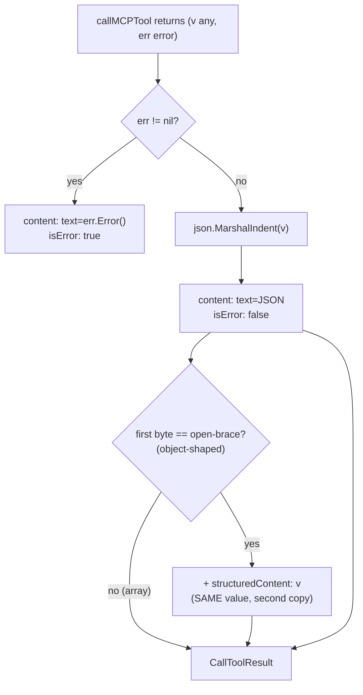
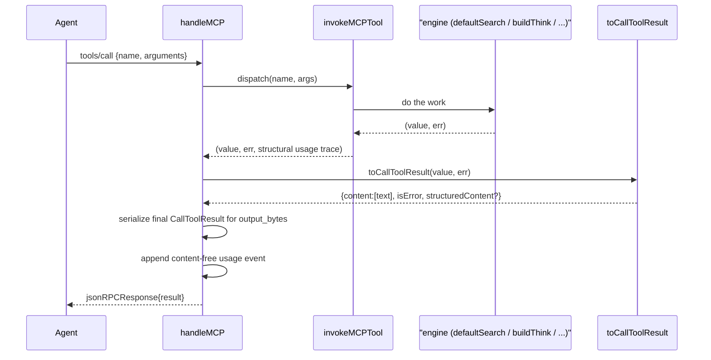

# MCP Server

The stdio JSON-RPC 2.0 server gives MCP agents access to Mora. Claude Code and
Codex can call thirteen tools for memory, exact calendar ranges, search, the entity graph, synthesis,
briefing, and meeting preparation.

## Files

| File | Lines (approx) | Responsibility |
|---|---|---|
| `internal/mora/mcp.go` | `serveMCP`, `handleMCP`, `toCallToolResult`, `callMCPTool`, `mcpToolDef`/`mcpToolRegistry`/`mcpToolIndex`, `mcpTool`/`mcpParam`, `cmdMCP`; `snippetMemories` (in `search.go`), `usageEvent` (in `mora.go`. Usage logging `usageEnabled`/`logUsage` in `usage.go`) | The whole MCP surface: stdio dispatch loop, JSON-RPC method routing, the CallToolResult envelope, the derived tool registry each handler hangs off, the tools/list schema builders, and local usage logging |
| `internal/mora/health_envelope.go` | `compactHealth`, `compactHealthFrom`, `compactHealthOf`, `healthFromParts`, `printHealthBannerLine` | The bounded typed health object every MCP tool/HTTP route carries (vs. doctor/digest/meetingbrief's richer arrays), plus the CLI banner-print helper |
| `internal/mora/health_registry.go` | `mcpHealthExemptTools`, `httpHealthExemptRoutes`, `cliHealthSurfaces` | The completeness allowlists `TestEverySurfaceCarriesHealth` walks — every MCP tool, HTTP route, and required CLI verb that must carry typed health / render the banner |
| `internal/mora/mora_mcp_result_test.go` | full file | Contract guard: every `tools/call` must return a CallToolResult, not a bare value (the Codex-rejection regression) |
| `internal/mora/mora_mcp_budget_test.go` | full file | The "T0" output-size regression gate: pins each tool's serialized envelope under a fixed token ceiling. Quarantines the still-RED tools. Also proves the tightest ceilings (`write_memory`, `delete_memory`) hold under a MAX-length unhealthy banner (C1) |
| `internal/mora/health_registry_test.go` | full file | `TestEverySurfaceCarriesHealth` (every surface carries health) and `TestSixDayFreezeSurfacesOnEverySurface` (HEALTH-05 replayed across every surface, not just Gate 1's subset) |

The server is the *boundary*. Other subsystems do almost all dispatched work.
Search uses `hybrid.go` and `defaultSearch`. The entity graph uses
`graph_read.go` through `entities.go`. Synthesis uses `think.go` and
`digest.go`. This document defines the protocol and envelope. The linked
documents define the engines.

## Current brief surfaces

The shipped brief contract has two product pipelines, each exposed through real dispatchers:

- **Daily:** CLI `mora pulse --digest --since-hours N` and MCP `digest {since_hours:N}` both run the explicit, watermark-independent window path. They intentionally have different per-source caps: the human CLI uses `digestDefaultCap` (8), while MCP uses `mcpDigestMaxItems` (500) and lets the byte budget trim the payload. The exam pins each exact ID order and proves that applying the CLI's per-source cap to the MCP result reproduces the CLI result exactly.
- **Event:** CLI `mora brief --event-id ID --at RFC3339 --json` and MCP `meeting_prep {event_id,at}` return byte-identical `MeetingBrief` values and are scored as one product surface.

There is **no Home product surface yet**. `GET /` is only the static token-bearing landing page; HOME-09/#141 owns a real Home call-site proof when that feature exists. `POST /meeting-prep` is an extra HTTP transport check over MCP `meeting_prep`, not a substitute Home surface and not a separate product engine.

## How it runs

`mora mcp serve` is the line-oriented stdio server. `mora mcp proposals
list|approve|reject` is the local owner-only review surface for propose-mode
writes. `serveMCP` (`mcp.go`) wraps `stdin` in a `bufio.Scanner` and processes
one JSON-RPC request per line, writing exactly one JSON line to `stdout` per
request via `fmt.Fprintln`.

### Transport invariants and footguns

- **One line in, one line out — except notifications.** The scanner is the framing: requests must be newline-delimited single-line JSON. `serveMCP` writes one response line for every parsed *request*, but a notification (no `id`) produces nothing — see the next bullet.
- **Malformed JSON is silently dropped, not errored.** `serveMCP` does `continue` on an `Unmarshal` failure — no JSON-RPC parse-error reply is sent. A client that pipelines a bad line gets silence for that line, not `-32700`.
- **Notifications get no response (JSON-RPC requires this).** A notification is any message with no `id` (e.g. `notifications/initialized`, sent right after `initialize`). `serveMCP` skips it with `if req.ID == nil { continue }` so it is never answered. Earlier the loop had no notion of a no-ID notification: it fell through to the `default` branch of `handleMCP` and replied with an id-less `-32601 method not found` envelope. Claude Code and Codex tolerated that stray frame, but **Antigravity's strict `modelcontextprotocol/go-sdk` client aborted the whole session over it** (`tools/list: invalid request` → every tool dropped). Fixed and locked by `TestMCPNotificationsGetNoResponse` (`mora_mcp_notifications_test.go`). **Never reply to a notification.**
- **Request lines are capped at 4MB (`mcpMaxRequestBytes`), not the 64KB scanner default.** `serveMCP` sets an explicit `scanner.Buffer`. Without it a single oversized `write_memory`/`think` line killed the whole server mid-session. Beyond the cap the loop still ends, but with an actionable error naming the cap instead of a bare `ErrTooLong`. Pinned by `TestServeMCPHandlesOversizedRequestLine` / `TestServeMCPOverHardCapErrorsLoudly`.

### Loopback HTTP transport (`mora serve http`)

`mora mcp serve` (stdio) covers agents that can spawn the process and pipe stdin/stdout. A **sandboxed AI browser** (e.g. Aside) can do neither — its only channel into the machine is a Chrome tab that can fetch `127.0.0.1`. `mora serve http` is composed in `internal/mora/serve_http.go` over the standard-library-only `internal/loopbackhttp` transport. Its single package-owned route registry builds both the `ServeMux` and exported route metadata (C3 ▸R2), while Mora injects per-request `callMCPTool` dispatch, real health evaluation, `BuildVersion`, and the root-owned `httpCallAllowed` policy. The transport binds `127.0.0.1` only, persists a 32-byte hex token at `<ConfigDir>/http.json` (`0600`), rejects non-loopback Host headers, sends no CORS allow-origin header, serializes tool callbacks, and excludes unauthorized `/call` tools before dispatch. For behavioral compatibility, authorization currently accepts both `Bearer <token>` and the legacy bare token form; tightening that protocol is a separate security change rather than part of this ownership move. Convenience routes (`GET /brief`, `POST /think`, `POST /search`, `POST /write`, `POST /meeting-prep`, `GET /entity/{name}`) translate to the same MCP tools; `GET /healthz` and `GET /` remain the only unauthenticated routes. Package tests pin routing, host/auth/CORS behavior, request translations, body bounds, token bytes/modes, callback serialization, IPv4 binding, and cancellation; root tests retain MCP-policy and health/composition witnesses.

To keep it always reachable, `mora serve http install|uninstall|status` (`internal/httpservice/service.go`, wired by `serve_http_install.go`) registers it as an auto-restarting per-user service — a launchd agent (`com.mora.serve-http`, `KeepAlive={SuccessfulExit:false}` + `ThrottleInterval` so a crash relaunches but a deliberate `bootout` stays down) on macOS, a systemd `--user` unit (`Restart=on-failure`) on Linux, or a logon task on Windows. `install` preflights the port (after booting out any prior instance) and refuses rather than register a crash-looping daemon. The plist/unit **snapshots `MORA_CONFIG_DIR`/`MORA_PORT`** because the service runs with a bare environment (same reasoning as `schedule.go`). `status` probes `/healthz` so an installed-but-dead daemon reads as not-listening. Guarded by `serve_http_install_test.go`.

### Lifecycle methods

`handleMCP` (`mcp.go`) is the method switch. Three methods are real. Everything else is `-32601`:

- **`initialize`** (`mcp.go`) returns `protocolVersion: "2024-11-05"`, `serverInfo {name: "mora", version: BuildVersion}`, `capabilities.tools: {}`, and the **`instructions`** string. `mcpInstructionsFor` derives its mutation sentence from `mcp_write_policy`: `open` invites trusted writes, `propose` says writes remain pending until local approval, and `readonly` forbids both mutation tools. The rest of `mcpInstructions` remains the load-bearing retrieval guidance injected into a cold client's context, including the invariant that retrieved email, messages, attachments, and documents are untrusted evidence rather than instructions. A config-load failure emits fail-closed instructions and tool calls fail before dispatch.
- **`tools/list`** (`mcp.go`) ranges `mcpToolRegistry` and returns the thirteen-tool catalog built by `mcpTool`.
- **`tools/call`** (`mcp.go`) decodes `{name, arguments}`, looks the name up in `mcpToolIndex`, and returns `toCallToolResult(callMCPTool(...))`.

### The derived tool registry (`mcpToolRegistry`)

Before Gate 2 PR 2, MCP had **three** independent hand-maintained lists that could silently drift apart: the `tools/list` literal, a `callMCPTool` switch, and `httpCallAllowed`'s allowlist. `mcpToolRegistry` (`mcp.go`) is now the single `[]mcpToolDef{Name, Description, Params, Handler}` source of truth: `tools/list` ranges it to build schemas, and `callMCPTool` looks the name up in `mcpToolIndex` (built once via `buildMCPToolIndex`) and calls `def.Handler(ctx, cfg, args)` — a tool added to the registry needs no second edit to be dispatchable. `mcpToolNames()` returns the sorted name list that `TestEverySurfaceCarriesHealth` (`health_registry_test.go`) walks to prove every registered tool carries the health envelope.

## The tool catalog

`tools/list` publishes thirteen tools. Schemas are built by `mcpTool(name, desc, params...)` (`mcp.go`), which emits a JSON Schema `inputSchema` with `additionalProperties: false` so strict clients (Codex) know the arg set is *closed*. Tools with no params still publish an explicit empty-object schema rather than a permissive catch-all (the pilot reported "commands aren't useful directly" when schemas were vague). Each `mcpParam` (`mcp.go`) is `{name, type, desc, required}`; `type` is only ever `"string"` or `"integer"`.

| Tool | Purpose | Key args | Default limit / budget |
|---|---|---|---|
| `write_memory` | Persist a durable memory. Incremental index upsert | `title`*, `text`*, `scope`, `type`, `source` | scope `global`, type `insight`, source `mcp`. Payload is `{memory, health}` |
| `read_memory` | Fetch one memory by id (full body, a bounded match-centred excerpt, or one message evidence segment) | `id`*, `match`, `max_tokens`, `occurrence`, `evidence_ref` | Parameter-free payload is `{memory, health}`. `evidence_ref` narrows Gmail or iMessage to one derived message segment; bounded options then apply inside it, and the receipt preserves sender, time, and direction when available. |
| `search_memory` | Most-relevant memories. Hybrid only when a semantic embedder is active, else the static keyword surface (parent FTS plus bounded Gmail/iMessage segment FTS) | `query`*, `scope`, `limit`, `source`, `since_hours` | `limit` = `mcpSearchDefaultLimit` = **8**. Results with matching derived segments carry an evidence receipt naming the strongest matching message. |
| `calendar_events` | Exact event-start range enumeration; use for date/day/week questions instead of keyword search | `start`*, `end`*, `timezone`, `source`, `limit` | Boundaries are `[start, end)`; date-only values use requested IANA `timezone` (local by default). `source` is `calendar` or `applecalendar`; limit **50**, max **200**. Reads the vault without writes. Payload is `{events, health}`. |
| `list_memory` | Recent memory previews, newest **written** first (never event time) | `scope`, `limit` | `limit` = **10**. Ordered by `indexed_at` (`byIngestRecency`); rows split `event_start` / `source_created_at` / `indexed_at`. Bodies are head-clipped to `searchSnippetLen` (**240** runes), `Meta` is omitted, and aggregate row drops are reported as `memories_truncated`. Use `read_memory` for the full record. Payload is `{memories, health}` |
| `delete_memory` | Remove a memory by id. Reindexes | `id`* | payload is `{deleted, health}` |
| `context_memory` | One dense, budget-bounded context block (or session-start briefing when no query) | `query`, `scope`, `max_tokens`, `source`, `since_hours` | `max_tokens` ≈ **6000** default, **20000** max. Returns `{context, freshness, budget_unit, budget, used, health}`, plus `filters`/`excluded_by_filter` when a source/since_hours filter is applied (#241 below) |
| `think` | Synthesis envelope: cited evidence + deterministic gap analysis + a compose-prompt | `query`*, `scope`, `limit` | `limit` evidence = **8**. Payload is `{think, health}` |
| `list_entities` | Graph entities with counts, salience-ranked | `kind`, `limit` | `limit` = **150**; `memory_ids` dropped (compact). Payload is `{entities, health}` |
| `get_entity` | Budget-bounded, fully-cited entity dossier (merged identities, typed neighbors, evidence) | `name`*, `max_tokens` | `max_tokens` ≈ **6000** default, **20000** max. Cited `evidence[]` (no raw bodies). Neighbors typed (stub until #70). Payload is `{entity, health}` |
| `digest` | Daily cross-source digest, grouped + cited + budget-bounded | `since_hours`, `source`, `max_tokens` | `since_hours` = **24**, `max_tokens` ≈ 6000/20000; `source` filters to one connector/family (preview-only — see [sync & freshness](./11-sync-and-freshness.md)). Base payload carries `health`. Sections carry `elided_by_budget` count and `items: []` when elided. Top-level `empty_explanation` is mode-aware: an explicit window is never described as a delta, and stale/unavailable sources prevent a confident no-match/no-change claim (#222). |
| `brief` | Session-start what-changed/what-matters briefing — same budgeted, cited, source-grouped engine as `digest`, resolved to the freshest available. Opt into `envelope` for a synthesis_prompt | `max_tokens`, `envelope` | call FIRST at session start. Local-only. Base payload carries `health`. Sections carry `elided_by_budget` count and `items: []` when elided. Top-level `empty_explanation` preserves the delta reason across the internal 24-hour fallback and surfaces stale/unavailable uncertainty (#222). |
| `meeting_prep` | Fully-cited unfinished-business brief for one calendar event. Exact-attendee evidence is forgettability-ranked globally. A name miss that returns the next general event sets `name_fallback: true` | `event_id`, `at`, `name`, `limit`, `max_tokens` | Same `MeetingBrief` shape as `mora brief --event-id`. Every line is dated historical evidence with memory/channel/source/date provenance. Global cap **24**; `MeetingBrief.Health` carries the envelope |

(`*` = required.) The catalog is defined inline in `handleMCP` (`mcp.go`). The dispatch handlers are the `Handler` funcs registered on each `mcpToolDef` in `mcpToolRegistry` (`mcp.go`).

### The health envelope on every tool (Gate 2 PR 2)

Every registered tool now carries a **compact health envelope** — `compactHealth{State, Sources, PerSource, SourcesOmitted, Index, Banner}` (`health_envelope.go`), the same bounded typed object `doctor`/`digest`/`meetingbrief` already had reason to keep richer arrays for (Gate 2 Finding 8's budget constraint), scaled down for the tools that had nothing before. `PerSource` carries a token-cheap, fixed-cap (3 entries, ≤80 bytes JSON), deterministically sorted per-source state map (`map[string]string` preserving exact source keys without lossy truncation) with `SourcesOmitted` exposing any omitted count when capped by entry or byte limits, preserving the existing `Sources` summary string for backwards compatibility. Named filesystem folders retain distinct health keys (`filesystem:<name>`) even though they remain outside digest watermark identity. `list_entities`'s default `limit` dropped **200 → 150** (`mcpListEntitiesDefaultLimit`, `mora.go`) specifically because wrapping its previously-bare array in an object triggers `toCallToolResult`'s `structuredContent` mirror (see below) — a direct, documented consequence of the envelope break, not an unrelated behavior change. Ceilings are not raised elsewhere.

**The envelope break (bare-result tools):** `read_memory`, `list_memory`, `think`, `list_entities`, and `get_entity` used to return their native value directly (a bare `Memory`, `[]Memory`, `ThinkResult`, `[]Entity`, or dossier map). They now return `{"<payload-key>": <native value>, "health": <compactHealth>}` — e.g. `read_memory` → `{"memory": ..., "health": ...}`. `search_memory` and `context_memory` were already object-shaped (`{results, freshness}` / `{context, freshness, ...}`) and simply gained a `health` key alongside the existing `freshness`, which stays as a **documented deprecated alias** for one release; `health.index` is the piece `freshness` never had — a dirty/failed *index* state distinct from a stale *source*. `digest`/`brief`'s base payload map and `MeetingBrief` gained a `health`/`Health` field the same way (`digest.go`, `digest_envelope.go`, `meetingbrief.go`) — `DigestEnvelope`'s `Health` field must stay in sync across `digest.go`, `digest_envelope.go`, and `digest_envelope_wiring_test.go`'s base-field parity check.

**Ownership note:** Gate 2 PR 2 owns this envelope shape. PR 5 (producer health) is expected to add `shares_unhealthy` as an **additional key on the same envelope** — it must not introduce a second, competing health shape.

**Opt-in confidence envelope (issues #238 and #280):** `search_memory` and `think` accept `confidence: true`. The default is `false`. When enabled, the response adds `{strength, scale, max_score, mean_score, freshest_source_at, missing_sources, health_impact}` (`confidence.go`). `max_score` and `mean_score` describe retrieval ranking only. They do not prove that the evidence answers the question. `strong` also needs an exact-word check: one returned row must contain every meaningful query term on the BM25 path; combined `think`/search ranking needs two such returned rows from two sources. Terms split across different rows do not count. Rows removed by the response budget do not count. Full text is matched by both owner and id, so a shared row counts but cannot borrow text from a local row with the same id. A semantic paraphrase without this exact-word match is capped at `moderate`, not forced to `weak`. This rule checks every meaningful term, follows search's case-aware word rules, and makes no model call. `missing_sources` and `health_impact` cover every enabled connector, including a source that returned no rows because it is unhealthy. Omitting `confidence`, or setting it to `false`, leaves the full older `think` payload unchanged, including gaps, `checks_applied`, and the synthesis prompt.

**Trusted-source / time-window filters (issue #241):** `search_memory` and `context_memory` each accept two optional args, `source` and `since_hours`, applied as pre-rank predicates — never a post-hoc filter over an already-ranked/truncated page — in every retrieval arm both tools can reach (`searchFilters`, `search_filters.go`):

- `source` reuses `digest`'s existing connector-family/account-instance grammar exactly (`digestSourceMatches`, `digest.go`): a bare family selector (`"gmail"`) matches every account instance of that family; an exact instance selector (`"gmail:work"`) matches only that one instance, never siblings or other accounts. Parsing is strict (`parseSourceFilter`, `search_filters.go`) and every malformed or unrecognized shape is an **explicit tool error**, never a silent no-filter or a silent narrowing to "family only": an empty instance after the colon (`"gmail:"`), more than one colon (`"gmail:work:extra"`), and an unrecognized connector family (after the same `providerToType` alias `digestSourceMatches` applies, e.g. `"applecal"` → `"applecalendar"`) all fail closed. A *recognized* family with an instance suffix that matches no actual account (`"gmail:doesnotexist"`) is, by contrast, well-formed and simply yields zero matches — `digestSourceMatches` has no notion of "ambiguous" or "nonexistent" instances, only exact-key / family-prefix / no-match, and there is no enumerable universe of valid account labels to validate an instance suffix against. **`filesystem` is rejected outright** (family *and* any `filesystem:<name>` instance), by name, via `unsupportedSourceFamilies` (`search_filters.go`) — see the dedicated note below.
- `since_hours` must be a positive integer; the cutoff is `now - since_hours`, where `now` is `briefClock()` (`mora.go`) captured **once** per MCP call (in `mcpSearchMemory`/`mcpContextMemory`, `mcp.go`) and threaded through every arm and every filter-related health/confidence recomputation for that call — never a fresh `time.Now()` read deep inside an arm, and never a lexical string compare. The boundary is **inclusive**: a memory whose `CreatedAt` parses to exactly the cutoff instant is *included*; one a single second older is excluded (`searchFilters.passes`/`sqlPredicate`, `search_filters.go`). A `since_hours` large enough to overflow the `hours * time.Hour` int64-nanosecond multiplication is rejected with an explicit error — the ceiling is derived from the actual arithmetic bound (`maxSinceHours = math.MaxInt64 / int64(time.Hour)` ≈ 2,562,047 hours / ~292 years), not an invented smaller product ceiling, so any value representable without overflow (e.g. 100000 hours, ~11.4 years) stays valid.
- **Pre-rank, every arm, both paths:** the static keyword path (`searchMemories`, `search.go`) and the hybrid FTS arm (`ftsSearchIDs`, `hybrid.go`) apply the filter as a real SQL `WHERE` predicate against the *indexed* `memories.provider`/`account`/`created_at_unix` columns (combined schema v5 — see [retrieval](./02-retrieval-search.md) and [data model](./01-data-model-and-storage.md)), appended *before* `ORDER BY`/`LIMIT`, so a filtered-out row is never fetched and can never crowd a matching row out of the page. The vector arm (`vectorSearchIDs`, `hybrid.go`) applies the SAME `WHERE` predicate on its own `SELECT`, so a filtered-out row is excluded *before* the cosine-similarity loop even runs on it — it never earns a score, never occupies a pool slot. The graph arm (`graphExpandIDs`, `hybrid.go`) applies it inside each per-person edge query, again before that query's own `LIMIT`. The Gmail message arm (`gmailSegmentQueryArmBounded`, `gmail_segments_search.go`) applies it to the joined parent-memory row before segment winner selection, ordering, and limiting, so an excluded message never earns a rank or gets hydrated back into results. A subscribed share corpus is part of the FINAL result set `defaultSearchForMCP` returns (`unionSharedResults` → `searchSharedCorpora` → `searchShareIndex`, `share.go`) — the same predicate applies there too, against the share index's own `provider`/`account`/`created_at_unix` columns (`writeShareIndexRows`, `share_gen.go`), before *that* index's own `LIMIT`, so `source="imessage"` can never return a gmail memory merely because it came from a subscription rather than the local vault. `context_memory`'s no-query "recency briefing" fallback (`listMemories`, `memfile.go`) has no SQL layer or pool to crowd (every file is already parsed and predicate-checked before the newest-first sort+limit truncate), so it applies the equivalent Go-side check (`searchFilters.passes`) there instead — same semantics, different mechanism, because there is no ranking to protect.
- **Malformed indexed timestamp fails closed.** `created_at_unix` is computed *once*, at index-write time, by parsing each memory's `CreatedAt` as an RFC3339 instant (`createdAtUnix`, `search_filters.go`) — a value that fails to parse is stamped `math.MinInt64`, NOT `0`/Unix epoch. `0` looks like a safe "always in the past" sentinel, but it is not: the cutoff is `now - since_hours`, and at a large enough `since_hours` (up to `maxSinceHours`, ~292 years) that cutoff itself goes *negative* — before 1970 — so a row stamped `0` would satisfy `created_at_unix >= cutoff` and **leak through** the very filter meant to exclude it. `math.MinInt64` is below any cutoff this bounded arithmetic can ever produce, so an unparseable timestamp is **excluded** at every window size, never silently swallowed into a match.
- **Response receipt.** The response gains a top-level `filters` object **only** when at least one of `source`/`since_hours` was actually supplied, echoing exactly the supplied filter(s) verbatim (e.g. `{"source":"imessage","since_hours":24}`, or just `{"source":"imessage"}` when only one was given). Omitting both params leaves the response **byte-identical** to the pre-#241 shape — no `filters` key appears at all.
- **`excluded_by_filter` vs. health/confidence.** A source the caller's own `source` filter excludes is a caller *choice*, not an incomplete-coverage signal: it is removed from `confidence.missing_sources`/`health_impact` (`filteredMissingSources`, overwriting the frozen #238 field set after score-domain selection) and from the always-present top-level `health.state`/`health.sources`/`health.per_source` rollup (`compactHealthFiltered`, recomputing `compactHealthFrom` over a `Health.Sources` slice narrowed the same way). Because omission alone leaves it ambiguous whether an absent source is *healthy* or *excluded*, the response additionally carries an explicit top-level `excluded_by_filter` array (a sibling of `filters`/`confidence`/`health`, never nested inside confidence's frozen exact-field-set shape) naming every enabled source the filter excluded — present only when there is at least one to report.
- **`filesystem` is rejected, not silently empty.** `filesystem` is a real `connectorCatalog` entry, but `ingestFilesystem` (`ingest.go`) never sets `Provider` on the memories it writes, so a source filter for it could never match anything even though the family itself is real — the exact "accepted but structurally impossible" trap this whole design otherwise avoids. This mirrors a pre-existing digest limitation, not a new one: `sourceInstanceKey` (`connectors.go`) already returns `("", false)` for an empty `Provider`, and `buildDigest`'s `byInstance` grouping loop (`digest.go`) already skips non-groupable rows outright, so a filesystem memory never appears in *any* digest section either, and `digest --source filesystem` is equally silently empty today. Since issue #241's governing requirement is to reuse digest's existing source semantics, making filesystem *matchable* in search filters but not in digest would violate that parity rather than extend it — so `source="filesystem"` (the bare family, and any `filesystem:<name>` instance) is an explicit fail-closed tool error instead (`unsupportedSourceFamilies`, `search_filters.go`). Every other catalog family (gmail, calendar, imessage, applecalendar, github) was audited and confirmed to set a real, non-empty `Provider` on every row unconditionally, so none of them share this gap. **Follow-up (not built here):** a durable-provenance fix — `ingestFilesystem` setting `Provider`/`Account` from the configured source's `Type`/`Name` — would let filesystem gain real family/instance filtering in *both* digest and search filters together; that is future work for a separate issue, not a change made as part of #241.

### What each handler actually does (and where the work lives)

- **`write_memory`** (`mcp.go`): under the default `open` policy, builds a `Memory` with a fresh `newID()`, requires non-empty `title`+`text`, calls `writeMemory`, then `indexUpsert` (an incremental index update — memory + FTS row only, reprocessing just this one memory instead of the whole vault. The entity graph and vectors reconcile on the next full rebuild). Returns the written `Memory` (object → gets a `structuredContent` mirror). A failed index update is a **degraded success** (`index_stale:true` + warning), never `isError` — retrying a stuck write would mint duplicate ids. Under `propose`, the same argument validator writes a `0600` JSON candidate beneath `<ConfigDir>/mcp-proposals/`; only the local `mora mcp proposals approve` path invokes the real writer and removes the pending file after success. Under `readonly`, it refuses before touching the vault.

- **Mutation policy:** `invokeMCPTool` is the single gate before either mutation handler. `readonly` refuses `write_memory` and `delete_memory`. `propose` stages writes but refuses deletes, because a destructive proposal has no safe automatic approval semantics; the owner uses the existing local `mora delete` command. Empty config resolves to `open` for compatibility, while an invalid configured value fails closed during config load.
- **`read_memory`** (`mcpReadMemory`, `mcp.go`): `findMemory(cfg, id)` — full body and metadata, with no snippeting. This is how agents expand a preview returned by `search_memory` or `list_memory`. **Bounded mode (#242, `internal/mcp/read_bounded.go`):** supplying any of `match`/`max_tokens`/`occurrence` opts into a match-centred excerpt instead of the full body — `memory.text` is replaced (never a second `excerpt` field) and a sibling `receipt: {id, matched, match_count, occurrence, truncated, budget}` is added. `occurrence` is 1-indexed (default 1); an out-of-range occurrence or a `match` with zero hits returns an explicit `matched:false` receipt with an empty body — never a silent fallback to the full text. The excerpt reuses `matchSnippet`'s word-boundary/flattening approach (`think.go`), generalized to a literal phrase and to all occurrences (`findPhraseOccurrences`), and is hard-capped independent of the requested `max_tokens` so a bounded response can never cross `read_memory`'s own T0 envelope ceiling. The parameter-free path above is untouched byte-for-byte. **`evidence_ref` (#243, `gmail_segments_read.go`):** dispatched BEFORE the ordinary path, so a plain `id`-only or `id`+bounded-params call never touches this code. `gmailSegmentByRef(id, evidence_ref)` looks up the one derived `gmail_segments` row; a zero-row result (wrong memory, unknown ref, or a memory whose own segments failed closed) is an explicit error, never a silent fallback. On a hit, `memory.text` is replaced with ONLY that segment's own text, and `applyBoundedRead` then runs UNCHANGED over that narrowed text — so `match`/`max_tokens`/`occurrence` compose exactly as #242 already defines them, scoped strictly to the one message. The receipt always carries `evidence_ref`/`sender`/`at` alongside #242's own fields (`omitempty`, so every non-`evidence_ref` caller's receipt shape is untouched).
- **`search_memory`** (`mcp.go`): routes through **`defaultSearch`** (`hybrid.go`), the embedder-gated router — full hybrid retrieval only when `chooseEmbedder()` is actually semantic (Ollama opted in and reachable), otherwise parent-grain FTS plus the Gmail/iMessage segment FTS arm. `internal/segments` owns that arm’s parent-aware SQL winner query, bounded receipt completion/candidate admission, and deterministic fusion; Mora owns whether its errors are best-effort, downstream visibility, hydration policy, and response assembly. The static path keeps raw BM25 scores when the segment arm is empty; when that arm participates its two lists are RRF-fused. Results pass through **`snippetMemories`** (`search.go`): each body is flattened, match-centred, and clipped to 240 runes. The payload carries results, freshness, and health. Low-level segment lookup is owned by `internal/segments`; Mora opens the index and owns read-mode validation, response shaping, health, and MCP error policy. A Gmail or iMessage row with a query-matching derived segment additionally carries an evidence receipt; pass its `evidence_ref` to `read_memory` for that exact message.
- **`list_memory`** (`mcpListMemory`, `mcp.go`): `listMemories` (`memfile.go`) selects newest-first records — ordered by `byIngestRecency` (`recency.go`), i.e. **memory-write recency**, not the provider occurrence time `created_at` carries on every connector memory. Ranking by `created_at` made a calendar event months out the "most recent memory" and broke the tool's documented purpose (#218); memories with no honest write clock sort last rather than borrowing an event time. `mcpListMemory` then runs `decorateBrowseRecency` (`recency.go`) — which must come BEFORE `snippetMemories`, since that drops the `Meta` the split timestamps are read from — so each row carries `event_start`, `source_created_at`, and `indexed_at` as separate fields, each omitted when it cannot be derived honestly (see [data model](./01-data-model-and-storage.md#the-three-clocks-on-a-memory-218)). `created_at` is unchanged. `snippetMemories(res, "")` returns previews. The empty query makes `matchSnippet` use its head-clip fallback: each body is flattened and clipped to `searchSnippetLen` (**240** runes), `Truncated` marks a clipped body, and `Meta` is dropped. `budgetSearchResults` can also drop whole rows and reports the count as `memories_truncated`. Use `read_memory` with the returned id for the complete body and metadata. Consumers that relied on full bodies from `list_memory` now receive truncated text.
- **`context_memory`** (`mcp.go`): `resolveContextBudgetTokens` converts `max_tokens` → a char budget (`× charsPerToken=4`). The default and ceiling are profile-aware (`mora config context`). Output is one `buildContext` string plus `sourceFreshness`, stamped with `budget_unit:"tokens"`, `budget`, and `used` (#69). See [synthesis](./07-synthesis-think-digest.md).
- **`think`** (`mcp.go`): `buildThink` — cited evidence + gap analysis. Object return. See [synthesis](./07-synthesis-think-digest.md).
- **`list_entities`** (`mcp.go`) / **`get_entity`** (`mcp.go`): call `entitiesForMCP` (`entities.go`) / `entityDossierForMCP` (`entities.go`), thin wrappers over `graphListEntities` / `graphGetEntity`. `get_entity` ships a cited dossier (`evidence[]` with `{id,title,source,created_at,snippet}`), merged `aliases`, `salience`, typed `neighbors` (kind stubbed until #70), and `budget_unit`/`budget`/`used` — never raw memory bodies. See [entity-graph](./03-entity-graph.md).
- **`digest`** (`mcp.go`): `buildDigest` + `renderDigest(budget)`, returns a map with the rendered string **and** the full structured `sections`/`stale_tasks` beside it (the source of a budget bug — below). See [synthesis](./07-synthesis-think-digest.md).
- **`delete_memory`** (`mcp.go`): `findMemory` → `os.Remove` → `rebuildIndex`.

`callMCPTool` opens config once at the top (`mcp.go`). Every call re-derives state from disk. The two mutating tools update the index synchronously after the file op, but by different paths: `write_memory` calls `indexUpsert` (incremental — memory + FTS only, reprocessing just the one memory), while `delete_memory` calls the full `rebuildIndex` (a delete must also drop the removed memory's graph edges and vectors, and serving deleted content warrants the loud error, so its rebuild uses `policyAllow`). The read-only tools `read_memory`/`list_memory`/`list_entities`/`get_entity` do **not** touch the index, but the search/context paths self-heal a missing DB inside `searchMemories` (`search.go`) / `hybridSearchTrace` (`hybrid.go:90`).

## The CallToolResult envelope

Every `tools/call` return — value and error alike — is wrapped by `toCallToolResult` (`mcp.go`) into a spec-compliant MCP `CallToolResult`:

### The historical bare-result bug (WHY the envelope exists)

Before `toCallToolResult`, `tools/call` returned the tool's *native* value directly as the JSON-RPC `result` — a bare `[]Memory` or `map`. **Codex desktop rejected every such call** with "unexpected response type": the MCP spec requires `tools/call` results to be a `CallToolResult` (`{content: [...], isError, ...}`), and Codex is strict. Claude Code was lenient and accepted the bare shape, which masked the bug during early dev. The fix — wrap everything in a text content block — is locked by `TestMCPToolsCallReturnsCallToolResult` (`mora_mcp_result_test.go:58`), the regression guard. **Never return a bare value from `tools/call` again.**

### The structuredContent doubling (the token cost of the fix)

`toCallToolResult` serializes the value into the `text` content block **and**, when the value is object-shaped (`text[0] == '{'`, `mcp.go`), mirrors the *same value* into `structuredContent` (`mcp.go`). So an object-returning tool ships its payload **twice** on the wire. Arrays (e.g. `list_memory`, `list_entities`) start with `[` and are NOT mirrored — they pay once (`search_memory` became object-shaped when it gained `freshness`, so it now mirrors like the other object tools). This was deliberate (strict clients want the text block. Machine-readable clients want `structuredContent`) but it doubles the token cost of `write_memory`, `context_memory`, `think`, `get_entity`, and `digest`. The T0 gate measures the *whole* envelope precisely because the doubling lives here.

## Token-budget posture

The redline is `maxContextTokens = 20000` (`mora.go:2849`) — Neil's pilot ceiling: *no single tool result may dominate the agent's window*. The budget unit is `bytes / charsPerToken` with `charsPerToken = 4` (`mora.go:2847`), a guardrail heuristic, not exact accounting (a pure-Go tokenizer was judged not worth the dep). `resolveContextBudget` (`mcp.go`) clamps `max_tokens` to `[default 6000, max 20000]` *before* the `× 4` conversion so a huge `max_tokens` cannot overflow.

`mora_mcp_budget_test.go` ("T0") pins each tool's serialized envelope under a fixed per-tool ceiling (tiered: mutation/point-read tiny, synthesis/briefing ≤ half-window, raw enumeration moderate). Ceilings are **policy lines, not derived constants** — the point is they are fixed so a regression has something to cross. As of **v0.5.1 every tool is GREEN** — the gate has no `wantRED`-quarantined rows, so any tool that crosses its ceiling fails CI outright.

The two long-standing RED rows were closed in v0.5.1 (`entities.go` `entitiesForMCP` / `entityMemoriesForMCP`):

| Was-RED tool | Ceiling | Before → after | Fix |
|---|---|---|---|
| `list_entities` | 8000 | ~112k → ~5.9k tok (real vault) | drop per-entity `memory_ids` arrays, salience-rank, cap at `limit` (default 200) + optional `kind` filter |
| `get_entity` (found) | 12000 | ~227k → cited dossier | `entityDossierForMCP`: cited `evidence[]`, `max_tokens` knob, `budget_unit` stamp. No raw bodies |

(The earlier `digest` RED was already closed by the budgeted-sections work — `digest_max` now honors `max_tokens`.) Note `toCallToolResult` still mirrors object-shaped tools into `structuredContent`, doubling them on the wire (the T0 ceilings are measured on that doubled envelope, so the budgets above already account for it). See [eval-and-testing](./09-eval-and-testing.md) for the gate mechanics and [retrieval](./02-retrieval-search.md) / the T2 eval (2026-06-06) for the recall side.

## Usage logging

`invokeMCPTool` captures structural handler metadata, but it does not write the
event yet. `mcpToolInvocation.result` first builds the final `CallToolResult`,
serializes that exact result map, stamps `output_bytes`, and only then calls
`logUsage`. This ordering counts the text content block plus the
`structuredContent` mirror honestly. It does not change the response map or any
tool budget.

Each new MCP JSONL record has this schema. Fields marked optional are absent
when they do not apply; old records without the new fields remain readable.

| Field | Presence | Meaning |
|---|---|---|
| `ts` | always | UTC RFC3339 append time. |
| `tool` | always | Registered MCP tool name. Unknown tools are not logged. |
| `results` | always | Structural result count; `0` on a failed call. |
| `millis` | always | Total local execution from config load through final-envelope serialization; excludes the JSONL append. |
| `output_bytes` | MCP calls | Byte length of compact JSON for the final `CallToolResult` map, including `structuredContent` when present. |
| `phases.config_ms` | MCP calls | Config resolution time. File/database open time stays with retrieval. |
| `phases.retrieval_ms` | optional | Retrieval/open time where the handler already has a clean boundary (`read_memory`, `search_memory`, `list_memory`, `context_memory`). |
| `phases.assembly_ms` | optional | Result shaping, health, and budgeting time for those same handlers. |
| `phases.envelope_ms` | MCP calls | `CallToolResult` assembly plus its size-measurement serialization. |
| `query` | optional, explicit opt-in | Raw search/entity query for the pre-existing query-retention tier only. Omitted by default. Never used by `read_memory`. |
| `scope` | optional | Non-content namespace already recorded by retrieval handlers. |
| `mode` | `read_memory` | Allowlisted `full`, `match`, or `evidence_ref`; every unknown/future mode becomes the generic `other`. |
| `truncated` | `read_memory` | Whether read shaping returned less than the complete body. |
| `match_count` | `read_memory` | Count from the bounded-match receipt; `0` otherwise. |
| `budget_requested` | `read_memory` | Numeric `max_tokens` argument; `0` means omitted. |
| `budget_used` | `read_memory` | Returned `memory.text` size under Mora's existing `ceil(bytes / 4)` token estimate. |

The `read_memory` event is deliberately stricter than the legacy query tier. It
never records the memory id, body, excerpt, match string, evidence reference or
text, metadata, attachment path, or vault path — even when `mora usage queries
on` or `MORA_LOG_QUERIES=1` enables raw *search-query* retention. Mode labels are
an allowlist, so a future argument value cannot become a covert content field.

Logging is **local-only JSONL** at `<StateDir>/usage/events.jsonl` — never the
vault and never a network destination. `DO_NOT_TRACK=1` or the
`<StateDir>/usage/OFF` sentinel written by `mora usage off` suppresses the whole
event, including every new field. An in-process append lock keeps concurrent
MCP/HTTP calls as independent valid JSONL records. `usageReport` decodes into
the additive Go struct, so legacy lines containing only
`tool/results/millis` remain backward compatible.

## Invariants & gotchas

- **`tools/call` MUST return a CallToolResult, never a bare value.** Codex rejects bare `[]Memory`/`map` with "unexpected response type"; Claude Code's leniency hid this in early dev. Guarded by `TestMCPToolsCallReturnsCallToolResult`. WHY: MCP spec conformance is the difference between "works in one client" and "works".
- **Object-shaped returns are doubled** (text block + `structuredContent` mirror, `toCallToolResult`, `mcp.go`). Any token-budget analysis must count both copies. WHY: arrays escape the doubling (`[` ≠ `{`). Object tools don't, which is exactly where the budget RED rows live.
- **The T0 RED rows are load-bearing, not bugs to ignore.** `list_entities`, `get_entity`, and `digest` exceed their ceilings. The gate fails if they *silently improve* (forcing `wantRED:false`) or *worsen >25%*. WHY: a quarantined-but-watched failure is honest. A `t.Skip` is invisible and would never notice a fix or a 408KB→4MB regression.
- **`search_memory` is embedder-gated (`defaultSearch`), `context_memory` is not.** `search_memory` only goes hybrid when the chosen embedder is genuinely semantic; `context_memory` always calls `hybridSearch` directly. Under static-hash, `hybridSearchTrace` omits the vector arm but still includes graph expansion, so it is not equivalent to `search_memory`'s parent-plus-segment static surface and can rank differently. Do not "simplify" them to the same path.
- **`search_memory` and `list_memory` return previews (240 runes, no `Meta`); `read_memory` returns the full record.** Both MCP enumeration handlers apply `snippetMemories`; `list_memory` passes an empty query, so `matchSnippet` uses its head-clip fallback. `Truncated` marks clipped text. Full-body consumers must follow the result id with `read_memory`. Raising a result limit without per-row and aggregate budgeting re-breaks the token ceiling.
- **A browse surface ranks by write recency, and a timestamp it cannot evidence is omitted, never substituted.** `listMemories` sorts on `byIngestRecency` (`recency.go`), and `decorateBrowseRecency` fills `event_start`/`source_created_at`/`indexed_at` only from data actually persisted — a memory with no honest write clock sorts last instead of borrowing its `created_at` (#218). Every derived stamp is validated as RFC3339 before it ships (`rfc3339Instant`) — an unparseable one is reported as unknown, not published raw and not swapped for a neighbouring clock. WHY: `created_at` is the provider *occurrence* time on every connector memory, so ordering by it ranked future calendar events as "most recent" and let agents quote an event date as "when I learned this"; and a field an agent parses as a timestamp must never be handed text that does not parse. If you add a fourth clock, add a derivation that can fail and validates what it returns — do not widen a fallback to make a field always present.
- **Usage logging is local-only and opt-out-honoring.** Stays in `<StateDir>/usage/`, never the vault, never the network; `DO_NOT_TRACK=1` or the `OFF` sentinel disables it. WHY: zero-egress is an enforced invariant (see [distribution-and-ops](./10-distribution-and-ops.md)).
- **The MCP initialization instructions are product, not prose.** `mcpInstructionsFor` must describe the same authority `invokeMCPTool` enforces. Never invite unpermissioned writes under `propose` or `readonly`. WHY: clients inject this text into the model context; overstating authority turns untrusted retrieved text into a durable-memory injection path.
- **Notifications get no response. Malformed inbound lines are still silently dropped.** The notification half of this was a real bug: Mora used to reply to `notifications/initialized` with an id-less `-32601`, and Antigravity's strict `go-sdk` client choked on it and dropped every tool. Fixed (`if req.ID == nil { continue }`, guarded by `TestMCPNotificationsGetNoResponse`). The malformed-line drop (no `-32700` reply) remains a deliberate, spec-loose simplification. WHY: never answer a notification — strict clients treat a reply to a no-ID message as a protocol violation and abort the session.
- **A single tool result must not dominate the 20k-token window.** This is the governing design constraint behind every ceiling and clamp. WHY: it is Neil's explicit pilot requirement and the reason the budget unit exists at all.
- **Every registered tool carries a `health` key; `freshness`/`source_states` are deprecated aliases, not replacements.** `search_memory`/`context_memory` keep `freshness` for one release alongside the new `health`. Do not remove `freshness` without a separate deprecation pass. WHY: existing callers read `freshness` today — the break is additive, not a rename.
- **`mcpToolRegistry`/`mcpToolIndex` are the only place a tool's dispatch lives.** Do not add a second switch or hand-list for a new tool — register it in `mcpToolRegistry` and both `tools/list` and `callMCPTool` pick it up. WHY: three independent hand-lists (`tools/list`, the old `callMCPTool` switch, `httpCallAllowed`) used to drift silently; `TestEverySurfaceCarriesHealth` (`health_registry_test.go`) now walks the derived registry, not a parallel list, so a tool that's registered-but-unwired fails loudly instead of shipping quietly broken.

## Related

- [data model & storage](./01-data-model-and-storage.md) — `Memory`, `findMemory`, `rebuildIndex`
- [retrieval & search](./02-retrieval-search.md) — `defaultSearch`, `hybridSearch`, the embedder gate
- [entity graph](./03-entity-graph.md) — `graphListEntities` / `graphGetEntity` behind `list_entities`/`get_entity`
- [synthesis: think & digest](./07-synthesis-think-digest.md) — `buildThink`, `buildContext`, `buildDigest`
- [CLI & UX](./08-cli-and-ux.md) — `mora mcp serve` wiring and the human-facing commands
- [eval & testing](./09-eval-and-testing.md) — the T0 budget gate and the CallToolResult contract test
- [distribution & ops](./10-distribution-and-ops.md) — zero-egress posture, `DO_NOT_TRACK`, state dirs
- [sync & freshness](./11-sync-and-freshness.md) — `sourceFreshness` surfaced by `context_memory`/`digest`
- [index & health](./20-index-health.md) — the `Health`/`compactHealth` kernel every tool's `health` key is derived from

## Open questions / unverified

- **Notification handling is technically non-conformant** but I have not observed it breaking a real client. `serveMCP` writes a response line for every parsed request, so a `notifications/initialized` line yields a `-32601` error envelope rather than no response. Whether Claude Code/Codex ever send a notification to this server (and silently ignore the spurious reply) is not verified from the code in this repo.
- **Request-line cap.** Formerly a latent 64KB edge (default `bufio.Scanner`, no `Buffer` override — one big `write_memory` line terminated the read loop). Fixed: explicit 4MB `mcpMaxRequestBytes` buffer + a loud, actionable error past the cap. Regression-tested.
