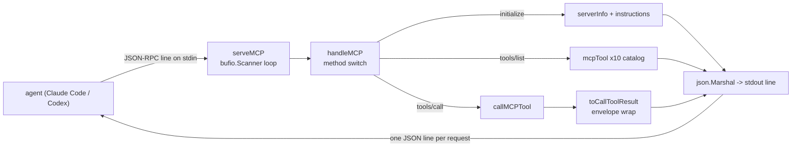
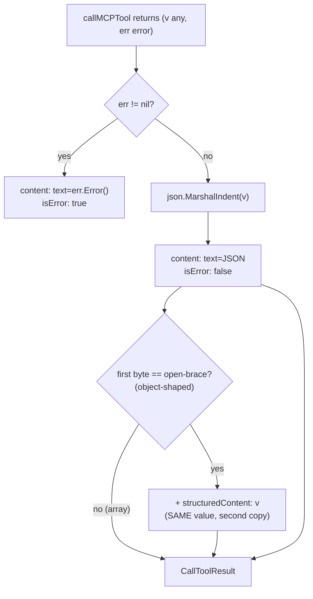
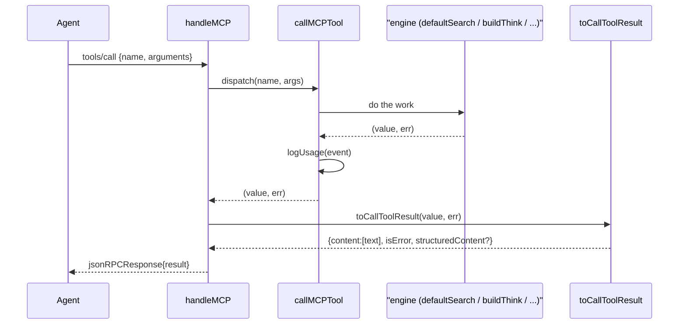

# MCP Server

The stdio JSON-RPC 2.0 server that exposes Mora's memory, retrieval, entity-graph, and synthesis surfaces to MCP-capable agents (Claude Code, Codex) as ten callable tools.

## Files

| File | Lines (approx) | Responsibility |
|---|---|---|
| `internal/mora/mora.go` | `serveMCP` 2820–2832, `handleMCP` 2867–2926, `toCallToolResult` 2935–2957, `callMCPTool` 2959–3053, `mcpTool`/`mcpParam` 3072–3101, `cmdMCP` 1862–1867, `snippetMemories` 2180–2197, `usageEvent`/`usageEnabled`/`logUsage` 3242–3271 | The whole MCP surface: stdio dispatch loop, JSON-RPC method routing, the CallToolResult envelope, every tool case, the tools/list schema builders, and local usage logging |
| `internal/mora/mora_mcp_result_test.go` | full file | Contract guard: every `tools/call` must return a CallToolResult, not a bare value (the Codex-rejection regression) |
| `internal/mora/mora_mcp_budget_test.go` | full file | The "T0" output-size regression gate: pins each tool's serialized envelope under a fixed token ceiling; quarantines the still-RED tools |

The server is the *boundary*; nearly all the work it dispatches lives in sibling subsystems — retrieval (`hybrid.go`, `defaultSearch`), the entity graph (`graph_read.go` via `entities.go`), synthesis (`think.go`, `digest.go`). This doc owns the protocol plumbing and the envelope; follow the links for the engines.

## How it runs

`mora mcp serve` is the only valid invocation — `cmdMCP` rejects anything else (`mora.go:1862`). It is a line-oriented stdio server: `serveMCP` (`mora.go:2820`) wraps `stdin` in a `bufio.Scanner` and processes one JSON-RPC request per line, writing exactly one JSON line to `stdout` per request via `fmt.Fprintln`.

### Transport invariants and footguns

- **One line in, one line out.** The scanner is the framing: requests must be newline-delimited single-line JSON. `serveMCP` writes a response line for *every* parsed request.
- **Malformed JSON is silently dropped, not errored.** `serveMCP:2824` does `continue` on an `Unmarshal` failure — no JSON-RPC parse-error reply is sent. A client that pipelines a bad line gets silence for that line, not `-32700`.
- **Notifications get a response anyway.** The loop has no notion of "no-ID notification". A `notifications/initialized` line (which carries no `id`) falls through to the `default` branch of `handleMCP` and is answered with a `-32601 method not found` error envelope (`handleMCP:2922`). The `id` is omitted (`omitempty`), so it is a result-less error line. In practice Claude Code/Codex tolerate this, but it is a spec deviation — a notification should produce no response at all. See Open questions.
- **Request lines are capped at 4MB (`mcpMaxRequestBytes`), not the 64KB scanner default.** `serveMCP` sets an explicit `scanner.Buffer`; without it a single oversized `write_memory`/`think` line killed the whole server mid-session. Beyond the cap the loop still ends, but with an actionable error naming the cap instead of a bare `ErrTooLong`. Pinned by `TestServeMCPHandlesOversizedRequestLine` / `TestServeMCPOverHardCapErrorsLoudly`.

### Lifecycle methods

`handleMCP` (`mora.go:2867`) is the method switch. Three methods are real; everything else is `-32601`:

- **`initialize`** (`2870`) returns `protocolVersion: "2024-11-05"`, `serverInfo {name: "mora", version: BuildVersion}`, `capabilities.tools: {}`, and the **`instructions`** string. The instructions (`mcpInstructions`, `mora.go:2839`) are load-bearing product surface, not boilerplate: clients inject them into the model's context, so this is how a cold agent learns Mora exists and that "I don't have that context" is usually a bug — it should `search_memory` first. Treat edits to that string as a behavior change.
- **`tools/list`** (`2872`) returns the ten-tool catalog built by `mcpTool`.
- **`tools/call`** (`2915`) decodes `{name, arguments}` and returns `toCallToolResult(callMCPTool(...))`.

## The tool catalog

`tools/list` publishes eleven tools. Schemas are built by `mcpTool(name, desc, params...)` (`mora.go:3083`), which emits a JSON Schema `inputSchema` with `additionalProperties: false` so strict clients (Codex) know the arg set is *closed*; tools with no params still publish an explicit empty-object schema rather than a permissive catch-all (the pilot reported "commands aren't useful directly" when schemas were vague). Each `mcpParam` (`mora.go:3072`) is `{name, type, desc, required}`; `type` is only ever `"string"` or `"integer"`.

| Tool | Purpose | Key args | Default limit / budget |
|---|---|---|---|
| `write_memory` | Persist a durable memory; reindexes | `title`*, `text`*, `scope`, `type`, `source` | scope `global`, type `insight`, source `mcp` |
| `read_memory` | Fetch one memory by id (full body) | `id`* | — |
| `search_memory` | Most-relevant memories; hybrid only when a semantic embedder is active, else FTS-only | `query`*, `scope`, `limit` | `limit` = `mcpSearchDefaultLimit` = **8**; bodies snippeted to 240 runes; payload is `{results, freshness}` (per-source `last_synced`) |
| `list_memory` | Recent memories, newest first | `scope`, `limit` | `limit` = **10** |
| `delete_memory` | Remove a memory by id; reindexes | `id`* | — |
| `context_memory` | One dense, budget-bounded context block (or session-start briefing when no query) | `query`, `scope`, `max_tokens` | `max_tokens` ≈ **6000** default, **20000** max; gathers 10 items |
| `think` | Synthesis envelope: cited evidence + deterministic gap analysis + a compose-prompt | `query`*, `scope`, `limit` | `limit` evidence = **8** |
| `list_entities` | Graph entities with counts, salience-ranked | `kind`, `limit` | `limit` = **200**; `memory_ids` dropped (compact) |
| `get_entity` | Memories + graph provenance for a named entity | `name`* | bodies snippeted; memories ≤ **20**, edges ≤ **25**, neighbors ≤ **15** (true totals in `count`/`degree`) |
| `digest` | Daily cross-source digest, grouped + cited + budget-bounded | `since_hours`, `source`, `max_tokens` | `since_hours` = **24**, `max_tokens` ≈ 6000/20000; `source` filters to one connector/family (preview-only — see [sync & freshness](./11-sync-and-freshness.md)) |
| `brief` | Session-start what-changed/what-matters briefing — same budgeted, cited, source-grouped engine as `digest`, resolved to the freshest available; opt into `envelope` for a synthesis_prompt | `max_tokens`, `envelope` | call FIRST at session start; local-only |

(`*` = required.) The catalog is defined inline in `handleMCP:2873–2914`; the dispatch handlers are the `switch` cases in `callMCPTool:2964–3052`.

### What each handler actually does (and where the work lives)

- **`write_memory`** (`2965`): builds a `Memory` with a fresh `newID()`, requires non-empty `title`+`text`, calls `writeMemory`, then `rebuildIndex` synchronously. Returns the written `Memory` (object → gets a `structuredContent` mirror).
- **`read_memory`** (`2975`): `findMemory(cfg, id)` — full body, no snippeting. This is how agents fetch full text after a snippeted `search_memory`.
- **`search_memory`** (`2977`): routes through **`defaultSearch`** (`hybrid.go:70`), the embedder-gated router — hybrid retrieval *only* when `chooseEmbedder()` is actually semantic (Ollama opted in *and* reachable), otherwise pure FTS. This gate exists because hybrid under the static-hash floor *regresses* recall (0.591→0.394 @5; see [retrieval](./02-retrieval-search.md) and the T2 eval). Results pass through **`snippetMemories`** (`mora.go:2180`): each body flattened to one line, clipped to a `searchSnippetLen` = **240**-rune window **centered on the earliest query-term match** (`matchSnippet`, `think.go` — word-boundary, case-insensitive, stopword-filtered; head-clip fallback), and `Meta` dropped — so 8 rows stay under the token ceiling. The payload is `{results, freshness}` — the same `sourceFreshness` per-source `last_synced` map `context_memory` ships — so every search answer carries its data age (the honest-snapshot contract on the primary query surface).
- **`list_memory`** (`2985`): `listMemories` — note these are NOT snippeted (full bodies, capped only by `limit`).
- **`context_memory`** (`2990`): `resolveContextBudget` converts `max_tokens` → a char budget (`× charsPerToken=4`); the default and ceiling are profile-aware (`mora config context`): default 3000/6000/12000 tokens for small/default/large, clamped to `contextMaxTokens()` — 20000, except the `large` profile which opts into 50000 (`largeContextMaxTokens`, an explicit window-headroom-for-density trade). With a query it calls **`hybridSearch` directly** (not `defaultSearch`) — the vector arm is empty/harmless under static-hash here, so the gate is unnecessary; without a query it lists recent. Output is one `buildContext` string plus `sourceFreshness`. See [synthesis](./07-synthesis-think-digest.md).
- **`think`** (`3007`): `buildThink` — cited evidence + gap analysis. Object return. See [synthesis](./07-synthesis-think-digest.md).
- **`list_entities`** (`3013`) / **`get_entity`** (`3018`): call `entitiesForMCP` (`entities.go:204`) / `entityMemoriesForMCP` (`entities.go:210`), thin wrappers over `graphListEntities` / `graphGetEntity`. See [entity-graph](./03-entity-graph.md).
- **`digest`** (`3023`): `buildDigest` + `renderDigest(budget)`, returns a map with the rendered string **and** the full structured `sections`/`stale_tasks` beside it (the source of a budget bug — below). See [synthesis](./07-synthesis-think-digest.md).
- **`delete_memory`** (`3039`): `findMemory` → `os.Remove` → `rebuildIndex`.

`callMCPTool` opens config once at the top (`2960`); every call re-derives state from disk. The two mutating tools reindex synchronously: `write_memory` (`2973`) and `delete_memory` (`3048`) both call `rebuildIndex` after the file op. The read-only tools `read_memory`/`list_memory`/`list_entities`/`get_entity` do **not** reindex, but the search/context paths self-heal a missing DB inside `searchMemories` (`mora.go:2200`) / `hybridSearchTrace` (`hybrid.go:90`).

## The CallToolResult envelope

Every `tools/call` return — value and error alike — is wrapped by `toCallToolResult` (`mora.go:2935`) into a spec-compliant MCP `CallToolResult`:

### The historical bare-result bug (WHY the envelope exists)

Before `toCallToolResult`, `tools/call` returned the tool's *native* value directly as the JSON-RPC `result` — a bare `[]Memory` or `map`. **Codex desktop rejected every such call** with "unexpected response type": the MCP spec requires `tools/call` results to be a `CallToolResult` (`{content: [...], isError, ...}`), and Codex is strict. Claude Code was lenient and accepted the bare shape, which masked the bug during early dev. The fix — wrap everything in a text content block — is locked by `TestMCPToolsCallReturnsCallToolResult` (`mora_mcp_result_test.go:58`), the regression guard. **Never return a bare value from `tools/call` again.**

### The structuredContent doubling (the token cost of the fix)

`toCallToolResult` serializes the value into the `text` content block **and**, when the value is object-shaped (`text[0] == '{'`, `mora.go:2953`), mirrors the *same value* into `structuredContent` (`:2954`). So an object-returning tool ships its payload **twice** on the wire. Arrays (e.g. `list_memory`, `list_entities`) start with `[` and are NOT mirrored — they pay once (`search_memory` became object-shaped when it gained `freshness`, so it now mirrors like the other object tools). This was deliberate (strict clients want the text block; machine-readable clients want `structuredContent`) but it doubles the token cost of `write_memory`, `context_memory`, `think`, `get_entity`, and `digest`. The T0 gate measures the *whole* envelope precisely because the doubling lives here.

## Token-budget posture

The redline is `maxContextTokens = 20000` (`mora.go:2849`) — Neil's pilot ceiling: *no single tool result may dominate the agent's window*. The budget unit is `bytes / charsPerToken` with `charsPerToken = 4` (`mora.go:2847`), a guardrail heuristic, not exact accounting (a pure-Go tokenizer was judged not worth the dep). `resolveContextBudget` (`mora.go:2857`) clamps `max_tokens` to `[default 6000, max 20000]` *before* the `× 4` conversion so a huge `max_tokens` cannot overflow.

`mora_mcp_budget_test.go` ("T0") pins each tool's serialized envelope under a fixed per-tool ceiling (tiered: mutation/point-read tiny, synthesis/briefing ≤ half-window, raw enumeration moderate). Ceilings are **policy lines, not derived constants** — the point is they are fixed so a regression has something to cross. As of **v0.5.1 every tool is GREEN** — the gate has no `wantRED`-quarantined rows, so any tool that crosses its ceiling fails CI outright.

The two long-standing RED rows were closed in v0.5.1 (`entities.go` `entitiesForMCP` / `entityMemoriesForMCP`):

| Was-RED tool | Ceiling | Before → after | Fix |
|---|---|---|---|
| `list_entities` | 8000 | ~112k → ~5.9k tok (real vault) | drop per-entity `memory_ids` arrays, salience-rank, cap at `limit` (default 200) + optional `kind` filter |
| `get_entity` (found) | 12000 | ~227k → ~12.4k tok (high-degree person) | snippet bodies, cap memories ≤ 20 / edges ≤ 25 / neighbors ≤ 15; true totals stay in `count` / `degree` |

(The earlier `digest` RED was already closed by the budgeted-sections work — `digest_max` now honors `max_tokens`.) Note `toCallToolResult` still mirrors object-shaped tools into `structuredContent`, doubling them on the wire (the T0 ceilings are measured on that doubled envelope, so the budgets above already account for it). See [eval-and-testing](./09-eval-and-testing.md) for the gate mechanics and [retrieval](./02-retrieval-search.md) / the T2 eval (2026-06-06) for the recall side.

## Usage logging

Every `callMCPTool` case calls `logUsage` (`mora.go:3261`) with a `usageEvent` (`mora.go:3242`: `ts, tool, query, scope, results, millis`). Logging is **local-only JSONL** appended to `<StateDir>/usage/events.jsonl` (`logUsage:3270`) — never the vault, never any network. It is gated by `usageEnabled` (`mora.go:3251`): disabled if `DO_NOT_TRACK=1` **or** an `OFF` sentinel file exists at `<StateDir>/usage/OFF` (written by `mora usage off`). The `query` field is the *raw tier* — it stays on local disk and is "never sent" (the struct comment makes this explicit). `logUsage` runs before the error check in the search path, so even failed/empty searches are logged with `results: 0`.

## Invariants & gotchas

- **`tools/call` MUST return a CallToolResult, never a bare value.** Codex rejects bare `[]Memory`/`map` with "unexpected response type"; Claude Code's leniency hid this in early dev. Guarded by `TestMCPToolsCallReturnsCallToolResult`. WHY: MCP spec conformance is the difference between "works in one client" and "works".
- **Object-shaped returns are doubled** (text block + `structuredContent` mirror, `toCallToolResult:2953`). Any token-budget analysis must count both copies. WHY: arrays escape the doubling (`[` ≠ `{`); object tools don't, which is exactly where the budget RED rows live.
- **The T0 RED rows are load-bearing, not bugs to ignore.** `list_entities`, `get_entity`, and `digest` exceed their ceilings; the gate fails if they *silently improve* (forcing `wantRED:false`) or *worsen >25%*. WHY: a quarantined-but-watched failure is honest; a `t.Skip` is invisible and would never notice a fix or a 408KB→4MB regression.
- **`search_memory` is embedder-gated (`defaultSearch`), `context_memory` is not.** `search_memory` only goes hybrid when the chosen embedder is genuinely semantic; `context_memory` always calls `hybridSearch` directly. WHY: hybrid under static-hash regresses search recall, but `context_memory`'s assembly is harmless under an empty vector arm. Do not "simplify" them to the same path.
- **`search_memory` results are snippeted (240 runes, no Meta); `read_memory`/`list_memory` are full bodies.** `snippetMemories` is the *only* thing keeping the bumped `limit=8` default under budget. WHY: 8 full bodies blow the ceiling; the design is "snippet to find, `read_memory` to fetch". Raising `limit` without snippeting re-breaks the budget.
- **Usage logging is local-only and opt-out-honoring.** Stays in `<StateDir>/usage/`, never the vault, never the network; `DO_NOT_TRACK=1` or the `OFF` sentinel disables it. WHY: zero-egress is an enforced invariant (see [distribution-and-ops](./10-distribution-and-ops.md)).
- **The `mcpInstructions` string is product, not prose.** It is injected into the model's context on `initialize` and is the only reason a cold agent reaches for Mora. Edits change behavior. WHY: without it the tools sit unused.
- **Malformed inbound lines are silently dropped, and notifications get an erroneous response.** Neither is spec-clean. WHY (to fix carefully): clients tolerate it today, but a stricter client could choke on a `-32601` reply to a `notifications/initialized` line.
- **A single tool result must not dominate the 20k-token window.** This is the governing design constraint behind every ceiling and clamp. WHY: it is Neil's explicit pilot requirement and the reason the budget unit exists at all.

## Related

- [data model & storage](./01-data-model-and-storage.md) — `Memory`, `findMemory`, `rebuildIndex`
- [retrieval & search](./02-retrieval-search.md) — `defaultSearch`, `hybridSearch`, the embedder gate
- [entity graph](./03-entity-graph.md) — `graphListEntities` / `graphGetEntity` behind `list_entities`/`get_entity`
- [synthesis: think & digest](./07-synthesis-think-digest.md) — `buildThink`, `buildContext`, `buildDigest`
- [CLI & UX](./08-cli-and-ux.md) — `mora mcp serve` wiring and the human-facing commands
- [eval & testing](./09-eval-and-testing.md) — the T0 budget gate and the CallToolResult contract test
- [distribution & ops](./10-distribution-and-ops.md) — zero-egress posture, `DO_NOT_TRACK`, state dirs
- [sync & freshness](./11-sync-and-freshness.md) — `sourceFreshness` surfaced by `context_memory`/`digest`

## Open questions / unverified

- **Notification handling is technically non-conformant** but I have not observed it breaking a real client. `serveMCP` writes a response line for every parsed request, so a `notifications/initialized` line yields a `-32601` error envelope rather than no response. Whether Claude Code/Codex ever send a notification to this server (and silently ignore the spurious reply) is not verified from the code in this repo.
- **Request-line cap.** Formerly a latent 64KB edge (default `bufio.Scanner`, no `Buffer` override — one big `write_memory` line terminated the read loop). Fixed: explicit 4MB `mcpMaxRequestBytes` buffer + a loud, actionable error past the cap; regression-tested.
