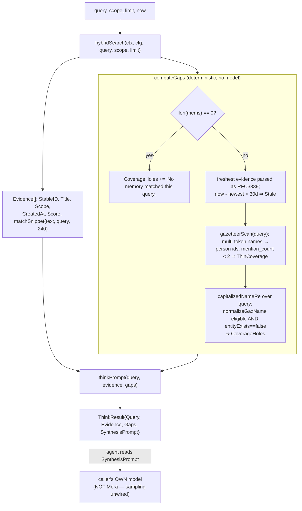
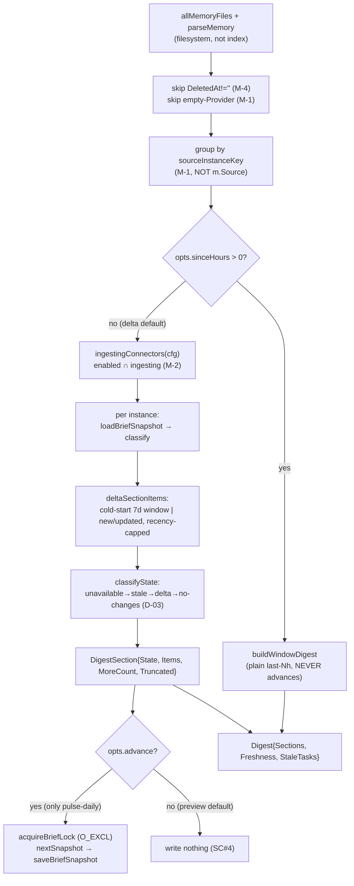
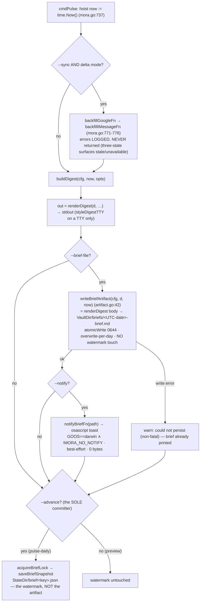
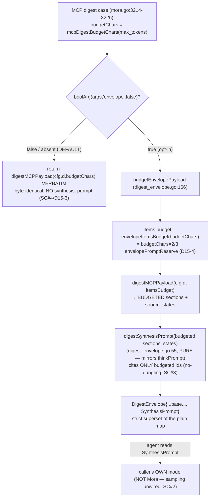
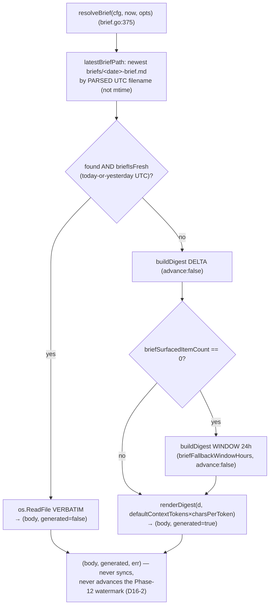
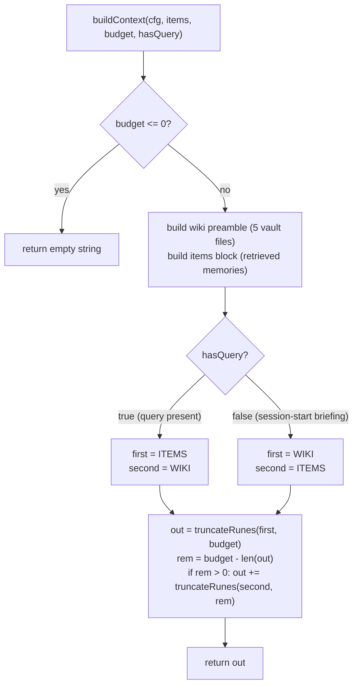

# Synthesis layer: `think`, `digest`, `context_memory`

The three "assembly" surfaces that turn raw retrieved memories into something an agent can act on — a cited synthesis envelope, a daily cross-source brief, and a budget-bounded context block — all of which are **deterministic, model-free, zero-egress floors** that an agent's own model can layer prose on top of.

## Files

| File | Lines | Responsibility |
|---|---|---|
| `internal/mora/think.go` | 218 | `buildThink` synthesis envelope: hybrid evidence + deterministic gap analysis (`computeGaps`) + a ready-to-run `thinkPrompt`. Owns `thinkSnippetLen`, the shared `snippet()` helper, `entityExists`. |
| `internal/mora/digest.go` | 816 | `buildDigest` daily cross-source brief — **delta-aware** as of Phase 12: `buildWindowDigest` (ad-hoc `--since-hours`) vs `buildDeltaDigest` (the scheduled default: per-instance content-hash delta + three-state + cold-start window + commit-time watermark advance). **Salience-ordered as of Phase 14**: `digestMemorySalience`/`flattenInstances` + the salience-primary `capRecency` comparator (`tsItem.sal`), reusing the `salience.go` kernel. Owns the typed Delta seam (`DigestItem.Change`, `DigestSection.State`/`MoreCount`/`Truncated`), `renderDigest`, the D-05 one-budgeted MCP projection (`digestMCPPayload`/`buildSourceStates`/`budgetSections`), and the `connectorDisplay`-backed `sourceDigestRank`/`digestSourceLabel` shims. |
| `internal/mora/brief.go` | 411 | **Two halves, deliberately split.** (1) The **isolated, unit-testable core of the delta** (Phase 12): the per-instance watermark store (`briefSnapshot`, `loadBriefSnapshot`/`saveBriefSnapshot` at `<StateDir>/brief/<key>.json`), the PURE content-hash `classify` (→ typed `briefDelta`), and the `O_EXCL` commit lock `acquireBriefLock` — the WRITE side `digest.go` consumes. (2) **Phase 16 — the session-start READ side** (`brief.go:264-411`): `resolveBrief` (read the freshest persisted brief VERBATIM if fresh, else GENERATE on demand), `latestBriefPath` (newest dated file by parsed UTC filename), `briefIsFresh` (today-or-yesterday UTC), `briefSurfacedItemCount`, and `briefFallbackWindowHours=24` — the read sibling of `artifact.go`'s write side, PURE/LOCAL-ONLY/watermark-safe (never calls `saveBriefSnapshot`/`acquireBriefLock`). See [sync-and-freshness](./11-sync-and-freshness.md) for why the watermark is decoupled from `SyncStatus`. |
| `internal/mora/digest_envelope.go` | 217 | **Phase 15 — the digest's `think`-style synthesis envelope (OPT-IN).** The PURE, model-free `digestSynthesisPrompt(sections, states)` (the digest analog of `thinkPrompt`) + the `budgetEnvelopePayload` assembler (prompt-reserved, no-dangling) + the `DigestEnvelope` projection. Mora emits a `synthesis_prompt` STRING the agent runs with its OWN model — no MCP sampling, no `net/*` (imports only `fmt`/`sort`/`strings`). Wired (default OFF, byte-identical when off) into the MCP `digest` tool's `envelope` arg + `pulse --digest --envelope` (both in `mora.go`). |
| `internal/mora/artifact.go` | 49 | **Phase 13 — the dated VAULT artifact writer.** `briefArtifactPath(cfg, now)` (`<VaultDir>/briefs/<UTC-date>-brief.md`) + `writeBriefArtifact(cfg, d, now)`, which renders the SAME `renderDigest` body the human/MCP brief emits to a per-day file via `atomicWrite` (temp+rename, 0644) — idempotent (overwrite), local-only, and **decoupled from the watermark** (never calls `saveBriefSnapshot`/`acquireBriefLock`). Leaf: no render/wiring, no `net/*`. |
| `internal/mora/notify.go` | 110 | **Phase 13 — the best-effort macOS notification.** `notifyBrief`/`notifyBriefDefault` post an `osascript` toast naming the persisted brief, gated by `shouldNotify(goos)` (`GOOS=="darwin"` ∧ `MORA_NO_NOTIFY` unset — **NOT a TTY check**). osascript is a SYSTEM binary via `os/exec` (no new Go dep — the `openBrowser` precedent); a failing/absent osascript is swallowed (never fails the brief); writes zero bytes (byte-clean). The injectable `goos`/`notifyRunner` seams make it unit-testable off-darwin. |
| `internal/mora/connectors.go` | 132 | The Phase-12 connector seams the delta consumes: `sourceInstanceKey` (M-1 keying), `ingestingConnectors` (M-2 enabled∩ingesting enumeration), `connectorDisplay` (M-6 rank/label owner). The catalog descriptor (`connectorInfo.Ingesting/Rank/Label`) lives in `mora.go:117-142`. |
| `internal/mora/mora.go` | (selected) | `context_memory` MCP case + `cmdContext` CLI, `buildContext` (budget split + wiki-preamble starvation guard), `resolveContextBudget`, `truncateRunes`. Also the MCP `think`/`digest` cases and tool schemas, the digest budget constants (`mcpDigestMaxItems`/`mcpDigestEnvelopeDivisor`/`mcpDigestBudgetChars`), `cmdPulse`'s flags (`--since-hours`/`--advance` from Phase 12; `--sync`/`--brief-file`/`--notify` from Phase 13), the `backfillGoogleFn`/`backfillIMessageFn`/`notifyBriefFn` test seams (`mora.go:1329-1339`), and the `scheduleCommands["pulse-daily"]` job string (`mora.go:3441-3442`). **Phase 16 — the session-start `brief` surface:** `cmdBrief` (the `mora brief` CLI, `mora.go:682`) + its `case "brief"` in `Run` (`mora.go:250`), the shared generate helper `briefDigest` (`mora.go:655`), and the MCP `brief` tool (`tools/list` entry `mora.go:3174`, `callMCPTool` case `mora.go:3323`, `mcpInstructions` nudge `mora.go:3069`). |

The unifying design stance, stated verbatim in `think.go:13-19`: Mora **holds no API key and pays no synthesis bill**. Every surface here is a *floor* — useful headless with no model — and the agent that called it reads the evidence and writes the prose.

---

## `think` — the cited-synthesis envelope

`buildThink` (`think.go:60`) assembles a `ThinkResult` (`think.go:49-54`) with four parts: the echoed `Query`, a list of `Evidence`, a `Gaps` analysis, and a `SynthesisPrompt`.

### IMPORTANT: MCP sampling is UNWIRED — `think` emits a prompt, it does not run a model

This is the single most load-bearing fact about `think`. Despite the name, **`buildThink` never calls a model.** It calls `hybridSearch`, computes deterministic gaps, and then builds an instruction *string* (`SynthesisPrompt`, via `thinkPrompt` at `think.go:184`). The calling agent (Claude Code / Codex) is expected to *read that prompt and run it through its own model*. Mora is the retrieval + gap-analysis stage; the LLM stage lives entirely in the caller. There is no MCP sampling call, no HTTP client, no API key anywhere in this path. The doc comment at `think.go:13-19` and the CLI hint at `mora.go:634` ("Pass this evidence + gaps to your agent…") both say so explicitly.

So `think`'s real product is the **deterministic floor**: cited evidence plus an honest "what the vault does NOT know." That gap analysis is described in the code as *"the trust feature… the antidote to confidently-wrong RAG"* (`think.go:16-19`).



### Evidence

For each `Memory` returned by `hybridSearch`, `buildThink` appends a `ThinkEvidence` carrying provenance for citation: `StableID` (the `[stable_id]` the prompt tells the model to cite), `Title`, `Scope`, `CreatedAt`, `Score`, and `Snippet` = `matchSnippet(m.Text, query, thinkSnippetLen)` where `thinkSnippetLen = 240` — the window centers on the earliest query-term match so the cited line shows *why* the evidence matched (head-clip fallback when the hit is in the title/tags).

`think` calls `hybridSearch` **directly** (`think.go:62`), not the gated `defaultSearch`. This is deliberate and consistent with the project rule that `context_memory`/`think` always run hybrid: under the static-hash embedder the vector arm is empty and harmless, while `mora search`/`search_memory` route through `defaultSearch` which gates hybrid on a genuinely semantic embedder (see [retrieval](./02-retrieval-search.md) and `hybrid.go:59-75`). The CLI default `--limit` is 8 (`mora.go:573`); the MCP default is also 8 (`mora.go:3010`).

### The three deterministic gap signals (`computeGaps`, `think.go:87`)

`ThinkGaps` (`think.go:38-42`) has three slices, each populated by a distinct, precision-tuned rule:

1. **`Stale`** — if there are matches, pick the freshest by **parsed instant** (not string compare — mixed RFC3339 offsets like local `-07:00` vs UTC `Z` misorder lexically; `think.go:94-100`). If `now.Sub(newest) > thinkStaleDays*24h` (`thinkStaleDays = 30`, `think.go:22`), emit a dated "freshest matching memory is from … — older than 30 days" warning (`think.go:101-103`). If there are **no** matches at all, instead emit a single `CoverageHoles` entry "No memory matched this query." (`think.go:90-91`).

2. **`ThinCoverage`** — named people the query mentions who have little evidence. Matching is done **only** through the multi-token gazetteer via `gazetteerScan(gaz, query)` (`think.go:121`), never against loose single tokens. The reason is in the comment at `think.go:112-115`: matching single first names or common words against aliases would fire thin-coverage noise on any query that happens to share a person's first name. For each matched canonical person id (collected, **sorted** for determinism — `think.go:124-128`), it looks up `display_name, mention_count` from the `entities` table; if `mention_count < thinkThinK` (`thinkThinK = 2`, `think.go:23`) it emits "Only N memory about <name> — coverage is thin." (`think.go:129-138`).

3. **`CoverageHoles`** — capitalized multi-word phrases in the query that resolve to **no** entity of any kind. It scans the query with `capitalizedNameRe` (`\b[A-Z][a-z]+(?:\s+[A-Z][a-z]+)+\b`, `think.go:56`), then reuses the gazetteer's name-eligibility guard `normalizeGazName` so a title-cased *question* phrase ("What Did", "How Should We") is **not** mistaken for a name (`think.go:145-148`). Only phrases that pass eligibility and fail `entityExists` (`think.go:159`) become holes: "The vault has no entity for <name>." (`think.go:144-154`). `entityExists` checks `entities.display_name` case-insensitively, then scans all `person:%` aliases via `aliasMatches` (`think.go:159-180`).

All three rules sort their inputs before iterating, so `buildThink` output is **byte-stable across rebuilds** — the same determinism invariant the entity graph holds (see [entity-graph](./03-entity-graph.md)).

### The synthesis prompt (`thinkPrompt`, `think.go:184`)

`thinkPrompt` builds the instruction the caller's model runs. It is a fixed template: "Answer the question using ONLY the evidence below. Cite every claim with its [stable_id]. If the evidence is insufficient, say so plainly rather than guessing." followed by the `QUESTION`, the `EVIDENCE` list (`- [stable_id] (scope, created_at) title — snippet`, or `(none found)`), and — only when gaps are non-empty — a `KNOWN GAPS` block instructing the model to surface them in a "What the vault does not know" section (`think.go:184-207`). The CLI's `printThink` (`mora.go:615`) shows evidence and gaps for human reading but **omits** the prompt; you only get the runnable prompt via `--json` or the MCP `think` tool, which return the full `ThinkResult`.

---

## `digest` — the daily cross-source brief (delta-aware as of Phase 12)

`buildDigest` (`digest.go:116`) is "Neil's #1 use case" (`digest.go:14`). **As of Phase 12 it is a delta/watermark brief, not a fixed-window re-dump.** Each run records a per-instance content-hash watermark, and the next run surfaces only what is *new-or-changed since you last looked*, plus a three-state per-source label so a source with nothing new, a stale sync, or a sync error is honestly distinguished from one with fresh deltas. Like `think`, it is a **deterministic, model-free floor — no LLM call** — so it is cheap, reproducible, and safe to run on a schedule (`digest.go:14-21`).

### THE LOAD-BEARING FINDING: the delta is the CONTENT-HASH set, never timestamps

This is the single fact that reframes the whole subsystem (stated verbatim in `brief.go:18-24`). A timestamp-based "what's new since `now-24h`" delta provably misses the exact case the phase exists to catch:

- `writeMappedMemory` **preserves the existing `created_at` on a content change** (`mora.go:2564-2569`) — a grown iMessage conversation or an edited Gmail thread keeps its ORIGINAL `created_at` and only its `content_hash` moves.
- Calendar items are **future-dated** with no upper bound (`windowForSource` sets `Until = now+3mo`, `mora.go:2648-2651`).
- `m.Source` is the per-item ProviderID, not a stable instance handle.

So `classify` diffs `content_hash` against the stored watermark exclusively; `created_at` is used only to *order* and *window-display* items, never to compute the delta (`brief.go:154-173`). `TestClassifyTimestampIndependentUpdated` pins this (same old `created_at`, new hash → "updated").

### Two modes: plain window vs delta

`buildDigest(cfg, now, briefOpts)` (`digest.go:116`) branches on `opts.sinceHours` (`digest.go:147-151`):

- **Plain-window mode** (`opts.sinceHours > 0`, SC#2): `buildWindowDigest` (`digest.go:156`) renders every non-deleted memory created within the last `sinceHours`, grouped by instance, recency-ordered, capped. It is the legacy ad-hoc behavior and **never advances the watermark** — `cmdPulse` forces `advance=false` whenever `--since-hours>0`, even if `--advance` is also passed (`mora.go:740-743`).
- **Delta mode** (`opts.sinceHours == 0`, the scheduled default, SC#1): `buildDeltaDigest` (`digest.go:187`) is the behavioral heart. Per instance it surfaces only the content-hash delta against the watermark, classifies a three-state label, applies the cold-start window on a first run, and — only when `opts.advance` is set — commits the advanced watermark under a lock.

Both walk the **filesystem**, not the SQLite index: `allMemoryFiles(cfg)` + `parseMemory` (`digest.go:122-145`), so the brief reflects on-disk memories even if `index rebuild` hasn't run. Two filters apply up front: a tombstone (`m.DeletedAt != ""`) is skipped (M-4, `digest.go:137-139`) so a cancelled calendar event — which gets a NEW content_hash — never renders as a live `[updated]`; and an empty-Provider (filesystem) memory is skipped via `sourceInstanceKey`'s `ok=false` (M-1, `digest.go:140-143`) rather than collapsing distinct sources into one shared empty-key bucket. `now` is injected for deterministic windowing.

### The watermark store (`brief.go`)

The watermark is a per-instance record persisted at `<StateDir>/brief/<sourceInstanceKey>.json` (`briefPath`, `brief.go:80-82`):

```go
type briefSnapshot struct {
    Key               string            `json:"key"`
    LastBriefAt       string            `json:"last_brief_at"`        // UTC RFC3339
    HashSchemaVersion int               `json:"hash_schema_version"`
    Items             map[string]string `json:"items"`                // stableID -> contentHash
}
```

It is **NEW state, deliberately NOT a `memory.SyncStatus` extension** and kept OUT of `sync/` (`brief.go:32-48`, `brief.go:78-79`) — because `SyncStatus.LastSynced` advances on *every* sync regardless of whether content changed, so reusing it would make every re-pull look like a delta. `sourceFreshness` scans only `sync/` and never reads the watermark. (Full rationale: [sync-and-freshness](./11-sync-and-freshness.md).)

- `saveBriefSnapshot` (`brief.go:132`) stamps `last_brief_at = now.UTC()` + the current `hash_schema_version`, marshals with `json.MarshalIndent` (which sorts `map[string]string` keys lexically → byte-stable, no map-iteration dependence — T-12-08), and writes **0600** via `atomicWrite` (MkdirAll 0700 + tmp + rename) because the file stores sensitive stableIDs (`gmail_thread/<id>`, `imessage_chat/<guid>`) at rest (T-12-06).
- `loadBriefSnapshot` (`brief.go:91`) mirrors `LoadStatus`'s zero-value-on-`ErrNotExist` convention and EXTENDS it: any read error, corruption/unmarshal error, OR a `hash_schema_version` mismatch returns a cold-start-equivalent snapshot for THAT instance — a per-instance recover that never propagates a fatal error blanking the whole brief (T-12-05, `brief.go:91-116`). On a schema bump it preserves `Key` + the on-disk (mismatched) version, dropping only the un-diffable old-scheme items, so `classify` can flag a post-upgrade reset vs a fresh install (`brief.go:103-111`).

### The pure classifier + the typed Delta seam

`classify(snap, mems, now) briefDelta` (`brief.go:174`) is the PURE delta engine — it touches **no files** (the store is the only I/O boundary), so idempotence, determinism, and cold-start are unit-provable before any wiring. Its rules (`brief.go:154-173`, `brief.go:195-226`):

- `sourceInstanceKey(m) ok=false` (empty Provider) → memory skipped entirely (never bucketed, never in Baseline — M-1).
- `id ∉ snapshot.Items` → `Change="new"`.
- `hash ≠ snapshot.Items[id]` → `Change="updated"` (D-01).
- `hash == snapshot.Items[id]` → skipped (unchanged, never surfaced).
- **Cold start** (no prior commit OR schema bump): `ColdStart=true`, surfaces nothing (suppress the backfill flood), but `Baseline = ALL` current hashes so the commit records them — archived backfill becomes the *starting line*, not a delta (D-04). `SchemaReset=true` iff the cold start was a `hash_schema_version` bump.

Cold start is detected as `(len(Items)==0 && LastBriefAt=="") || schemaMismatch` (`brief.go:193`) — note it is *never-committed*, not zero-items: a committed-but-empty instance (first commit over an empty vault, or one whose every memory was later deleted) is **steady state**, not a perpetual 7-day window. `Baseline` always carries every kept memory's current hash (`brief.go:200`) so the caller persists it on commit.

The result is the typed Delta seam Phases 13–16 consume **without re-entering `buildDigest`**:

```go
type briefDelta struct {                 // brief.go:71-76
    Items       []briefDeltaItem        // {ID, Change: "new"|"updated"} — unchanged omitted
    ColdStart   bool
    SchemaReset bool
    Baseline    map[string]string       // ALL present hashes — persisted on commit
}
```

At the render level the same seam is exposed structurally on `DigestItem.Change` and `DigestSection.State`/`MoreCount`/`Truncated` (`digest.go:51-71`) — **one typed struct** that both `renderDigest` and the MCP projection read, not a render string plus a hand-built map. This is what lets Phase 14 sort by salience BEFORE the cap.

### Salience-ordered sections (Phase 14): the SAME kernel as `mora graph`, at the `capRecency` seam

As of Phase 14 the digest **orders and cap-selects WITHIN each section by salience first**, not recency alone — so the brief leads with the most-salient real thread/person and a high-salience item **survives the budget cut** instead of being truncated in favor of a noisier recent one (SC#3). The ranking reuses the **same `aggregatePersonSalience` kernel** the entity graph freezes (`internal/mora/salience.go`, model `S = HumanGate × Recency × Core`; see [entity-graph](./03-entity-graph.md)) — one source of truth, so the digest and `mora graph` rank on identical math and can never disagree.

**The per-item salience** is `digestMemorySalience` (`digest.go:179-196`): it calls `aggregatePersonSalience(mems)` ONCE (no re-implemented math) and maps each non-tombstoned memory to the **MAX salience of its participant people** (`digest.go:186-193`). Max-fold (not sum) mirrors the graph's canon remap — a thread's salience is its most-salient human, never a sum that would reward many low-value participants. A memory with no participants, or only service participants (which score 0), maps to 0.

**It is computed ONCE over the full vault, then threaded down.** `buildDigest` builds `memSal := digestMemorySalience(flattenInstances(byInstance))` over the **entire flattened parsed set** (`digest.go:151`, `flattenInstances` at `digest.go:163-169`, sorted-key order) — because a person's volume signal must span the whole vault, exactly matching `buildGraph`'s whole-vault scoring. Per-section recomputation would under-count a person who appears across sections. The map is then passed into both `buildWindowDigest` (`digest.go:201`) and `buildDeltaDigest` (`digest.go:232`) and down to `deltaSectionItems` (`digest.go:312`), never recomputed.

**`buildDigest` stays FILE-BASED — no DB handle.** Salience is derived from the already-parsed `[]Memory` (`allMemoryFiles` + `parseMemory`, `digest.go:122-145`), NOT read from the `entities` table, so the brief stays decoupled from `index rebuild` timing and the kernel's vault-relative recency keeps it deterministic (no `time.Now` in any expectation; grep confirms no `database/sql` import added to this path).

**The ordering plugs into the EXISTING `capRecency` seam** (`digest.go:451-470`, the Phase-12 order-BEFORE-truncate split explicitly designed for this re-sort). The internal `tsItem` gained a `sal int64` field (`digest.go:435-439`), populated at all three construction sites from `memSal[m.ID]` — window (`digest.go:211`), cold-start (`digest.go:326`), steady-state (`digest.go:352`). `capRecency`'s comparator is now **salience DESC → recency DESC → id** (`digest.go:452-460`) and, crucially, runs BEFORE the `len(tis) > cap` truncation (`digest.go:461-464`), so the most-salient item both LEADS its section and SURVIVES the cap. A 0-salience item (service / no-participant notification) sinks below the salient ones while the existing recency-then-id order is preserved among equals — humans lead, services sink. The comparator is total and deterministic, so two passes over the same input are byte-identical.

**Salience never leaks into the JSON/MCP contract.** `sal` lives on the internal `tsItem` only; `DigestItem` and the MCP projection are byte-for-byte unchanged — the `--json`/MCP digest payload contract is untouched (the salience only re-orders which items appear).



### Three-state per source (D-03 / SC#3)

The enumeration set for the labels is the **enabled∩ingesting connectors** — `ingestingConnectors(cfg)` (`digest.go:194`, `connectors.go:57`) — explicitly NOT providers-found-in-memories (which would hide a broken/all-deleted source) and NOT the `sync/` dir. A connector enumerated here but absent from `byInstance` still emits a section with its State (`digest.go:218-220`), so a zero-memory / all-deleted source surfaces "unavailable" rather than vanishing (the SC#3 gap). `classifyState` (`digest.go:325`) derives the label first-match-wins:

1. **`unavailable`** — `LastError != ""` OR `ErrorCount > 0` OR never synced (`LastSuccessAt == ""`) (`digest.go:326-329`). Because Plan-01's M-3 reset clears `ErrorCount`/`LastError` on a clean recovery, a source that errored once then recovered correctly reads healthy, not unavailable forever.
2. **`stale`** — last clean sync older than `digestStaleHours = 48` (`digest.go:333-337`). Measured against the **injected `now`** (`now.Sub(t)`), never `time.Since` — deterministic under an injected clock.
3. **`baseline`** (cold start) — a healthy first run reports a baseline, never "no changes" (`digest.go:338-342`).
4. **`delta`** — surfaced new/updated items (`digest.go:343-345`).
5. **`no changes since last brief`** — synced recently, no error, nothing new (`digest.go:346`).

The status is loaded per instance via `loadConnectorSyncStatus` (`digest.go:447`), which resolves the connector's enabled source(s) → `syncStatusPathFor` (`digest.go:478`) → `memory.LoadStatus`.

### Cold-start courtesy window (D-04)

On an instance's first run `classify` baselines ALL hashes but surfaces nothing; `deltaSectionItems` (`digest.go:267`) then chooses what to **display**: the last 7 days for gmail/imessage by `created_at`, or the UPCOMING 7 days for calendar (its natural framing, since events are future-dated) — `inColdStartWindow` (`digest.go:432`), `digestColdStartDays = 7` (`digest.go:31`). Window math stays `now.Add(±N*time.Hour)` + parsed-instant compare (DST-safe, not calendar arithmetic). Run 2 onward is a true delta.

### Preview vs commit (`--advance` is the sole committer, SC#4 / D-02)

The watermark advances **only** when `opts.advance` is set, under the brief lock (`digest.go:202-208`, `digest.go:237-242`):

- `acquireBriefLock` (`brief.go:241`) takes an exclusive `O_EXCL` lockfile at `<StateDir>/brief/.lock` so a hand-run `--advance` racing the cron no-ops/blocks rather than interleaving the read-modify-write (T-12-07). Default is FAIL-FAST; stale-lock-after-SIGKILL is a documented, accepted failure mode.
- `nextSnapshot` (`digest.go:360`) is the **silent-data-loss guard**: it keeps the PREVIOUS hash EXACTLY for every unshown-still-present id (so an unshown `updated` item keeps its OLD hash and re-surfaces next run — never silently marked-read), UNIONs the current hashes of items actually SHOWN, and DROPS ids no longer present (M-4 — a later same-id recreation re-surfaces as `new`). When the per-instance delta exceeds the cap, `capRecency` (`digest.go:451`, salience-primary as of Phase 14) returns the truncated `more` count and the section carries `MoreCount`/`Truncated` (the `+N more since last brief` line) — the dropped items are now the LEAST-salient (then least-recent).

**Every production surface is preview by default.** The MCP `digest` tool has no `advance` arg at all (`mora.go:3287-3322`); `pulse --digest` and `pulse --write --digest` are both preview; the *only* committer is the scheduled `pulse --write --digest --advance --sync --brief-file --notify` (`scheduleCommands["pulse-daily"]`, `mora.go:3441-3442`). See [sync-and-freshness](./11-sync-and-freshness.md) for the launchd `RunAtLoad` drop that stops a reboot from consuming the morning delta.

---

## The VISIBLE-BRIEF layer (Phase 13): a dated vault artifact + a macOS toast

Phase 12 left the brief stuck on stdout — useful to an MCP agent, invisible to the human running it on a schedule (the `pulse-daily` LaunchAgent's stdout goes to a log file nobody reads). Phase 13 adds three **additive, default-OFF** `cmdPulse` flags that turn that same render into something the human can SEE: `--sync` (refresh before building — covered in [sync-and-freshness](./11-sync-and-freshness.md)), `--brief-file` (persist a dated vault artifact), and `--notify` (post a macOS toast). All three are off for ad-hoc `pulse` and are appended only to the installed `pulse-daily` job — so `mora pulse --digest` is byte-for-byte unchanged.

### The dated vault artifact (`writeBriefArtifact`, `artifact.go:42`)

`--brief-file` persists the rendered digest to a dated file in the VAULT: `briefArtifactPath(cfg, now)` = `<VaultDir>/briefs/<YYYY-MM-DD>-brief.md` (`artifact.go:21-23`). Key properties, all verifiable in the 49-line leaf:

- **One source of truth.** The body is **EXACTLY** `renderDigest(d, defaultContextTokens*charsPerToken)` (`artifact.go:44`) — byte-identical to what the human brief printed to stdout and what the MCP `digest` tool's render path would emit. The artifact is a *copy of the brief you just saw*, never a separately-computed second render.
- **Atomic + idempotent-per-day.** The write goes through the existing `atomicWrite` (temp + `os.Rename`, `MkdirAll(briefs, 0700)`) at mode **0644** (human-readable vault content, NOT the 0600 secret watermark) — `artifact.go:45`. A crash mid-write leaves the old file or the full new one, never a torn brief (T-13-01). A second run **the same day OVERWRITES** that day's file (one file per day, no proliferation, SC#4); a different day yields a different dated file.
- **Date from the injected `now`, UTC-canonicalized.** `now.UTC().Format("2006-01-02")` (`artifact.go:22`) — never a fresh `time.Now()` inside the writer. `cmdPulse` hoists a single `now := time.Now()` (`mora.go:737`) and threads the SAME value into `buildDigest` AND `writeBriefArtifact` (`mora.go:779`, `mora.go:796`), so the digest header, the artifact date, and any watermark all agree on one logical day (D13-3). A late-local-evening run (`23:30 -04:00`) lands deterministically on the next UTC day.

### THE LOAD-BEARING DECOUPLING: persisting the artifact does NOT advance the watermark

This is the single fact that keeps the visible-brief layer honest. `writeBriefArtifact` **never calls `saveBriefSnapshot` / `acquireBriefLock`** (`artifact.go:38-41`) — it is pure render + `atomicWrite`, local-only (no `net/*` import). So persisting a brief is *not* "I read it": the Phase-12 delta watermark stays gated **solely on `--advance`** (D-02/SC#4). Two distinct stores, two distinct directories, deliberately not conflated:

| Concern | Store | Advances when | Mode |
|---|---|---|---|
| "what have I already shown you" (the delta) | `<StateDir>/brief/<key>.json` | **only** `--advance` (under the `O_EXCL` brief lock) | 0600 (secret stableIDs) |
| "the brief I rendered today" (the artifact) | `<VaultDir>/briefs/<date>-brief.md` | every `--brief-file` run (overwrite) | 0644 (vault content) |

Even though `pulse-daily` happens to pass both `--advance` and `--brief-file`, they are independent: a `pulse --digest --brief-file` (no `--advance`) writes the artifact while leaving the watermark untouched. `TestWriteBriefArtifactDoesNotAdvanceWatermark` asserts `<StateDir>/brief` stays absent/empty after a write (T-13-03). Do NOT "optimize" by advancing the watermark inside the writer — that would silently mark deltas read merely because a file was saved.

### The best-effort macOS notification (`notify.go`)

`--notify` posts a native toast naming the freshly persisted brief, through the `notifyBriefFn` seam (`mora.go:1339`, default `notifyBriefDefault`). It fires **only when a brief was actually persisted** — `cmdPulse` calls `notifyBriefFn(path)` inside the `--brief-file` success branch (`mora.go:799-804`), so a persist failure (or `--notify` without `--brief-file`) sends no toast (T-13-12). The toast itself (`notifyBrief`, `notify.go:88`) is built on four deliberate constraints:

- **`osascript`, a SYSTEM binary — no new Go dep.** It shells out via `exec.Command("osascript", "-e", script).Start()` (`osascriptRunner`, `notify.go:45-47`) — the exact fire-and-forget shell-out precedent in `internal/google/oauth.go openBrowser`. `go.mod`/`go.sum` are byte-identical; there is no Go notification library.
- **Gated on `GOOS==darwin` ∧ `MORA_NO_NOTIFY` unset — NOT a TTY check (load-bearing).** `shouldNotify(goos)` (`notify.go:33-35`). A TTY gate would be WRONG here: the `pulse-daily` LaunchAgent redirects stdout to a log file (`schedulePlistFor` sets `StandardOutPath`, `mora.go:3317`), so `isTTY` is false in exactly the scheduled run we WANT to notify from — yet that run executes in the user's GUI session where osascript works. `MORA_NO_NOTIFY` is the user opt-out (mirroring `MORA_NO_BANNER`/`MORA_NO_COLOR`).
- **Best-effort: a failing osascript NEVER fails the brief.** Off-darwin or opted-out it is a silent no-op returning nil (`notify.go:89-91`); on darwin a runner error is swallowed (`_ = run(...)`, `notify.go:96-97`). A missing/failing toast must not abort a brief that already printed and persisted (D13-1).
- **Byte-clean: writes zero bytes.** `notifyBrief` takes no `io.Writer` — its only effect is the runner call — so the toast can never contaminate `--json`/MCP/non-TTY output (T-13-07). The single interpolated value (the brief path) is `escapeAppleScriptString`-escaped (control-char strip + `\`→`\\` then `"`→`\"`) against AppleScript injection (T-13-05, `notify.go:55-69`).

### The pulse flags at a glance

| Flag | Ad-hoc `pulse` default | `pulse-daily` | Effect |
|---|---|---|---|
| `--sync` | OFF | ON | sync-first refresh before building (delta mode only); errors surfaced via the three-state, never aborting ([sync-and-freshness](./11-sync-and-freshness.md)) |
| `--brief-file` | OFF | ON | persist `<VaultDir>/briefs/<date>-brief.md` (non-fatal on error) |
| `--notify` | OFF | ON | macOS toast naming the persisted brief (only if persisted; best-effort) |
| `--advance` | OFF | ON | the SOLE watermark-commit surface (Phase 12, D-02) |

So the brief no longer ends at stdout — on the scheduled job it ends at a **persisted, greppable, re-openable daily file plus a desktop toast**, while the watermark advance stays the independent concern it was.



### Freshness and stale tasks (side panels)

`buildDigest` attaches two side panels (`digest.go:248-255`, mirrored in `buildWindowDigest` `digest.go:175-182`):
- `Freshness` = `sourceFreshness(cfg)` (`digest.go:253`), keyed off `SyncStatus.Source` (the Phase-12 fix). See [sync-and-freshness](./11-sync-and-freshness.md).
- `StaleTasks` = `staleTasks(cfg, 3)`, parsing `live-tasks.md` for table rows whose last-touched date (column 7) is older than 3 days (`mora.go:2444-2465`). Best-effort: a missing `live-tasks.md` simply means no tasks (`digest.go:248`); the error is discarded. **NOT gated by the watermark** — tasks come from the vault, sync-independent (`digest.go:246-247`).

### Rendering: CLI Markdown vs the D-05 budgeted MCP payload

The CLI and MCP paths diverge as of Phase 12 (the D-05 fix), each reading the same typed seam:

**CLI — `renderDigest` (`digest.go:519`)** emits Markdown: a `# Mora digest — <generated> (since last brief)` (or `(last Nh)` in window mode) header, a sorted `Fresh as of:` line, one `## <heading>` section per instance, and `## Open tasks (N stale)`. `sectionHeading` (`digest.go:562`) renders the three-state sentinel — `— no changes since last brief` / `— stale (no recent sync)` / `— unavailable (sync error)` / `— baseline (N)` / `(N)` for a live delta. `changePrefix` (`digest.go:580`) prepends `[new]`/`[updated]` and the `+N more since last brief` line surfaces the guard. The string is clipped with `truncateRunes(budgetChars)` (`digest.go:556`) — time-sensitive sections lead, so truncation drops the least-important tail (default `defaultContextTokens * charsPerToken` = 6000×4 = 24000 chars). `mora pulse --digest` layers `styleDigestTTY` *only on a TTY* (`mora.go:751-752`); pipes/redirects get the raw Markdown — the byte-clean invariant (`styleDigestTTY` has a styling case for every new sentinel — M-6; see [cli-and-ux](./08-cli-and-ux.md)).

**MCP — `digestMCPPayload` (`digest.go:656`)** ships **ONE budgeted structured representation** and NO `digest` render string. This is the D-05 fix: previously the MCP payload carried a *clipped render string PLUS the full unclipped `sections`* (a doubling), and `max_tokens` was a dead knob. Now:

- The payload is `{generated, since_hours, source_states, freshness, stale_tasks, sections}` — no `digest` key (`digest.go:665-677`).
- **`source_states`** (`buildSourceStates`, `digest.go:625`) is `[{instance, state: new|no_change|stale|unavailable, count, last_synced, errored}]` — the three-state surfaced **structurally** so an agent never parses Markdown. It is derived from the SAME typed `Digest` and is **never budgeted away** (it is the SC#3 signal — `digest.go:660-671`).
- **`budgetSections`** (`digest.go:693`) greedily fills a byte budget highest-rank-first, item by item; a section that only partially fits keeps its fitting items and bumps `MoreCount`/`Truncated`, and once the budget is spent every remaining section is kept as a **truncated shell** (`truncatedShell`, `digest.go:741` — State + a `MoreCount` of all its items, empty `Items`) so the agent distinguishes "suppressed for budget" from "no data".
- The byte budget comes from `mcpDigestBudgetChars(max_tokens)` = `resolveContextBudget(maxTokens) / mcpDigestEnvelopeDivisor` (`mora.go:2932`), divisor `3` because the generic `CallToolResult` envelope mirrors the payload as an indented text block AND `structuredContent` (~2.76× measured — `mora.go:2907-2916`). The MCP digest case requests `perSourceCap = mcpDigestMaxItems = 500` (`mora.go:3105`, `mora.go:2918-2924`) so the **byte budget — not the human cap of 8 — governs item count**, which is the only way `max_tokens` visibly scales the payload (safe because the MCP path is always preview, no watermark side effect). Measured on the T0 fixture: `digest_default ≈ 5.3k` tok, `digest_max ≈ 15.8k` tok — both under the 20k redline, with `default < max` proving the knob is alive (D-05).

### The digest synthesis envelope (Phase 15): a `think`-style cited prompt, OPT-IN

As of Phase 15 the digest has a **parallel construct to the `think` envelope above** — an OPT-IN variant that returns the budgeted cited items PLUS a `synthesis_prompt`: a grounded instruction the calling agent runs with its OWN model to compose a cited brief. It is the exact same stance as `think` — **Mora emits a prompt string and runs no model** — applied to the daily digest. The whole thing lives in the leaf `digest_envelope.go` (imports only `fmt`/`sort`/`strings`; no `net/*`, no model client, no MCP sampling — grep-verified).

#### Model-free / zero-egress — `digestSynthesisPrompt` MIRRORS `thinkPrompt`

`digestSynthesisPrompt(sections, states)` (`digest_envelope.go:55`) is the digest analog of `thinkPrompt` (`think.go:184`): a **PURE** function of its inputs — no `time.Now`, no map iteration, no DB, no network — so identical inputs yield a byte-identical string. It builds, with a `strings.Builder`:

1. A fixed grounding header (the same trust posture as `thinkPrompt`'s "say so plainly rather than guessing"): *"Write a brief grounded ONLY in the cited items below. Cite each claim by its [id]. You may `read_memory <id>` to verify any claim. Do not invent facts not present in a cited item; if something is missing, say so plainly rather than guessing."* (`digest_envelope.go:60-63`).
2. A `CITED ITEMS:` block — one bounded line per item across all passed sections, in caller-given order: `- [id] (Source) Title — Snippet` (`digest_envelope.go:68-78`). The citation is the **existing `DigestItem.ID`** (no new scheme — D15-2), and the body reuses the **already-budgeted `Snippet`** (NOT re-snippeted). `(no items)` when zero items total.
3. A bounded **"WHAT THIS BRIEF DOES NOT COVER"** line (D15-5) — the cheap gap note, NOT deep per-item analysis: it collects the `stale`/`unavailable` `sourceState.Instance` values, `sort.Strings`-sorts them (determinism), and emits only when any exist (`digest_envelope.go:85-94`). This is the digest's lightweight echo of `think`'s `computeGaps` "what the vault does NOT know."

Just like `think`, the *caller's* model turns the prompt into prose; Mora attaches a STRING, not a model call. The `mora.go` digest case returns a struct carrying that string — `if boolArg(args, "envelope", false) { return budgetEnvelopePayload(...) }` (`mora.go:3223-3224`) — with an explicit comment that there is no sampling/model call (`mora.go:3216-3222`).

#### OPT-IN + backward-compatible (SC#4 / D15-3) — off is byte-for-byte unchanged

The envelope is reachable from BOTH digest surfaces, each default-OFF:

- **MCP `digest` tool** — an `envelope` boolean param (`mcpParam{"envelope", "boolean", …, false}`, `mora.go:3080`), read via the lenient `boolArg` helper (`mora.go:3815` — a native JSON bool or a `"true"/"false"` string, defaulting OFF; an untrusted arg can never flip the safe default). When `false`/absent the case returns the **UNCHANGED `digestMCPPayload` map verbatim** (`mora.go:3226`) — the envelope is never even allocated — so the payload is byte-identical to the pre-phase-15 D-05 payload, with no `synthesis_prompt` key.
- **`pulse --digest --envelope`** — a `--envelope` flag (`mora.go:733`, default OFF) that, AFTER the existing rendered brief prints, appends `digestSynthesisPrompt(d.Sections, buildSourceStates(cfg, d))` (`mora.go:802-803`). It only `Fprintln`s an extra block — the brief, the `--advance`/watermark path, and the brief-file/notify artifact are all untouched (the envelope is interactive/preview-only; `pulse-daily` does NOT pass it). Plain `pulse --digest` stdout is byte-for-byte unchanged.

Both byte-identical guarantees are PINNED in the T0 gate file (`mora_mcp_budget_test.go`): `TestMCPGateDigestEnvelopeOffByteIdentical` marshals `digest {}` vs `{"envelope":false}`, asserts `bytes.Equal` with no `synthesis_prompt` key, and adds an envelope-ON positive control so the off/on distinction can never silently collapse.

#### Grounded + budget-reserving (SC#3 / D15-4) — `budgetEnvelopePayload`

`budgetEnvelopePayload(cfg, d, budgetChars)` (`digest_envelope.go:166`) is the ONE assembly point shared by the MCP tool. It enforces two invariants:

- **No dangling citation (SC#3).** It budgets the items via `digestMCPPayload`, then reads the **ALREADY-BUDGETED** `sections`/`source_states` back out of the payload and builds the prompt from THOSE (`digest_envelope.go:167-172`). So the prompt cites EXACTLY the ids the agent receives — it can never cite an id that was budget-dropped from the emitted items (which would force the agent to hallucinate or fail). The returned `DigestEnvelope` base fields equal the plain payload exactly + `SynthesisPrompt` (the strict-superset JSON contract — `DigestEnvelope`, `digest_envelope.go:26`).
- **The instructions are never truncated away, and the envelope respects the SAME 20000-token ceiling (D15-4).** The synthesis_prompt is NOT a fixed-size addition — it re-emits one plain-text line PER budgeted item, so it grows ~proportionally to the items. A flat byte reserve could not hold the ceiling: at `max_tokens=20000` the additive prompt pushed the full `CallToolResult` to ~22.6k tokens, OVER the redline — **caught by the `digest_envelope` T0 row**. The fix is `envelopeItemsBudget` (`digest_envelope.go:132`): budget the items against `budgetChars × 2/3` minus the fixed-template floor `envelopePromptReserve` (`digest_envelope.go:105`), i.e. an effective envelope-inflation divisor of ~4.5 (the base path's `mcpDigestEnvelopeDivisor=3` × 3/2), reserving the remaining ~1/3 of the compact budget for the additive per-item prompt + the fixed instructions. The envelope-ON `CallToolResult` now measures ~16.2k tokens on the T0 fixture (~19% headroom under 20000), while envelope-OFF is untouched. The `digest_envelope` row is the standing forcing function that this stays true.



The relationship to the `think` envelope is direct: both emit a cited `SynthesisPrompt` the agent's model runs; both are deterministic, model-free, zero-egress floors; both ground on stable ids and surface a "what is NOT covered" honesty signal. `think` answers an ad-hoc question over hybrid evidence; the digest envelope frames the daily cross-source delta. Neither calls a model — that is the load-bearing, repeated stance of this whole subsystem (`think.go:13-19`).

---

## Session-start `brief` — the read-or-generate front door (Phase 16)

Phase 16 puts a **session-start front door** on the digest: `mora brief` and the MCP `brief` tool resolve the FRESHEST brief — read today's-or-yesterday's persisted `briefs/<date>-brief.md` VERBATIM if it exists (the READ side of `artifact.go`'s WRITE side), else GENERATE one on demand. It is the surface that makes the brief the *default* a fresh install gets at the start of every agent session (the [guide's session-start section](../guide.md#make-the-brief-your-session-start-default) wires it into the Claude Code hook / Codex / MCP). Like everything in this subsystem it is **LOCAL-ONLY, model-free, and watermark-safe**: it never syncs, never advances the Phase-12 delta, and makes no network or model call — it closes the digest-habit loop without weakening any of its invariants.

### The read-or-generate kernel (`resolveBrief`, `brief.go:375`)

`resolveBrief(cfg, now, opts) (string, bool, error)` is the pure kernel both surfaces wrap. It returns `(body, generated, err)` where `generated` reports whether the body was freshly built (`true`) or read from disk (`false`):

- **Read path.** If `latestBriefPath(cfg, now)` (`brief.go:304`) finds a persisted brief AND `briefIsFresh(dated, now)` (`brief.go:349`) holds, `os.ReadFile` it and return its bytes VERBATIM (`brief.go:376-382`) — no re-render that could drift from what the scheduled job persisted. `latestBriefPath` selects the newest `<VaultDir>/briefs/<YYYY-MM-DD>-brief.md` by PARSING the filename date in UTC (never os mtime, which is non-deterministic and timezone-fragile — `brief.go:292-296`); `briefIsFresh` treats today's OR yesterday's UTC day as fresh (the UTC-boundary fallback so a local-morning session reuses the brief the cron just wrote rather than needlessly regenerating — `brief.go:339-345`).
- **Generate path.** With no fresh persisted file, build the DELTA digest first via `buildDigest(cfg, now, briefOpts{advance:false, …})` — the canonical "what changed since the last brief" (`brief.go:386`). If that surfaces ZERO items across all sections (`briefSurfacedItemCount(d) == 0` — the scheduled `--advance` job already consumed today's delta), RE-build in WINDOW mode over a fixed `briefFallbackWindowHours = 24` look-back (watermark-INDEPENDENT, `brief.go:283-290`, `brief.go:390-397`) so a session-start brief is **never useless** yet stays honest (T-16-04). The body is `renderDigest(d, defaultContextTokens*charsPerToken)` at the SAME budget the WRITE side persists (`brief.go:398`), so a generated brief is byte-shaped like a read one.

**Both builds force `advance:false`** (`brief.go:386`, `brief.go:393`) and the kernel never calls `saveBriefSnapshot`/`acquireBriefLock`, so it can never mutate the Phase-12 watermark or sync (D16-1/D16-2). `brief.go` imports only stdlib (`encoding/json`/`errors`/`os`/`path/filepath`/`strings`/`time`) — no `net/*`, no `internal/google`/`internal/imessage` — so zero egress is structural; `TestBriefGoZeroEgress` pins it with a `go/ast` import+identifier walk and `TestResolveBriefDoesNotAdvanceWatermark` proves the snapshot is byte-identical across a call (16-01).



### The MCP `brief` tool — the single session-start tool call (D16-3)

The MCP `brief` tool (`tools/list` entry `mora.go:3174`, `callMCPTool` case `mora.go:3323`) is the ONE tool call an agent makes at session start — `mcpInstructions` (`mora.go:3069`) tells it to *"Call `brief` at the START of a session … before doing anything else."* It does **not** return the verbatim persisted file (that is the human CLI's path); it ships the SAME budgeted structured payload as `digest`: it calls the shared `briefDigest(cfg, time.Now(), mcpDigestMaxItems)` (`mora.go:3334`) and reuses the Phase-15 budget machinery **verbatim** — `budgetEnvelopePayload(cfg, d, budgetChars)` when `envelope:true`, else `digestMCPPayload(cfg, d, budgetChars)` (`mora.go:3344-3347`), budgeted via `mcpDigestBudgetChars(max_tokens)`. Because it reuses the digest reservation, it is **T0-safe by construction**: the `brief` + `brief_envelope` rows in `mora_mcp_budget_test.go` measure identically to `digest_max` (15759 tok) / `digest_envelope` (16158 tok), both under the 20000-token redline (D16-3). It is **model-free** — the optional `synthesis_prompt` is a STRING the agent runs with its own model, mirroring `think`/`digest` (no sampling, no model call), and **preview by construction** (no `advance` arg; `briefDigest` forces `advance:false` everywhere).

### The CLI `mora brief` command

`cmdBrief` (`mora.go:682`, dispatched via `case "brief"` in `Run` at `mora.go:250`) prints the LOCAL latest-or-generated brief from `resolveBrief`. `--json` emits the byte-clean typed `briefResult{generated, body}` (`mora.go:640-645`); `--envelope` appends `digestSynthesisPrompt(d.Sections, buildSourceStates(cfg, d))` after the body (model-free, read-only). The styling rule is load-bearing: `styleDigestTTY` is applied **ONLY when `generated == true`** (`mora.go:709-712`) — a verbatim persisted file is printed raw (no double-skinning), and off-TTY `styleDigestTTY` is byte-identical, so piped/redirected/test output is raw Markdown either way (the byte-clean invariant; see [cli-and-ux](./08-cli-and-ux.md)). The shared generate helper `briefDigest` (`mora.go:655`) factors the DELTA-then-24h-window semantics (`advance:false` on both builds) used by BOTH the CLI `--envelope` path and the MCP tool, so the two surfaces cite the SAME items.

### It closes the Tier-1 digest-habit loop

The brief surface is the last piece of a five-phase habit (see the [guide's session-start section](../guide.md#make-the-brief-your-session-start-default) for the end-to-end onboarding):

| Phase | Piece | Contribution |
|---|---|---|
| 12 | delta watermark | *what changed since last time* (content-hash, not timestamps) |
| 13 | dated artifact + `pulse-daily` | the scheduled job writes `briefs/<date>-brief.md` each day (`artifact.go:42`, `scheduleCommands["pulse-daily"]` `mora.go:3441-3442`) |
| 14 | salience ordering | *what matters most, first* (`capRecency`, same kernel as `mora graph`) |
| 15 | synthesis envelope (opt-in) | a cited, model-free `synthesis_prompt` (`digest_envelope.go`) |
| 16 | `mora brief` / MCP `brief` / SessionStart | reads today's brief (or generates on demand) at session start — the default |

The WRITE side (`pulse-daily`, the only `--advance` committer) persists today's brief; the READ side (`resolveBrief`) reads it at session start, generating on demand when none exists yet. The two halves never cross: persisting a brief does not advance the watermark (Phase 13 decoupling), and reading one never advances it either (Phase 16, `advance:false` everywhere).

---

## `context_memory` — the budget-bounded context block

`context_memory` (MCP case `mora.go:2990-3006`; CLI `cmdContext` `mora.go:535`) assembles one dense context block — either *for a query* or, when no query is given, a session-start recency briefing.

### It always calls `hybridSearch`

When a query is present, `context_memory` calls `hybridSearch` directly (`mora.go:2997`, `cmdContext` at `mora.go:551`) with a fixed pool of `limit=10`; with no query it falls back to `listMemories(cfg, scope, 10)` (`mora.go:2998-3000`). Like `think`, it bypasses the `defaultSearch` gate: the vector arm is empty and harmless under static-hash, so hybrid is always safe here (see [retrieval](./02-retrieval-search.md)).

### Budget resolution (`resolveContextBudget`, `mora.go:2857`)

The public knob over MCP is `max_tokens` (agents speak tokens; the pilot asked for a ~20k-token ceiling, `mora.go:2841-2845`). The engine stays char-based, approximating `charsPerToken = 4` (`mora.go:2847`). `resolveContextBudget`:
- non-positive request → `defaultContextTokens = 6000` (`mora.go:2858-2860`),
- request over `maxContextTokens = 20000` → clamped to 20000 (`mora.go:2861-2863`),
- then `× charsPerToken` → character budget.

The clamp happens **before** the multiply (`mora.go:2855-2864`) so an arbitrarily large `max_tokens` cannot overflow the int. The CLI `mora context` uses a separate `--budget` flag that is a **raw character** budget defaulting to 2000 (`mora.go:540`), *not* tokens — it does not go through `resolveContextBudget`.

### The starvation guard (`buildContext`, `mora.go:2304`)

`buildContext` concatenates two blocks: a **wiki preamble** (the vault's standing files `index.md`, `priority-map.md`, `live-tasks.md`, `heartbeat.md`, `auto-resolver.md`, each read from `cfg.VaultDir` and skipped if absent — `mora.go:2308-2313`) and the **query items** (`# Title\n<text>` per memory, `mora.go:2314-2317`). The ordering flips on intent:



The invariant (comment `mora.go:2318-2321`): **when there IS a query, the items lead** so the static wiki preamble can never starve the most relevant memories out of the budget. The caller already filtered items to the most relevant; surfacing them first guarantees they get budget before the boilerplate wiki files. With **no** query (briefing mode), the wiki preamble leads and items fill whatever remains. `truncateRunes` (`mora.go:2290`) clips to a byte budget without splitting a multi-byte UTF-8 rune (it walks back to a `utf8.RuneStart`), so the budget is a byte ceiling honored rune-safely. The second block only gets the *remaining* bytes after the first is written (`mora.go:2328-2329`).

Both the MCP and CLI paths return the assembled `context` string plus `freshness` (MCP: `mora.go:3006`; CLI `--json` also returns the raw `items`, `mora.go:560`).

---

## Invariants & gotchas

- **`think` does NOT call a model — it emits a prompt.** MCP sampling is unwired everywhere. `buildThink` returns a `SynthesisPrompt` string; the *caller's* model turns it into prose. Do not "fix" `think` by adding an API client — that breaks the zero-egress, $0, no-API-key contract (`think.go:13-19`). The deterministic floor (evidence + gaps) is the product when no model is attached.
- **Gap analysis must stay deterministic and byte-stable.** Every gap rule sorts its inputs before emitting (person ids `think.go:128`, coverage-hole dedup via `seenHole` `think.go:144`), and staleness uses **parsed instants**, never string compare, because mixed RFC3339 offsets misorder lexically (`think.go:94-100`, mirrored in digest's `tsItem`/`capRecency` at `digest.go:435-470` — total comparator `salience int64 → instant → id`). Reordering or skipping the sort reintroduces map-iteration nondeterminism (the digest also sorts instance keys and sections — `sortedInstanceKeys` `digest.go:550`, `sortSections` `digest.go:563`).
- **Thin-coverage matches only the multi-token gazetteer, never loose tokens.** Single first names / common words against aliases would fire false thin-coverage on any shared-first-name query (`think.go:112-115`). Coverage-holes reuse `normalizeGazName` so title-cased question phrases aren't misread as missing names (`think.go:143-148`). Precision-first: a false gap is a false alarm that erodes the trust feature.
- **`think`/`context_memory` call `hybridSearch` directly; `search`/`search_memory` call `defaultSearch`.** This asymmetry is intentional: hybrid's vector arm is harmless under static-hash here, but the gated `defaultSearch` exists because hybrid *regresses* FTS-only recall under static-hash (`hybrid.go:54-75`). Don't unify them without re-reading [retrieval](./02-retrieval-search.md).
- **`context_memory` starvation guard: items lead when `hasQuery`.** Flipping the order (wiki first under a query) lets the static preamble eat the budget and starve the relevant memories — the exact failure the guard at `mora.go:2318-2325` prevents.
- **Token budget is clamped before the `×4` multiply.** `resolveContextBudget` clamps to `maxContextTokens` *then* multiplies (`mora.go:2855-2864`); reordering risks int overflow on a hostile `max_tokens`. Also: `mora context --budget` is **chars**, `context_memory max_tokens` is **tokens** — different units, different paths.
- **Digest sections order salience-FIRST via `capRecency`, on the SAME kernel as `mora graph`.** Per-item salience is `digestMemorySalience` = max participant salience from the shared `aggregatePersonSalience` kernel (`digest.go:179-196`; see [entity-graph](./03-entity-graph.md)), computed ONCE over the full flattened vault (`digest.go:151`) and threaded down — never per-section (which would under-count a cross-section person). `capRecency`'s comparator is `salience DESC → recency DESC → id` and runs BEFORE truncation (`digest.go:451-470`), so the most-salient item LEADS and SURVIVES the cap. `buildDigest` stays file-based (salience from the already-parsed `[]Memory`, no DB handle) and `sal` lives on the internal `tsItem` only — the `--json`/MCP contract is byte-unchanged. Don't recompute salience per-section, don't read it from the `entities` table, and don't let it onto `DigestItem`.
- **The digest delta is the CONTENT-HASH set, never timestamps.** `classify` diffs `content_hash` against the watermark exclusively (`brief.go:154-173`). `writeMappedMemory` preserves `created_at` on a content change (`mora.go:2564-2569`) and calendar is future-dated (`mora.go:2648-2651`), so a `created_at` delta would miss the grown/edited case the phase exists to catch. `created_at` orders and windows items; it never computes the delta. Don't "optimize" the delta back to a time window.
- **The watermark is NOT a `SyncStatus` extension and lives OUTSIDE `sync/`.** It is `<StateDir>/brief/<key>.json` (`brief.go:78-82`), 0600, byte-stable (sorted-key JSON + UTC RFC3339). Reusing `SyncStatus.LastSynced` (which advances on every sync regardless of change) would make every re-pull look like a delta; `sourceFreshness` scans only `sync/` and must never read the watermark. See [sync-and-freshness](./11-sync-and-freshness.md).
- **`classify` is pure (no I/O) and `loadBriefSnapshot` recovers per-instance.** The store is the only I/O boundary, so the delta is unit-provable. Corruption / read error / schema-version mismatch returns a cold-start-equivalent snapshot for THAT instance only (`brief.go:91-116`) — never a fatal error blanking the whole brief (T-12-05).
- **Cold start = never-committed, NOT zero-items.** `coldStart = (len(Items)==0 && LastBriefAt=="") || schemaMismatch` (`brief.go:193`). A committed-but-empty instance is steady state; the original `len(Items)==0`-only predicate would re-enter the 7-day courtesy window every run and never become a true delta.
- **`--advance` is the ONLY committer; everything else is preview (SC#4/D-02).** The MCP `digest` tool has no `advance` arg (`mora.go:3287-3322`); the MCP `brief` tool has none either (`mora.go:3323-3347`, preview by construction); only the scheduled `pulse --write --digest --advance --sync --brief-file --notify` advances (`scheduleCommands["pulse-daily"]`, `mora.go:3441-3442`). `nextSnapshot` is the silent-data-loss guard — it keeps the OLD hash for unshown ids (so an unshown `updated` re-surfaces), advances only over shown ids, and drops deleted ids (`digest.go:360-383`). Commit holds the `O_EXCL` brief lock (`brief.go:241`, T-12-07).
- **Persisting the dated artifact is DECOUPLED from advancing the watermark (Phase 13).** `writeBriefArtifact` (`artifact.go:42`) writes `<VaultDir>/briefs/<date>-brief.md` and never calls `saveBriefSnapshot`/`acquireBriefLock` (`artifact.go:38-41`); the watermark still advances ONLY under `--advance`. Two stores, two dirs, two questions: `<StateDir>/brief/` (0600, "what have I shown you") vs `<VaultDir>/briefs/` (0644, "the brief I rendered today"). A `pulse --digest --brief-file` (no `--advance`) persists the file but leaves the watermark untouched — `TestWriteBriefArtifactDoesNotAdvanceWatermark` (T-13-03). Do NOT advance inside the writer.
- **The artifact body is EXACTLY `renderDigest`, idempotent-per-day, from the hoisted `now`.** Body == `renderDigest(d, defaultContextTokens*charsPerToken)` (`artifact.go:44`) — one source of truth with the stdout brief and MCP digest, NOT a second render. `atomicWrite` 0644 (vault content, not the 0600 watermark) means a same-day re-run overwrites (one file/day). The date is `now.UTC()` from the single `now` hoisted in `cmdPulse` (`mora.go:737`) and threaded into both `buildDigest` and `writeBriefArtifact` — never a fresh `time.Now()` inside the writer (D13-3).
- **The macOS toast is GOOS/env-gated, NOT TTY-gated, and best-effort (Phase 13).** `shouldNotify(goos)` = `GOOS=="darwin"` ∧ `MORA_NO_NOTIFY` unset (`notify.go:33-35`). A TTY check would be WRONG: the `pulse-daily` LaunchAgent redirects stdout to a log file (`StandardOutPath`, `mora.go:3317`), so `isTTY` is false in the exact run we want to notify from — yet osascript works in the user's GUI session. osascript is a SYSTEM binary via `os/exec` (no new Go dep — the `openBrowser` precedent); a failing/absent osascript is swallowed (never fails the brief, D13-1); it writes zero bytes (byte-clean, T-13-07) and `--notify` only fires when `--brief-file` actually persisted (T-13-12). Don't "fix" it by adding a notification library or a TTY gate.
- **Three-state enumerates enabled∩ingesting connectors, not memory-derived providers.** `ingestingConnectors(cfg)` (`connectors.go:57`) so a zero-memory / all-deleted source still surfaces "unavailable" (`digest.go:194`, `digest.go:218-220`) instead of vanishing (the SC#3 gap). `classifyState` depends on M-3: a recovered source reads healthy, not unavailable forever (`digest.go:326-329`). Staleness uses the injected `now`, never `time.Since` (`digest.go:333-337`).
- **The MCP digest payload is ONE budgeted representation — no doubling, and `max_tokens` is live (D-05).** `digestMCPPayload` (`digest.go:656`) ships structured `sections` + `source_states` and NO render string. `source_states` is never budgeted away (SC#3 signal); only section item bodies are trimmed, highest-rank-first, with truncated shells for suppressed sections (`digest.go:693-748`). The byte budget = `resolveContextBudget(max_tokens)/3` (`mora.go:2932`) and the MCP cap is `mcpDigestMaxItems=500` (`mora.go:3105`) so the budget — not the human cap of 8 — scales item count. Default ≈5.3k / max ≈15.8k tok, both under the 20k redline, `default < max`.
- **The digest synthesis envelope is OPT-IN, model-free, and byte-identical when off (Phase 15).** `digestSynthesisPrompt` (`digest_envelope.go:55`) mirrors `thinkPrompt` — a PURE string builder that EMITS a grounded, cited `synthesis_prompt` the agent runs with its OWN model; Mora makes NO model/sampling/network call (the leaf imports only `fmt`/`sort`/`strings`). It is reachable only via the MCP `digest` tool's `envelope` arg (`mora.go:3080`, `mora.go:3223`) or `pulse --digest --envelope` (`mora.go:733`, `mora.go:802`), BOTH default OFF — the off path returns the UNCHANGED `digestMCPPayload` map / unchanged stdout (SC#4/D15-3), pinned by `TestMCPGateDigestEnvelopeOffByteIdentical` in the T0 gate. Do NOT "fix" the envelope by adding an API client (it breaks the zero-egress, no-API-key contract this whole subsystem holds) and do NOT leak it into the default path.
- **The envelope is grounded (no dangling) and budget-reserving (D15-4).** `budgetEnvelopePayload` (`digest_envelope.go:166`) builds the prompt from the ALREADY-BUDGETED sections read back out of the payload, so it cites EXACTLY the ids the agent receives — never a budget-dropped id (SC#3). Because the prompt re-emits one line per item (growing with item count), a flat reserve cannot hold the ceiling: the items are budgeted against `envelopeItemsBudget` = `budgetChars×2/3 − envelopePromptReserve` (`digest_envelope.go:132`), an effective ~4.5 envelope divisor, so the envelope-ON `CallToolResult` lands ~16.2k tok (~19% under the 20000 redline) while the FIXED instructions are never truncated away. The `digest_envelope` T0 row (`mora_mcp_budget_test.go`) is the standing forcing function — if envelope-on ever crosses 20000, fix the reservation, do NOT loosen the ceiling.
- **The session-start `brief` is read-or-generate, LOCAL-ONLY, and watermark-safe (Phase 16).** `resolveBrief` (`brief.go:375`) reads the freshest persisted `briefs/<date>-brief.md` VERBATIM when fresh (`latestBriefPath` by parsed UTC filename, `briefIsFresh` today-or-yesterday — `brief.go:304`/`brief.go:349`), else GENERATES via `buildDigest` DELTA (`advance:false`) with a fixed `briefFallbackWindowHours=24` WINDOW fallback when the delta is empty (`brief.go:386-397`). BOTH builds force `advance:false` and the kernel never calls `saveBriefSnapshot`/`acquireBriefLock` — it can never sync or advance the Phase-12 watermark (D16-1/D16-2, `TestResolveBriefDoesNotAdvanceWatermark`). The MCP `brief` tool (`mora.go:3323`) ships the SAME budgeted `digestMCPPayload`/`budgetEnvelopePayload` as `digest` (NOT the verbatim file — that's the CLI's `cmdBrief` path, `mora.go:682`), reusing the proven reservation so it is T0-safe (`brief`/`brief_envelope` rows ≈ `digest_max`/`digest_envelope`, under 20000 — D16-3). Don't add a sync/fetch to the brief path, don't return the verbatim file over MCP, and don't advance the watermark from a read.
- **Digest section order = truncation safety, now data-driven (M-6).** `sourceDigestRank`/`digestSourceLabel` are thin shims over `connectorDisplay` (`digest.go:98-99`, `connectors.go:106`); the catalog descriptor (`mora.go:136-142`) owns the data: calendar(0) → imessage(1) → gmail(2) → filesystem(3), unknown=`connectorUnknownRank=100`. An Nth connector gets a real rank, not the old default-rank-3 that was first-to-truncate (`connectors.go:82-89`). Both `renderDigest` truncation and `budgetSections` honor this order.
- **`renderDigest` is the CLI data path; the MCP path is `digestMCPPayload`.** `styleDigestTTY` is a TTY-only skin applied *after* (`mora.go:751-752`) and has a case for every new sentinel (M-6); never let ANSI styling leak into the rendered Markdown or the structured MCP payload (byte-clean invariant — see [cli-and-ux](./08-cli-and-ux.md)).
- **`snippet` is rune-safe and single-line.** It collapses whitespace via `strings.Fields` and clips on runes with a trailing `…` (`think.go:211-218`); shared by both `think` (240) and `digest` (200). Don't reintroduce byte-slicing.

## Related

- [retrieval & search](./02-retrieval-search.md) — `hybridSearch`, `defaultSearch`, the static-hash vs Ollama gate
- [entity graph](./03-entity-graph.md) — the gazetteer, `entities` table, `mention_count`, alias trust that `computeGaps` reads
- [MCP server](./06-mcp-server.md) — how the `think`/`digest`/`context_memory` tools are exposed, `toCallToolResult`, schemas
- [CLI & UX](./08-cli-and-ux.md) — `mora think` / `mora context` / `mora pulse --digest` / `mora brief`, `styleDigestTTY`, byte-clean invariant
- [the guide — session-start brief](../guide.md#make-the-brief-your-session-start-default) — wiring `mora brief` / the MCP `brief` tool into the session-start hook (Claude Code / Codex / MCP)
- [sync & freshness](./11-sync-and-freshness.md) — the `brief/` watermark store (why it's decoupled from `SyncStatus`), the M-3 last-attempt health model `classifyState` reads, `sourceFreshness`, the `<StateDir>/sync/*.json` files surfaced in digest/context
- [connectors-google](./04-connectors-google.md) / [connectors-imessage](./05-connectors-imessage.md) — the `Provider` field that `sourceInstanceKey` keys off, the tombstones (`DeletedAt`) the digest filters (M-4)
- [overview](./00-overview.md)

## Open questions / unverified

- The doc comment in `defaultSearch` (`hybrid.go:67-69`) notes the Ollama-up path probes the embedder twice; for `think`/`context_memory` which call `hybridSearch` directly, the embedder is chosen inside `hybridSearchTrace`. I did not trace whether that interacts with the per-call budget in any way — it should not, since budget is applied post-retrieval, but I did not exhaustively read `hybridSearchTrace`'s embedder selection.
- **`mcpDigestEnvelopeDivisor = 3` is a guardrail, not exact accounting.** The summary measures the envelope at ~2.76× the compact payload (`mora.go:2907-2916`); the `/3` divisor leaves headroom but is an approximation, consistent with the codebase's approximate `charsPerToken` budget unit. The exact envelope size depends on snippet content (ASCII vs multi-byte) and was validated against the T0 budget gate's fixture, not every real payload.
- **`loadConnectorSyncStatus` returns the FIRST enabled source's status of a connector type** (`digest.go:447-474`). Today `Source.Name == connector type` for the single-account ingesting connectors, so this resolves uniquely; a future multi-account phase (multiple gmail sources) would need to reconcile the per-account `sourceInstanceKey` to the per-account status file — the comment flags this but it is not exercised in v1.
