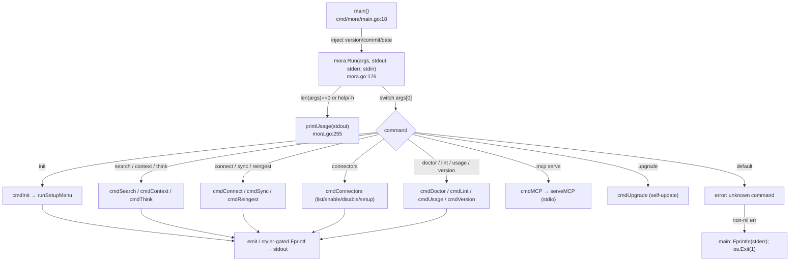
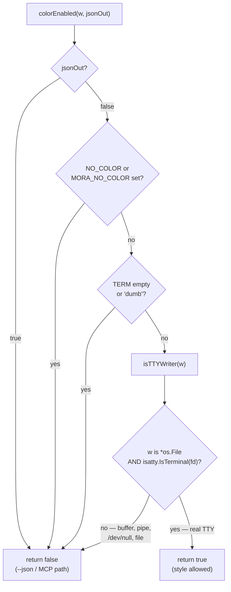
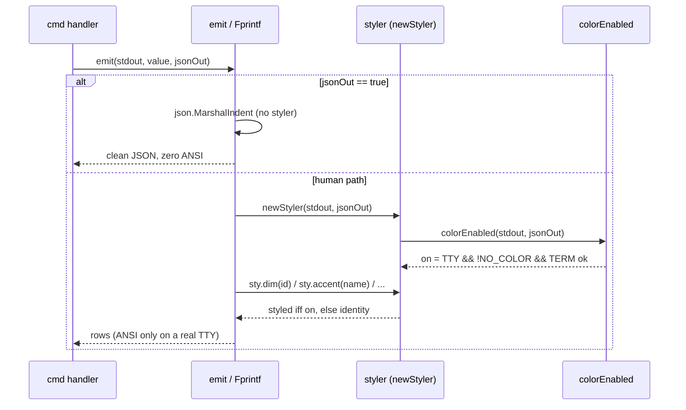

# CLI & Terminal UX

This document explains how `mora <command>` dispatches. It also defines the
byte-clean style layer. The same binary can show color in a terminal and send
clean data to a machine or agent.

## Files

| File | Lines | Responsibility |
|---|---|---|
| `cmd/mora/main.go` | 28 | The binary entrypoint. Injects `-ldflags` version vars into the package, calls `mora.Run`, maps any error to a stderr line + exit 1. |
| `internal/mora/mora.go` | 1089 | The CLI spine: the `Run` dispatch switch, `printUsage`, `cmdVersion`, `flagsFirst`, plus shared model types/consts. Each subsystem's `cmd*` handlers now live in sibling files — `init`→`config.go`, `write`/`read`/`list`/`search`/`delete`/`context`/`think`→`commands_memory.go`, `connect`/`sync`/`ingest`→`ingest.go`, `usage`→`usage.go`, `schedule`→`schedule.go`, `backup`/`lint`→`vaultops.go`, `sources`/`connectors`→`sources.go`/`setup.go`, `doctor`→`doctor.go`, `mcp`→`mcp.go` — and the `emit` human/JSON splitter + `isInteractive` in `helpers.go`. (The `brief`/`pulse` handlers stay in mora.go pending the #62 branch.) |
| `internal/mora/render.go` | 122 | The styling layer: the `colorEnabled` gate, `isTTYWriter`, the `styler` value type + `styAccent/styDim/styOK/styWarn/styBad` palette, and `styleDigestTTY` (the removable TTY skin over the digest). |
| `internal/mora/banner.go` | 105 | The "Apocrypha eye" ASCII banner shown once at the top of the interactive setup menu (TTY-only decoration), plus its own `bannerColor` TTY check. |

## Command dispatch

`main.main()` (`cmd/mora/main.go:18`) is intentionally tiny: it copies the three release-injected vars (`version`, `commit`, `date`) into the package globals (`mora.BuildVersion` etc., declared at `internal/mora/mora.go:38`) and hands everything else to `mora.Run(ctx, os.Args[1:], os.Stdout, os.Stderr, os.Stdin)`. **The streams are passed as parameters, never read from `os.*` inside the package** — that is the seam that makes every command testable with a `bytes.Buffer` and is also the foundation of the byte-clean invariant (a buffer is not a `*os.File`, so styling auto-disables in tests). If `Run` returns an error, `main` prints it to stderr and exits 1. There is no other exit path.

## `mora capabilities`

`mora capabilities --json` emits the `mora.capabilities` v1 receipt. Its top-level payload names the build version, every command path with its JSON contract and payload schema, the static connector catalog, every published error code, the allocated and reserved process exit codes, registered MCP tools and configured MCP write policy, and known receipt schemas. Connector and global `repair` / `deep_link` support use the stable tri-state values `supported`, `unsupported`, or `planned`; Phase 3 and Phase 5 change those values when the features land rather than revising the receipt schema. The deliberately omitted `gdrive` connector remains absent because it is not a user-enableable catalog entry.

### `capabilities` is derived, so edit the registry and not the payload

**Do not hand-edit `internal/mora/capabilities.go` to describe a command, an error code, or an exit code.** Four of its sections are projections of a source that already has its own drift test:

| Section | Source | Mechanism |
|---|---|---|
| `commands` | `internal/mora/eval/cli-command-registry.json` | `go:embed`, one payload row per registry row |
| `schemas` | the same registry's distinct non-exempt `payload` values, plus `moraExtraSchemas` | derived at runtime |
| `error_codes` | `internal/mora/eval/error-code-registry.json` | `go:embed` |
| `exit_codes` | the same file's `exit_codes`, `reserved_exit_codes`, and `first_allocatable_exit_code` | `go:embed` |
| `connectors` | `connectorCatalog` (`internal/mora/mora.go`) | walked at runtime |
| `mcp.tools` / `mcp.schemas` | `mcpToolNames()` | walked at runtime |
| `mcp.write_policy` | `Config.mcpWritePolicy()` | read per invocation, never a constant |

`TestCapabilitiesMatchesRegistries` asserts set equality both ways for each section, and `TestCapabilitiesWritePolicyFollowsConfig` drives the config through all three policy values to prove the field is live.

Two honest limits, stated so nobody over-trusts the test. First, because the two registries are embedded, an edit to either file moves the payload and the test's expectation together — that test therefore catches a **projection** bug (a filtered, truncated, or field-dropping copy), not registry drift. Registry drift is caught by `TestCLIRegistryMatchesProductionDispatch`, `TestContractEveryPayloadIsVersioned`, `TestErrorCodeRegistryMatchesSource`, and the golden corpus. Second, per-connector `incremental_sync` has no registry behind it: it is asserted in `capabilitiesIncrementalSync`, which carries the evidence for today's `unsupported` value in its comment. Phase 4 (ING-01) flips it, and nothing automatic will catch it if that phase forgets.

Every element of `commands` and `error_codes` carries the same key set, with `reason` and `error_class` emitted empty rather than omitted. The compatibility gate walks arrays index-wise, so uneven key sets can report a false removal once an array reorders.

The machine-readable command contract is
`internal/mora/eval/cli-command-registry.json`, with row behavior evidence in
`internal/mora/eval/cli-command-evidence.json`. The registry covers canonical
verbs, aliases, and nested subcommands.
`TestCLIRegistryMatchesProductionDispatch` parses the production Go
dispatchers and fails when an exact command token drifts without a registry
row. `TestCLIRegistryBehaviorEvidence` requires each row to resolve the full
success/usage/invalid/JSON/pipe/state/error/refusal/mutation contract to named
tests or a reasoned platform/N/A classification.
`TestCLIRegistryRealRunDispatch` then drives every row through `Run`; the
mutation audit and checked-in rollup live beside the registry. Line coverage is
not used as a proxy for this contract.

`Run` (`internal/mora/mora.go:176`) is a flat `switch` over `args[0]`. No flags are parsed before the switch — each handler does its own parsing. Most handlers own a `flag.FlagSet` built with `flag.ContinueOnError` + `SetOutput(io.Discard)` (so flag errors surface as the handler's own returned error, not Go's default usage dump). A few hand-roll their flag loop instead (`search` via `parseSearchArgs` `search.go`, and `think`, `reingest`, and `brief` with inline `for`/`switch` scans — `brief` via `case "brief"` at `:250` → `cmdBrief` `:682`, which scans for `--json`/`--envelope`). An empty arg list or `help`/`-h`/`--help` prints `printUsage`. An unknown command returns `fmt.Errorf("unknown command %q", cmd)` (`:243`) rather than silently no-opping.

### The command surface

| Command | What it does | Handler |
|---|---|---|
| `init [--vault DIR]` | Create dirs, **preserve** existing `config.toml`, scaffold control files, rebuild index, then launch the interactive setup menu (TTY only). | `cmdInit` `config.go` |
| `write --title --text [--scope/--type/--tags/--source] [--json]` | Write a manual Markdown memory, incremental index upsert (`indexUpsert`), echo it. | `cmdWrite` `commands_memory.go` |
| `read <id> [--json]` | Print one memory (body or JSON). | `cmdRead` `commands_memory.go` |
| `list [--scope] [--json]` | Recent memories (id / scope / title rows). | `cmdList` `commands_memory.go` |
| `search <query> [--scope] [--limit] [--json]` | Embedder-gated routed search (see [retrieval](./02-retrieval-search.md)). | `cmdSearch` `commands_memory.go` |
| `entities [name] [--json]` / `graph [name]` | Browse / expand the person+topic graph. | `cmdEntities` `entities.go:104`, `cmdGraph` `graph_cmd.go:21`. See [entity-graph](./03-entity-graph.md) |
| `delete <id> --yes` | Remove a memory file + reindex. Refuses without `--yes`. | `cmdDelete` `commands_memory.go` |
| `context [--scope] [--query] [--budget] [--json]` | Build a budgeted context blob (FTS+vector via `hybridSearch`). | `cmdContext` `commands_memory.go` |
| `think "<q>" [--scope] [--limit] [--json]` | Cited-evidence synthesis envelope + gap analysis. | `cmdThink` `commands_memory.go`, see [synthesis](./07-synthesis-think-digest.md) |
| `brief [--json] [--envelope]` | **Session-start default (Phase 16):** print the latest *what-changed/what-matters* brief — read the freshest persisted `briefs/<date>-brief.md` verbatim, else generate on demand. Local-only, zero network, never advances the watermark. `--json` → `{generated, body}`; `--envelope` → append a model-free synthesis prompt. | `cmdBrief` `:682`, see [synthesis](./07-synthesis-think-digest.md) + [the guide](../guide.md#make-the-brief-your-session-start-default) |
| `index rebuild` | Re-parse vault → SQLite + graph + vectors. | `cmdIndex` `index.go` |
| `tasks sync [--write]` / `tasks add <name> [flags]` / `tasks list [--json]` / `tasks done <name>` / `pulse [--write] [--digest]` | Task hygiene + lifecycle: `add` captures an open loop (idempotent by name), `list` shows live tasks, `done` closes one so it stops resurfacing as stale + daily digest. | `cmdTasks` `tasks.go`, `cmdPulse` `:678` |
| `lint` / `backup` | Verify control files exist / tar.gz the vault to state dir. | `cmdLint` `vaultops.go`, `cmdBackup` `vaultops.go` |
| `doctor` | Environment + storage + iMessage-readiness checks. | `cmdDoctor` `doctor.go` |
| `schedule install/list` | Install a scheduled job through launchd on macOS, Task Scheduler on Windows, or a printed cron line on Linux. | `cmdSchedule` `schedule.go` |
| `sources add … / ingest run` | Register / run a filesystem source. | `cmdSources` `sources.go`, `cmdIngest` `ingest.go` |
| `connectors list\|enable\|disable\|setup` | Catalog + per-type consent state. | `cmdConnectors` `setup.go` |
| `connect google\|imessage [--since-days N]` | OAuth/FDA consent **then** backfill. | `cmdConnect` `ingest.go` |
| `sync status\|google\|filesystem\|imessage` | Per-source freshness (no fetch) / re-backfill. A source is required. Unknown names fail closed. | `cmdSync` `ingest.go` |
| `share keygen\|init\|preview\|push\|subscribe\|pull\|list\|remove` | Scoped, age-encrypted, read-only sharing of authored memories over a dedicated private git remote. Subscriptions union into search/think, owner-attributed. | `cmdShare` `share.go:1437`, see [sharing](./13-sharing.md) |
| `reingest [--full]` | Re-fetch + rewrite memories with latest metadata, rebuild graph. | `cmdReingest` `ingest.go` |
| `usage report\|off\|on` | Local-only content-free analytics. | `cmdUsage` `usage.go` |
| `disconnect google` | Drop the Google token. | `cmdDisconnect` `setup.go` |
| `mcp serve` | stdio JSON-RPC MCP server. | `cmdMCP` `mcp.go`, see [mcp-server](./06-mcp-server.md) |
| `upgrade [--check]` | GitHub-release self-update. Refuses dev builds. | `cmdUpgrade` `upgrade.go:24` |
| `version` / `--version` / `-v` | Version + commit + build date + Go runtime. | `cmdVersion` `:247` |

## The uniform command voice (2026-06-10)

Every human-facing command speaks ONE visual language, via three shared helpers (`internal/mora/progress.go`):

- **`okf(w, …)`** — green `✓` prefix for completed actions ("enabled applecalendar…", "Signed in…", "installed launchd job…").
- **`warnf(w, …)`** — yellow `warn:` prefix for recoverable problems (every sync-incomplete line routes here).
- **`progress`** — the live backfill counter. On a TTY it animates ONE in-place line: a timer-driven (120ms) braille spinner — the `bubbles/spinner` "Dot" frames, hand-rolled so the line-oriented CLI gets Charm-style motion WITHOUT adopting the bubbletea event loop — plus the running count, so even API-page dead time visibly moves; `done()` settles `"✓ <name>: N <noun> synced"` (space-padded clear, deliberately not `\x1b[K`, so a NO_COLOR TTY stays escape-free). On a pipe/launchd-log it appends plain lines every 500 and a final count. The fix for "the command looks dead" during a sub-500-item backfill (`progress_test.go` pins both branches. Mutex-guarded — the animator goroutine and the ingest write callback share the line).

All three route through `newStyler`/`isTTYWriter`, so the byte-clean invariant below holds by construction — pipes get plain text, no `\r`, no ANSI. New commands must use these helpers rather than minting their own prefixes. The OAuth flow follows the same expectation-first copy rule: say what will happen ("Opening your browser…", "Waiting… resumes automatically") before any raw URL, never after.

## The byte-clean invariant (the load-bearing rule)

Mora is one binary serving two audiences: a human at a terminal and a machine (a pipe, a `--json` consumer, the MCP stdio transport feeding an agent's context window). **ANSI escape sequences must NEVER reach a machine consumer.** A stray escape corrupts JSON parsing, inflates the agent's token cost, and garbles redirected/CI output. Everything human-facing therefore routes through one gate.

### `colorEnabled` — the single gate

`colorEnabled(w io.Writer, jsonOut bool) bool` (`render.go:21`) is the only function allowed to decide whether styled bytes may be written. It returns `false` (no color) unless **all** of these hold:

1. `jsonOut == false` — `--json` forces color off first, before any other check (`render.go:22`).
2. Neither `NO_COLOR` (community standard) nor `MORA_NO_COLOR` (Mora's escape hatch) is set (`render.go:25`).
3. `TERM` is non-empty and not `"dumb"` (`render.go:28`).
4. `isTTYWriter(w)` is true — `w` is a real terminal (`render.go:31`).

### The `/dev/null` trap and why `go-isatty`, not `os.ModeCharDevice`

`isTTYWriter` (`render.go:38`) deliberately uses `github.com/mattn/go-isatty` (`isatty.IsTerminal(fd) || isatty.IsCygwinTerminal(fd)`) and **not** an `os.ModeCharDevice` stat. The comment at `render.go:36` names the reason: `/dev/null` (and other character devices) pass a `ModeCharDevice` test, so redirecting `mora … > /dev/null` with `TERM` set would *wrongly* enable ANSI and violate the invariant. This was caught when Codex ran the tool with stdout pointed at `/dev/null`. The guard is pinned by `TestColorDisabledForDevNull` in `render_test.go`.

Note the parallel-but-distinct check `isInteractive(r io.Reader)` (`helpers.go`), used for **stdin** (consent menus). It uses the stdlib `os.ModeCharDevice` test instead of go-isatty — acceptable there because the failure mode is "menu blocks on a non-TTY," not "escape codes leak into a machine stream." Do not conflate the two: writer-side TTY detection (output cleanliness) must stay on go-isatty. Reader-side (don't-block) can stay on the stdlib stat.

### The styling layer

The visual language is a tiny 5-color palette using the **16-slot ANSI palette** (`lipgloss.Color("1"…"6")`, `render.go:66`. Rationale comment `render.go:58`) rather than hardcoded hex, so colors inherit the user's terminal theme instead of clashing with it. A `styler` value (`render.go:61`) carries a single `on bool` resolved once via `newStyler(w, jsonOut)` (`render.go:63`). Its methods (`accent/dim/ok/warn/bad`) call `apply`, which returns the input **unchanged** when `on==false` (`render.go:79`). That is the mechanism: off-path styling is the identity function, so the bytes are provably identical to the unstyled path.

Surfaces wired through the styler:
- **`sync status`** (`ingest.go`): accented source name (`sty.accent(st.Source)`), dim `last_synced` timestamp, red `(STALE)` when `LastSynced` is past 48h, red error-count string when `ErrorCount > 0`.
- **`doctor`** (`doctor.go`): green `ok`, yellow `warn`, storage status colored by threshold.
- **`emit` tables** (`helpers.go`): memory rows dim the id+scope; `connectors list` shows `● enabled` (green) / `○ disabled` (dim) — but only on a TTY. Off-path stays the byte-identical literal `"enabled"`/`"disabled"` (`helpers.go`).
- **digest** via `styleDigestTTY`.

#### `styleDigestTTY` — a removable skin, never a fork of the data

`styleDigestTTY(raw string, sty styler)` (`render.go:94`) is the one place worth understanding deeply because it touches the agent path. `cmdPulse --digest` (`mora.go:712`) calls `renderDigest(...)` to produce **the exact same Markdown string the MCP `digest` tool returns**, then layers `styleDigestTTY` on top *only* for human terminals. When `sty.on` is false the function early-returns `raw` verbatim (`render.go:95`). On a TTY it accents `#`/`##` headers (dropping the markdown markers from the human view), dims the `Fresh as of:` line, and dims the trailing ` (id: …)` on each bullet (`dimIDSuffix`, `render.go:116`) — those ids are for agents, not the reader. **Do not move styling into `renderDigest`**. The split is the invariant. `TestDigestByteCleanOnNonTTY` (`render_test.go`) asserts the non-TTY output equals the raw markdown and contains no `\x1b`.

The Phase-16 `mora brief` command (`cmdBrief`, `mora.go:682`) reuses this exact skin but applies it **conditionally**: `resolveBrief` returns a VERBATIM persisted file (`generated==false`) or a freshly-RENDERED digest (`generated==true`), and `cmdBrief` calls `styleDigestTTY` **only on the freshly-generated body** (`mora.go:709-712`) — re-skinning a persisted file would double-process it. Off-TTY `styleDigestTTY` is the identity, and `--json` short-circuits color, so both branches emit raw Markdown to a pipe/`--json`/MCP consumer — the same byte-clean guarantee as `pulse --digest`.

#### Why not glamour

The comment at `render.go:53` is a standing decision: glamour was rejected for the digest because its default style wraps every space in its own ANSI span (heavy "boxed" look + large token cost), the opposite of a quick briefing. Rich markdown rendering is held back for genuinely rich bodies (`read`/`think`) behind a hand-trimmed style, not yet wired.

### `emit` — the human/machine output splitter

`emit(w, v, jsonOut)` (`helpers.go`) is the canonical output funnel for structured results. When `jsonOut` it `json.MarshalIndent`s and prints — no styler is constructed on that branch, so JSON is unconditionally clean. Otherwise it builds a styler (`newStyler(w, jsonOut)`) and type-switches over `Memory`, `[]Memory`, and `[]catalogRow` to print tab-separated human rows. The `default` case `Fprintf("%v\n", v)`. Commands that produce plain prose (doctor, sync status, pulse) bypass `emit` and `Fprintf` directly, constructing their own styler — there is no single output choke point, so **any new human-facing print must construct its styler from `colorEnabled`/`newStyler`**, never emit raw lipgloss.

### The versioned JSON envelope (CON-01)

**The consumer-facing rules — the two keys, MAJOR-only semantics, the bare-array shape moves, the
exempt families, and why MCP results carry no envelope — are published in
[22 — The Mora machine contract](./22-cli-contracts.md), §1.** They are not repeated here. What
follows is the implementation a contributor needs.

`emitReceipt(w, schema, version, payload)` (`receipt.go`) is the single writer. It **merges** the two
keys into the payload object rather than wrapping it, which is what keeps every pre-existing field at
its own name, type, and top-level position — the property the compatibility gate then freezes.

A payload's schema name is not chosen at the call site: it must equal the `payload` value
`internal/mora/eval/cli-command-registry.json` assigns that path.
`TestContractEveryPayloadIsVersioned` (`contract_envelope_test.go`) drives every executable non-exempt
row and fails if executed plus shape-only rows do not add up to the non-exempt row count, so a new
command cannot be added without a payload name and a classification.

### The frozen v1 corpus and the compatibility gate (CON-05)

**The guarantee itself — what a pinned consumer may rely on, the exact remedy for a removal, the
corpus's 50/45 scope limit, and the fact that ordering is not frozen — is published in
[22 — The Mora machine contract](./22-cli-contracts.md), §7.** The contributor-facing mechanics:

`internal/mora/testdata/contracts/v1/<schema>.json` holds one frozen document per executable versioned
payload. `contract_compat_test.go` decodes each in both directions
(`TestContractCompatAdditiveIsSafe`, `TestContractCompatRemovalIsCaught`), reconciles the corpus
against the registry (`TestContractGoldenCorpusIsComplete`), and re-drives every command
(`TestContractGoldenCorpusIsFrozen`).

Two things worth knowing before you touch it:

- **Regenerate with `MORA_UPDATE_CONTRACT_GOLDENS=1` only for an ADDITION.** The generator refuses to
  write a document that lost a key, and the failure message for a dropped key deliberately never
  mentions the env var — otherwise the gate would be bypassable by following its own advice.
- **Volatility is normalized, not excluded.** `contractNormalize` and `contractVolatileLeaves`
  (`contract_compat_test.go`) replace ids, timestamps, absolute paths, bare dates, and two inherently
  variable byte counts with typed placeholders, and sort every array. Generation runs the whole
  command sequence twice and fails on any divergence, so a missed pattern is a hard generation failure
  rather than a CI flap. If CI reds on `ubuntu-latest` or `windows-latest`, `contractNormalizeString`
  and `contractVolatileLeaves` are where to look — the corpus has only ever been generated on darwin.

### The banner

`printBanner(w)` (`banner.go:80`) renders the "Apocrypha eye" + `M O R A` wordmark **once**, at the top of `runSetupMenu` (`setup.go`). It is pure decoration with three independent suppressors: non-`*os.File` or non-TTY writer → prints nothing (`banner.go:82`); `MORA_NO_BANNER` set → prints nothing (`banner.go:85`). Color further gated by `bannerColor` (its own NO_COLOR/dumb/isatty check, `banner.go:69`). The raw art reads as an eye in monochrome, so NO_COLOR terminals still get the art. Only pipes/CI/`--json` get nothing. The trailing whitespace on each art line is **intentional and load-bearing** (37-column rows for centering) and the lines are backtick literals precisely so gofmt cannot strip it (`banner.go:18`).

## `doctor` — environment checks

`cmdDoctor` (`doctor.go`) runs an ordered slice of named checks and prints each as `ok`/`warn` (or, with `--json`, a machine-readable `doctorReport`), then storage + iMessage readiness:
- `vault`, `index_db`, `token_dir`, `sources_config` — existence checks.
- `tokens_disjoint_from_vault` (`disjointRealPaths`, `doctor.go`) — the OAuth token dir must NOT live inside the vault (symlink-resolved, `EvalSymlinks`, via `resolveReal` in `mora.go`), so a synced/shared vault never carries credentials.
- `looksSynced` (`doctor.go`) emits a `warn` if the token dir path contains a cloud-sync marker (`com~apple~CloudDocs`, `Dropbox`, `Google Drive`, `OneDrive`, `Sync`) — a token in iCloud/Dropbox is a credential-leak smell.
- **`source_fresh:<key>`** (Gate 1, HEALTH-01/-03) — one critical check per enabled connector instance, from `sourceHealthAll(cfg, now)` (`internal/mora/health.go`). An enabled-but-never-synced/stale/failed source makes `.healthy` false. See [sync & freshness](./11-sync-and-freshness.md) for the full alarm design (stricter thresholds than the digest three-state, the red banner, `doctor --pulse`).
- **Storage footprint** (`vaultStorageBytes`, `doctor.go`): vault size + the index DB size, but the DB is added **only when it resolves to a path outside the vault** (else `dirBytes` already counted it — double-count guard). `storageStatus` (`doctor.go`) classifies the total `ok`/`warn`/`over` against a 3 GiB soft target / 15 GiB hard ceiling (`storageTargetBytes`/`storageCeilingBytes`, `doctor.go`). Mora reports only. It never deletes or caps.
- **iMessage readiness** (`printIMessageReadiness`, `doctor.go`) prints in a dedicated *ordered* block (the checks map is unordered) so the Full Disk Access guidance reads top-to-bottom. The FDA check is a **real read probe** (`imessage.ProbeReadable` — open+read one row), never `os.Stat`: a present-but-unreadable `chat.db` is exactly the FDA-denied case. See [imessage connector](./05-connectors-imessage.md).

Checks are collected into an ordered slice (not a map) precisely so both the JSON report and the text output are deterministic. The surrounding blocks (storage, iMessage) are printed *outside* that slice so their ordering is stable too.

**The flag matrix:** `--json` emits `doctorReport` (a `healthy` bool, every named check, storage/share/version/platform fields, and a `sources` array that is always `[]`, never `null`); `--strict` makes `Run` return a non-zero-mapped error when any critical check is `false` (default `doctor`/`doctor --json` stay exit-0 even when unhealthy — a deliberate backward-compat choice, `TestDoctorStrictErrorsWhenUnhealthy`); `--pulse` (Gate 1) is a DIFFERENT mode entirely — see below. `--pulse --json` and `--pulse --strict` are two of the three documented combinations (`cmdDoctor`, `doctor.go`). The plain `--json`/`--strict` pair above is the third.

### `doctor --pulse` — the freshness-only alarm

`--pulse` skips every check above and runs ONLY the per-source freshness classification: all fresh → one `ok` line, exit 0. Any source `stale`/`failed`/`never` → prints the red banner (`healthBannerFromSources`, shared with the daily/meeting brief — see [sync & freshness](./11-sync-and-freshness.md)), posts a best-effort native toast (`notifyHealthAlarm`, the same GOOS/`MORA_NO_NOTIFY`-gated seam as the brief's toast), and returns the TYPED `exitCodeError{code: 2}` (`loop.go`) so `cmd/mora/main.go` exits 2 — distinct from `--strict`'s generic non-zero, so a caller can tell "sick" (`--pulse`) from "broken" (`--strict`). `--pulse --json` emits ONLY `{"sources": [...]}`. No banner text reaches the JSON stream. Meant to be scheduled: `mora schedule install doctor-pulse` installs a daily 09:00 job.

## Error codes and exit codes (CON-03 / CON-07)

Mora publishes a machine-checked error taxonomy so an unattended agent can branch on a code instead of matching English. `internal/mora/errors.go` declares it; `internal/mora/eval/error-code-registry.json` (`schema_version: 1`, issue 416) publishes it; `TestErrorCodeRegistryMatchesSource` parses the source with `go/ast` and fails if the two drift in either direction — a code declared but not registered, or registered with no constant behind it.

A failure reaches a caller as a `moraError` carrying `Code`, `Class`, `Source`, and `Msg`. `moraError.Unwrap` returns the cause, so `errors.Is(err, errIndexUnmarkable)` and the other package sentinels still match through the wrap.

### The codes

**The full table — fifteen codes, seven classes, retryability, the `error_class` axis, the
many-to-one mapping into `state`, and why the `permission` class deliberately has no code — is
published in [22 — The Mora machine contract](./22-cli-contracts.md), §4.** Edit
`internal/mora/errors.go` and `internal/mora/eval/error-code-registry.json` together; the `go/ast`
sweep fails if they disagree in either direction.

### Where a code is attached

- **`stampSyncAttemptFailure` (`health.go`)** is the single boundary every connector failure is persisted through, so it is where the code lands on disk.
- **`classifyConnectorError` / `connectorCodeForCause` (`ingest.go`)** classify an untyped failure at `ingestSource`. Every rule is **structural** — a decoder type, a sentinel, an interface — and none matches on error prose. A failure whose message merely says "unauthorized" is `connector.unclassified`, deliberately: re-encoding a guess as a typed code makes the guess look like a fact, which is the exact habit Phase 3 (DOC-03) exists to remove.
- **`sqliteErrorCode` (`index.go`)** classifies index failures. The sqlite driver reports a missing table, a duplicate column, and an unopenable file only as prose, so the match is on strings by necessity. Every such match now lives in that one function; the call sites keep their own `strings.Contains` checks because those gate *control flow* (which errors the rebuild tolerates), not labeling.
- The `Full Disk Access not granted?` sentences in `ingest.go` are **unchanged** by this taxonomy and carry `connector.unavailable`, not `connector.unauthorized` — Mora observed a failed open, not a refusal. Phase 3 (DOC-03) owns removing the inference; the typed code is what it will switch to.

### Exit codes

**The published table — 1, 2, and 10 grandfathered, 3 through 9 permanently reserved-unused, 11 the
first allocatable, and the reasoning behind `doctor --strict` staying 1 — is published in
[22 — The Mora machine contract](./22-cli-contracts.md), §3.**

Implementation: `exitCodeForClass` (`errors.go`) maps a class to a status,
`cmd/mora/main.go` applies the fallback, `cmdDoctorPulse` (`doctor.go`) produces 2, and
`loopSkipExitCode` (`loop.go`) produces 10. `TestExitCodeAllocationIsGrandfathered` fails if any
status lands in the reserved band, or below 11 without being 1, 2, or 10.

## `init` config-preservation

`cmdInit` (`config.go`) **never resets an existing install's config.** It calls `loadConfig()` (`config.go`) first, which returns defaults only when no `config.toml` exists. An existing file is parsed and its `vault_dir`/`data_dir`/`state_dir` preserved. A re-run of `init` therefore cannot repoint Mora away from a custom vault and orphan it (the failure that `bba2c6c fix(init)` corrected). `--vault` is the only override, applied on top of the loaded config (`config.go`). It then `MkdirAll`s all dirs (0700), writes config (atomic, 0600), scaffolds control files (`scaffoldControlFiles` skips files that already exist, `config.go`), rebuilds the index, and finally launches `runSetupMenu` — which itself is TTY-guarded (`setup.go`): on a non-TTY stdin it prints a hint and returns immediately, never blocking CI/scripts.

## `connect` — consent then backfill

`cmdConnect google` (`ingest.go`) is the deliberate enable+backfill convenience: it runs loopback OAuth consent, persists+validates the token (an `AuthedLabels` round-trip), then `ensureGoogleSources` (creates gmail/calendar **disabled**), flips both Enabled bits, and runs an **ungated** backfill loop over gmail/calendar. The loop is ungated on purpose — it is the named, consented path, not a silent backfill. `--since-days N` persists a window override onto the gmail source. `connect imessage` delegates to `connectIMessage`. Contrast with `sync google` (`backfillEnabledGoogle`, `ingest.go`) which IS gated — it skips disabled sources and surfaces a specific "sign-in expired" message on a Google auth error (the 7-day Testing-mode refresh-token trap). See [google connector](./04-connectors-google.md) and [sync & freshness](./11-sync-and-freshness.md).

## Invariants & gotchas

### Stdout/stderr contract

Command results belong on stdout. Diagnostics, including advisory `note:` and `warning:` messages, belong on stderr. With `--json`, stdout is exactly one valid JSON document (or empty when the command has no result); callers never need to strip human prose before decoding it. Doctor check rows remain stdout report content rather than diagnostics.

- **Byte-clean: ANSI never reaches a machine stream.** Every styled write goes through `colorEnabled`/`styler`. `--json` short-circuits color first (`render.go:22`). The MCP stdio path and any pipe/redirect fail the `isTTYWriter` test. *Why:* a stray escape corrupts JSON parsing, bloats agent token cost, and garbles CI/redirect output. Pinned by `TestColorEnabledGate` + `TestDigestByteCleanOnNonTTY`.
- **TTY detection for OUTPUT uses go-isatty, not `os.ModeCharDevice`.** `/dev/null` is a character device that would pass `ModeCharDevice` but is not a terminal. *Why:* `mora … > /dev/null` with `TERM` set must not enable color. Pinned by `TestColorDisabledForDevNull`. (Stdin/`isInteractive` may keep the stdlib stat because its failure mode is benign blocking, not byte leakage.)
- **`styleDigestTTY` is a skin, not a fork.** The digest's data string (`renderDigest`) is byte-identical to what the MCP `digest` tool returns. Styling is layered only on the TTY branch in `cmdPulse`. *Why:* the agent and the human must read the same digest content. If styling moved into `renderDigest`, the machine path would carry ANSI or drift from the human path.
- **Streams are parameters, never globals.** Handlers take `stdout/stderr/stdin io.Writer/Reader`. The package never touches `os.Stdout` directly. *Why:* it is the test seam (buffers) and the reason styling auto-disables under test (a buffer is not `*os.File`).
- **`init` preserves existing config.** `loadConfig` runs before any write. Defaults are used only on a fresh install. *Why:* re-running `init` must never orphan a custom vault (regression fixed in `bba2c6c`).
- **Tokens must live outside the vault and outside synced dirs.** `doctor` checks `disjointRealPaths` + `looksSynced`. *Why:* a vault is meant to be shared/synced; OAuth refresh tokens in it are a credential leak.
- **Unknown commands and unknown connector types error, never no-op.** `Run`'s `default` returns an error (`mora.go:243`); `lookupCatalog` callers must reject unknown types. *Why:* a silent no-op hides typos and (for connectors) consent bugs.
- **Banner art whitespace is intentional and backtick-protected.** Each `eyeBanner` line is exactly 37 columns. Backtick literals stop gofmt from trimming the trailing spaces (`banner.go:18`). *Why:* the eye must center under the wordmark.
- **Doctor reports storage. It never prunes.** Thresholds (3 GiB / 15 GiB) are advisory only. *Why:* the vault is the user's data — Mora is read-only over the user's own files and never deletes.
- **The storage double-count guard.** `vaultStorageBytes` adds the index DB only when it resolves to a path outside the vault. *Why:* a `data_dir` configured inside `vault_dir` is already walked by `dirBytes`.

## Related

- [overview](./00-overview.md)
- [retrieval & search](./02-retrieval-search.md) — `search` routing (`defaultSearch`, embedder gate)
- [entity graph](./03-entity-graph.md) — `entities` / `graph` commands
- [google connector](./04-connectors-google.md) — `connect google` OAuth + backfill
- [imessage connector](./05-connectors-imessage.md) — `connect imessage`, Full Disk Access probe
- [mcp server](./06-mcp-server.md) — `mcp serve`, the byte-clean machine transport
- [synthesis: think & digest](./07-synthesis-think-digest.md) — `think` / `pulse --digest` / `brief` data path, the `resolveBrief` read-or-generate kernel
- [the guide — session-start brief](../guide.md#make-the-brief-your-session-start-default) — wiring `mora brief` into the session-start hook (Claude Code / Codex / MCP)
- [sync & freshness](./11-sync-and-freshness.md) — `sync status`, gated backfill, staleness

## Open questions / unverified

- The CLI has no global `--no-color`/`--color` flag. Color is controlled only by env (`NO_COLOR`/`MORA_NO_COLOR`/`TERM`) and TTY detection. This appears intentional but is not asserted anywhere I read.
