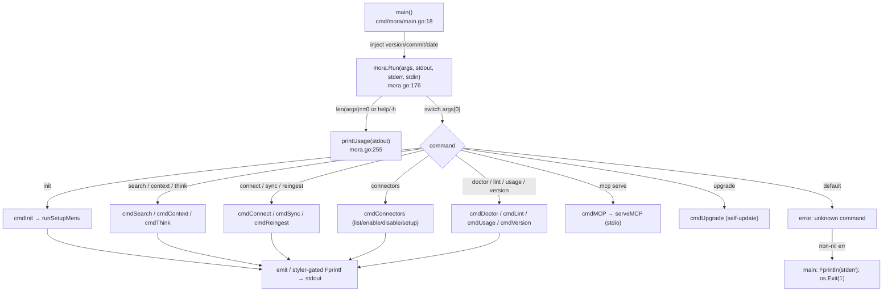
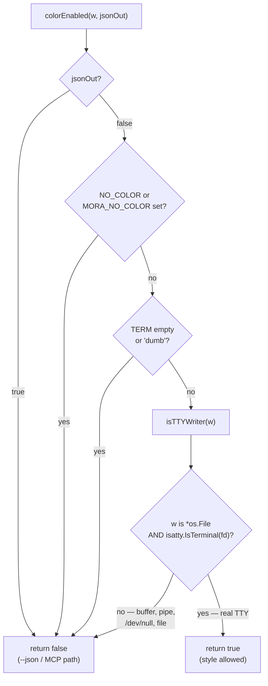
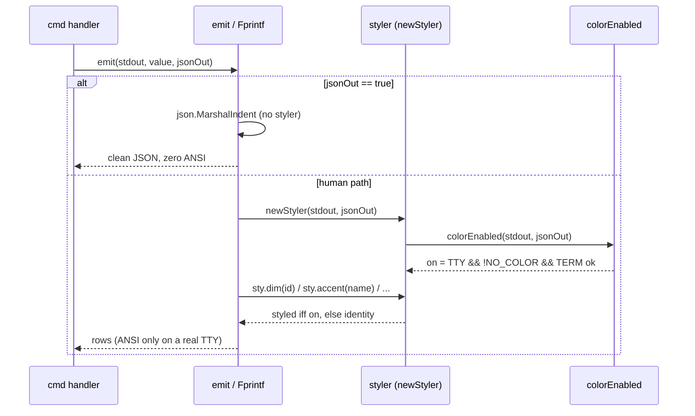

# CLI & Terminal UX

How `mora <command>` dispatches, and the byte-clean styling layer that lets the same binary be both a colored human terminal tool and a silent machine/agent transport.

## Files

| File | Lines | Responsibility |
|---|---|---|
| `cmd/mora/main.go` | 28 | The binary entrypoint. Injects `-ldflags` version vars into the package, calls `mora.Run`, maps any error to a stderr line + exit 1. |
| `internal/mora/mora.go` | 3587 | The whole CLI: `Run` dispatch switch, every `cmd*` handler (`init`, `search`, `connect`, `sync`, `doctor`, `context`, `usage`, …), the `emit` human/JSON splitter, `printUsage`, `isInteractive`, config load/preserve. (This doc owns only the CLI/UX surface of this file; storage, MCP, ingest, graph live in their own docs.) |
| `internal/mora/render.go` | 122 | The styling layer: the `colorEnabled` gate, `isTTYWriter`, the `styler` value type + `styAccent/styDim/styOK/styWarn/styBad` palette, and `styleDigestTTY` (the removable TTY skin over the digest). |
| `internal/mora/banner.go` | 105 | The "Apocrypha eye" ASCII banner shown once at the top of the interactive setup menu (TTY-only decoration), plus its own `bannerColor` TTY check. |

## Command dispatch

`main.main()` (`cmd/mora/main.go:18`) is intentionally tiny: it copies the three release-injected vars (`version`, `commit`, `date`) into the package globals (`mora.BuildVersion` etc., declared at `internal/mora/mora.go:38`) and hands everything else to `mora.Run(ctx, os.Args[1:], os.Stdout, os.Stderr, os.Stdin)`. **The streams are passed as parameters, never read from `os.*` inside the package** — that is the seam that makes every command testable with a `bytes.Buffer` and is also the foundation of the byte-clean invariant (a buffer is not a `*os.File`, so styling auto-disables in tests). If `Run` returns an error, `main` prints it to stderr and exits 1; there is no other exit path.

`Run` (`internal/mora/mora.go:176`) is a flat `switch` over `args[0]`. No flags are parsed before the switch — each handler does its own parsing. Most handlers own a `flag.FlagSet` built with `flag.ContinueOnError` + `SetOutput(io.Discard)` (so flag errors surface as the handler's own returned error, not Go's default usage dump); a few hand-roll their flag loop instead (`search` via `parseSearchArgs` `:3493`, and `think`, `reingest`, and `brief` with inline `for`/`switch` scans — `brief` via `case "brief"` at `:250` → `cmdBrief` `:682`, which scans for `--json`/`--envelope`). An empty arg list or `help`/`-h`/`--help` prints `printUsage`; an unknown command returns `fmt.Errorf("unknown command %q", cmd)` (`:243`) rather than silently no-opping.

### The command surface

| Command | What it does | Handler |
|---|---|---|
| `init [--vault DIR]` | Create dirs, **preserve** existing `config.toml`, scaffold control files, rebuild index, then launch the interactive setup menu (TTY only). | `cmdInit` `:346` |
| `write --title --text [--scope/--type/--tags/--source] [--json]` | Write a manual Markdown memory, rebuild index, echo it. | `cmdWrite` `:406` |
| `read <id> [--json]` | Print one memory (body or JSON). | `cmdRead` `:440` |
| `list [--scope] [--json]` | Recent memories (id / scope / title rows). | `cmdList` `:461` |
| `search <query> [--scope] [--limit] [--json]` | Embedder-gated routed search (see [retrieval](./02-retrieval-search.md)). | `cmdSearch` `:481` |
| `entities [name] [--json]` / `graph [name]` | Browse / expand the person+topic graph. | `cmdEntities` `entities.go:104`, `cmdGraph` `graph_cmd.go:21`; see [entity-graph](./03-entity-graph.md) |
| `delete <id> --yes` | Remove a memory file + reindex; refuses without `--yes`. | `cmdDelete` `:504` |
| `context [--scope] [--query] [--budget] [--json]` | Build a budgeted context blob (FTS+vector via `hybridSearch`). | `cmdContext` `:535` |
| `think "<q>" [--scope] [--limit] [--json]` | Cited-evidence synthesis envelope + gap analysis. | `cmdThink` `:570`, see [synthesis](./07-synthesis-think-digest.md) |
| `brief [--json] [--envelope]` | **Session-start default (Phase 16):** print the latest *what-changed/what-matters* brief — read the freshest persisted `briefs/<date>-brief.md` verbatim, else generate on demand. Local-only, zero network, never advances the watermark. `--json` → `{generated, body}`; `--envelope` → append a model-free synthesis prompt. | `cmdBrief` `:682`, see [synthesis](./07-synthesis-think-digest.md) + [the guide](../guide.md#make-the-brief-your-session-start-default) |
| `index rebuild` | Re-parse vault → SQLite + graph + vectors. | `cmdIndex` `:637` |
| `tasks sync [--write]` / `tasks done <name>` / `pulse [--write] [--digest]` | Task hygiene + lifecycle (`done` closes a live task so it stops resurfacing as stale) + daily digest. | `cmdTasks` `:656`, `cmdPulse` `:678` |
| `lint` / `backup` | Verify control files exist / tar.gz the vault to state dir. | `cmdLint` `:719`, `cmdBackup` `:746` |
| `doctor` | Environment + storage + iMessage-readiness checks. | `cmdDoctor` `:785` |
| `schedule install/list` | Install a scheduled job. | `cmdSchedule` `:959` |
| `sources add … / ingest run` | Register / run a filesystem source. | `cmdSources` `:980`, `cmdIngest` `:1520` |
| `connectors list\|enable\|disable\|setup` | Catalog + per-type consent state. | `cmdConnectors` `:1006` |
| `connect google\|imessage [--since-days N]` | OAuth/FDA consent **then** backfill. | `cmdConnect` `:1567` |
| `sync status\|google\|imessage` | Per-source freshness (no fetch) / re-backfill. | `cmdSync` `:1649` |
| `reingest [--full]` | Re-fetch + rewrite memories with latest metadata, rebuild graph. | `cmdReingest` `:1709` |
| `usage report\|off\|on` | Local-only content-free analytics. | `cmdUsage` `:1764` |
| `disconnect google` | Drop the Google token. | `cmdDisconnect` `:1827` |
| `mcp serve` | stdio JSON-RPC MCP server. | `cmdMCP` `:1862`, see [mcp-server](./06-mcp-server.md) |
| `upgrade [--check]` | GitHub-release self-update; refuses dev builds. | `cmdUpgrade` `upgrade.go:24` |
| `version` / `--version` / `-v` | Version + commit + build date + Go runtime. | `cmdVersion` `:247` |

## The uniform command voice (2026-06-10)

Every human-facing command speaks ONE visual language, via three shared helpers (`internal/mora/progress.go`):

- **`okf(w, …)`** — green `✓` prefix for completed actions ("enabled applecalendar…", "Signed in…", "installed launchd job…").
- **`warnf(w, …)`** — yellow `warn:` prefix for recoverable problems (every sync-incomplete line routes here).
- **`progress`** — the live backfill counter. On a TTY it animates ONE in-place line: a timer-driven (120ms) braille spinner — the `bubbles/spinner` "Dot" frames, hand-rolled so the line-oriented CLI gets Charm-style motion WITHOUT adopting the bubbletea event loop — plus the running count, so even API-page dead time visibly moves; `done()` settles `"✓ <name>: N <noun> synced"` (space-padded clear, deliberately not `\x1b[K`, so a NO_COLOR TTY stays escape-free). On a pipe/launchd-log it appends plain lines every 500 and a final count. The fix for "the command looks dead" during a sub-500-item backfill (`progress_test.go` pins both branches; mutex-guarded — the animator goroutine and the ingest write callback share the line).

All three route through `newStyler`/`isTTYWriter`, so the byte-clean invariant below holds by construction — pipes get plain text, no `\r`, no ANSI. New commands must use these helpers rather than minting their own prefixes. The OAuth flow follows the same expectation-first copy rule: say what will happen ("Opening your browser…", "Waiting… resumes automatically") before any raw URL, never after.

## The byte-clean invariant (the load-bearing rule)

Mora is one binary serving two audiences: a human at a terminal and a machine (a pipe, a `--json` consumer, the MCP stdio transport feeding an agent's context window). **ANSI escape sequences must NEVER reach a machine consumer.** A stray escape corrupts JSON parsing, inflates the agent's token cost, and garbles redirected/CI output. Everything human-facing therefore routes through one gate.

### `colorEnabled` — the single gate

`colorEnabled(w io.Writer, jsonOut bool) bool` (`render.go:21`) is the only function allowed to decide whether styled bytes may be written. It returns `false` (no color) unless **all** of these hold:

1. `jsonOut == false` — `--json` forces color off first, before any other check (`render.go:22`).
2. Neither `NO_COLOR` (community standard) nor `MORA_NO_COLOR` (Mora's escape hatch) is set (`render.go:25`).
3. `TERM` is non-empty and not `"dumb"` (`render.go:28`).
4. `isTTYWriter(w)` is true — `w` is a real terminal (`render.go:31`).

### The `/dev/null` trap and why `go-isatty`, not `os.ModeCharDevice`

`isTTYWriter` (`render.go:38`) deliberately uses `github.com/mattn/go-isatty` (`isatty.IsTerminal(fd) || isatty.IsCygwinTerminal(fd)`) and **not** an `os.ModeCharDevice` stat. The comment at `render.go:36` names the reason: `/dev/null` (and other character devices) pass a `ModeCharDevice` test, so redirecting `mora … > /dev/null` with `TERM` set would *wrongly* enable ANSI and violate the invariant. This was caught when Codex ran the tool with stdout pointed at `/dev/null`. The guard is pinned by `TestColorDisabledForDevNull` in `render_test.go`.

Note the parallel-but-distinct check `isInteractive(r io.Reader)` (`mora.go:129`), used for **stdin** (consent menus). It uses the stdlib `os.ModeCharDevice` test instead of go-isatty — acceptable there because the failure mode is "menu blocks on a non-TTY," not "escape codes leak into a machine stream." Do not conflate the two: writer-side TTY detection (output cleanliness) must stay on go-isatty; reader-side (don't-block) can stay on the stdlib stat.

### The styling layer

The visual language is a tiny 5-color palette using the **16-slot ANSI palette** (`lipgloss.Color("1"…"6")`, `render.go:66`; rationale comment `render.go:58`) rather than hardcoded hex, so colors inherit the user's terminal theme instead of clashing with it. A `styler` value (`render.go:61`) carries a single `on bool` resolved once via `newStyler(w, jsonOut)` (`render.go:63`); its methods (`accent/dim/ok/warn/bad`) call `apply`, which returns the input **unchanged** when `on==false` (`render.go:79`). That is the mechanism: off-path styling is the identity function, so the bytes are provably identical to the unstyled path.

Surfaces wired through the styler:
- **`sync status`** (`mora.go:1669`): accented source name (`sty.accent(st.Source)`), dim `last_synced` timestamp, red `(STALE)` when `LastSynced` is past 48h, red error-count string when `ErrorCount > 0`.
- **`doctor`** (`mora.go:801`): green `ok`, yellow `warn`, storage status colored by threshold.
- **`emit` tables** (`mora.go:3199`): memory rows dim the id+scope; `connectors list` shows `● enabled` (green) / `○ disabled` (dim) — but only on a TTY; off-path stays the byte-identical literal `"enabled"`/`"disabled"` (`mora.go:3209`).
- **digest** via `styleDigestTTY`.

#### `styleDigestTTY` — a removable skin, never a fork of the data

`styleDigestTTY(raw string, sty styler)` (`render.go:94`) is the one place worth understanding deeply because it touches the agent path. `cmdPulse --digest` (`mora.go:712`) calls `renderDigest(...)` to produce **the exact same Markdown string the MCP `digest` tool returns**, then layers `styleDigestTTY` on top *only* for human terminals. When `sty.on` is false the function early-returns `raw` verbatim (`render.go:95`). On a TTY it accents `#`/`##` headers (dropping the markdown markers from the human view), dims the `Fresh as of:` line, and dims the trailing ` (id: …)` on each bullet (`dimIDSuffix`, `render.go:116`) — those ids are for agents, not the reader. **Do not move styling into `renderDigest`**; the split is the invariant. `TestDigestByteCleanOnNonTTY` (`render_test.go`) asserts the non-TTY output equals the raw markdown and contains no `\x1b`.

The Phase-16 `mora brief` command (`cmdBrief`, `mora.go:682`) reuses this exact skin but applies it **conditionally**: `resolveBrief` returns a VERBATIM persisted file (`generated==false`) or a freshly-RENDERED digest (`generated==true`), and `cmdBrief` calls `styleDigestTTY` **only on the freshly-generated body** (`mora.go:709-712`) — re-skinning a persisted file would double-process it. Off-TTY `styleDigestTTY` is the identity, and `--json` short-circuits color, so both branches emit raw Markdown to a pipe/`--json`/MCP consumer — the same byte-clean guarantee as `pulse --digest`.

#### Why not glamour

The comment at `render.go:53` is a standing decision: glamour was rejected for the digest because its default style wraps every space in its own ANSI span (heavy "boxed" look + large token cost), the opposite of a quick briefing. Rich markdown rendering is held back for genuinely rich bodies (`read`/`think`) behind a hand-trimmed style, not yet wired.

### `emit` — the human/machine output splitter

`emit(w, v, jsonOut)` (`mora.go:3190`) is the canonical output funnel for structured results. When `jsonOut` it `json.MarshalIndent`s and prints — no styler is constructed on that branch, so JSON is unconditionally clean. Otherwise it builds a styler (`newStyler(w, jsonOut)`) and type-switches over `Memory`, `[]Memory`, and `[]catalogRow` to print tab-separated human rows. The `default` case `Fprintf("%v\n", v)`. Commands that produce plain prose (doctor, sync status, pulse) bypass `emit` and `Fprintf` directly, constructing their own styler — there is no single output choke point, so **any new human-facing print must construct its styler from `colorEnabled`/`newStyler`**, never emit raw lipgloss.

### The banner

`printBanner(w)` (`banner.go:80`) renders the "Apocrypha eye" + `M O R A` wordmark **once**, at the top of `runSetupMenu` (`mora.go:1308`). It is pure decoration with three independent suppressors: non-`*os.File` or non-TTY writer → prints nothing (`banner.go:82`); `MORA_NO_BANNER` set → prints nothing (`banner.go:85`); color further gated by `bannerColor` (its own NO_COLOR/dumb/isatty check, `banner.go:69`). The raw art reads as an eye in monochrome, so NO_COLOR terminals still get the art; only pipes/CI/`--json` get nothing. The trailing whitespace on each art line is **intentional and load-bearing** (37-column rows for centering) and the lines are backtick literals precisely so gofmt cannot strip it (`banner.go:18`).

## `doctor` — environment checks

`cmdDoctor` (`mora.go:785`) runs a set of boolean checks into a map and prints each as `ok`/`warn`, then storage + iMessage readiness:
- `vault`, `index_db`, `token_dir`, `sources_config` — existence checks.
- `tokens_disjoint_from_vault` (`disjointRealPaths`, `mora.go:769`) — the OAuth token dir must NOT live inside the vault (symlink-resolved, `EvalSymlinks`), so a synced/shared vault never carries credentials.
- `looksSynced` (`mora.go:775`) emits a `warn` if the token dir path contains a cloud-sync marker (`com~apple~CloudDocs`, `Dropbox`, `Google Drive`, `OneDrive`, `Sync`) — a token in iCloud/Dropbox is a credential-leak smell.
- **Storage footprint** (`vaultStorageBytes`, `mora.go:859`): vault size + the index DB size, but the DB is added **only when it resolves to a path outside the vault** (else `dirBytes` already counted it — double-count guard). `storageStatus` (`mora.go:873`) classifies the total `ok`/`warn`/`over` against a 3 GiB soft target / 15 GiB hard ceiling (`storageTargetBytes`/`storageCeilingBytes`, `mora.go:834`). Mora reports only; it never deletes or caps.
- **iMessage readiness** (`printIMessageReadiness`, `mora.go:904`) prints in a dedicated *ordered* block (the checks map is unordered) so the Full Disk Access guidance reads top-to-bottom. The FDA check is a **real read probe** (`imessage.ProbeReadable` — open+read one row), never `os.Stat`: a present-but-unreadable `chat.db` is exactly the FDA-denied case. See [imessage connector](./05-connectors-imessage.md).

The check-map iteration is unordered Go map iteration; the surrounding blocks (storage, iMessage) are deliberately printed *outside* the map loop so their ordering is stable. Doctor output is not `--json` aware — it is human-only prose with a styler.

## `init` config-preservation

`cmdInit` (`mora.go:346`) **never resets an existing install's config.** It calls `loadConfig()` (`mora.go:304`) first, which returns defaults only when no `config.toml` exists; an existing file is parsed and its `vault_dir`/`data_dir`/`state_dir` preserved. A re-run of `init` therefore cannot repoint Mora away from a custom vault and orphan it (the failure that `bba2c6c fix(init)` corrected). `--vault` is the only override, applied on top of the loaded config (`mora.go:361`). It then `MkdirAll`s all dirs (0700), writes config (atomic, 0600), scaffolds control files (`scaffoldControlFiles` skips files that already exist, `mora.go:396`), rebuilds the index, and finally launches `runSetupMenu` — which itself is TTY-guarded (`mora.go:1299`): on a non-TTY stdin it prints a hint and returns immediately, never blocking CI/scripts.

## `connect` — consent then backfill

`cmdConnect google` (`mora.go:1567`) is the deliberate enable+backfill convenience: it runs loopback OAuth consent, persists+validates the token (an `AuthedLabels` round-trip), then `ensureGoogleSources` (creates gmail/calendar **disabled**), flips both Enabled bits, and runs an **ungated** backfill loop over gmail/calendar. The loop is ungated on purpose — it is the named, consented path, not a silent backfill. `--since-days N` persists a window override onto the gmail source. `connect imessage` delegates to `connectIMessage`. Contrast with `sync google` (`backfillEnabledGoogle`, `mora.go:1232`) which IS gated — it skips disabled sources and surfaces a specific "sign-in expired" message on a Google auth error (the 7-day Testing-mode refresh-token trap). See [google connector](./04-connectors-google.md) and [sync & freshness](./11-sync-and-freshness.md).

## Invariants & gotchas

- **Byte-clean: ANSI never reaches a machine stream.** Every styled write goes through `colorEnabled`/`styler`. `--json` short-circuits color first (`render.go:22`); the MCP stdio path and any pipe/redirect fail the `isTTYWriter` test. *Why:* a stray escape corrupts JSON parsing, bloats agent token cost, and garbles CI/redirect output. Pinned by `TestColorEnabledGate` + `TestDigestByteCleanOnNonTTY`.
- **TTY detection for OUTPUT uses go-isatty, not `os.ModeCharDevice`.** `/dev/null` is a character device that would pass `ModeCharDevice` but is not a terminal. *Why:* `mora … > /dev/null` with `TERM` set must not enable color. Pinned by `TestColorDisabledForDevNull`. (Stdin/`isInteractive` may keep the stdlib stat because its failure mode is benign blocking, not byte leakage.)
- **`styleDigestTTY` is a skin, not a fork.** The digest's data string (`renderDigest`) is byte-identical to what the MCP `digest` tool returns; styling is layered only on the TTY branch in `cmdPulse`. *Why:* the agent and the human must read the same digest content; if styling moved into `renderDigest`, the machine path would carry ANSI or drift from the human path.
- **Streams are parameters, never globals.** Handlers take `stdout/stderr/stdin io.Writer/Reader`; the package never touches `os.Stdout` directly. *Why:* it is the test seam (buffers) and the reason styling auto-disables under test (a buffer is not `*os.File`).
- **`init` preserves existing config.** `loadConfig` runs before any write; defaults are used only on a fresh install. *Why:* re-running `init` must never orphan a custom vault (regression fixed in `bba2c6c`).
- **Tokens must live outside the vault and outside synced dirs.** `doctor` checks `disjointRealPaths` + `looksSynced`. *Why:* a vault is meant to be shared/synced; OAuth refresh tokens in it are a credential leak.
- **Unknown commands and unknown connector types error, never no-op.** `Run`'s `default` returns an error (`mora.go:243`); `lookupCatalog` callers must reject unknown types. *Why:* a silent no-op hides typos and (for connectors) consent bugs.
- **Banner art whitespace is intentional and backtick-protected.** Each `eyeBanner` line is exactly 37 columns; backtick literals stop gofmt from trimming the trailing spaces (`banner.go:18`). *Why:* the eye must center under the wordmark.
- **Doctor reports storage; it never prunes.** Thresholds (3 GiB / 15 GiB) are advisory only. *Why:* the vault is the user's data — Mora is read-only over the user's own files and never deletes.
- **The storage double-count guard.** `vaultStorageBytes` adds the index DB only when it resolves to a path outside the vault. *Why:* a `data_dir` configured inside `vault_dir` is already walked by `dirBytes`.

## Related

- [overview](./00-overview.md)
- [retrieval & search](./02-retrieval-search.md) — `search` routing (`defaultSearch`, embedder gate)
- [entity graph](./03-entity-graph.md) — `entities` / `graph` commands
- [google connector](./04-connectors-google.md) — `connect google` OAuth + backfill
- [imessage connector](./05-connectors-imessage.md) — `connect imessage`, Full Disk Access probe
- [mcp server](./06-mcp-server.md) — `mcp serve`, the byte-clean machine transport
- [synthesis: think & digest](./07-synthesis-think-digest.md) — `think` / `pulse --digest` / `brief` data path, the `resolveBrief` read-or-generate kernel
- [the guide — session-start brief](../guide.md#make-the-brief-your-session-start-default) — wiring `mora brief` into the session-start hook (Claude Code / Codex / MCP)
- [sync & freshness](./11-sync-and-freshness.md) — `sync status`, gated backfill, staleness

## Open questions / unverified

- The CLI has no global `--no-color`/`--color` flag; color is controlled only by env (`NO_COLOR`/`MORA_NO_COLOR`/`TERM`) and TTY detection. This appears intentional but is not asserted anywhere I read.
- `doctor` has no `--json` mode (it is human-only prose). Whether a machine-readable health check is wanted is out of scope for what the code shows.
