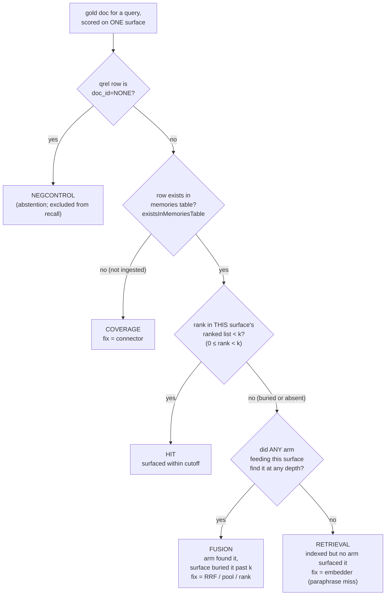
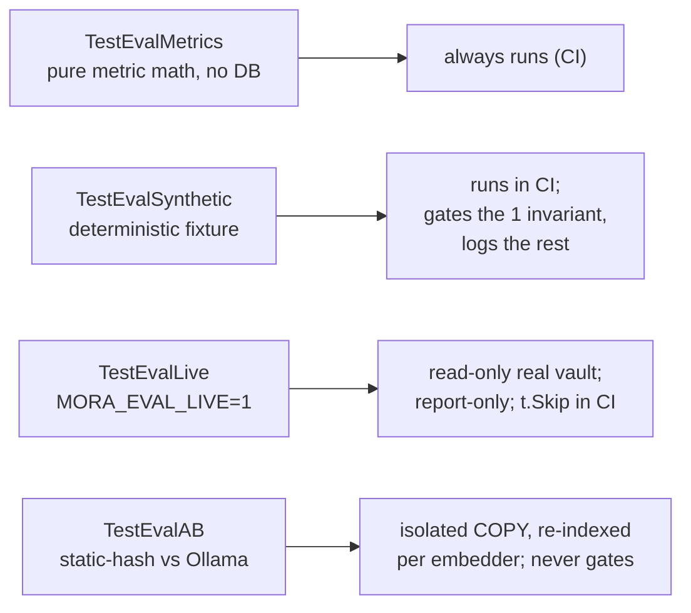
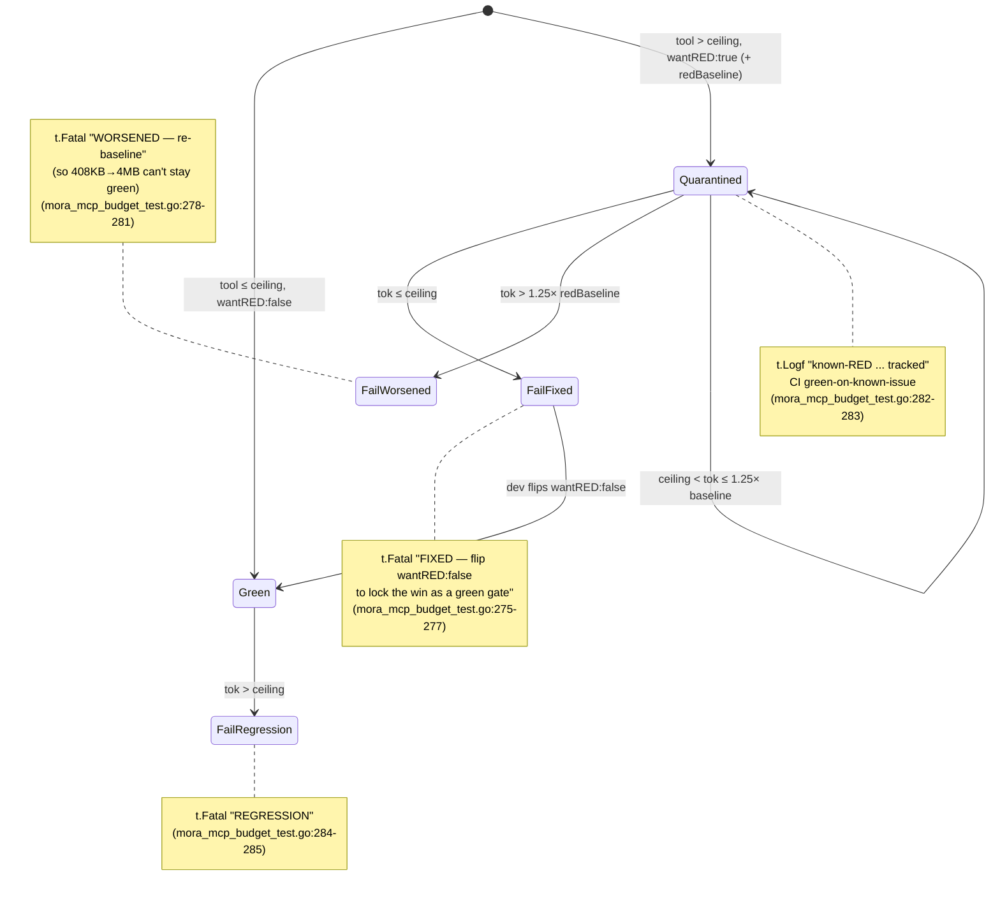

# Evaluation & Testing

Three purpose-built test harnesses measure what the rest of the codebase cannot self-assert: **retrieval recall quality** (the T2 eval, which attributes every miss to a fixable cause), **MCP output-size discipline** (the T0 gate, which pins per-tool token blowups so they can't silently regress), and the **meeting-brief sabotage gate** (which replays the sanitized July 2026 gibberish incident through the assembled production path).

The rendered-output obligation exam adds a single typed ledger that deterministically renders its synthetic Gmail, iMessage, Calendar, and notes corpus. Its regenerate-and-hash and forbidden-real-identity shape uses AMD GAIA issue #848 and the historical generator at commit `0c197ef3` (MIT) as design evidence only; Mora imports no GAIA code or corpus. A high, clean, uniform first score is a defect report against the ledger, not a win: known misses remain labeled so the exam measures the product rather than fitting the fixture to it.

## Files

| File | Lines | Responsibility |
|---|---|---|
| `internal/mora/eval_test.go` | 717 | T2 retrieval-recall eval: golden-set TSV loaders, the `classifyBucket` §6 attribution switch, the deterministic synthetic gate (`TestEvalSynthetic`), the read-only live diagnosis (`TestEvalLive`), the static-vs-Ollama A/B (`TestEvalAB`), the per-surface histogram printer (`reportEval`), the `kFTS`/`kHybrid`/`tracePoolDepth` constants |
| `internal/mora/eval_metrics.go` | 120 | Pure-Go IR metrics ported from `trec_eval`: `recallAtK`, `hitAtK`, `reciprocalRank`, `rankOf`, `meanBy`, and the `existsInMemoriesTable` COVERAGE probe. stdlib only, no CGO/network/Python |
| `internal/mora/mora_mcp_budget_test.go` | 324 | T0 MCP token-budget regression gate: `budgetCase` table, `wantRED` quarantine semantics, per-tool ceilings anchored to 20000, `seedBudgetFixture`, `TestMCPBudgetCeilings`, `TestMCPSearchDefaultLimitIsEight` |
| `internal/mora/eval/sabotage/gibberish-2026-07/` | — | Sanitized frozen-incident input vault, pinned event/as-of clock, and a rendered broken artifact used to self-check the scorer |
| `internal/mora/sabotage_test.go`, `junk_invariance_test.go` | — | End-to-end meeting-brief replay through the direct builder/renderer and MCP `meeting_prep`; scorer degeneration checks; older-junk byte invariance and newer-junk line invariance |
| `internal/mora/junk_patterns_test.go` | — | Test-only table mapping the frozen incident signatures to defect classes and source fixtures; shared by replay and invariance gates without shipping scorer data in the binary |
| `internal/mora/exam/` | — | Stdlib plus `internal/memory` ledger schema, twelve-rule validator, real-identity lint, and deterministic corpus renderer. The package is test infrastructure and must never be imported by `cmd/mora`. |
| `internal/mora/eval/obligations-v1/` | — | Plain-English contract, typed synthetic ledger, generated four-channel vault, event pin, and the sorted regenerate-and-hash manifest. The ledger is input; every vault byte is renderer output. |

The production code they couple to (`hybrid.go`, `mora.go`, `embed.go`, `digest.go`, `meetingbrief.go`, and `mcp.go`) is documented in [retrieval](./02-retrieval-search.md), [the MCP server](./06-mcp-server.md), and [synthesis](./07-synthesis-think-digest.md).

---

## Rendered-output obligation corpus

`OBLIGATIONS.md` is the adjudication contract and predates the typed ledger in git history. `ledger.json` records positive obligations, explicit negative spans, lifecycle transitions, duplicate links, surface expectations, and known expected failures without borrowing the production meeting cleaner. The separate `internal/mora/exam` package may import `internal/memory` for canonical metadata, but it may not import `internal/mora`; connector-side parity tests and Mora-side production round trips point inward toward `exam`, never the reverse.

`exam.Render` produces the complete committed vault. Gmail artifacts retain thread grain, iMessage artifacts retain conversation grain including `Me:` turns, Calendar artifacts retain attendee identity metadata, and notes live under `memories/` as user-authored memories. CI validates the ledger and identity lint first, re-renders and checks `CORPUS.sha256` second, then lets the normal suite drive the production index and output builders. `ERR_LEDGER_DRIFT` identifies source-to-render disagreement; `ERR_CORPUS_TAMPERED` identifies a checked-out vault byte that differs from the recorded render. CI never rewrites either the corpus or its manifest.

All fixture identities use RFC-2606 domains and the designated fictional handle range. No framework is imported by production, no exam test needs network, and no corpus, output, or score is sent to an LLM judge.

### Ledger schema v2: the realism track

Schema version 1 deliberately banned the shapes real mail carries — connector-style quote syntax, wrapped bodies, and artifacts that mix a live obligation with boilerplate — and the human-audit round proved the cost: negatives whose rationale is extractor mechanics cannot be validated by people. Schema v2 (`Ledger.Version == 2`) unlocks exactly those shapes while leaving every version-1 byte frozen (the pinned `CORPUS.sha256` depends on the v1 renderer, named by `RendererVersionFor`):

- **Structural quoting.** `Block.Attr` carries the attribution line of a `quoted_reply` or `forwarded` block, and the v2 renderer emits real client syntax (`On … wrote:`, `> ` prefixes, forward headers, `-- ` signature separators). Authored text may still never fake a quote — quoting stays label-attributable to its block.
- **Wrapped bodies.** `Message.Wrap` (gmail only, 40–100 columns) hard-wraps authored text the way 72-column clients do, making the #136 segmentation shape representable.
- **Composite artifacts.** The one-defect-per-artifact rule relaxes: an artifact may carry a commitment and non-obligations together (footer-on-real-ask), but no two defect labels may share a block and no defect may sit on the block that opens a commitment.
- **Required realism shapes.** A v2 ledger that never uses a composite artifact, a wrapped body, and an attributed quote is refused — a v2 corpus must exercise what v2 exists for.
- **Fingerprint lints.** `LintDateFingerprint` and `LintTitleFingerprint` refuse any ledger whose artifact dates or subject tokens alone separate open-commitment artifacts from the rest — the two metadata channels that leaked the gold label out of the first human sitting are now gated in CI for every corpus.

`TestExamSurfacesV2` sends the validated v2 corpus through the same shared driver as v1: daily CLI, daily MCP, event CLI, and event MCP, with loopback HTTP required to remain byte-identical to event MCP. Both product clocks are pinned to the ledger's `as_of`. The resulting `surface-scorecards-v2.golden.json` is a measured product baseline, not a passing grade. Golden comparison is the regression ratchet: any product change that moves a scorecard requires an explicit, reviewed baseline update, while unchanged deficiencies remain visible as typed values.

`TestExamIntegrityExit` is the Gate 1 trust certificate. For both schema versions it requires validator and all five lint families to pass, rendered and checked-out bytes to match `CORPUS.sha256`, every scorecard metric to retain a registered sabotage case, and the determinism guard to cover the v2 adapter. It also requires the v2 human-validation record to retain its literal `VALIDATED` status and parses every mutation-matrix source and test anchor so a dead anchor cannot silently turn a dated audit green.

`TestExamProductTarget` recomputes the real scorecards for both corpora rather than trusting the goldens. The strict target requires extraction precision and recall of at least 0.90; perfect citation coverage and correctness; zero identity, direction, third-party, closed, duplicate, and non-obligation leaks; scorable owner, direction, due time, lifecycle, closure linkage, commitment identity, dedup, and citation-role rows at or above 0.90; and every reported class recall at or above 0.90. The default CI row is an honest, dated known-red pin tied to #138 and #154. The strict form, enabled with `MORA_EXAM_PRODUCT_TARGET=1`, stays visibly red in the manual mutation audit until the typed product contract exists and the measured target is actually met. Gate 1 therefore certifies that the exam is trustworthy; it does not claim that the product passes the exam.

### Ledger schema v3: Gmail per-message evidence substrate

Schema version 3 adds only the representation Gate 3 needs before direction can be measured: Gmail renders an ordered `Meta["messages"]` array with message refs, block refs, sender, To/Cc, and timestamp, plus `Meta["last_sender"]`. The thread-level sorted `from`/`to`/`cc` union remains byte-compatible behavior for older consumers, but it is explicitly insufficient for direction in a two-way exchange. The v3 validator requires a genuine two-sender Gmail thread so a corpus cannot claim this schema without exercising the new shape; v3 otherwise inherits every schema-v2 realism, identity, leakage, date-fingerprint, and title-fingerprint gate.

`exam-render-v3` is schema-gated: schemas 1 and 2 retain their frozen renderer names and bytes. No `obligations-v3` corpus is generated by machinery tests. Corpus authoring, preregistration, and the human validation round are a separate sealed step; the v3 unit fixture lives only in `_test.go`, proving validator/lint/render behavior without creating or blessing evaluation ground truth.

---

## The obligation scorer, and why it refuses things

`internal/mora/exam/{score,baseline,mutate}.go` is a typed Go scorer. It is typed Go and not a preference judge because an LLM judge measured **τ = −0.40** on this corpus — anti-correlated with truth. It scores one `Scorecard` per surface and never merges them: the meeting brief is scored at **quote grain**, the daily digest at **artifact grain**, and a single number spanning both would describe neither.

**The predicate is the whole exam.** A surfaced meeting line joins to gold on the memory id (a hard gate) **and** an exactly-equal normalized quote. A hit that would need *containment* is recorded as a `loose_match` and never credited — otherwise a copy-the-input extractor that emits the whole memory body "contains" every gold quote and scores well. `Unmatched` is measured against **every labelled span in the ledger**, not against the gold set: a line that hits a labelled *non*-obligation is a false positive, not a hallucination. Collapsing the two would show a nonzero `Unmatched` on a healthy engine, and the natural "fix" for that is to loosen the predicate into containment — which destroys the instrument. Both counters must be **zero on the real engine** before the human audit may start.

**Three run states, never collapsed.** `INVALID_HARNESS` (invalid ledger, unknown surface, zero required samples, a missing cited source artifact) is an `error` and a **zero** scorecard — never a low score. `SCORED_FAILURE` is a real, comparable number. `PASS` means the product got everything right. A broken instrument must never be reportable as a bad product, and a bad product must never be excused as a broken instrument.

**Scorer v2 measures Owner directly.** `Scorecard.scorer_version` freezes the contract at 2, and `Prediction.Owner` is compared with the ledger owner per class. The shipped payloads do not carry that field yet, so Owner is a normal fail-closed dimension (`defined:false`, zero recall), not a special string sentinel. Deriving it from `SectionKind == "open_loops"` remains forbidden because that would restate extraction precision instead of measuring ownership.

**Eight rows are born red, by measurement.** Owner, direction, due time, lifecycle state, closure linkage, commitment identity, dedup, and citation roles have no production substrate, so the adapters emit `unknown`/`""` and the rows remain undefined or measure zero. `Due` and `ClosureRef` carry explicit `none` sentinels for the gold values — without them, a surface that cannot express a due time at all would score *correct* against an obligation that has none, and the row would be accidentally green. `Prediction.CommitmentID`, `DuplicateOf`, and typed citations (`opener`, `closure`, `supporting`) make canonical selection, duplicate-copy citation retention, and closure evidence independently observable.

`CommitmentID` is frozen as `commit:v1:<sha256>` over three four-byte-length-prefixed components: the opening memory/message reference, the authored block reference, and the zero-based obligation slot ordered by span position within that block. The scorer derives this oracle from ledger evidence, never from the ledger's readable `c/...` label. Owner/counterparty identity is intentionally excluded; the stability test redirects both identities and permutes ledger order without moving an ID.

**Visible output and inventory are separate contracts in one scorer.** `Prediction.Origin` is typed as `surface` or `inventory`. Surface rows answer what may be shown and own extraction plus leak discipline; inventory rows answer what the product knows and score lifecycle/closure across every commitment, including closed, superseded, and duplicate items that must not render. A genuine inventory row has no rendered text or section. A text-bearing row is always scored as visible output even if it claims `origin=inventory`, so the origin discriminator cannot launder a closed-item leak. Citation coverage/correctness, counterparty, identity, dedup, and citation-role scoring also inspect genuine inventory rows. The **oracle** fills both contracts from gold and must pass every row, which proves the born-red target is reachable.

### The metric sensitivity contract

The most dangerous eval failure is not a wrong number; it is a **green metric that is insensitive to the bug it claims to detect**. So `RequiredMetrics` registers every number on the `Scorecard` with a scorer-version and at least one red-team row that moves it, and three meta-tests make that structural: `TestEveryMetricHasASabotageCase` fails by metric name if a metric names no sabotage, `TestEveryRegisteredSabotageMovesItsMetric` executes each declared row against a typed positive control and fails unless that exact `Scorecard` field changes, and `TestMetricRegistryCoversEveryScorecardField` walks the struct by reflection so a new number cannot enter the scoreboard without declaring what breaks it. Scorer v2 adds named owner, commitment-id, duplicate-pointer, citation-role, inventory-lifecycle, and inventory-origin-escape mutations. `RecallUncapped` is driven by an explicit second prediction run in the empty-brief row; leaving its zero value untouched is not movement.

The generated render→`parseMemory` property proves only what the production memory format can preserve: stable identity metadata, artifact kind/source, each citation's source-memory association, and exact span bytes. Block ids/kinds and commitment ids are ledger-only scorer provenance and are not serialized into a Mora memory, so the property deliberately does not claim they emerge from `parseMemory`.

`RequiredRedTeamRows` is a version-pinned manifest, and `TestScorerRedTeam` **iterates the manifest, not a list of subtests** — a row with no registered baseline is a named failure, so deleting a subtest cannot delete the failure it was there to raise. The rows include the degenerate baselines (empty, every-question, copy-the-input, synthetic gibberish), the mutants that corrupt the **real** engine output (identity flip, unsupported citation, citation-span move, daily citation blanking), the mutants that corrupt the **gold** (owner flip, authored→quoted, removed source), three **invariance** rows that fail if the score *moves* (duplicate noise, input order), the **gate-disable sweep** that binds all seventeen production exclusion gates to a scored consequence, and the **oracle** — without which every negative row is satisfiable by a scorer that unconditionally fails, and an eval broken in the safe direction is still broken.

`sabotage-ledger.json` is a self-contained synthetic world carrying every defect class. The exam **never reads** `eval/sabotage/gibberish-2026-07/`: that tree carries real names on a public repo.

### Current-surface scoreboard

`exam_surfaces_test.go` runs the corpus through the real `Run` and `callMCPTool` switches, not helper-only builders. It scores daily CLI and MCP independently, pins the daily ID ordering and their intentional cap relationship, and requires event CLI and MCP to marshal to the same `MeetingBrief` bytes. `POST /meeting-prep` is checked end to end as an extra transport over `callMCPTool`; it is not counted as another engine. Both `briefClock` and `prepClock` are pinned, and `cmdPulse` reads the same `briefClock` seam as MCP digest so a machine's wall clock cannot move the scored window.

The daily obligation lane remains an explicit known-red row through [DIGEST-OBLIGATION-LANE #154](https://github.com/pyranthus-hq/mora/issues/154), expiring 2026-10-14. That row says only that `DigestItem` lacks owner, direction, due, lifecycle, and closure fields. Daily citation coverage and correctness are live measurements; calling the digest "uncited" would be false.

Home is `MISSING`, not simulated: HOME-09/#141 owns its future call-site proof. A high, clean, uniform first score remains a defect report against the ledger, not a win.

### Correction flywheel

`TestExamCorrectionFlywheel` runs the same vault in two graph states. PRE-MERGE has no governance entry. POST-MERGE is established only through the real `Run(["merge","confirm",...])` CLI path, which appends the governance decision and rebuilds the graph. The test then reruns the real event brief, requires the designated iMessage commitment to become a correctly attributed and cited true positive, and pins both complete typed scorecards. There are four meeting-surface gold commitments (`G=4`): extraction recall moves from `0.50` to `0.75`, so the recorded flywheel gain is exactly `1/G = 0.25`. If the commitment is already correct before confirmation, or if the scorecard does not move between states, the exam fails `EVAL_BROKEN`.

This measures the value of a human confirmation. It deliberately does not test whether `emailPhoneCandidates` proposes the pair; proposal recall belongs to the Teach gate.

### Mutation matrices

`scripts/eval/exam-mutation-matrix.sh` is the reproducible audit driver, and `eval/obligations-v1/mutation-matrix.md` records its dated result. Matrix 1 plants source-level mutants at all seventeen production exclusion gates reachable from meeting-brief assembly; all seventeen are closed by assembled-surface tests. Matrix 2 attacks the exam itself: validator refusal, scorer dimensions and sensitivity relations, red-team registration, determinism and identity guards, corpus hashes, current-surface clocks/caps, and both flywheel arms. A row is either `CLOSED` by a named red test or a dated, issue-linked `HOLE`; there are no silent or undated exceptions.

### Determinism is structural, not a convention

`determinism_guard_test.go` parses every file that can reach a score, a baseline, a mutant, an adapter or a gate, and fails on any `math/rand` import or any `time.Now`/`Since`/`Until` selector. It also enforces the inverse rule: `pgregory.net/rapid` may be imported **only** in a `*_prop_test.go` file, because a PRNG on a scoring path would quietly void every byte-stability promise the exam makes. `rapid` v1.3.0 is pinned, test-only, run with a fixed CI seed that is printed for replay; `TestExamTestOnlyDepsAreNotLinked` asserts `go list -deps ./cmd/mora` never reaches it.

**A high, clean, uniform first score is a defect report against the ledger, not a win.**

---

## T2: retrieval-recall attribution

The hard question for a retrieval system is not "what's my recall" — it's "**when I miss a relevant doc, whose fault is it and what fixes it**." A miss can mean: the doc was never ingested (connector bug), the embedder couldn't surface it on meaning (embedder bug), or an arm found it but fusion buried it past the cutoff (RRF/pool/rank bug). Each routes work to a different subsystem. Conflating them is the named #1 risk in the design doc. The T2 eval's load-bearing deliverable is therefore **not a recall number** — it's a histogram that mechanically attributes every gold-doc miss to exactly one of those causes, with zero metric math (`eval_test.go:18-20`).

### The §6 attribution buckets

`classifyBucket` (`eval_test.go:164-177`) is the entire diagnosis logic, isolated into a pure function so it can be exhaustively unit-tested without any embedder or DB in the loop:



The branch **order is the invariant**: COVERAGE is checked *before* any retrieval state (`eval_test.go:162-169`). An un-ingested doc must never be blamed on the embedder, and an embedder miss must never be blamed on the connector — the COVERAGE↔RETRIEVAL misroute is exactly what sends work to the wrong fix. `TestClassifyBucket` (`eval_test.go:512-536`) drives all eight branches with pure inputs, including the `coverage-beats-rank` case (`!inIndex` dominates even when a rank is present) so this ordering can never silently flip in CI.

### Per-surface separation (the wrong-surface-confidence guard)

`classifyBucket` scores **one surface at a time**, and `reportEval` (`eval_test.go:198-263`) keeps two separate histograms: `search_memory` (FTS-only, `k=kFTS`) and `context_memory` (hybrid, `k=kHybrid`). This is the spec's primary guard against false confidence: an FTS miss that the vector arm recovers must **not** read as HIT on the FTS surface (`eval_test.go:150-153`). For the FTS surface, `foundByAnyArm` is `rFTS >= 0` only; for the hybrid surface it is `rFTS >= 0 || rVec >= 0 || rGraph >= 0` (`eval_test.go:237-238`). The per-arm ranks come from `retrievalTrace` (see below).

Recall and MRR are scored over each surface's **production-emitted** list — `search_memory`'s real top-`kFTS` via `mustSearchIDs` → `searchMemories`, and `context_memory`'s real top-`kHybrid` via `mustHybridTrace` → `hybridSearchTrace` (`eval_test.go:213-228`). A doc the surface never returns therefore can never earn recall or reciprocal rank; the eval is **surface-honest**, not measuring some idealized fused list the agent never sees.

### Where the per-arm ranks come from: `hybridSearchTrace`

`classifyBucket` needs to know the rank of a gold doc in *each individual arm* (FTS, Vec, Graph) and in the *full pre-limit fused ranking*. Production `hybridSearch` computes these and discards them. `retrievalTrace` (`hybrid.go:32-39`) exposes them, and `hybridSearchTrace` (`hybrid.go:88`) is the one code path both production and the eval share — `hybridSearch` is a thin wrapper passing `tracePool=0` (`hybrid.go:49-52`).

The subtle part is `tracePoolDepth = 200` (`eval_test.go:184`), which is deliberately **larger** than production's pool of `limit*5` (min 50, `hybrid.go:101-104`). The fused production ranking is always computed from arms queried at the *production* pool and fed whole to RRF, so it stays byte-identical to `hybridSearch` regardless of `tracePool` (`hybrid.go:77-87`). But the arm lists *recorded in the trace* are re-queried at the deeper `tracePool`. Without this, a gold doc that an arm found at rank #55 — beyond the production pool — would be invisible to the trace and misclassified as RETRIEVAL (falsely blaming the embedder) instead of FUSION (`hybrid.go:34-38`, `eval_test.go:174`). The deep trace is what separates "an arm found it but fusion buried it" from "no arm found it at all."

### The golden set

The committed synthetic golden set lives in `internal/mora/testdata/eval/`:

- `golden_queries.tsv` — `qid<TAB>query_text`, loaded by `loadQueries` (`eval_test.go:54-65`).
- `golden_qrels.tsv` — TREC-style qrels: `qid iter doc_id rel source archetype gen surface` (tab-separated), loaded by `loadQrels` (`eval_test.go:71-112`). `rel>0` rows form the relevant set; `doc_id=NONE` rows are kept as negative controls. The first-seen row per `qid` wins for the metadata tags (`eval_test.go:89-104`).

The committed set has exactly four queries (verified): `q1` exact-phrase (PKCE), `q2` person (Neil Patel, reachable only via the graph arm), `q3` paraphrase (cash-runway), and `q4` a `NONE` negative control. The synthetic fixture (`seedEvalFixture`, `eval_test.go:423-462`) writes these docs plus three lexically-disjoint decoys so recall isn't trivially 1.0. **All dates are fixed, no `time.Now`, no randomness** — so `buildGraph` and the static embedder produce byte-identical output every run.

The **live** golden set — `internal/mora/live_queries.tsv` and `live_qrels.tsv` — is **hand-labeled against the real vault and gitignored** (`.gitignore:20-21`). `TestEvalLive`/`TestEvalAB` skip if it's absent (`eval_test.go:616-618`, `640-642`). The design doc's recipe: 3 RED seeds (queries Codex's MCP calls actually failed) expanded to ~15 stratified queries.

### The ONE gated synthetic invariant

`TestEvalSynthetic` (`eval_test.go:566-604`) reports the full eval but **gates exactly one assertion**:

> `Recall@5[gen=seed, archetype=exact, surface=fts] == 1.0`

i.e. an exact phrase that exists verbatim in a body must be returned by the FTS surface. If that breaks, FTS itself is broken (`eval_test.go:588`). The test finds the gated query by its metadata tags and fails loudly with the ranked list if recall isn't 1.0 (`eval_test.go:590-600`); it also fails if the golden set is missing that tagged query at all (`eval_test.go:601-603`), and if the set lacks a `NONE` negative control to exercise the abstention/exclusion path (`eval_test.go:584-586`).

**Everything else is logged, not gated.** The comment states the reasoning directly: "you cannot freeze a recall floor blind, before the live numbers exist" (`eval_test.go:564-565`). Freezing a recall threshold against the synthetic fixture would bake in a meaningless number; the real recall verdict is read off the live histogram, by a human, not asserted in CI.

`kFTS` is **coupled to production** (`eval_test.go:181-185`) — `mcpSearchDefaultLimit` is `8` (`mora.go:2168`):

```go
kFTS           = mcpSearchDefaultLimit // search_memory default cutoff — coupled to production so they can't drift
kHybrid        = 10                    // context_memory hybridSearch cutoff
tracePoolDepth = 200                   // > production pool=limit*5; separates FUSION from RETRIEVAL
```

If someone bumps `mcpSearchDefaultLimit`, the eval's FTS cutoff moves with it automatically — the gate is measuring the real surface, never a stale constant.

### The four run modes



- **`TestEvalMetrics`** (`eval_test.go:467-505`) locks the metric math with hand-checked fixtures, no DB. Always runs.
- **`TestEvalSynthetic`** (`eval_test.go:566`) — described above. Forces `MORA_EMBEDDER=""` so a dev with Ollama opted in still gets the CI floor under static-hash (`eval_test.go:567`).
- **`TestEvalLive`** (`eval_test.go:610-626`) scores the real vault read-only via `MORA_EVAL_LIVE=1` (or a path to a data dir) and prints the histogram. It **never rebuilds the live index** (`eval_test.go:613`) — it opens the DB `?mode=ro` (`eval_test.go:300-307`). This is where the embedder-vs-coverage verdict is read.
- **`TestEvalAB`** (`eval_test.go:635-717`) runs static-hash vs Ollama on an **isolated deep copy** of the live vault (`copyTree`, `eval_test.go:388-414`), re-indexing under each embedder. The headline is the bucket migration: **RETRIEVAL→HIT proves the gain is semantic** (`eval_test.go:715-716`). It has multiple correctness guards that make the A/B trustworthy, described next.

### Why the A/B can't lie to itself

`chooseEmbedder` (`embed.go`/`embed_ollama.go:92`) **silently degrades to static-hash** if the Ollama daemon is down — which would turn a static-vs-Ollama A/B into a static-vs-static comparison, the most dangerous possible bug because it would report "no improvement" and look correct. `TestEvalAB` defends against this at every step:

1. Re-index per embedder (`eval_test.go:679`, `689`) — vectors are keyed by `ModelID`, so an Ollama query against a static-keyed index would return an empty arm.
2. Probe Ollama before trusting it; if the embedder resolves to anything not prefixed `ollama:`, **skip** (never fatal) (`eval_test.go:644-648`).
3. After re-indexing under Ollama, count `mem_vectors WHERE model = ?` and `t.Fatal` if zero — "would compare static-vs-static" (`eval_test.go:693-701`).
4. Re-check the embedder *after scoring*, not just before, so a daemon that drops mid-test can't silently mix arms (`eval_test.go:703-707`).
5. `t.Fatal` if the Ollama vec arm returned **0 hits across all queries** despite stored vectors — the query embedder mismatched the index model (`eval_test.go:708-710`).

`bucketHistogram` (`eval_test.go:270-296`) returns the hybrid-surface histogram *plus* `vecHits` (total vec-arm hits across the set) precisely so guard #5 can prove the arm is live. The whole `static-hash-v1` model id (`embed.go:31`) is the named static floor; `embedderIsSemantic` (`hybrid.go:59`) is just `ModelID() != defaultEmbedder().ModelID()`.

> The standing "Retrieval and embeddings" verdict (hybrid beats FTS-only **only** under Ollama; static-hash hybrid *regresses* recall 0.591→0.394@5) is the output of this A/B against Adit's real golden set. The eval is the instrument that produced it.

---

## T0: MCP output-size budget gate

Neil's redline: **one tool result must not dominate the 20000-token context window** (`mora.go:2849`, `mora_mcp_budget_test.go:14-16`). The T0 gate (`mora_mcp_budget_test.go`) pins every MCP tool's *full `CallToolResult` envelope* to a fixed per-tool token ceiling. It measures the whole serialized result map — the text content block **plus** the `structuredContent` mirror — because that is what the agent pays for on the wire (`mora_mcp_budget_test.go:17-21`, `measureEnvelope` at `:68-76`).

### The envelope-doubling bug it's built around

`toCallToolResult` (`mcp.go`) JSON-marshals an object-shaped return into a text block **and** attaches the same value as `structuredContent` (`mcp.go`). So object-returning tools serialize their payload twice on the wire. The budget gate exists to keep that doubling — and three other structural blowups — visible and bounded.

Tokens are computed as `ceil(bytes / charsPerToken)` with `charsPerToken = 4` (`mora.go:2847`, `mora_mcp_budget_test.go:301`), matching the codebase's own budget unit so the ceilings mean the same thing the runtime budgeting means.

### The ceilings are policy lines, tiered by role

Ceilings (`budgetCase.ceil`, `mora_mcp_budget_test.go:218-269`) are **fixed token lines anchored to 20000**, tiered by tool role (`mora_mcp_budget_test.go:41-49`):

| Role | Tools | Ceiling | Rationale |
|---|---|---|---|
| Mutation / point-read | `write_memory` 1500, `delete_memory` 500, `read_memory` 4000 | tiny | a point op must not approach the window |
| Synthesis / briefing | `think` 6000, `digest` 10000, `context_memory` 12000 | ≤ half the window | a briefing that fills the window defeats its purpose |
| Raw enumeration | `search_memory` 8000, `list_memory` 10000, `list_entities` 8000 | row headroom + fixed cap | should force per-result snippeting + limits before higher limits unlock |

The ceilings are **never scaled with the `limit`/`max_tokens` argument** (`mora_mcp_budget_test.go:31-33`). A regression ceiling is a fixed line; scaling it with the input would hide the very regression it exists to catch. That's why `context_max` (`max_tokens=20000`) and `context_default` share the same 12000 ceiling (`mora_mcp_budget_test.go:247-255`) — a tool that can claim the whole window on one call is exactly the failure mode.

### The `wantRED` quarantine state machine

Several tools are **over budget today, by design** — the RED rows are the deliverable, pinning real bugs (`mora_mcp_budget_test.go:23-30`). Rather than `t.Skip` them (invisible; wouldn't notice a fix), they're quarantined via `wantRED:true` with a `redBaseline` magnitude. The gate stays green on the known baseline but flips RED on two events: a quarantined tool gets *fixed*, or one gets *meaningfully worse*.



`assertBudget` (`mora_mcp_budget_test.go:272-289`) is the whole state machine. The `redBaseline*5/4` worsening guard (`:278`) is what stops a known-RED tool from quietly ballooning 10× while staying "green-on-known-issue" — the explicit example is `408KB→4MB must not stay green`.

### The still-RED tools (the pinned bugs)

From `budgetCases` (`mora_mcp_budget_test.go:218-269`), the rows with `wantRED:true` today:

- **`list_entities`** — ceiling 8000, baseline 11443. Unbounded entity count + full `MemoryIDs` per entity, no limit/pagination (`graph_read.go graphListEntities`, `mora_mcp_budget_test.go:240-241`).
- **`get_entity_found`** ("Neil Patel") — ceiling 12000, baseline **189602**. Dumps every evidence body in full, no snippet/limit, then doubled by `structuredContent` (`graph_read.go graphGetEntity`, `mora_mcp_budget_test.go:243-244`).
- **`digest_default`** and **`digest_max`** — ceiling 10000, baseline 17007 each. Renders a budget-clipped digest string but ships full `d.Sections` beside it, then doubles via the envelope (`mora.go` digest case, `mora_mcp_budget_test.go:257-260`). That the two are **identical size** proves `max_tokens` is a dead knob on the sidecar (`:260`).

`get_entity_notfound` is green at 12000 (the 404 path), proving the blowup is the evidence dump, not the lookup. `search_big`/`search_default_limit` are green with notes recording that the body-bloat bug was **fixed** — `snippetMemories` (`search.go`) caps each row at `searchSnippetLen=240` (the const stays in `mora.go`; `mora_mcp_budget_test.go:225-230`).

### The fixture is deterministic by construction

`seedBudgetFixture` (`mora_mcp_budget_test.go:84-184`) reproduces each blowup structurally, not by accident:

- 200 emails sharing one sender ("Neil Patel") → one high-degree person that `get_entity` dumps in full; 200 distinct recipients → ~200 low-degree persons that bloat `list_entities` (`mora_mcp_budget_test.go:78-83`, `90-109`).
- For `digest`, 12 sources × 8 items = 96 in-window items > the `digestDefaultCap=8` per-source cap (`digest.go:16-18`), so the blowup is **count-driven across sections**, not body-size-driven — robust, not fragile (`mora_mcp_budget_test.go:110-122`). These are the **only** now-relative timestamps in the fixture (`recent := time.Now().Add(-12h)`, `:123`), pinned well inside the 24h window so the size stays stably over-ceiling.
- 9 "bulktext" rows (> the default limit 8) so a no-arg `search_memory` returns a full 8 snippet-capped rows (`mora_mcp_budget_test.go:170-178`).
- Everything else uses **fixed 2026-05 dates and no randomness** (`mora_mcp_budget_test.go:97`, `:82-83`), so `buildGraph` + the static embedder are byte-identical run to run.

A footgun baked into the fixture comment (`mora_mcp_budget_test.go:141-150`): the read/delete subjects use **slash-free ids** (`read-target`, not `gmail_thread/x`) because a connector-style id nests under `memoryPath` into a subdirectory whose file base `findMemory` can't resolve via the generic `writeMemory` path — it would silently measure a ~22-token error envelope. Production is fine (the real connector files via `writeMappedMemory`+`SafeFilename`); this only bites the test's generic write path.

### The coupled default-limit assertion

`TestMCPSearchDefaultLimitIsEight` (`mora_mcp_budget_test.go:189-211`) proves the no-arg `search_memory` default is `mcpSearchDefaultLimit` (bumped 5→8) **and** that every returned body is snippet-capped at `searchSnippetLen` runes (+ ellipsis) with `Truncated=true`. This is what holds the 8000-token line — snippeting, not the old limit of 5. `kFTS` in the T2 eval reads the same constant, so the two harnesses agree on the production cutoff by construction.

### `TestMCPBudgetLive`

`TestMCPBudgetLive` (`mora_mcp_budget_test.go:318-324`) measures the same contracts against a real vault via `MORA_BUDGET_LIVE=/path`, but is **double-skipped** today: it needs read-only config repointing that isn't wired yet. The documented fast path for live numbers is the stdio binary directly: `printf '<jsonrpc line>' | mora mcp serve | wc -c` (`mora_mcp_budget_test.go:311-317`).

---

## Meeting-brief frozen-incident sabotage gate

The Gate 1 sabotage fixture is sanitized input, not only a golden output. `TestSabotageGibberishNeverRenders` copies that vault into an isolated test home, rebuilds the real index, assembles the pinned event through `buildEventMeetingBrief`, renders it, and calls the MCP `meeting_prep` handler. Every surfaced evidence line is checked against one defect-signature table, while a genuine signed-pilot obligation must survive so an empty brief cannot pass.

The four incident gates are mutation-checked one at a time. Their fixtures are intentionally independent: a direct two-party third-party assignment pins `assignedToThirdParty`; a genuine ask on a thread with an outsider pins `meetingBriefIsTwoPartyExchange`; actionable RSVP/Teams boilerplate pins `isMeetingNotification`; and a non-notification Meet URL whose hard-wrapped continuation turns a post-segmentation URL shard into a candidate pins pre-segmentation `stripURLs`. Disabling any one gate makes its fixture's junk reach the rendered brief, so redundant filtering cannot hide an unwired call site.

`TestSabotageScorerSelfCheck` evaluates the evaluator: the scorer must reject the committed broken rendering, an empty artifact, and a question-only extraction of the fixture vault. The assembled-boundary invariance tests then distinguish two honest contracts. Junk older than the newest genuine attendee evidence must leave the rendered meeting brief byte-identical; junk newer than genuine evidence may shift pre-filter recency/ranking state, so it gets the weaker but truthful line-exclusion plus non-empty-control assertion. The daily digest deliberately does not claim full byte invariance because a newly ingested junk email is still a new delta item; only its urgent shelf, freshness state, and stale open-task lane are pinned.

All fixture names and path construction are Windows-safe, dates and the briefing clock are fixed, and the gate runs without network access or a live vault.

---

## The cross-model TDD workflow

Mora was built via cross-model TDD: **Codex CLI authors the RED tests, Claude implements GREEN, each task reviewed.** Both harnesses here are artifacts of that loop:

- The T0 gate's `wantRED` rows are RED tests for bugs that are *intentionally not yet fixed* — they encode the failing state and the fix-detection so CI carries the bug forward visibly instead of forgetting it. A Codex-authored RED that Claude later fixes trips the `FIXED` fatal, forcing the win to be locked in as a green gate (`mora_mcp_budget_test.go:275-277`).
- The T2 eval's single gated invariant is the minimal RED-able assertion (exact-phrase FTS must work); everything richer is logged for human reading because freezing it blind would be a false RED.

Get live numbers with `MORA_EMBEDDER=ollama MORA_EVAL_LIVE=1 go test ./internal/mora/ -run TestEvalAB` (needs hand-labeled live qrels + a running Ollama daemon).

---

## Invariants & gotchas

- **`classifyBucket` branch order is load-bearing.** COVERAGE (`!inIndex`) is checked before any rank/arm state (`eval_test.go:162-169`). WHY: an un-ingested doc must route to the connector and an embedder miss must route to the embedder; the COVERAGE↔RETRIEVAL misroute sends work to the wrong subsystem. `TestClassifyBucket`'s `coverage-beats-rank` case (`eval_test.go:524`) guards the ordering.

- **Per-surface, never cross-surface, attribution.** A surface's `foundByAnyArm` includes only the arms feeding *that* surface — FTS surface uses `rFTS>=0`; hybrid uses FTS∨Vec∨Graph (`eval_test.go:237-238`). WHY: an FTS miss recovered by the vector arm reading as HIT on the FTS surface is "wrong-surface false confidence," the spec's primary failure mode.

- **`existsInMemoriesTable` must never swallow a DB error into `false`.** It returns `(false, nil)` only for `sql.ErrNoRows`; any other error propagates (`eval_metrics.go:109-120`). WHY: a swallowed infra fault would misclassify *every* gold doc as COVERAGE and misroute the entire diagnosis to the connector. `TestExistsInMemoriesTable` (`eval_test.go:541-559`) pins both real outcomes.

- **`tracePoolDepth` (200) must exceed production pool (`limit*5`, min 50).** `eval_test.go:184`, `hybrid.go:101-104`. WHY: a gold doc an arm found beyond the production pool would otherwise be invisible to the trace and misread as RETRIEVAL (blaming the embedder) instead of FUSION. The fused production result is still computed at the production pool, so byte-identity with `hybridSearch` holds (`hybrid.go:77-87`).

- **`kFTS = mcpSearchDefaultLimit`, not a literal.** `eval_test.go:182`. WHY: so the eval's FTS cutoff can never drift from the real `search_memory` cutoff. Bumping the production limit moves the eval automatically.

- **`TestEvalSynthetic` gates exactly ONE invariant.** Recall@5[fts,exact,seed]==1.0 (`eval_test.go:588-600`). WHY: you cannot freeze a recall floor before live numbers exist; gating richer numbers against a synthetic fixture would bake in a meaningless threshold. Everything else is `t.Logf`.

- **Synthetic + budget fixtures must be byte-deterministic.** Fixed dates, no `time.Now`, no randomness (`eval_test.go:416-422`, `mora_mcp_budget_test.go:82-83`). WHY: `buildGraph` and the static embedder must produce identical output every run, or the gate flickers. The *only* exception is `seedBudgetFixture`'s digest items, which are now-relative-but-pinned inside the 24h window (`mora_mcp_budget_test.go:118-123`); they're count-driven so timestamps jitter the total by only a few bytes.

- **`TestEvalAB` must prove Ollama is actually live.** Re-index per embedder, count `mem_vectors`, re-check the model after scoring, require `vecHits>0` (`eval_test.go:679-710`). WHY: `chooseEmbedder` silently degrades to static-hash when the daemon is down; without these guards a static-vs-static comparison would masquerade as "no improvement" and look correct — the most dangerous bug.

- **Live golden set is gitignored; never rebuild the live index.** `live_*.tsv` (`.gitignore:20-21`); `TestEvalLive` opens `?mode=ro` (`eval_test.go:300-307`, `613`). WHY: gold labels are personal vault data, and the eval must measure the production index as-is, not a re-indexed copy.

- **Budget ceilings are fixed, never scaled with the input arg.** `mora_mcp_budget_test.go:31-33`. WHY: a regression ceiling that scaled with `limit`/`max_tokens` would hide the regression it exists to catch (e.g. `context_max` at 20000 shares the 12000 ceiling).

- **`wantRED` over `t.Skip` for known bugs.** `mora_mcp_budget_test.go:30`. WHY: a skip is invisible and won't notice when the bug is fixed; `wantRED` flips the gate RED on a fix (`FIXED` fatal) so the win is locked in, and on a >25%-worse regression (`WORSENED` fatal) so a quarantined tool can't balloon unnoticed.

- **The budget gate measures the FULL envelope, not just the text block.** `measureEnvelope` marshals the whole result map including the `structuredContent` mirror (`mora_mcp_budget_test.go:68-76`). WHY: the doubling bug lives in `toCallToolResult` (`mcp.go`); measuring only the text block would hide half the cost the agent actually pays.

## Related

- [retrieval & search](./02-retrieval-search.md) — `hybridSearchTrace`, RRF, the arms (FTS/Vec/Graph), `defaultSearch`/`embedderIsSemantic` routing, and the static-hash vs Ollama embedder choice the T2 eval measures.
- [MCP server](./06-mcp-server.md) — `toCallToolResult` envelope, `callMCPTool`, `snippetMemories`, and the per-tool returns the T0 gate ceilings bound.
- [synthesis: think & digest](./07-synthesis-think-digest.md) — the `digest`/`think`/`context_memory` sidecar shapes the T0 gate pins as still-RED.
- [entity graph](./03-entity-graph.md) — `graphListEntities`/`graphGetEntity`, the source of the two largest T0 blowups.
- [overview](./00-overview.md)

## Open questions / unverified

- **`TestMCPBudgetLive` is dead code today.** It unconditionally `t.Skip`s pending read-only config repointing (`mora_mcp_budget_test.go:323`); the documented live path is the `mora mcp serve | wc -c` shell one-liner instead. The Go parity path is unverified at runtime.
- **Whether the still-RED tools have been fixed since the recorded baselines.** This doc reports the `wantRED` rows and `redBaseline` values as committed in `budgetCases()` (`mora_mcp_budget_test.go:240-260`); I did not run the gate to confirm the live token counts still match those baselines. If a fix landed, `assertBudget` would already be failing CI with the `FIXED` fatal — so green CI implies they're still RED, but I did not execute the test to verify.
