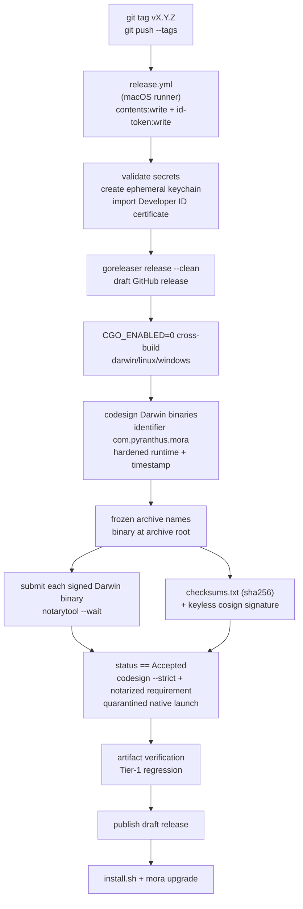
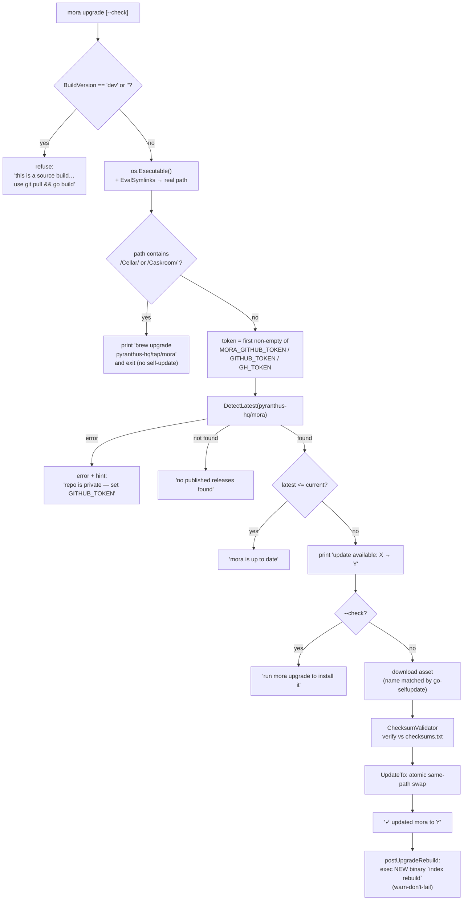
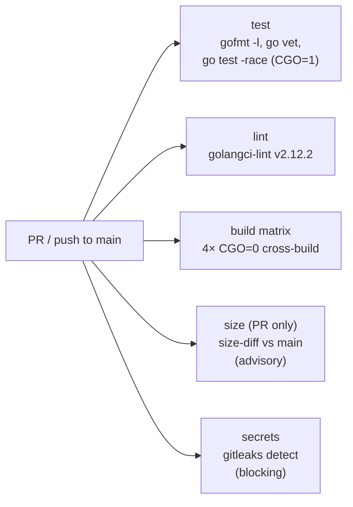

# Distribution, Build & Ops

This document explains how Mora is built, signed, released, updated, and
installed. The full pipeline keeps the pure-Go and zero-egress rules.

## Files

| File | Lines | Responsibility |
|---|---|---|
| `.goreleaser.yaml` | — | Release pipeline config (v2 schema): CGO-free cross-compile matrix (darwin/linux/windows), macOS signing hook, `tar.gz` archives + a windows/amd64 `zip`, sha256 checksums, cosign keyless signing, syft SBOM, Homebrew cask metadata, **draft** GitHub Release. |
| `.github/workflows/ci.yml` | 151 | PR/push gate: gofmt, `go vet`, `go test -race`, a **windows-latest full `go test ./...` portability job (`build-windows`)**, golangci-lint, cross-arch build matrix, binary-size diff (advisory), gitleaks secret scan. |
| `.github/workflows/release.yml` | — | Tag-triggered (`v*`), macOS-hosted release: imports the Developer ID certificate into an ephemeral keychain, validates Apple/OAuth secrets, runs GoReleaser to build a **draft** release, notarizes and verifies both Darwin artifacts, verifies the remaining artifact contracts, runs Tier 1, then **explicitly publishes** via `gh release edit --draft=false`. |
| `.github/workflows/claude.yml` | 63 | On-demand Claude reviewer (`@claude` mention or `claude-review` label). Read-only on contents, advisory only. |
| `internal/mora/upgrade.go` | ~150 | `mora upgrade [--check]` self-update via `go-selfupdate`: checksum-validated, Homebrew-aware, refuses dev builds (both literal `dev` and git-describe local builds at/ahead of the latest release — never offers a downgrade). After a successful swap it execs the NEW binary's `index rebuild` (`postUpgradeRebuild`, warn-don't-fail) so a schema change never strands a stale index. |
| `cmd/mora/main.go` | 28 | Entry point. Receives `-ldflags -X main.{version,commit,date}` and forwards into `mora.Build*`. |
| `install.sh` | — | POSIX installer: local-tarball or public remote-download mode; on macOS it verifies the fixed Developer ID team/identifier and Apple's notarized code requirement without changing quarantine or the signature. Idempotent `mora init`. |
| `install.ps1` | new | Windows installer: downloads `mora_<version>_windows_amd64.zip`, verifies sha256 against `checksums.txt`, installs `%LOCALAPPDATA%\Mora\bin\mora.exe`, and updates the User PATH. |
| `uninstall.ps1` | new | Windows uninstaller: removes `%LOCALAPPDATA%\Mora`, removes the User PATH entry, deletes `\Mora\` scheduled tasks, and preserves the vault/config unless explicitly purged. |
| `scripts/build-release.sh` | 49 | Local GoReleaser-mirror cross-build of all four targets + `checksums.txt`. |
| `scripts/package.sh` | 55 | Single-target packaging with build-time real-OAuth-client embedding (swap-and-restore guard). |
| `scripts/codesign-darwin.sh` | — | GoReleaser post-build hook: ignores non-Darwin targets; signs Darwin binaries with the pinned identity, hardened runtime, and timestamp; then verifies signature metadata and the designated requirement. |
| `scripts/notarize-darwin-release.sh` | — | Pre-publish Apple gate: inventories both Darwin archives, verifies checksums/signatures, submits each root-level binary, requires `Accepted` and Apple's `notarized` code requirement, then launches a quarantined disposable copy for the runner's native architecture. |
| `scripts/regress/release-signing-contract.sh` | — | Secret-free adversarial contract test for both architectures, wrong/missing identity metadata, notary failures, workflow ordering, and forbidden quarantine/ad-hoc-signing bypasses. |
| `scripts/bootstrap-release-project.sh` | 140 | One-shot GitHub Projects v2 board scaffold (roadmap/PR pipeline). Not part of the build. |
| `.golangci.yml` | 32 | golangci-lint v2 tuning (the blocking lint gate). |
| `go.mod` | 84 | Module graph. Pins `modernc.org/sqlite` (pure-Go) and `go-selfupdate`; `go 1.25.8`. |
| `LICENSE` | 202 | **Apache-2.0** (copyright AdiSam Consulting LLC). |

> **Scope note.** This document describes the main build under `./internal/`,
> `./cmd/`, and the repo-root config. The `dist/` directory is build output.
> `.claude/worktrees/mora-demo/` is a stale copy. Ignore both.

---

## The single thesis: pure-Go, CGO-off, one static binary

The build pipeline enforces one rule: **Mora is one static binary with no CGO
or Python. `modernc.org/sqlite` is its only SQL engine.** This rule makes
one-file installs possible. They need no toolchain or dynamic libraries. The
pipeline tests the rule on each build.

- `go.mod:12` requires `modernc.org/sqlite v1.29.0` (the pure-Go SQLite). There is no `mattn/go-sqlite3` or any cgo driver in the graph — `go.mod:78-83` shows the supporting `modernc.org/{libc,memory,mathutil,...}` tree, all pure Go.
- Every **build/release** step sets `CGO_ENABLED=0`: GoReleaser (`.goreleaser.yaml:19-20`), the CI build matrix (`ci.yml:79`), the size job (`ci.yml:99`), and `build-release.sh:31`.
- **The one exception is the test job**, and it is deliberate and narrow: `ci.yml:36-38` sets `CGO_ENABLED=1` *only* for `go test -race` (the race detector needs cgo). The comment at `ci.yml:34-35` is explicit that this is the lone place cgo is on, "every build/release step stays `CGO_ENABLED=0` (the product's thesis)."

### Cross-compile targets

The baseline release ships **darwin + linux × amd64 + arm64** (four binaries). Windows support adds a **windows/amd64** zip archive with `mora.exe`. Windows/arm64 remains deferred. Go compilation is still a pure cross-build, but the **release** uses a macOS runner for native `codesign`, `notarytool`, and quarantined-launch verification. This does not change the product: every target builds with `CGO_ENABLED=0`; the Apple tools operate on the completed Darwin executables.

The CI **build matrix** (`ci.yml:85-108`) compiles all five targets (darwin/linux × amd64/arm64 plus windows/amd64) with `CGO_ENABLED=0` on every PR. The comment (`ci.yml:58-59`) frames this precisely: it "proves CGO_ENABLED=0 builds on every target before a tag is ever cut. This is the single-binary guarantee, gated."

### Windows support seam

Windows support keeps the same pure-Go single-binary model. Platform behavior is selected at runtime with `runtime.GOOS`. The codebase does not split behavior into OS-specific build-tag files. The Windows release archive contract is `mora_<version>_windows_amd64.zip` containing `mora.exe` at archive root, plus the same release `checksums.txt` sha256 manifest consumed by self-update and installers.

The Windows hand-install path is `install.ps1`: it installs to `%LOCALAPPDATA%\Mora\bin\mora.exe` and writes only the User PATH. The v1 binary is unsigned, so the installer and docs must tell users about the SmartScreen **Windows protected your PC** prompt and `Unblock-File`. MSI/MSIX, winget/Scoop, Authenticode signing, Windows toast notifications, and windows/arm64 archives are deferred.

Windows scheduling is a CLI/runtime seam, not a daemon. `mora schedule install <job>` uses `schtasks` and names tasks `Mora\<job>`; `uninstall.ps1` deletes all tasks under `\Mora\`.

### Reproducibility & version stamping

Builds are reproducible: `-trimpath` strips local paths (`.goreleaser.yaml:22`, `ci.yml:82`) and `mod_timestamp: "{{ .CommitTimestamp }}"` (`.goreleaser.yaml:30`) pins file mtimes to the commit. Version metadata is injected via ldflags `-s -w -X main.version=... -X main.commit=... -X main.date=...` (`.goreleaser.yaml:23-27`, `build-release.sh:17`). `cmd/mora/main.go:12-21` declares the `version/commit/date` vars (defaulting to `dev`/`none`/`unknown`) and copies them into `mora.BuildVersion/BuildCommit/BuildDate`, which `cmdVersion` prints (`mora.go:247-253`) and the MCP `serverInfo.version` reports (`mora.go:2871`). **A source build therefore self-identifies as version `dev`** — and that fact gates self-update (below).

---

## Release pipeline (tag → signed artifacts → Apple notary → publish)

A maintainer cuts a release by pushing a `v*` tag. `release.yml:3-5` triggers on `tags: ["v*"]` and runs one `goreleaser` job.

### Stage details

1. **Credentials and keychain.** The workflow fails before building if an Apple or OAuth secret is absent. It creates a throwaway build keychain, imports the Developer ID `.p12`, allows non-interactive `codesign`, and removes the keychain on the always-run cleanup path. The App Store Connect `.p8` exists only in the ephemeral runner workspace. No credential enters an artifact or the repository.
2. **Build and sign.** One build id `mora` compiles the five-target matrix from `./cmd/mora` with `CGO_ENABLED=0`. Only the two Darwin outputs then receive a hardened-runtime, secure-timestamp Developer ID signature. Their fixed signing contract is identifier `com.pyranthus.mora`, Team Identifier `VS8M5VJBZ5`, and an Apple-trusted Developer ID Application chain.
3. **Archives.** Darwin/Linux use `tar.gz`; Windows/amd64 uses `zip`. The executable stays at archive root so `go-selfupdate` can find it. The frozen name is `mora_{{.Version}}_{{.Os}}_{{.Arch}}`. Archives also carry `LICENSE`, `README.md`, `docs/guide.md`, `install.sh`, and `examples/*`.
4. **Checksums, cosign, and SBOM.** One SHA-256 `checksums.txt` remains the self-update trust anchor. Keyless cosign signs that manifest and Syft emits the archive SBOMs. Apple code signing is an additional platform trust layer, not a replacement for the cross-platform checksum contract.
5. **Notarize and verify before publish.** Each archive's already-signed Darwin executable is submitted to Apple with `notarytool --wait`. The gate requires `Accepted`, reruns `codesign --verify --strict`, confirms the identifier/team/designated requirement, and requires Apple's special `notarized` code requirement for both architectures. Before that requirement, a best-effort `spctl --type execute` probe makes Gatekeeper fetch the online ticket. Its expected raw-CLI "not app-like" result is ignored; it is ticket hydration, not the verdict. The gate also adds quarantine to a disposable copy of the runner-native binary and launches `mora version`. `spctl --type install` is never used because that policy is for installer packages. The release archive is never modified after checksums are generated.
6. **Draft, then publish.** GoReleaser creates a draft release. OAuth embedding, Windows archive, checksums, macOS signing/notarization, and Tier-1 regression gates all run while it is invisible to `mora upgrade`. Only their success publishes the draft. A signing or notary failure therefore cannot become the latest installable release.

> **One known label inconsistency, not yet reconciled:** the cask's `license:` is hardcoded `"Apache-2.0"` with a `TODO: confirm SPDX id` (`.goreleaser.yaml:80`). The repo `LICENSE` *is* Apache-2.0 (`LICENSE:1-2,189`), so the value is correct today — but note that earlier project memory and the bootstrap board (`bootstrap-release-project.sh:120-122`) still framed the license as an *open decision* (Apache vs MIT, or FSL). **As built, the license is Apache-2.0.**

---

## `mora upgrade` — self-update flow

`mora upgrade` is the "auto-update like Claude Code" path: in-place self-replacement from the latest GitHub release. Dispatched at `mora.go:235-236`. Implemented in `upgrade.go:24`.

Key behaviors, each grounded:

- **Source builds are refused** (`upgrade.go:32-35`). If `BuildVersion` is `"dev"` or empty, upgrade errors out and tells the user to `git pull && go build`. This is why the ldflags version-stamp (above) is a hard dependency of self-update.
- **Homebrew installs defer to brew** (`upgrade.go:45-49`). After resolving symlinks (`upgrade.go:41-43`), `isHomebrewManaged` (`upgrade.go:107-110`) checks whether the *resolved* path contains `/Cellar/` or `/Caskroom/`. The symlink-resolve-first step matters: a binary that merely *sits in* `/opt/homebrew/bin` via `install.sh` is a real file there, not a Homebrew symlink, so it is **not** flagged (`upgrade.go:102-106`) and self-update proceeds normally.
- **Token discovery** (`upgrade.go:52`). The repo is public, so no token is required. When one of `MORA_GITHUB_TOKEN`, `GITHUB_TOKEN`, `GH_TOKEN` is set it is used (rate limits, forks of the private lineage). On detection failure with no token the error still hints `export GITHUB_TOKEN=$(gh auth token)`.
- **Post-upgrade reindex** (`postUpgradeRebuild`). After `UpdateTo` succeeds, upgrade execs the swapped-in binary as `<exe> index rebuild` — the running process is still the old code; `indexSchemaVersion` knowledge lives in the new executable. Failure warns and prints the manual command. It never fails the upgrade (the swap already happened). Belt-and-braces with `indexAutoHeal`: static-floor vaults would self-heal at first read anyway. This hook is what spares semantic-embedder vaults the actionable error.
- **Checksum validation before swap** (`upgrade.go:60-63`). The updater is built with `&selfupdate.ChecksumValidator{UniqueFilename: "checksums.txt"}` — the downloaded archive is verified against the release's published `checksums.txt` (the same file GoReleaser/`build-release.sh` emit) before the binary is swapped. The comment is explicit: "don't trust TLS + the GitHub API alone."
- **Atomic, failure-safe swap** (`upgrade.go:94-96`). `UpdateTo` replaces the running binary in place. On error the message guarantees "binary left unchanged."
- **Stable macOS signing identity.** Every official Darwin replacement keeps identifier `com.pyranthus.mora`, Team Identifier `VS8M5VJBZ5`, and the Developer ID designated requirement. `mora upgrade` must copy the release bytes unchanged: any local `codesign --sign -` would replace that identity and can invalidate Full Disk Access. The release gate, not the updater, performs Apple trust assessment before publication.
- **`--check` is read-only** (`upgrade.go:88-91`): reports availability and stops.

The asset go-selfupdate fetches must match the `name_template` GoReleaser produces — that coupling is the single most fragile seam in this subsystem (see Invariants).

---

## `install.sh` — the hand-install path

`install.sh` is the non-Homebrew installer. It runs two ways:

1. **Local**: if an executable `mora` sits next to the script, use it — the bundled-tarball case (`tar -xzf … && ./install.sh`).
2. **Remote**: otherwise detect OS/arch (normalizing `aarch64→arm64`, `x86_64→amd64`), construct `mora_${VERSION}_${OS}_${ARCH}.tar.gz` — the same frozen name the release produces — and download it. It prefers `gh` when authenticated and falls back to public `curl`.

Then it:
- **Verifies the downloaded archive before extraction.** The archive's SHA-256 must match `checksums.txt`.
- **Fails closed on macOS identity.** Before copying, `codesign --verify --strict` must pass; the signature metadata must be exactly `Identifier=com.pyranthus.mora` and `TeamIdentifier=VS8M5VJBZ5` with a Developer ID Application authority; and `codesign -R='notarized'` must accept Apple's ticket for that exact code directory. The same checks run after the copy. A best-effort `spctl --type execute` probe first fetches that ticket; its raw-CLI "not app-like" result is not treated as success or failure. `spctl --type install` is for installer packages and is not used. A raw executable cannot carry a stapled ticket, so the first ticket check can require network access.
- **Never mutates Gatekeeper state or the signature.** There is no `xattr -d` and no ad-hoc re-sign. Quarantine remains for Gatekeeper to evaluate, and the Developer ID identity remains the one TCC sees. This macOS verification is a no-op on Linux; Linux install behavior is otherwise unchanged.
- **Replaces the active install.** It honors an explicit `PREFIX`. Otherwise, if `command -v mora` resolves to a regular non-Homebrew file in a writable directory, it replaces that exact pathname. It refuses an active symlink or a path under `Cellar`/`Caskroom` so it cannot silently write through a package-manager or future app-bundle boundary. Only a first install uses the first writable of `/usr/local/bin`, `/opt/homebrew/bin`, and `~/.local/bin`, falling back to `~/.local/bin`.
- **Runs `mora init` idempotently** against `MORA_VAULT` (default `~/vault/mora`), reports the active vault, then prints the agent-wiring commands and next steps.

### Standalone bridge, then `Mora.app`

The signed raw executable is deliberately a **compatibility bridge**. Its archive
name and root-level `mora` entry stay unchanged, so every existing installer and
`go-selfupdate` client can consume the first signed release. Apple stores the
notarization ticket server-side for a raw executable; unlike an app, it has no
bundle onto which `stapler` can attach that ticket.

The later branded `Mora.app` is a distinct distribution target with bundle ID
`com.pyranthus.mora`. Its release asset must use a name that the old standalone
updater will not select. Installation puts the whole app in a stable location
and exposes its CLI through a symlink. An app update stages, verifies, and
atomically replaces the **whole bundle**. Replacing only
`Contents/MacOS/mora` invalidates the bundle seal, so the raw self-updater cannot
be reused inside the app unchanged.

The permission transition is explicit:

- An FDA grant made to an old ad-hoc executable cannot be assumed to transfer to
  the first Developer ID-signed bridge. The user can need to grant the signed
  executable once.
- Moving from the raw executable to `Mora.app` changes the TCC target. Plan for
  one final grant to the app and retain the old entry until app-launched
  `mora doctor` plus an iMessage sync succeed.
- Only a real version N to N+1 whole-app replacement that reads iMessage without
  a re-grant can close the continuity claim. The intended steady state is that
  routine app upgrades preserve the grant; the release pipeline alone is not
  evidence that macOS did so.

### `scripts/package.sh` — the OAuth-embed footgun

`package.sh` packages a single target and, critically, **embeds the real Google OAuth client at build time** when `MORA_GOOGLE_CREDENTIALS` is set. `internal/google/client.json` is a committed **non-secret** `DEV_PLACEHOLDER` (the embed target at `oauth.go:28`, detected at `oauth.go:77`). The script copies the real client over the placeholder, builds, then **always restores the placeholder via a `trap … EXIT INT TERM`** (`package.sh:25-32`) so real creds are never left in the tree or committed. The trap uses an **absolute** `$EMBED` path on purpose — the script `cd`s into `$DIST` before the trap fires, and a relative path would restore from the wrong directory (`package.sh:21-24`). When given real creds it then **asserts the built binary actually embeds the real client id** (`package.sh:40-46`), because the `DEV_PLACEHOLDER` string is itself a detection constant compiled into every binary and so can't be used as a negative test. `build-release.sh` does **not** do this embed step — it always ships the placeholder.

---

## CI gates (`.github/workflows/ci.yml`)

CI runs on every PR and every push to `main` (`ci.yml:3-6`), with `contents: read` only (`ci.yml:8-9`) and per-ref concurrency cancellation (`ci.yml:11-13`). Six jobs (the mermaid and table below predate the `build-windows` job — it runs the full suite on windows-latest):

| Job | Blocking? | What it enforces |
|---|---|---|
| `test` (`ci.yml:22-72`) | **yes** | `gofmt -l .` must be empty; `go vet ./...`; `go test -race -vet=off -count=1 -covermode=atomic ./...` with `CGO_ENABLED=1` (the only cgo-on step). Vet stays explicit and is disabled only inside the subsequent test command to avoid duplicate analysis. |
| `lint` (`ci.yml:40-56`) | **yes** | `golangci-lint` pinned to **`v2.12.2`** via `golangci-lint-action@v8`. The version pin is deliberate (`ci.yml:50-52`): the action `@v6` only installs golangci-lint v1, which cannot read the v2 `.golangci.yml` and builds against go1.24 < the go1.25 target; `@v8` installs v2. |
| `build` (`ci.yml:85-108`) | **yes** | Cross-builds all five targets (incl. windows/amd64) with `CGO_ENABLED=0`; `fail-fast: false` so all targets report. |
| `size` (`ci.yml:86-105`) | **no (advisory)** | PR-only binary-size diff vs `main` (`size-diff-action@v1`, `continue-on-error: true`). The comment is explicit: "a size hiccup must never block merge" — but size matters because "a single small static binary IS the product." |
| `secrets` (`ci.yml:107-122`) | **yes** | gitleaks scans full history (`fetch-depth: 0`) with `--exit-code 1`. Uses the **OSS gitleaks CLI directly, not gitleaks-action@v2** (`ci.yml:114-116`), because the action requires a mandatory `GITLEAKS_LICENSE` for org-owned repos and Mora now lives under `pyranthus-hq`. |

The Claude reviewer (`claude.yml`) is **advisory and opt-in by design**: it does not run on every push (to avoid double-commenting alongside the always-on Codex GitHub app), only on an `@claude` mention or the `claude-review` label, and only from maintainer `Aowner` (`claude.yml:33-36`). Its permissions are `contents: read` — it can comment but cannot push (`claude.yml:21-24`). The review prompt encodes Mora's hard rules and tells Claude to **defer to Codex on test design** (`claude.yml:54-63`).

`.golangci.yml` is v2 format (`.golangci.yml:3`), uses the `standard` linter set plus the `std-error-handling` exclusion preset, and adds narrow rule exclusions (capitalized error strings for proper nouns. The fire-and-forget OAuth loopback server's `Serve/Shutdown`. Deprecated `ParseDir` in tests) — `.golangci.yml:13-32`.

---

## License — Apache-2.0

The repository ships under **Apache-2.0** (`LICENSE:1-2`), copyright **AdiSam Consulting LLC** (`LICENSE:189`). The GoReleaser cask metadata declares the same SPDX id (`.goreleaser.yaml:80`). Note the license choice was historically tracked as an open board decision (Apache vs MIT, with FSL floated in project memory), but the file on disk is unambiguously Apache-2.0 today.

---

## Security posture as a product invariant

Mora's distribution and ops posture is **zero-telemetry, zero-egress, read-only**, and this is enforced in code:

- **Read-only Google scopes, least-privilege.** `internal/google/oauth.go:31-32` hardcodes `Scopes = {gmail.GmailReadonlyScope, calendar.CalendarReadonlyScope}` — there is no write scope anywhere, and Drive is deferred. (`oauth_test.go` exercises `ResolveOAuthConfig`'s scope round-trip — `oauth_test.go:29-30` checks the *passed* scopes survive resolution — but does not itself assert the read-only `Scopes` global. The global at `oauth.go:32` is the ground truth.)
- **No telemetry / opt-out usage logging.** Usage logging is local-only JSONL in the state dir (never the vault). `usageEnabled` (`usage.go`) honors `DO_NOT_TRACK=1` **and** a `<StateDir>/usage/OFF` sentinel (written by `mora usage off` — `cmdUsage`, `usage.go`). MCP events measure the serialized final `CallToolResult`; `read_memory` adds only allowlisted structural fields and never ids, bodies, matches, evidence, metadata, or paths. The query field remains an explicit raw-search-query tier only and is never sent (`usageEvent`, `mora.go`; exact schema in [MCP server](./06-mcp-server.md#usage-logging)).
- **Zero-egress embeddings guard.** The opt-in Ollama embedder POSTs memory text to its host, so `chooseEmbedder` **refuses any non-loopback `MORA_OLLAMA_URL`** and falls back to the static embedder rather than send memory off-machine (`embed_ollama.go:100-106`). A test enforces this — `TestChooseEmbedderRefusesNonLoopback` (`embed_ollama_test.go:91`). The default static embedder is "pure-Go, zero-egress, single-binary" (`embed.go:10`).
- **Supply-chain integrity at rest and on update.** Releases are sha256-checksummed and the checksum manifest is cosign-signed (Sigstore keyless); `mora upgrade` re-verifies the downloaded archive against `checksums.txt` before swapping (`upgrade.go:60-63`). Darwin binaries additionally carry the fixed Developer ID identity and an Apple notary acceptance ticket, both gated before publication. gitleaks blocks any committed secret (`ci.yml:107-122`).

In short: the only network egress the binary performs is to Google's read-only APIs (during `connect`/`sync`), to GitHub releases (during `upgrade`), and — only if the user opts in — to a **loopback-only** Ollama. Nothing else leaves the machine.

---

## Invariants & gotchas

1. **`CGO_ENABLED=0` on every build/release path. Cgo is allowed ONLY in `go test -race`.** WHY: the single static binary is the product. If any build step turns cgo on, the artifact gains dynamic-lib dependencies and the "drop one file" story breaks. The race-test exception (`ci.yml:34-38`) is the lone, documented carve-out.

2. **`modernc.org/sqlite` is the only SQL engine — never add a cgo SQLite driver.** WHY: a cgo driver (e.g. `mattn/go-sqlite3`) would silently re-introduce cgo and defeat invariant #1. Verify after any dep change that `go.mod` still has no cgo SQL driver.

3. **The archive `name_template` is a contract shared by installers and self-update.** POSIX assets use `mora_{Version}_{Os}_{Arch}.tar.gz`; Windows uses `mora_{Version}_windows_amd64.zip`. GoReleaser produces the archives, `install.sh` / `install.ps1` reconstruct the names, and `go-selfupdate` matches them. WHY: change the template in one place and self-update or install scripts silently stop finding assets. Treat the templates as frozen.

4. **The binary must live at the archive root (no nested directory).** Both `build-release.sh:38` and GoReleaser's default do this. WHY: go-selfupdate and the Homebrew cask resolve `mora` at the archive root. A nested path breaks both.

5. **The ldflags version stamp gates self-update.** A build without `-X main.version` reports `dev`, and `mora upgrade` refuses dev builds (`upgrade.go:32-35`). WHY: self-update on an unversioned binary has no baseline to compare against and would loop/misfire. Releases MUST carry the stamp.

6. **Resolve symlinks before the Homebrew check.** `isHomebrewManaged` matches `/Cellar/` or `/Caskroom/` on the **resolved** path (`upgrade.go:41-43,107-110`). WHY: skipping the symlink-resolve would misclassify a real file in `/opt/homebrew/bin` (installed via `install.sh`) as Homebrew-managed and wrongly refuse self-update — or vice versa.

7. **Checksum-validate every self-update before swapping.** `ChecksumValidator` against `checksums.txt` (`upgrade.go:60-63`). WHY: TLS + the GitHub API alone is not a sufficient integrity guarantee. The swap replaces a binary the user will execute. Never drop the validator.

8. **`package.sh` must always restore the placeholder `client.json`.** The `trap … EXIT INT TERM` with an **absolute** path (`package.sh:25-32`) is mandatory. WHY: a real OAuth client left in the working tree is a secret leak and would be committed. The absolute path is required because the script `cd`s into `$DIST` before the trap runs.

9. **`//go:embed client.json` requires the file to exist.** `internal/google/client.json` is a committed non-secret `DEV_PLACEHOLDER` (`oauth.go:28,77`). WHY: deleting it breaks `go build` entirely (embed fails at compile time), and committing a real client there leaks credentials. Swap at release time only (via `package.sh` / `MORA_GOOGLE_CREDENTIALS`), never in git.

10. **Read-only Google scopes are a hard product invariant.** `Scopes` is `{gmail.readonly, calendar.readonly}` (`oauth.go:32`), pinned by test. WHY: Mora's trust model is "it can read, it can never write or delete your data." Adding a write scope is a posture change, not a feature.

11. **Zero-egress: memory bytes never leave the machine except to read-only Google APIs (and opt-in loopback Ollama).** The non-loopback Ollama refusal (`embed_ollama.go:100-106`) and the `DO_NOT_TRACK`/`OFF` usage gate (`mora.go:3251-3259`) enforce it. WHY: local-only operation is a core invariant. Any new outbound call must be gated the same way.

12. **The size job is advisory. The secrets and lint jobs are blocking.** `size` is `continue-on-error: true` (`ci.yml:103`). Gitleaks is `--exit-code 1` (`ci.yml:121`). WHY: a size regression should inform, not block. A leaked secret or lint regression must block.

13. **Every Darwin release keeps one designated requirement.** The identifier is `com.pyranthus.mora`, the Team Identifier is `VS8M5VJBZ5`, and the authority is an Apple-trusted Developer ID Application certificate. Hardened runtime and a secure timestamp are required. WHY: macOS TCC continuity depends on stable signed identity; a valid signature from the wrong team is still the wrong product identity.

14. **Never clear quarantine or re-sign an official macOS release during install or upgrade.** `install.sh` verifies before and after copying. Homebrew and future installers must preserve the same behavior. WHY: quarantine is the Gatekeeper trigger, and ad-hoc re-signing replaces the designated requirement that Full Disk Access was granted to.

15. **The raw bridge and app bundle are different update contracts.** The existing archive keeps `mora` at its root. A future app asset has a non-matching name, and app updates replace the whole signed bundle. WHY: an old `go-selfupdate` client otherwise selects the app archive and extracts the wrong executable, while an inner-binary-only swap invalidates the app seal.

---

## Related

- [CLI & UX](./08-cli-and-ux.md) — `mora version`, `mora doctor`, `mora init`, command dispatch (`Run`/`cmdVersion`).
- [Connectors — Google](./04-connectors-google.md) — OAuth, embedded `client.json`, the read-only scopes referenced here.
- [Eval & testing](./09-eval-and-testing.md) — the `go test -race` gate and the size/budget regression tests.
- [Sync & freshness](./11-sync-and-freshness.md) — honest-snapshot sync, the other place the binary touches the network.
- [Overview](./00-overview.md) — how the binary fits the whole system.

## Open questions / unverified

- **Homebrew tap repo existence.** `.goreleaser.yaml:74` and `bootstrap-release-project.sh:106-108` both note `pyranthus-hq/homebrew-tap` as a repo to *create*; I could not verify from the code whether it exists yet, so `brew install pyranthus-hq/tap/mora` may not yet resolve.
- **Whether any `v*` tag / GitHub Release has actually been published.** The pipeline is fully wired, but the existence of a published release (and thus a working `mora upgrade` / remote `install.sh`) is a repo/GitHub-state fact, not a code fact — not verifiable from these files.
- **License decision finality.** On disk the license is Apache-2.0 (`LICENSE`), and the cask agrees, but project memory and the bootstrap board frame it as an open decision (Apache/MIT/FSL). The code says Apache-2.0. Whether that is the *final* intended license is a governance question outside this subsystem.
