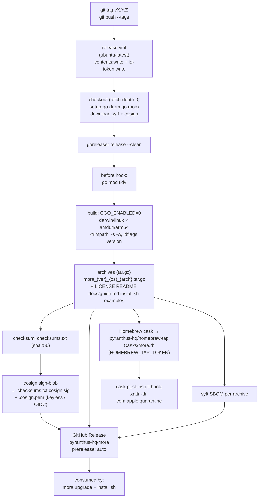
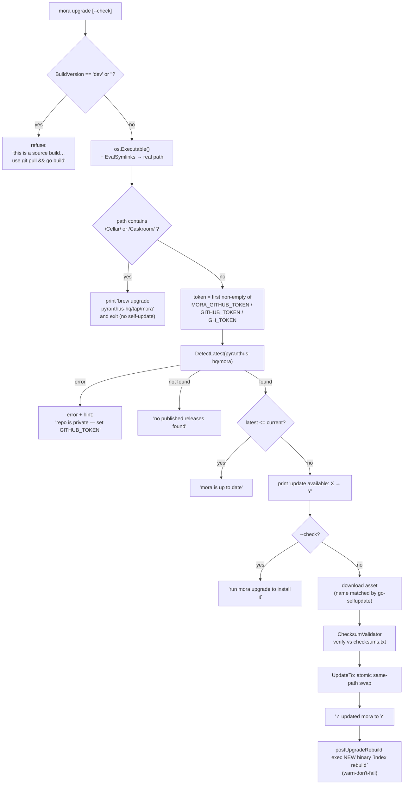
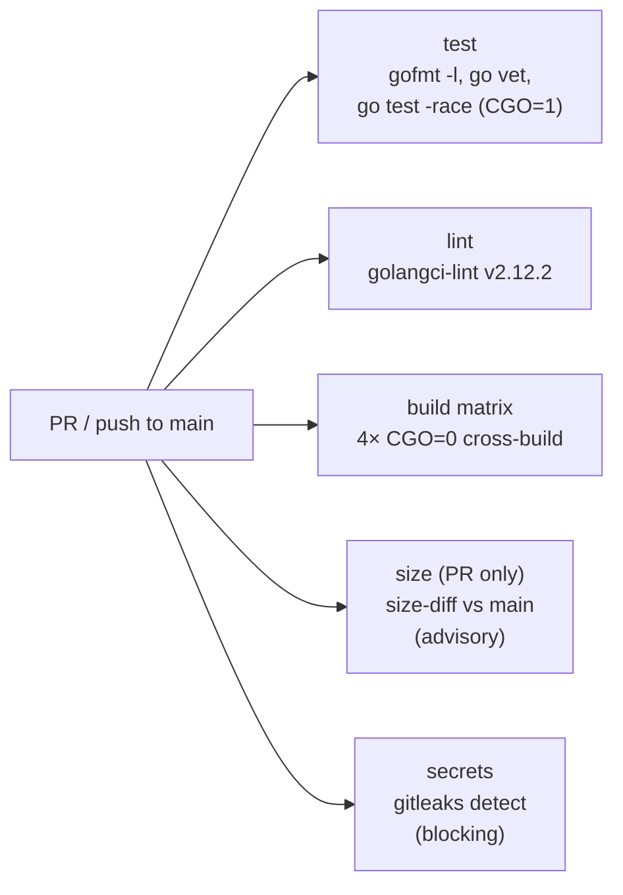

# Distribution, Build & Ops

How Mora is built, signed, released, self-updated, and installed — and the pure-Go / zero-egress invariants that the whole pipeline exists to preserve.

## Files

| File | Lines | Responsibility |
|---|---|---|
| `.goreleaser.yaml` | 112 | Release pipeline config (v2 schema): cross-compile matrix, archives, sha256 checksums, cosign keyless signing, syft SBOM, Homebrew cask publish to `pyranthus-hq/homebrew-tap`, GitHub Release. |
| `.github/workflows/ci.yml` | 122 | PR/push gate: gofmt, `go vet`, `go test -race`, golangci-lint, cross-arch build matrix, binary-size diff (advisory), gitleaks secret scan. |
| `.github/workflows/release.yml` | 34 | Tag-triggered (`v*`) GoReleaser run; provisions syft + cosign; wires `GITHUB_TOKEN` + `HOMEBREW_TAP_TOKEN`. |
| `.github/workflows/claude.yml` | 63 | On-demand Claude reviewer (`@claude` mention or `claude-review` label); read-only on contents, advisory only. |
| `internal/mora/upgrade.go` | ~150 | `mora upgrade [--check]` self-update via `go-selfupdate`: checksum-validated, Homebrew-aware, refuses dev builds; after a successful swap it execs the NEW binary's `index rebuild` (`postUpgradeRebuild`, warn-don't-fail) so a schema change never strands a stale index. |
| `cmd/mora/main.go` | 28 | Entry point; receives `-ldflags -X main.{version,commit,date}` and forwards into `mora.Build*`. |
| `install.sh` | 109 | POSIX installer: local-tarball or authenticated remote-download mode; Gatekeeper quarantine strip + ad-hoc sign; idempotent `mora init`. |
| `scripts/build-release.sh` | 49 | Local GoReleaser-mirror cross-build of all four targets + `checksums.txt`. |
| `scripts/package.sh` | 55 | Single-target packaging with build-time real-OAuth-client embedding (swap-and-restore guard). |
| `scripts/bootstrap-release-project.sh` | 140 | One-shot GitHub Projects v2 board scaffold (roadmap/PR pipeline). Not part of the build. |
| `.golangci.yml` | 32 | golangci-lint v2 tuning (the blocking lint gate). |
| `go.mod` | 84 | Module graph; pins `modernc.org/sqlite` (pure-Go) and `go-selfupdate`; `go 1.25.8`. |
| `LICENSE` | 202 | **Apache-2.0** (copyright AdiSam Consulting LLC). |

> **Scope note.** This doc describes the canonical build under `./internal/`, `./cmd/`, and repo-root config. The `dist/` directory and `.claude/worktrees/mora-demo/` are build output and a stale duplicate respectively — ignore both.

---

## The single thesis: pure-Go, CGO-off, one static binary

Every line of the build pipeline serves one constraint: **Mora is a single static binary with no CGO, no Python, and `modernc.org/sqlite` as the only SQL engine.** This is not a preference — it is the product's distribution story (drop one file on a machine, no toolchain, no dynamic libs, no notarization dance), so the pipeline gates it rather than trusting it.

- `go.mod:12` requires `modernc.org/sqlite v1.29.0` (the pure-Go SQLite). There is no `mattn/go-sqlite3` or any cgo driver in the graph — `go.mod:78-83` shows the supporting `modernc.org/{libc,memory,mathutil,...}` tree, all pure Go.
- Every **build/release** step sets `CGO_ENABLED=0`: GoReleaser (`.goreleaser.yaml:19-20`), the CI build matrix (`ci.yml:79`), the size job (`ci.yml:99`), and `build-release.sh:31`.
- **The one exception is the test job**, and it is deliberate and narrow: `ci.yml:36-38` sets `CGO_ENABLED=1` *only* for `go test -race` (the race detector needs cgo). The comment at `ci.yml:34-35` is explicit that this is the lone place cgo is on, "every build/release step stays `CGO_ENABLED=0` (the product's thesis)."

### Cross-compile targets

The release ships **darwin + linux × amd64 + arm64** (four binaries). GoReleaser declares `goos: [darwin, linux]` and `goarch: [amd64, arm64]` (`.goreleaser.yaml:28-29`); `build-release.sh:24` iterates the same `darwin/arm64 darwin/amd64 linux/amd64 linux/arm64`. Because the build is pure Go, **no macOS runner is needed** — `release.yml:13` runs the whole thing on `ubuntu-latest` and the comment notes there is no notarization step to require a Mac.

The CI **build matrix** (`ci.yml:60-82`) compiles all four targets with `CGO_ENABLED=0` on every PR. The comment (`ci.yml:58-59`) frames this precisely: it "proves CGO_ENABLED=0 builds on every target before a tag is ever cut. This is the single-binary guarantee, gated."

### Reproducibility & version stamping

Builds are reproducible: `-trimpath` strips local paths (`.goreleaser.yaml:22`, `ci.yml:82`) and `mod_timestamp: "{{ .CommitTimestamp }}"` (`.goreleaser.yaml:30`) pins file mtimes to the commit. Version metadata is injected via ldflags `-s -w -X main.version=... -X main.commit=... -X main.date=...` (`.goreleaser.yaml:23-27`, `build-release.sh:17`). `cmd/mora/main.go:12-21` declares the `version/commit/date` vars (defaulting to `dev`/`none`/`unknown`) and copies them into `mora.BuildVersion/BuildCommit/BuildDate`, which `cmdVersion` prints (`mora.go:247-253`) and the MCP `serverInfo.version` reports (`mora.go:2871`). **A source build therefore self-identifies as version `dev`** — and that fact gates self-update (below).

---

## Release pipeline (tag → artifacts → tap + cosign)

A maintainer cuts a release by pushing a `v*` tag. `release.yml:3-5` triggers on `tags: ["v*"]` and runs one `goreleaser` job.

### Stage details

1. **Build** (`.goreleaser.yaml:15-30`). Single build id `mora` from `./cmd/mora`, `CGO_ENABLED=0`, the four-way matrix, reproducible flags.
2. **Archives** (`.goreleaser.yaml:32-44`). `tar.gz` only; the binary sits at the archive root (no nested dir) so both go-selfupdate and the cask resolve it directly. Bundles `LICENSE`, `README.md`, `docs/guide.md`, `install.sh`, `examples/*`. **The `name_template` is load-bearing** (see Invariants): `mora_{{.Version}}_{{.Os}}_{{.Arch}}` (`.goreleaser.yaml:37-38`).
3. **Checksums** (`.goreleaser.yaml:46-48`). One `checksums.txt`, sha256. This file is the trust anchor for self-update.
4. **Cosign signing** (`.goreleaser.yaml:52-63`). Keyless `sign-blob` of `checksums.txt` only (`artifacts: checksum`), producing `checksums.txt.cosign.sig` + `.cosign.pem`. Keyless = Sigstore OIDC, no key management — which is why `release.yml:9` grants `id-token: write` and `release.yml:24` installs `sigstore/cosign-installer@v3`.
5. **SBOM** (`.goreleaser.yaml:67-68`). Syft SBOM per archive (`release.yml:23` downloads syft). The config comment marks it low-priority/droppable for launch.
6. **Homebrew cask** (`.goreleaser.yaml:70-95`). Publishes a **cask** (`homebrew_casks:`, *not* the deprecated `brews:` removed in GoReleaser v2.16 — `.goreleaser.yaml:5`) to `pyranthus-hq/homebrew-tap` under `Casks/`, authed by `HOMEBREW_TAP_TOKEN` (`release.yml:33`). The cask is chosen specifically so its **post-install hook can strip the macOS quarantine xattr** (`.goreleaser.yaml:89-94`) — the binary is unsigned/un-notarized, and without the strip macOS shows "mora is damaged and cannot be opened." This is the deliberate reason notarization is deferrable for a CLI.
7. **GitHub Release** (`.goreleaser.yaml:97-102`). Published (not draft) to `pyranthus-hq/mora`, `prerelease: auto` (pre-release iff the tag is a pre-release). Changelog from GitHub commits, excluding `docs:`/`test:`/`chore:` (`.goreleaser.yaml:104-111`).

> **One known label inconsistency, not yet reconciled:** the cask's `license:` is hardcoded `"Apache-2.0"` with a `TODO: confirm SPDX id` (`.goreleaser.yaml:80`). The repo `LICENSE` *is* Apache-2.0 (`LICENSE:1-2,189`), so the value is correct today — but note that earlier project memory and the bootstrap board (`bootstrap-release-project.sh:120-122`) still framed the license as an *open decision* (Apache vs MIT, or FSL). **As built, the license is Apache-2.0.**

---

## `mora upgrade` — self-update flow

`mora upgrade` is the "auto-update like Claude Code" path: in-place self-replacement from the latest GitHub release. Dispatched at `mora.go:235-236`; implemented in `upgrade.go:24`.

Key behaviors, each grounded:

- **Source builds are refused** (`upgrade.go:32-35`). If `BuildVersion` is `"dev"` or empty, upgrade errors out and tells the user to `git pull && go build`. This is why the ldflags version-stamp (above) is a hard dependency of self-update.
- **Homebrew installs defer to brew** (`upgrade.go:45-49`). After resolving symlinks (`upgrade.go:41-43`), `isHomebrewManaged` (`upgrade.go:107-110`) checks whether the *resolved* path contains `/Cellar/` or `/Caskroom/`. The symlink-resolve-first step matters: a binary that merely *sits in* `/opt/homebrew/bin` via `install.sh` is a real file there, not a Homebrew symlink, so it is **not** flagged (`upgrade.go:102-106`) and self-update proceeds normally.
- **Token discovery** (`upgrade.go:52`). The repo is public, so no token is required; when one of `MORA_GITHUB_TOKEN`, `GITHUB_TOKEN`, `GH_TOKEN` is set it is used (rate limits, forks of the private lineage). On detection failure with no token the error still hints `export GITHUB_TOKEN=$(gh auth token)`.
- **Post-upgrade reindex** (`postUpgradeRebuild`). After `UpdateTo` succeeds, upgrade execs the swapped-in binary as `<exe> index rebuild` — the running process is still the old code; `indexSchemaVersion` knowledge lives in the new executable. Failure warns and prints the manual command; it never fails the upgrade (the swap already happened). Belt-and-braces with `indexAutoHeal`: static-floor vaults would self-heal at first read anyway; this hook is what spares semantic-embedder vaults the actionable error.
- **Checksum validation before swap** (`upgrade.go:60-63`). The updater is built with `&selfupdate.ChecksumValidator{UniqueFilename: "checksums.txt"}` — the downloaded archive is verified against the release's published `checksums.txt` (the same file GoReleaser/`build-release.sh` emit) before the binary is swapped. The comment is explicit: "don't trust TLS + the GitHub API alone."
- **Atomic, failure-safe swap** (`upgrade.go:94-96`). `UpdateTo` replaces the running binary in place; on error the message guarantees "binary left unchanged."
- **`--check` is read-only** (`upgrade.go:88-91`): reports availability and stops.

The asset go-selfupdate fetches must match the `name_template` GoReleaser produces — that coupling is the single most fragile seam in this subsystem (see Invariants).

---

## `install.sh` — the hand-install path

`install.sh` is the non-Homebrew installer (used for the Neil pilot demo and direct-download). It runs two ways (`install.sh:2-20`):

1. **Local**: if an executable `mora` sits next to the script (`install.sh:33-34`), use it — the bundled-tarball case (`tar -xzf … && ./install.sh`).
2. **Remote**: otherwise detect OS/arch (`install.sh:36-39`, normalizing `aarch64→arm64`, `x86_64→amd64`), construct the asset name `mora_${VERSION}_${OS}_${ARCH}.tar.gz` (`install.sh:40`) — **the same name_template the release produces** — and download it. Because the repo is private, it prefers authenticated `gh release download` (`install.sh:44-46`) and falls back to `curl` with a clear "repo is private — run `gh auth login`" failure message (`install.sh:48-50`).

Then it:
- **Picks an install dir on PATH** (`install.sh:57-67`): honors `PREFIX`, else first writable of `/usr/local/bin`, `/opt/homebrew/bin`, `~/.local/bin`, else `~/.local/bin`.
- **Strips quarantine + ad-hoc-signs on macOS** (`install.sh:69-78`): `xattr -dr com.apple.quarantine` then `codesign --force --sign -`, done *before* first run so a binary that arrived via download/AirDrop/zip never hits the Gatekeeper "cannot be opened because Apple cannot check it" wall. No-op on Linux.
- **Runs `mora init` idempotently** (`install.sh:81`) against `MORA_VAULT` (default `~/vault/mora`), prints the resolved version, and prints the agent-wiring one-liners (`claude mcp add … / codex mcp add …`) plus next steps (`install.sh:96-109`).

> Both the cask post-install hook and `install.sh` exist for the **same reason**: the binary is unsigned/un-notarized, so something must clear Gatekeeper. That is the trade-off of skipping Apple notarization.

> **Ad-hoc signing breaks TCC grants across upgrades.** macOS keys Full Disk Access (needed for the iMessage `chat.db` read under launchd — a terminal's FDA does NOT transfer to the launchd-spawned process) to the binary's code-signing identity. An ad-hoc signature (`--sign -`) has no stable identity — its designated requirement is the cdhash, which changes every rebuild — so any binary swap (rebuild, `mora upgrade`) silently invalidates the user's FDA grant: the System Settings toggle still shows enabled, but the iMessage leg of scheduled syncs starts failing (`mora doctor` / `sync status` surface it). Adit's dev machine fixes this with a local self-signed **`mora-dev`** signing cert (trusted for codeSign in the login keychain; sign with `codesign --force --sign mora-dev`) so the identity survives rebuilds — note the grant must be re-toggled ONCE when the identity changes. For *distributed* binaries the equivalent stable identity requires a real Apple Developer ID cert + notarization (self-signed certs don't transfer to other machines); until then, document "re-toggle FDA after upgrade" for users who schedule iMessage sync.

### `scripts/package.sh` — the OAuth-embed footgun

`package.sh` packages a single target and, critically, **embeds the real Google OAuth client at build time** when `MORA_GOOGLE_CREDENTIALS` is set. `internal/google/client.json` is a committed **non-secret** `DEV_PLACEHOLDER` (the embed target at `oauth.go:28`, detected at `oauth.go:77`). The script copies the real client over the placeholder, builds, then **always restores the placeholder via a `trap … EXIT INT TERM`** (`package.sh:25-32`) so real creds are never left in the tree or committed. The trap uses an **absolute** `$EMBED` path on purpose — the script `cd`s into `$DIST` before the trap fires, and a relative path would restore from the wrong directory (`package.sh:21-24`). When given real creds it then **asserts the built binary actually embeds the real client id** (`package.sh:40-46`), because the `DEV_PLACEHOLDER` string is itself a detection constant compiled into every binary and so can't be used as a negative test. `build-release.sh` does **not** do this embed step — it always ships the placeholder.

---

## CI gates (`.github/workflows/ci.yml`)

CI runs on every PR and every push to `main` (`ci.yml:3-6`), with `contents: read` only (`ci.yml:8-9`) and per-ref concurrency cancellation (`ci.yml:11-13`). Five jobs:

| Job | Blocking? | What it enforces |
|---|---|---|
| `test` (`ci.yml:16-38`) | **yes** | `gofmt -l .` must be empty; `go vet ./...`; `go test -race -count=1 -covermode=atomic ./...` with `CGO_ENABLED=1` (the only cgo-on step). |
| `lint` (`ci.yml:40-56`) | **yes** | `golangci-lint` pinned to **`v2.12.2`** via `golangci-lint-action@v8`. The version pin is deliberate (`ci.yml:50-52`): the action `@v6` only installs golangci-lint v1, which cannot read the v2 `.golangci.yml` and builds against go1.24 < the go1.25 target; `@v8` installs v2. |
| `build` (`ci.yml:60-82`) | **yes** | Cross-builds all four targets with `CGO_ENABLED=0`; `fail-fast: false` so all targets report. |
| `size` (`ci.yml:86-105`) | **no (advisory)** | PR-only binary-size diff vs `main` (`size-diff-action@v1`, `continue-on-error: true`). The comment is explicit: "a size hiccup must never block merge" — but size matters because "a single small static binary IS the product." |
| `secrets` (`ci.yml:107-122`) | **yes** | gitleaks scans full history (`fetch-depth: 0`) with `--exit-code 1`. Uses the **OSS gitleaks CLI directly, not gitleaks-action@v2** (`ci.yml:114-116`), because the action requires a mandatory `GITLEAKS_LICENSE` for org-owned repos and Mora now lives under `pyranthus-hq`. |

The Claude reviewer (`claude.yml`) is **advisory and opt-in by design**: it does not run on every push (to avoid double-commenting alongside the always-on Codex GitHub app), only on an `@claude` mention or the `claude-review` label, and only from maintainer `Aowner` (`claude.yml:33-36`). Its permissions are `contents: read` — it can comment but cannot push (`claude.yml:21-24`). The review prompt encodes Mora's hard rules and tells Claude to **defer to Codex on test design** (`claude.yml:54-63`).

`.golangci.yml` is v2 format (`.golangci.yml:3`), uses the `standard` linter set plus the `std-error-handling` exclusion preset, and adds narrow rule exclusions (capitalized error strings for proper nouns; the fire-and-forget OAuth loopback server's `Serve/Shutdown`; deprecated `ParseDir` in tests) — `.golangci.yml:13-32`.

---

## License — Apache-2.0

The repository ships under **Apache-2.0** (`LICENSE:1-2`), copyright **AdiSam Consulting LLC** (`LICENSE:189`). The GoReleaser cask metadata declares the same SPDX id (`.goreleaser.yaml:80`). Note the license choice was historically tracked as an open board decision (Apache vs MIT, with FSL floated in project memory), but the file on disk is unambiguously Apache-2.0 today.

---

## Security posture as a product invariant

Mora's distribution and ops posture is **zero-telemetry, zero-egress, read-only**, and this is enforced in code:

- **Read-only Google scopes, least-privilege.** `internal/google/oauth.go:31-32` hardcodes `Scopes = {gmail.GmailReadonlyScope, calendar.CalendarReadonlyScope}` — there is no write scope anywhere, and Drive is deferred. (`oauth_test.go` exercises `ResolveOAuthConfig`'s scope round-trip — `oauth_test.go:29-30` checks the *passed* scopes survive resolution — but does not itself assert the read-only `Scopes` global; the global at `oauth.go:32` is the ground truth.)
- **No telemetry / opt-out usage logging.** Usage logging is local-only JSONL in the state dir (never the vault). `usageEnabled` (`mora.go:3251-3259`) honors `DO_NOT_TRACK=1` (`mora.go:3252`) **and** a `<StateDir>/usage/OFF` sentinel (`mora.go:3255`, written by `mora usage off` at `mora.go:1771`). The query field is documented "raw tier only; never sent" (`mora.go:3245`).
- **Zero-egress embeddings guard.** The opt-in Ollama embedder POSTs memory text to its host, so `chooseEmbedder` **refuses any non-loopback `MORA_OLLAMA_URL`** and falls back to the static embedder rather than send memory off-machine (`embed_ollama.go:100-106`). A test enforces this — `TestChooseEmbedderRefusesNonLoopback` (`embed_ollama_test.go:91`). The default static embedder is "pure-Go, zero-egress, single-binary" (`embed.go:10`).
- **Supply-chain integrity at rest and on update.** Releases are sha256-checksummed and the checksum manifest is cosign-signed (Sigstore keyless); `mora upgrade` re-verifies the downloaded archive against `checksums.txt` before swapping (`upgrade.go:60-63`). gitleaks blocks any committed secret (`ci.yml:107-122`).

In short: the only network egress the binary performs is to Google's read-only APIs (during `connect`/`sync`), to GitHub releases (during `upgrade`), and — only if the user opts in — to a **loopback-only** Ollama. Nothing else leaves the machine.

---

## Invariants & gotchas

1. **`CGO_ENABLED=0` on every build/release path; cgo is allowed ONLY in `go test -race`.** WHY: the single static binary is the product. If any build step turns cgo on, the artifact gains dynamic-lib dependencies and the "drop one file" story breaks. The race-test exception (`ci.yml:34-38`) is the lone, documented carve-out.

2. **`modernc.org/sqlite` is the only SQL engine — never add a cgo SQLite driver.** WHY: a cgo driver (e.g. `mattn/go-sqlite3`) would silently re-introduce cgo and defeat invariant #1. Verify after any dep change that `go.mod` still has no cgo SQL driver.

3. **The archive `name_template` (`mora_{Version}_{Os}_{Arch}.tar.gz`) is a contract shared by three consumers.** GoReleaser produces it (`.goreleaser.yaml:37-38`), `install.sh` reconstructs it (`install.sh:40`), and `go-selfupdate` matches it (`upgrade.go`). WHY: change the template in one place and self-update silently stops finding assets and `install.sh` 404s. This was an explicit Codex review finding (`bootstrap-release-project.sh:131-133`). Treat the template as frozen.

4. **The binary must live at the archive root (no nested directory).** Both `build-release.sh:38` and GoReleaser's default do this. WHY: go-selfupdate and the Homebrew cask resolve `mora` at the archive root; a nested path breaks both.

5. **The ldflags version stamp gates self-update.** A build without `-X main.version` reports `dev`, and `mora upgrade` refuses dev builds (`upgrade.go:32-35`). WHY: self-update on an unversioned binary has no baseline to compare against and would loop/misfire. Releases MUST carry the stamp.

6. **Resolve symlinks before the Homebrew check.** `isHomebrewManaged` matches `/Cellar/` or `/Caskroom/` on the **resolved** path (`upgrade.go:41-43,107-110`). WHY: skipping the symlink-resolve would misclassify a real file in `/opt/homebrew/bin` (installed via `install.sh`) as Homebrew-managed and wrongly refuse self-update — or vice versa.

7. **Checksum-validate every self-update before swapping.** `ChecksumValidator` against `checksums.txt` (`upgrade.go:60-63`). WHY: TLS + the GitHub API alone is not a sufficient integrity guarantee; the swap replaces a binary the user will execute. Never drop the validator.

8. **`package.sh` must always restore the placeholder `client.json`.** The `trap … EXIT INT TERM` with an **absolute** path (`package.sh:25-32`) is mandatory. WHY: a real OAuth client left in the working tree is a secret leak and would be committed; the absolute path is required because the script `cd`s into `$DIST` before the trap runs.

9. **`//go:embed client.json` requires the file to exist.** `internal/google/client.json` is a committed non-secret `DEV_PLACEHOLDER` (`oauth.go:28,77`). WHY: deleting it breaks `go build` entirely (embed fails at compile time), and committing a real client there leaks credentials. Swap at release time only (via `package.sh` / `MORA_GOOGLE_CREDENTIALS`), never in git.

10. **Read-only Google scopes are a hard product invariant.** `Scopes` is `{gmail.readonly, calendar.readonly}` (`oauth.go:32`), pinned by test. WHY: Mora's trust model is "it can read, it can never write or delete your data." Adding a write scope is a posture change, not a feature.

11. **Zero-egress: memory bytes never leave the machine except to read-only Google APIs (and opt-in loopback Ollama).** The non-loopback Ollama refusal (`embed_ollama.go:100-106`) and the `DO_NOT_TRACK`/`OFF` usage gate (`mora.go:3251-3259`) enforce it. WHY: local-only operation is a core invariant; any new outbound call must be gated the same way.

12. **The size job is advisory; the secrets and lint jobs are blocking.** `size` is `continue-on-error: true` (`ci.yml:103`); gitleaks is `--exit-code 1` (`ci.yml:121`). WHY: a size regression should inform, not block; a leaked secret or lint regression must block.

---

## Related

- [CLI & UX](./08-cli-and-ux.md) — `mora version`, `mora doctor`, `mora init`, command dispatch (`Run`/`cmdVersion`).
- [Connectors — Google](./04-connectors-google.md) — OAuth, embedded `client.json`, the read-only scopes referenced here.
- [Eval & testing](./09-eval-and-testing.md) — the `go test -race` gate and the size/budget regression tests.
- [Sync & freshness](./11-sync-and-freshness.md) — honest-snapshot sync, the other place the binary touches the network.
- [Overview](./00-overview.md) — how the binary fits the whole system.

## Open questions / unverified

- **Homebrew tap repo existence.** `.goreleaser.yaml:74` and `bootstrap-release-project.sh:106-108` both note `pyranthus-hq/homebrew-tap` as a repo to *create*; I could not verify from the code whether it exists yet, so `brew install pyranthus-hq/tap/mora` may not yet resolve.
- **Whether any `v*` tag / GitHub Release has actually been published.** The pipeline is fully wired, but the existence of a published release (and thus a working `mora upgrade` / remote `install.sh`) is a repo/GitHub-state fact, not a code fact — not verifiable from these files.
- **License decision finality.** On disk the license is Apache-2.0 (`LICENSE`), and the cask agrees, but project memory and the bootstrap board frame it as an open decision (Apache/MIT/FSL). The code says Apache-2.0; whether that is the *final* intended license is a governance question outside this subsystem.
- **Repo public/private status at any given time.** `install.sh` and `upgrade.go` both assume a *private* repo (token-gated download). If the repo is later made public, the auth paths become optional; the code still works either way but the "repo is private" hints would be stale.
