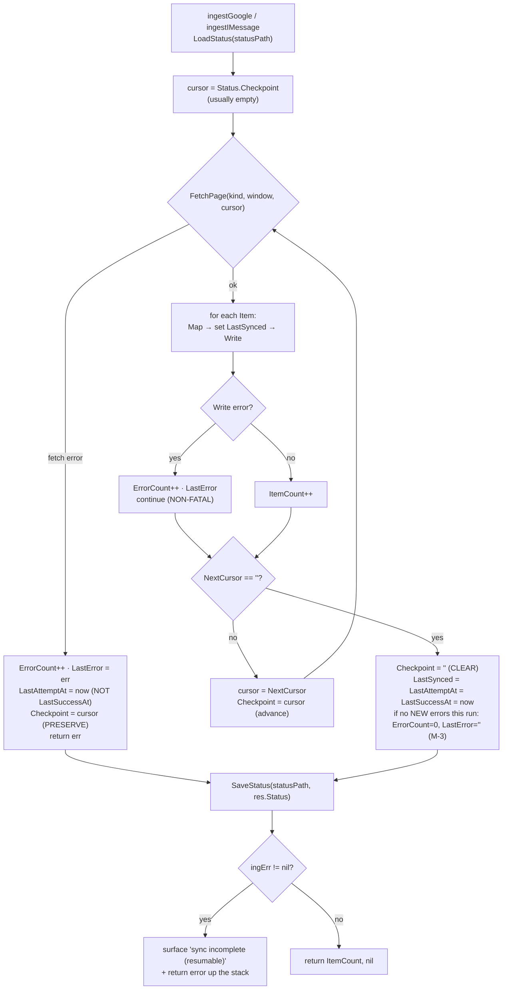
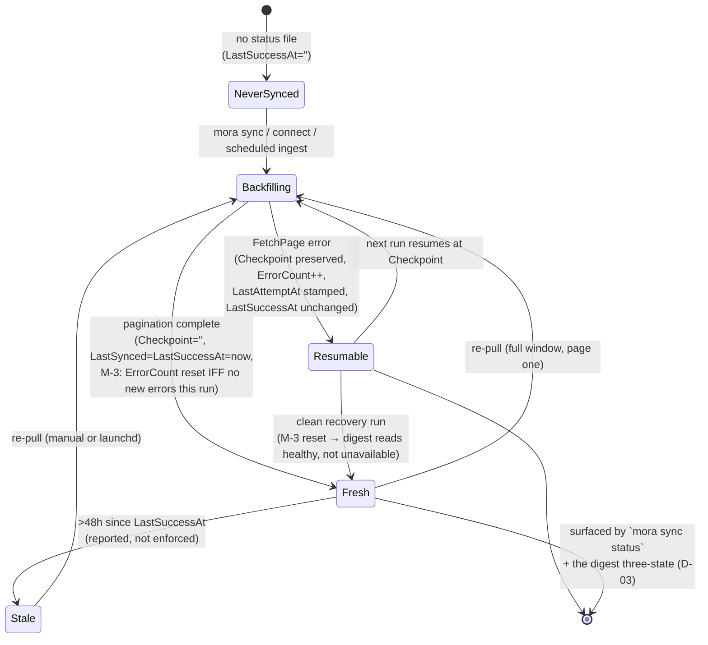

# Sync & Freshness

How Mora tracks and surfaces per-source data freshness under an **honest-snapshot** model — sync is a full re-pull, not a live stream — and why surfacing staleness is treated as a product invariant, not an afterthought.

## Files

| File | Lines | Responsibility |
|---|---|---|
| `internal/memory/status.go` | 62 | Canonical `SyncStatus` struct + `LoadStatus` / `SaveStatus` (atomic, per-source JSON). Cursor fields live here; the M-3 last-attempt health fields (`LastAttemptAt`/`LastSuccessAt`) were appended in Phase 12. |
| `internal/memory/ingest.go` | 94 | The shared resumable `Ingest` loop: paginates a `Fetcher` from the checkpoint cursor, counts items/errors, clears the checkpoint on clean completion, and (Phase 12 M-3) stamps `LastAttemptAt`/`LastSuccessAt` + resets the error tally on a clean recovery. |
| `internal/memory/types.go` | 64 | `Page.NextCursor`, `FetchWindow`, the `Fetcher` seam — the page-cursor shapes `Ingest` drives. |
| `internal/google/status.go` | 12 | Re-exports `SyncStatus`/`LoadStatus`/`SaveStatus` as `google.*` aliases (no cycle into `internal/mora`). |
| `internal/google/ingest.go` | 12 | Re-exports `Ingest`/`IngestParams`/`IngestResult` as `google.*` aliases. |
| `internal/mora/mora.go` | 3791 | The wiring: `cmdSync` (`sync status` / `sync google` / `sync imessage`), `ingestGoogle`/`ingestIMessage` (load→ingest→save status), `googleStatusPath`/`imessageStatusPath`, `sourceFreshness` (Phase-12 fix), `windowForSource`/`windowForIMessage`, `backfillEnabledGoogle`/`backfillEnabledIMessage` + the `backfillGoogleFn`/`backfillIMessageFn` sync-first seams (Phase 13, `mora.go:1329-1332`), `cmdPulse`'s `--sync` flag, `installSchedule`/`schedulePlistFor`/`scheduleRunAtLoad` (launchd periodic re-pull). |
| `internal/mora/brief.go` | 261 | The Phase-12 **`brief/` watermark store** — a SEPARATE per-instance state from `sync/` (`briefSnapshot`, `loadBriefSnapshot`/`saveBriefSnapshot`, `acquireBriefLock`). Decoupled from `SyncStatus` *on purpose* (see below). Consumed by the digest, never by freshness. Detailed in [synthesis-think-digest](./07-synthesis-think-digest.md). |
| `internal/mora/connectors.go` | 132 | `ingestingConnectors` (enabled∩ingesting enumeration — the set the digest's three-state classifier drives from) + `sourceInstanceKey` (the watermark/grouping key seam) + `connectorDisplay`. |
| `internal/mora/gitsync.go` | 234 | `mora sync git` — opt-in **off-device backup** of the vault to a private git remote (issue #6). `syncGit` (one-way push-only orchestration), `configureRemote` (`--github`/`--remote`/existing-origin precedence), `commitIdentityArgs` (fresh-machine identity fallback), `redactCredentials` (strips PAT userinfo from fail-loud git output), `realExec` (the injectable git/gh exec seam). |
| `internal/mora/digest.go` | 758 | `buildDigest` embeds `sourceFreshness(cfg)` into the digest `Freshness` map and reads per-instance `SyncStatus` via `loadConnectorSyncStatus`/`syncStatusPathFor` for the three-state health labels; `renderDigest` prints the `Fresh as of:` line. |

> Canonical source only: `./internal/`, `./cmd/`, repo-root config. The `SyncStatus` type and the `Ingest` loop physically live in `internal/memory`; `internal/google` re-exports thin aliases so connector call-sites read unchanged (`internal/google/status.go:7`, `internal/google/ingest.go:8-12`).

## The honest-snapshot model

**Sync is NOT live and NOT incremental.** Every sync is a full re-pull of the configured window from page one. The product never claims "you are seeing everything as of right now"; it claims "this is a snapshot, and here is exactly how old it is." Freshness *is* the value proposition, so the staleness is measured and surfaced rather than hidden.

Concretely, each `Ingest` run:

1. Seeds the page cursor from the stored `Checkpoint` (normally `""` after a clean prior run) — `internal/memory/ingest.go:40`.
2. Pages the `Fetcher` over the `FetchWindow` (Gmail default last 90 days, Calendar −6/+3 months, iMessage last 90 days — `internal/mora/mora.go:2594-2613`, `:2642-2651`).
3. **Clears** the `Checkpoint` on clean completion (`internal/memory/ingest.go:66`), so the next run restarts from page one over a window recomputed against `time.Now()`.

Two consequences worth internalizing before you touch this:

- **It is upsert-only, not a reconciliation.** `writeMappedMemory` skips unchanged content by content-hash and preserves `created_at` (`internal/mora/mora.go:2564-2569`); it never deletes a local memory just because the remote object vanished from the new window. So "snapshot" means "everything currently in-window, merged onto what was there before," not an exact mirror of the provider.
- **Re-pulling is cheap by design.** The lean default windows exist so a periodic full re-pull stays affordable (`windowForSource` comment, `internal/mora/mora.go:2638-2643`). A larger lookback is opt-in (`--since-days N`, persisted on the source; or `mora reingest --full` which bumps `SinceDays` to `reingestFullDays = 36500` ≈ all-time *for that run only*, `internal/mora/mora.go:1742`, `:1777`).

"Periodic" freshness comes from the OS scheduler, not a daemon: `mora schedule install ingest-hourly` writes a launchd plist that runs `mora ingest run --all` (the `ingest-hourly` → `ingest run --all` map entry in `scheduleCommands`, `internal/mora/mora.go:3286`; rendered by `schedulePlistFor`, `:3300`) on a 3600s interval (`launchdSchedule`, `internal/mora/mora.go:3778`; the `StartInterval` 3600 value is at `:3781`). On Linux/WSL there is no launchd, so the command prints a cron line (`*/60 * * * *`) and tells the user to just run `mora sync google` when they want fresh data. Either way, the freshness clock keeps ticking and `sync status` keeps telling the truth between runs. The Phase-12 watermark-commit job `pulse-daily` is the one exception that deliberately DROPS `RunAtLoad` (`scheduleRunAtLoad`, `:3295`) — see the gotcha below.

Two scheduled-run hardenings (2026-06-10), both born from a live failure where the hourly job silently broke while terminal syncs worked:

- **The plist snapshots `MORA_GOOGLE_CREDENTIALS`.** launchd jobs do NOT inherit the user's shell profile, so a BYO-creds setup hit the embedded `DEV_PLACEHOLDER` OAuth client on every scheduled Google sync and the vault went stale with no visible error. `schedulePlistFor` now writes the var (a path, not a secret) into an `EnvironmentVariables` dict at install time, and omits the dict when the var is unset (`mora_schedule_env_test.go`).
- **`ingest run --all` is warn-and-continue, not abort-on-first-error.** A single broken connector (e.g. iMessage without Full Disk Access under launchd — TCC grants are per-binary, so a terminal grant does not cover the launchd-spawned process) used to kill the whole run: later sources never synced and the final `rebuildIndex` never ran, leaving even successfully-ingested sources invisible to search. `cmdIngest` now mirrors `backfillEnabledGoogle`: per-source warn, keep going, always rebuild, aggregate error at the end (honest non-zero exit). The named `--source` path still aborts — there, the failure IS the result (`mora_ingest_all_test.go`).

Agent-facing freshness rides on the query surfaces themselves: `search_memory` and `context_memory` both return the `sourceFreshness` per-source `last_synced` map alongside results (see [mcp-server](./06-mcp-server.md)), so an agent can qualify every answer with its data age.

Two connect-path guards (2026-06-10, from live multi-account testing):

- **Same-account re-auth exits gracefully.** `connect google` fetches the signed-in address (`AuthedEmail`, Gmail profile), stamps it onto the account's source rows (`Source.Email`), and `googleAccountForEmail` refuses to connect a mailbox that is already registered under a different label — proceeding would double-ingest every thread under distinct `@account` StableIDs. The just-written duplicate token file is removed on exit.
- **Skip-if-fresh.** The connect backfill skips a source whose `LastSuccessAt` is inside `connectFreshWindow` (1h) — a re-auth minutes after a clean backfill must not re-pull the whole window. `mora sync google` remains the explicit force path and never skips. (The full-window re-pull itself is the honest-snapshot design; TRUE incremental — Gmail `history.list` / Calendar `syncToken`, the reserved `GmailHistory`/`CalSyncToken` cursor fields — remains the deferred next step.)

The digest gained a preview-only **source filter** (`digestSourceMatches`: exact instance key, or provider family — `"gmail"` spans `gmail` + `gmail:work`): MCP `digest {source, since_hours}` / `pulse --source`. It exists because section rank order let calendar sections eat the whole byte budget before an "iMessages this week" ask ever rendered; it is rejected in combination with `--advance` (a filtered advance would mark unseen sources' items read).

## The scheduled brief is SYNC-FIRST (Phase 13)

The honest-snapshot rule extends to the scheduled brief. Before Phase 13 the `pulse-daily` job built its digest off whatever the last `ingest-hourly` run happened to leave on disk — a brief could silently reflect hours-old data. Phase 13 makes the scheduled job **sync-first**: refresh the enabled sources, THEN build the digest, so the brief reflects current data.

The wiring is `cmdPulse`'s additive `--sync` flag (default OFF; the scheduled job is the sole caller that opts in). In **delta mode only** (`*sinceHours <= 0` — an explicit `--since-hours` ad-hoc window is intentionally NOT synced), when `--sync` is set, `cmdPulse` runs the SAME backfills `mora sync` runs, in `cmdSync`'s order — `backfillGoogleFn` then `backfillIMessageFn` (`internal/mora/mora.go:771-776`) — BEFORE `buildDigest` (`mora.go:779`). Those are the package-level seams `backfillGoogleFn`/`backfillIMessageFn` (`internal/mora/mora.go:1329-1332`), defaulting to `backfillEnabledGoogle`/`backfillEnabledIMessage`; tests swap them (`t.Cleanup`-restore, never `t.Parallel`) to assert sync-first ordering and honest pass-through WITHOUT real network.

### A sync failure surfaces through the EXISTING three-state — it is NOT swallowed and NEVER aborts the brief

This is the load-bearing nuance that keeps sync-first honest. The two backfill errors are **captured + logged but NEVER returned** (`internal/mora/mora.go:771-776`): each prints a `warn: <source> sync incomplete; the brief reflects last good data (run mora sync status)` line, and `cmdPulse` continues to build and print the brief. This is NOT swallowing the error — the error is surfaced through the existing machinery, twice over:

- The backfill has already **written the failure into `SyncStatus`** (`LastError`/`ErrorCount`, and `LastAttemptAt` advances while `LastSuccessAt` does not — the M-3 model above). The digest's three-state classifier reads exactly those fields, so the failed source renders as **`unavailable (sync error)`** (or `stale`) right in the brief via `classifyState` ([synthesis-think-digest](./07-synthesis-think-digest.md)). The reader sees the brief AND sees that one source is behind — they are never told a stale source is fresh (T-13-09).
- The warn line names the source and points at `mora sync status` for the forensic detail.

Aborting the whole brief on a single source's sync error would defeat the point: **a partial honest brief beats no brief** (T-13-12). So a Gmail auth-expiry on the 7am cron still produces a brief — with iMessage current and Gmail honestly flagged `unavailable` — rather than a silent no-show. This is the same "never swallow a sync error — surface it" invariant the rest of this doc enforces, now extended to the scheduled job: the error changes how the source is *labelled*, not whether the brief *exists*.

### The updated `pulse-daily` command string

Phase 13 makes `pulse-daily` the sole caller of the sync-first + persist + notify trio, by APPENDING three flags to the Phase-12 string (`scheduleCommands`, `internal/mora/mora.go:3282`):

```
scheduleCommands["pulse-daily"] = "pulse --write --digest --advance --sync --brief-file --notify"
```

`--write`/`--digest`/`--advance` are preserved verbatim. `--sync` is the sync-first refresh above; `--brief-file` persists the dated vault artifact and `--notify` posts the macOS toast (both in [synthesis-think-digest](./07-synthesis-think-digest.md)). Critically, **`--advance` remains the SOLE watermark-commit surface** (D-02): sync-first refreshes the *snapshot* (`sync/`), `--advance` advances the *delta watermark* (`brief/`), and `--brief-file` writes the *artifact* (`briefs/`) — three independent stores, only `--advance` commits the delta. The `RunAtLoad` drop (gotcha below) still applies, so a reboot does not re-fire this once-daily commit.

## `SyncStatus`: per-source persisted state

One JSON file per source under `<StateDir>/sync/`:

- Google sources: `google-<source>.json` (`googleStatusPath`, `internal/mora/mora.go:2656`).
- iMessage sources: `imessage-<source>.json` (`imessageStatusPath`, `internal/mora/mora.go:2662`).
- Filesystem sources: `filesystem-<source>.json`. The filesystem connector has no fetcher `Status` of its own, so `ingestFilesystem` (`internal/mora/mora.go`) writes the `SyncStatus` itself after the walk — `LastSuccessAt`/`LastAttemptAt` on a clean walk, `ErrorCount`/`LastError` otherwise. Without this the digest's `classifyState` found no status (`syncStatusPathFor` returned `""`) and mislabelled an ingested filesystem source as **`unavailable (sync error)`**; the `filesystem` case in `syncStatusPathFor` + this write fix it so the Files section reads its real state.

The struct (`internal/memory/status.go:13-32`):

```go
type SyncStatus struct {
    Source       string `json:"source"`
    LastSynced   string `json:"last_synced"`          // RFC3339, the freshness clock
    ItemCount    int    `json:"item_count"`
    ErrorCount   int    `json:"error_count"`
    LastError    string `json:"last_error,omitempty"`
    Checkpoint   string `json:"checkpoint,omitempty"`    // in-progress page token (resume)
    GmailHistory string `json:"gmail_history,omitempty"` // future incremental — UNUSED in v1
    CalSyncToken string `json:"cal_sync_token,omitempty"`// future incremental — UNUSED in v1

    // Last-attempt health (M-3, Phase 12). Appended so prior on-disk JSON
    // round-trips with no migration (LoadStatus zero-values them).
    LastAttemptAt string `json:"last_attempt_at,omitempty"` // every attempt (success OR fail)
    LastSuccessAt string `json:"last_success_at,omitempty"` // clean finish only
}
```

`SaveStatus` is atomic (write `path.tmp`, then `os.Rename`) with `0600` perms and `0700` parent dir (`internal/memory/status.go:49-62`). `LoadStatus` treats a missing file as a fresh zero-value `SyncStatus`, **not** an error (`internal/memory/status.go:36-37`) — a never-synced source reads cleanly as empty rather than crashing the status command.

### The M-3 last-attempt health model (Phase 12)

Before Phase 12, `ErrorCount`/`LastError` were a **sticky lifetime tally**: a source that errored once read "broken" forever, even after a later clean sync. That was harmless while nothing *derived behavior* from it — but Phase 12's digest derives a per-source "unavailable — sync error" three-state from exactly these fields (`classifyState`, [synthesis-think-digest](./07-synthesis-think-digest.md)), so a stale lifetime tally would invert SC#3: a recovered source would read unavailable for the rest of time. M-3 fixes this by modeling health as the **last attempt's outcome**:

- **Two new timestamps.** `LastAttemptAt` is stamped on *every* attempt — both a clean finish (`internal/memory/ingest.go:80-82`) and a page-fetch failure (`internal/memory/ingest.go:54`). `LastSuccessAt` is stamped **only on a clean finish** (`internal/memory/ingest.go:83`). Keeping them distinct lets a consumer tell "never succeeded" (`LastSuccessAt==""`) from "succeeded but stale" — the exact distinction the digest's `unavailable` vs `stale` branch needs.
- **Clean recovery resets the error state.** On a clean finish the loop resets `ErrorCount = 0` / `LastError = ""` (`internal/memory/ingest.go:89-92`), so a source that errored on a *prior* run and then completes a clean sync stops reading "unavailable."
- **But the reset is CONDITIONAL — gated on an `errorsBefore` snapshot** taken at run start (`internal/memory/ingest.go:45`). A run that itself accumulates per-item *write* errors (which `continue` and then fall through to clean completion) is **not** a clean attempt and KEEPS its errors (`internal/memory/ingest.go:89`). This preserves the package's existing per-item-write-error contract: only a run that introduced no new errors clears prior error state. "Health is the last attempt's outcome, not a 'paging finished' signal."

So the precise reading of the fields after Phase 12: `LastSuccessAt==""` ⇒ never synced cleanly (→ unavailable); `ErrorCount>0`/`LastError!=""` ⇒ the *last attempt* failed (→ unavailable); both clean but `LastSuccessAt` older than 48h ⇒ stale; otherwise healthy.

### What `LastSynced` means precisely

`LastSynced` is set to `time.Now().UTC()` at exactly **two** moments, both inside the connector mapping/write path:

- Per item, on `MappedMemory.LastSynced` at write time (`internal/memory/ingest.go:61`) — this is what each memory file's frontmatter records.
- On `SyncStatus.LastSynced` only on **clean completion** of the whole run (`internal/memory/ingest.go:81`), right after the checkpoint is cleared. As of Phase 12 the same instant is also stamped on `LastAttemptAt`/`LastSuccessAt` (`internal/memory/ingest.go:80-83`) — see the M-3 health model above.

So a source's `LastSynced` advancing is itself a signal: it means the last run reached the end of pagination without a fatal fetch error. A run that aborts mid-pagination saves a status whose `LastSynced` is unchanged but whose `ErrorCount` ticked up, whose `LastAttemptAt` advanced (but NOT `LastSuccessAt`), and whose `Checkpoint` is non-empty (see below).

### The cursor fields: present, but unused in v1

Three cursor-shaped fields exist; only one does anything today:

- **`Checkpoint`** — the *only* live cursor. It is the provider page token for resuming an interrupted backfill (next section).
- **`GmailHistory`** / **`CalSyncToken`** — declared for a *future* incremental-sync upgrade (Gmail `historyId`, Calendar `syncToken`). They are **read and written nowhere outside the struct definition and the serialization round-trip test** (verified: the only references are `internal/memory/status.go:20-21` and `internal/memory/status_test.go`). Do not assume they carry state. The struct comment says exactly this (`internal/memory/status.go:11-12`): *"Cursors are stored for a future incremental upgrade but are not the v1 refresh path."*

This is the deliberate v1 honesty: the schema reserves room for incremental sync, but v1 ships full re-pull only. If you wire incremental, those two fields are your slots — and you must add pruning logic, because the current upsert-only path has no delete-on-vanish.

## The checkpoint resume mechanism

`Ingest` is a single paginated loop (`internal/memory/ingest.go:32-69`):



Key behaviors:

- **Fetch error ⇒ stop, preserve cursor.** A `FetchPage` error increments `ErrorCount`, records `LastError`, stamps `LastAttemptAt` (but not `LastSuccessAt`), and sets `Checkpoint = cursor` (the page that failed) before returning the error (`internal/memory/ingest.go:48-57`). The next run resumes that exact page instead of restarting.
- **Write error ⇒ count, continue.** A per-item `Write` failure is non-fatal: it bumps `ErrorCount`/`LastError` and moves on (`internal/memory/ingest.go:62-66`). One bad item never aborts a backfill — and it keeps the run from being a "clean" attempt, so the M-3 reset (below) leaves those errors in place.
- **Clean finish ⇒ clear cursor + stamp success + conditionally reset errors.** When `NextCursor == ""` the loop clears `Checkpoint`, stamps `LastSynced`/`LastAttemptAt`/`LastSuccessAt` to one shared instant, and — only if this run added no new errors (`ErrorCount == errorsBefore`) — resets `ErrorCount`/`LastError` (`internal/memory/ingest.go:75-93`). This is why a normal next run re-pulls from page one AND why a recovered source stops reading "unavailable" (M-3, above).
- **Status is persisted once, after `Ingest` returns** — `SaveStatus(statusPath, res.Status)` in `ingestGoogle`/`internal/mora/mora.go:2627` and `ingestIMessage`/`:2750`. The checkpoint advances *in memory* per page, but only the final value is written to disk. **Consequence:** the checkpoint resumes a *returned fetch error* (the function returned normally with an error and saved), not a hard process kill mid-loop. A SIGKILL between pages loses the in-memory checkpoint and the next run restarts the window — acceptable because upserts are idempotent (content-hash skip).

### Source sync lifecycle



The three named states map onto the digest's three-state per-source labels ([synthesis-think-digest](./07-synthesis-think-digest.md)): `NeverSynced`/`Resumable` (a recorded error) ⇒ **unavailable**, `Fresh` past 48h ⇒ **stale**, `Fresh` ⇒ **delta** or **no changes**. M-3 is what makes the `Resumable → Fresh` edge actually clear the unavailable reading.

## What `mora sync status` surfaces

`cmdSync` with `status` reads every file in `<StateDir>/sync/`, loads each as a `SyncStatus`, and prints one line per source (`internal/mora/mora.go:1701-1725`):

```
<source>: <ItemCount> items, <ErrorCount> errors, last_synced <LastSynced> [(STALE)]
```

- **STALE threshold = 48h.** If `time.Since(LastSynced) > 48*time.Hour`, the line is tagged `(STALE)` in the "bad" style (`internal/mora/mora.go:1715-1716`). This is a *report*, not an enforcement — nothing blocks or auto-syncs; the user (or the scheduler) decides. (Note: `sync status` keys staleness off `LastSynced`; the digest's three-state keys off `LastSuccessAt` — the same instant on a clean run, but `LastSuccessAt` is the field that survives an aborted attempt without advancing.)
- **Error count is highlighted** when `> 0` (`internal/mora/mora.go:1718-1721`), but **`LastError` is not printed** by `sync status` — it's persisted in the JSON for forensics, but the human line shows only the count. The actual error text reaches the user through the *ingest* path's warnings instead (below).
- **`status` never fetches.** The help text is explicit: `status` shows freshness "(no fetch)" — `internal/mora/mora.go:1691`. It is a pure read of persisted state.
- An empty `sync/` dir prints `no sources synced yet` (`internal/mora/mora.go:1704-1706`).

The styling (`newStyler`/`sty.accent`/`sty.bad`/`sty.dim`) is the human-facing lipgloss layer; on non-TTY/`--json` it is byte-clean (see [cli-and-ux](./08-cli-and-ux.md)).

## Freshness as a first-class output of MCP tools

Freshness is not confined to the `sync status` command — it rides along inside agent-facing tool results so an MCP agent always knows how old its context is:

- `context_memory` returns `{"context": ..., "freshness": sourceFreshness(cfg)}` (`internal/mora/mora.go:3006`).
- `digest` carries `d.Freshness` (populated by `buildDigest` → `sourceFreshness(cfg)`, `internal/mora/digest.go:253`) rendered as a `Fresh as of: <src> <ts> · …` header line (`internal/mora/digest.go:529-539`). The Phase-12 MCP `digest` payload also derives a richer `source_states` array (per-instance three-state + health) from the same data — see [synthesis-think-digest](./07-synthesis-think-digest.md).

`sourceFreshness` (`internal/mora/mora.go:3142-3162`) is a parallel reader: it walks `<StateDir>/sync/`, loads each status, and builds a `map[source]LastSynced`.

### The Phase-12 `sourceFreshness` fix

`sourceFreshness` now **keys off the loaded `SyncStatus.Source` field**, not a filename-prefix strip (`internal/mora/mora.go:3151`). Two bugs this corrects, both load-bearing for the digest's three-state:

- **iMessage was mis-keyed.** The old reader stripped only the `google-` prefix from the filename, so `imessage-<name>.json` became the map key `imessage-<name>` instead of `imessage` — disagreeing with `cmdSync status`, which keys off `st.Source`. Keying off `st.Source` makes both readers agree (the filename stem is now only a fallback used when `st.Source` is empty, and even then strips both known prefixes — `internal/mora/mora.go:3152-3158`).
- **Never-synced sources were silently dropped.** The old reader effectively only surfaced sources with a real timestamp; a present-but-never-cleanly-synced status (`LastSynced==""`) vanished from the map, hiding a broken source. It is now **INCLUDED with an empty value** (`internal/mora/mora.go:3159`) so a broken source can read "unavailable" downstream rather than disappearing (the SC#3 gap).

## Off-device git backup (`mora sync git`) — opt-in egress

Issue #6. The vault is plaintext Markdown with no durable off-machine copy; `mora
sync git` adds a **one-way, push-only** backup to a **private git remote the user
controls** (`internal/mora/gitsync.go`). It is the *only* deliberate exception to
Mora's otherwise-zero-egress posture, so the design is opt-in and loud by construction:

- **Shells out to system `git` (and optional `gh`), not a vendored Go lib.** This
  honors the user's existing credential helper / SSH config / `gh` auth for free —
  a go-git impl would not. The single seam is `realExec(ctx, dir, name, args...)`
  (`execFunc`), faked in tests so the whole flow runs without subprocesses.
- **`--init` is idempotent and remote-agnostic.** Repo detection is `os.Stat(vault/.git)`
  (NOT `git rev-parse --is-inside-work-tree`, which would walk *up* into a parent
  repo if the vault is nested). Remote precedence in `configureRemote`: `--github
  <name>` (creates a PRIVATE repo via `gh repo create … --private --source --remote`)
  > `--remote <URL>` (add/set-url origin) > an already-configured origin > **fail-loud**.
- **No `--force`, ever.** Push is plain `git push [-u] origin HEAD`. A non-fast-forward
  rejection means the remote diverged and is surfaced loudly — never silently
  overwritten. For a single-writer backup that should not happen; if it does, the
  user must know. (Same spirit as "never swallow a sync error" below.)
- **Credential redaction is a hard requirement.** `git` echoes the remote URL on a
  push failure; if the user embedded a PAT (`https://token@host`), that secret would
  land in the fail-loud error. `redactCredentials` strips HTTP(S) userinfo from both
  the args and git's output before it reaches the terminal/logs/returned error.
- **Defensive `.gitignore` + fresh-machine identity fallback.** `--init` writes a
  `.gitignore` (`index.db`, `*.db`, `.DS_Store`, `tokens/`) so the ~87MB rebuildable
  index and any stray secrets never leave — restore is `git clone` → `mora index
  rebuild`. `commitIdentityArgs` injects a fallback `-c user.name/email` ONLY for the
  field(s) the user has not configured, so the first commit succeeds on a clean
  machine without clobbering a real identity.
- **Scheduling reuses the launchd scaffolding.** `git-daily` → `sync git` in
  `scheduleCommands` (`internal/mora/mora.go:4073`), a 3am `StartCalendarInterval`
  in `launchdSchedule`. `mora doctor` discloses (a `warn` line) whenever `vault/.git`
  exists, qualifying the zero-egress claim honestly.

## Invariants & gotchas

- **Never swallow a sync error — surface it.** This is the hard rule and it has teeth in code. `Ingest` records `LastError` and returns the fetch error (`internal/memory/ingest.go:48-57`); `ingestGoogle`/`ingestIMessage` save status and **return** the error (`internal/mora/mora.go:2627-2630`, `:2750-2756`); `backfillEnabledGoogle` counts failures and returns `"%d source(s) failed to sync; data may be stale (run mora sync status)"`, and `cmdReingest` mirrors it. **WHY:** a silently-stale memory that the agent treats as current is worse than no memory. A swallowed error would let the snapshot lie about its own age.
- **Sync-first `pulse-daily` surfaces a sync failure WITHOUT aborting the brief (Phase 13).** When `--sync` is set, `cmdPulse` runs `backfillGoogleFn`/`backfillIMessageFn` before `buildDigest` (`internal/mora/mora.go:771-776`) — but their errors are LOGGED as a warn line and NOT returned; the brief still builds and prints. This is not a contradiction of "never swallow": the backfill already wrote the failure into `SyncStatus`, where the digest's three-state renders the source `unavailable (sync error)`/`stale` (`classifyState`, [synthesis-think-digest](./07-synthesis-think-digest.md)). **WHY:** a partial honest brief beats no brief (T-13-09/T-13-12) — the error changes how the source is *labelled*, not whether the brief *exists*. Do NOT make a single source's sync error abort the whole scheduled brief, and do NOT add a parallel error channel — the existing `SyncStatus` three-state IS the surfacing path.
- **Health is the LAST attempt's outcome, not a lifetime tally (M-3).** A clean run resets `ErrorCount`/`LastError` IFF it added no new errors (`internal/memory/ingest.go:89-92`), and stamps `LastAttemptAt`/`LastSuccessAt`. **WHY:** the digest derives "unavailable — sync error" from these fields, so a sticky lifetime error tally would make a recovered source read broken forever (inverting SC#3). Conversely, do NOT reset unconditionally — a run with per-item write errors must keep them (the `errorsBefore` gate, `internal/memory/ingest.go:45`), or a write-failing backfill would falsely read healthy.
- **Auth-expiry gets a named cause, not a bare warning.** On `isGoogleAuthError`, `backfillEnabledGoogle` prints the specific fix (re-run `mora connect google`) and warns about the 7-day Testing-mode refresh-token trap. **WHY:** the most common real-world staleness cause is an expired token; a generic "resumable" warning would send the user chasing the wrong problem.
- **A clean run clears the checkpoint; treat that as the resume contract.** `Checkpoint=""` on success (`internal/memory/ingest.go:75`) is what makes the next run a fresh full window. If you add incremental sync, do NOT repurpose `Checkpoint` for the incremental token — that is what `GmailHistory`/`CalSyncToken` are reserved for. **WHY:** conflating intra-run resume state with inter-run incremental state would make a mid-backfill crash silently skip data on the next run.
- **`GmailHistory` / `CalSyncToken` are dead-for-now. Don't read them as truth.** They round-trip through JSON but are never populated by v1 (`internal/memory/status.go:20-21`). **WHY:** an "obvious" optimization that reads them would read uninitialized empty strings and silently no-op or, worse, request an incremental delta that the rest of the pipeline can't apply (no prune path).
- **Sync is upsert-only; it does not prune vanished remote items.** `writeMappedMemory` only writes/updates by content-hash and preserves `created_at` (`internal/mora/mora.go:2564-2569`). **WHY:** so a narrowed window or a deleted remote thread doesn't silently delete a local memory — but it also means "snapshot" ≠ "exact mirror." A future incremental must add explicit tombstoning. (Trashed/cancelled provider objects *do* arrive as tombstones via `Item.Deleted`; see [connectors-google](./04-connectors-google.md).) **Note (Phase 12):** the `created_at`-preserved-on-change behavior here is *exactly why* the digest delta keys off `content_hash`, not timestamps — a grown thread keeps its old `created_at` and only its hash moves (see [synthesis-think-digest](./07-synthesis-think-digest.md)).
- **`SinceDays` overrides for `reingest --full` are per-run copies, never persisted.** `cmdReingest` mutates a *copy* of the `Source` (`internal/mora/mora.go:1777`, comment "copy; not persisted"); `reingestFullDays = 36500` (`internal/mora/mora.go:1742`). **WHY:** a full all-time reingest is a one-shot; persisting the 36500-day window would make every subsequent scheduled re-pull enormous.
- **Status file naming is connector-prefixed; both readers now key off `Source`.** `google-<name>.json` vs `imessage-<name>.json`. As of Phase 12 BOTH `cmdSync status` and `sourceFreshness` key off the in-file `SyncStatus.Source` (`internal/mora/mora.go:3151`), so they agree — the old `google-`-only filename-strip bug that mis-keyed iMessage is fixed. The digest resolves a connector's status via `loadConnectorSyncStatus`/`syncStatusPathFor` (`internal/mora/digest.go:447-487`), which reconstructs the `google-`/`imessage-` filename from `Source.Type`. **WHY:** any new connector adding a status path must set `SyncStatus.Source` so all three readers (status / freshness / digest health) resolve the same key.
- **The watermark store is SEPARATE from `sync/` — by design (Phase 12).** The per-instance delta watermark lives at `<StateDir>/brief/<key>.json` (`internal/mora/brief.go:80-82`), NOT in `sync/` and NOT as a `SyncStatus` field. **WHY:** `SyncStatus.LastSynced` advances on *every* sync regardless of whether content changed, so a watermark built on it would mark everything "seen" on the next re-pull and surface no delta. `sourceFreshness` must keep scanning only `sync/` and never read `brief/`. The two stores answer different questions: `sync/` = "how old is this snapshot," `brief/` = "what have I already shown you." (Store details: [synthesis-think-digest](./07-synthesis-think-digest.md).)
- **`LastSynced` advancing means "reached end of pagination."** It is stamped only at `internal/memory/ingest.go:81`, after the checkpoint clears (alongside `LastSuccessAt`). **WHY:** if you start writing `LastSynced` per-page, the 48h STALE check and the agent-facing freshness map would report a source as "fresh" even when its last run aborted halfway — defeating the honesty guarantee.

## Related

- [data-model-and-storage](./01-data-model-and-storage.md) — `Memory.LastSynced` frontmatter, content-hash skip, `SafeFilename`, atomic writes.
- [connectors-google](./04-connectors-google.md) — `LiveFetcher.FetchPage`, the `FetchWindow`, tombstones, OAuth/refresh-token expiry.
- [connectors-imessage](./05-connectors-imessage.md) — the iMessage `Fetcher`, Full Disk Access gating, `imessage-` status path.
- [synthesis-think-digest](./07-synthesis-think-digest.md) — how `digest`/`context_memory` embed `sourceFreshness` into agent-facing results, the `brief/` watermark store, and the digest three-state that reads the M-3 health fields.
- [cli-and-ux](./08-cli-and-ux.md) — `mora sync` subcommands, the lipgloss styler, byte-clean non-TTY output.
- [distribution-and-ops](./10-distribution-and-ops.md) — `mora schedule install` launchd jobs, the periodic `ingest run --all` re-pull, state-dir layout. Note the `pulse-daily` job (Phase 13: `pulse --write --digest --advance --sync --brief-file --notify`) drops `RunAtLoad` (`scheduleRunAtLoad`, `internal/mora/mora.go:3295`) so a reboot/login no longer re-fires the once-daily watermark commit and consumes the morning delta.

## Open questions / unverified

- **`sourceFreshness` iMessage key bug — FIXED in Phase 12.** `sourceFreshness` now keys off `SyncStatus.Source` (`internal/mora/mora.go:3151`), so iMessage is keyed `imessage`, consistent with `cmdSync status`. The filename strip is now only a fallback for a status with no `Source`, and strips both `google-` and `imessage-` prefixes (`:3152-3158`). Verified by reading the new code + the Plan-05 regression tests (`mora_test.go`: keys-off-Source + includes-never-synced); not re-run against a live multi-source vault here.
- **`loadConnectorSyncStatus` resolves the FIRST enabled source of a connector type** (`internal/mora/digest.go:447-474`). Today `Source.Name == connector type` for the ingesting connectors, so this is unique; a future multi-account phase would need to reconcile per-account `sourceInstanceKey` values to per-account status files. The comment flags this; not exercised in v1.
- **Crash-resume durability:** the checkpoint survives a *returned* fetch error (status is saved on return, `internal/mora/mora.go:2627`), but a hard process kill between pages loses the in-memory checkpoint and forces a full-window restart next run. The idempotent content-hash upsert makes this safe, not lossy — but there is no test exercising a true mid-loop `SIGKILL`, so this is reasoned from the save-on-return structure rather than directly verified. The `brief/.lock` (`acquireBriefLock`) shares this stale-after-SIGKILL property: a hard kill before release leaks the lockfile until removed (documented, accepted — `internal/mora/brief.go:236-240`).
