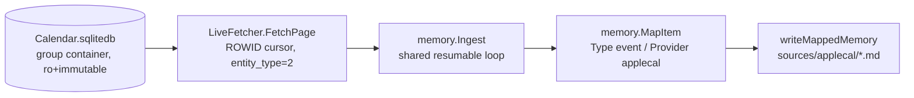

# 12 — Apple Calendar Connector

> Read-only reader of the local macOS Calendar store — one memory per event, mirroring the iMessage connector's constraints (pure Go, no net, no `internal/mora` import, FDA-gated). Added 2026-06-10.

## Files

| File | Responsibility |
|---|---|
| `internal/applecal/applecal.go` | The whole connector: `KindAppleCalEvent` + `RegisterKind` init, `DefaultDBPath`/`LegacyDBPath`, `LiveFetcher` (read-only + immutable open, schema probe), `FetchPage` (ROWID-cursor paging, window bounds), `participants`, `eventItem` |
| `internal/mora/mora.go` | Wiring: `ingestAppleCal` (darwin gate, FDA error text, shared `Ingest` loop), `appleCalDBPath` (modern→legacy probe), `windowForAppleCal`, catalog entry `applecalendar`, `enableConnector` copy |
| `internal/mora/digest.go` | `syncStatusPathFor` case → `sync/applecal-<name>.json` |

## Design decisions

- **Store location**: the modern path is the calendar group container (`~/Library/Group Containers/group.com.apple.calendar/Calendar.sqlitedb`); `appleCalDBPath` probes it first, then the legacy `~/Library/Calendars/` location. Opened `mode=ro&immutable=1` — Calendar.app may hold the write lock, and immutable guarantees we can never mutate Apple's store.
- **Core Data epoch**: all store timestamps are seconds since 2001-01-01T00:00:00Z (`appleEpoch`/`appleTime`).
- **Events only**: `entity_type = 2` selects events (reminders/tasks use other values); `hidden = 0` skips recurrence phantoms.
- **Forward bound (flood guard)**: `windowForAppleCal` always sets `Until = now + 180d`. Apple Calendar stores subscribed-holiday/sports events YEARS out; an unbounded Until floods the vault and the digest's upcoming-events framing. `SinceDays` keeps the iMessage semantics (0 ⇒ 90d back, negative ⇒ all-time past).
- **Schema probe at open** (the imessage Pitfall-9 lesson): required tables/columns are verified via `PRAGMA table_info` so an OS schema change errors as `unsupported Calendar.sqlitedb schema: …` at connect time, not cryptically mid-query.
- **Meta mirrors Google Calendar conventions** (`attendees` sorted+normalized emails, `organizer` from Participant role 1, `occurred_at`) so the entity graph's connector-capture path reads both calendars identically. Participant lookups are best-effort — a failure drops the edge, never the event.
- **FDA story is iMessage's, verbatim**: the gate is Full Disk Access, per-binary under TCC (a terminal grant does not cover the launchd-spawned binary — see [distribution-and-ops](./10-distribution-and-ops.md) on ad-hoc signing invalidating grants). The open error wraps to "cannot read your Calendar database (Full Disk Access not granted?) — run `mora doctor`".

## Tests

`internal/applecal/applecal_test.go` seeds a fixture sqlite store: window bounds (both ends), hidden/entity-type filtering, Core Data conversion, participant normalization + organizer split, cursor paging, kind registration through the shared `MapItem`, and the unsupported-schema error.

## Related

- [iMessage connector](./05-connectors-imessage.md) — the pattern this mirrors (read-only local store, FDA, no-net invariant)
- [sync & freshness](./11-sync-and-freshness.md) — `ingest run --all` warn-and-continue (one broken connector can't starve this one)
