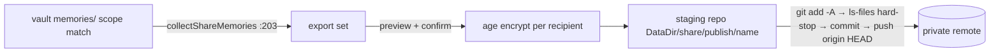

# 13 — Sharing (`mora share`)

`mora share` sends governed memory data out of Mora (#51). It publishes
**one scope of authored memories**. Mora encrypts the scope for each recipient
with age. It sends the result to a **dedicated private git remote** or a
**user-owned S3/R2 bucket**. See
[14 — Share transports](14-share-transports.md).

A subscriber decrypts the share into a **read-only, separately-indexed
corpus**. `search`/`think` joins this corpus to local results and names the
owner. This document describes the built system. The final section records
later work.

## Files

| File | Lines | Responsibility |
|---|---|---|
| `internal/mora/share*.go` | — | CLI consent, registry mutation, git transport, fetch/build/commit ordering, publication/import governance, query-time union, health composition, and orchestration. |
| `internal/sharing/` | — | Transport-neutral paths/contracts, encrypted bucket transport, durable ledgers, the owner-fenced `attempt.json` lifecycle, and immutable-generation paths, commit resolution, and artifact digests. |
| `internal/mora/share*_test.go` | — | End-to-end coverage with real age crypto plus fake git/transport seams. Lower storage and transport mechanics are tested with their implementations. |
| `internal/gitsync`; Mora adapter | — | Reused trust primitives now live below Mora: credential-redacted `Runner`/`RealExec`, plain-`.git` guard, remote configuration, and fallback commit identity. Mora keeps CLI parsing and off-device consent/disclosure. |

## The two sides

**Publish** (`shareInit` `share.go:322`, `sharePush` `share.go:651`):

**Subscribe** (`shareSubscribe` `share.go:1061`, `sharePull` `share.go:1164`, `shareImport` `share.go:871`):

State lives in three places: the grant registry `<ConfigDir>/shares.json` (`loadShares`/`saveShares`, 0600), the subscriber's age identity `<ConfigDir>/share/identity.txt` (`shareKeygen` `share.go:146`, 0600, never overwritten), and the publisher's local change-detection record `<StateDir>/share/publish/<name>.json` (`sharePushStatePath` `share.go:459`) — plaintext content hashes that deliberately never enter the repo (they would let a ciphertext holder confirm guessed plaintext).

## What may be exported

`collectShareMemories` (`share.go:203`) is the entire answer to "what can leave":

- Walks `VaultDir/memories` **only** — connector evidence under `sources/` is structurally out of reach (provider-derived IDs collide across vaults, `meta` carries participant PII, `att_` paths are machine-local).
- Frontmatter `scope` exact-match. The scope itself must match `^(personal|global|project:[A-Za-z0-9][A-Za-z0-9._-]*)$` **before** any filesystem access.
- Tombstones (`deleted_at`) and anything provider-stamped are skipped. A symlink anywhere in the tree aborts the export loudly. Every selected file is re-verified (`resolveReal`) to resolve inside the memories root. Ids must match `shareExportIDRE` (safe-filename charset) because they become filenames in every subscriber's corpus.

## Query-time union

`unionSharedResults` (`share.go:1386`) is called from exactly two seams: `defaultSearch` (`hybrid.go`) — covering `mora search` CLI and MCP `search_memory` — and `buildThink` (`think.go`). With zero subscriptions it returns the local slice **unchanged**, so the no-share path is byte-identical (the T0 MCP budget gate depends on this). With subscriptions it rank-fuses (RRF, `rrfWeighted`) the local list against each share's BM25 list: local arm weight 1.5 (the hybrid fusion's strongest-arm anchor), all shares together share 1.0 (`share.go` fusion constants) so multiple subscriptions cannot collectively out-vote the user's own vault. Results carry `Memory.Owner` (= subscription name, `omitempty`); `ThinkEvidence.Owner` and a `(shared:<owner>, …)` prompt line label think evidence.

Each share index is a schema-compatible subset (`memories` + `memories_fts`, `user_version` stamped) — FTS-only, no vectors/graph/entities — built once per **generation** (see the next section) and opened only via `openShareIndexRO`: direct DSN with `mode=ro` + `query_only(1)` pragma, never `openIndexRO`, whose auto-heal would rebuild the file from the wrong (personal) vault. Every serve resolves the highest committed generation and verifies the artifact it reads against a per-generation integrity digest. Shared ids returned by search resolve to full text on the read-only surfaces (`mora read`, MCP `read_memory`) via `findSharedMemory`, which reads the resolved generation's frozen corpus and verifies it against the committed `corpus_digest`. Delete paths never take that fallback.

## Generation-publish index health (Gate 2, HEALTH-09/-10)

The subscribed-share index is a *second derived index* — a live read path that reproduced #140's "a fresh source timestamp masks an older committed index" failure. Packet H redesigns the subscribe/pull import to **generation-publish** so a reaped-then-resumed ("zombie") import holder can never serve stale, torn, or revoked content.

- **Immutable per-run generations.** An import never mutates a published corpus or index. It writes a new `gens/gen-<run_id>/` (frozen `corpus/<id>.md` + `index.db`), then makes it visible by claiming the next slot in a monotonic commit sequence via an atomic `os.Link` of `commits/<seq>` — the **one** fence, run while holding the per-subscription import lease. A zombie's mid-flight writes land in an abandoned generation nobody can resolve. The only thing left to fence is the single commit link. Layout: `subs/<name>/{repo,gens/,commits/,attempt.json,import.lock,migrated,fetch-<run_id>/}`.
- **Run-id-private, immutable build input.** Git pins the branch's configured merge source into `refs/mora/import/<run_id>` (`git fetch --atomic --no-write-fetch-head --no-tags --no-auto-maintenance --refmap= origin +<merge-ref>:<pin>`), preserves the non-fast-forward refusal with an explicit `git merge-base --is-ancestor`, and reads objects only from that ref — never the shared working tree, `FETCH_HEAD`, or tracking refs. Bucket materializes each fetch into a run-private `fetch-<run_id>/` staging dir. So a reaped holder mutating the shared clone cannot contaminate a successor's build.
- **Serving resolves the highest committed generation. Fail-closed by construction.** `internal/sharing.GenerationStore.Resolve` (adapted as `resolvePublishedCommit` in Mora) reads a *directory listing* (`commits/`), not a mutable pointer, so a reader can never observe an "absent pointer served as healthy": it sees a complete committed generation or nothing. Search authenticates `index.db` against the committed `index_digest`. Read authenticates the corpus against `corpus_digest`, hashing and serving the **same bytes it read** (read-once). Both digests are recomputed on **every serve with no positive cache** (a byte-flip need not change the mtime). A corrupt/substituted `index.db` fails search closed and heals by re-cutting a repair generation from the head's own frozen corpus (never a stray/out-of-band file). A corrupt corpus fails read closed while search keeps serving the intact index — per-artifact serving, cross-artifact visibility.
- **Owner-fenced lease, attempt record, and health.** The import lease's release and heartbeat are **run_id compare-and-claim, never blind** (`releaseLockFileFor`/`heartbeatLockFileFor`), so a reaped holder's late release cannot drop its successor's lease and its heartbeat cannot resurrect its own. One durable, never-cleared `attempt.json` (`internal/sharing.AttemptStore`, owner-CAS active→terminal through `internal/atomicio.ClaimExclusiveDurable`) surfaces a SIGKILLed pull: `shareHealthOne` is worst-of over the committed head + the attempt record, and reads `fresh` **only** when the latest attempt has a matching durable `succeeded` record. A `failed`/`stale` share still serves its last-good head with the `shares_unhealthy` warning. Only a `never`/no-valid-artifact subscription is excluded from the surface that lacks the artifact.
- **Bucket anti-rollback survives crashes, heal, and GC.** Every commit record carries a monotonic `BucketFloor` = `max(sub.LastVersion, max committed floor, fetched version)`. A heal/repair inherits its parent's floor. The claim loop rejects any fetched version below the committed floor *before* building. GC refuses to delete a record if that would lower the published head's floor.
- **Bounded GC + one whole-product byte bound.** A preflight sweep reclaims committed losers/superseded gens (keeping `shareGenRetain`=3), uncommitted crash orphans, stale `fetch-*`/import-ref orphans, and old commit records — never the published head — deferring Windows open-file deletions to the next sweep. Admission is bounded by a single **whole-product** limit (default 15 GiB = the doctor ceiling) accounted by `productStorageBytes` across `Vault/Config/Data/StateDir` (hard-link deduped, fail-closed on an unreadable path), serialized by one global `storage.lock`. A legal larger share has an explicit durable opt-in: `mora share storage-limit <bytes>`. `mora share gc [<name>]` runs the same sweep out of band.
- **Legacy migration is fail-closed.** An existing flat subscription (`corpus/`+`index.db`, no `gens/`) is surfaced `failed`/`never` ("run `mora share pull`") until its first post-upgrade pull mints `gen-1` **from the pinned repo snapshot** (never re-cutting the untrusted local index/corpus) behind a durable one-way `migrated` latch — no fail-open window, no schema bump.

Doctor gets one critical `share_fresh:<name>` check per subscription; `Health.Index.Shares` makes the aggregate worst-of across the personal index and every subscription. `read_memory`/`search_memory`/`think` carry an additive `shares_unhealthy` key.

## Invariants & gotchas

- **The subscriber's vault and identity graph are never mutated by a share.** Everything share-related lives under `<DataDir>/share/`. The personal index walk covers only `memories/`+`sources/`, `mora backup` tars only the vault, vault git-sync stages only the vault, and `delete_memory` can only reach the two vault roots. *Why:* #51's core guarantee — reading someone must never rewrite you.
- **`shareGuardPaths` (`share.go:1648`) refuses every share verb when the share root or identity dir resolves inside the vault.** `data_dir` is user-configurable and may be co-located with the vault. Without the guard a subscriber's DECRYPTED corpus would ride the vault backup/git-sync. Resolution walks symlinks through the deepest existing ancestor (`resolveRealDeep`). *Why:* placement is the security boundary, so it is enforced at runtime, not assumed.
- **Encryption is mandatory and structural.** `push` refuses without a parseable recipient key (even a hand-edited registry), only `*.md.age` is ever written into staging, the staging `.gitignore` excludes `*.md`, and the post-`git add` `ls-files` hard-stop is an ALLOWLIST (stronger than `sync git`'s denylist): any tracked path other than `.gitignore`, `share.json`, and safe-named `memories/*.md.age` refuses the push, so a stray file can never leave unpreviewed. `doctor` runs `share_staging_clean` and discloses every publish. *Why:* "unencrypted share" must be unrepresentable, not discouraged.
- **Preview before anything mutates.** `sharePush` prints the exact add/update/remove list (and `share preview` the full content) *before* the confirm gate. Non-TTY without `--yes` is refused (`confirmSharePushFn` seam, mirroring `confirmVaultRepointFn`). *Why:* #51 P0 — the user sees exactly what leaves, every time.
- **Push state is recorded only after a successful `git push`.** A failed push re-publishes next run instead of silently leaving the remote stale; `push` always pushes even with no content changes for the same reason. Never `--force`. Origin must match the registry remote (`sharePush` origin check) so a swapped origin cannot exfiltrate to an unapproved destination. *Why:* honest-snapshot rule applied to egress.
- **Imported repo content is untrusted input.** Non-regular files, unsafe names, id-spoofs (frontmatter id ≠ filename stem), scope mismatches vs the manifest, and >4 MiB memories all abort the import. The attribution label is the **subscriber-chosen** subscription name, never publisher-controlled manifest metadata. The non-fast-forward refusal is preserved by an explicit `git merge-base --is-ancestor` gate on the run-private pin: a publisher history rewrite fails loudly with a re-subscribe pointer. *Why:* a chosen counterparty is still not a trusted code path.
- **Gap analysis stays local.** `buildThink` computes gaps from the pre-union local results only — "what the vault does not know" means the *user's* vault, and shared ids must never be compared against the personal retrieval trace or entity graph. *Why:* honest gaps are the trust feature. Polluting them with foreign corpora would fabricate coverage.
- **Revocation is honest.** `share remove` stops future pushes and deletes local state. The message states plainly that git history is durable and subscribers keep what they pulled — rotation (new repo + new keys) is the way to cut future access. *Why:* docs-honesty rule. Implying recall would be a lie.

## Related

- [01 — Data Model & Storage](./01-data-model-and-storage.md) — the frontmatter format shared files carry verbatim.
- [02 — Retrieval & Search](./02-retrieval-search.md) — `defaultSearch`, RRF fusion, the FTS arm the share index reuses.
- [07 — Synthesis](./07-synthesis-think-digest.md) — `think`'s evidence/gap envelope that now carries `owner`.
- [11 — Sync & Freshness](./11-sync-and-freshness.md) — `mora sync git`, whose trust model (redaction, hard-stop, never-force) this subsystem reuses on a dedicated repo.

## Open questions / unverified

- Fusion weights (1.5 local / 1.0 shared total, k=10) are principled but untuned — no T2-style eval discriminates local-vs-shared ranking yet.
- v1.1 per-share graph view (`mora graph --share <name>`) and the deferred items from #51 (connector-evidence snapshots, owner-namespaced merged graph, multi-writer, field-level redaction) are not built.
- The grant ledger is `shares.json`; #52 (forget) and #53 (prune) are expected to grow the same registry pattern into suppressions consulted at `writeMappedMemory` — not designed here.
