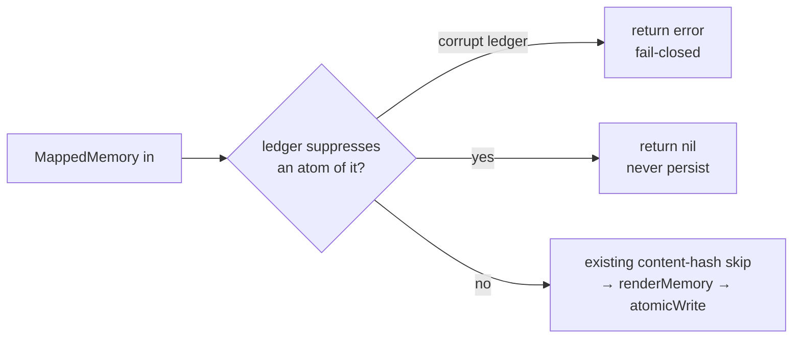

# 17 — Governance ledger (`mora forget`)

The governance ledger is Mora's durable, local record of *who decided what about which memory, and when* — the governance/provenance layer that selective forgetting (#52) and bounded retention (#53) both need. It is the durable half of `mora forget`: the reason a deletion **survives the hourly, agent-less sync** instead of being silently re-created. This document describes what is built; the deferred items are listed at the end.

## The problem it solves

`mora delete` does not stick for connector memories. Sync re-fetches everything inside its window with no agent in the loop, and the single write boundary (`writeMappedMemory`) re-creates any file missing at its stable path — so "I deleted that chat" becomes "that chat is back within the hour" (see [11 — Sync & Freshness](./11-sync-and-freshness.md): sync is upsert-only). The only durable fix is a persistent, **identity-keyed** suppression the write path consults before re-creating anything.

## Files

| File | Responsibility |
|---|---|
| `internal/mora/governance.go` | The whole primitive: the ledger types, load/save/append/revoke (serialized under `acquireGovernanceLock`), the stable-atom key derivation from `Meta`, the suppression decision, and the guard entry point `shouldSuppressWrite`. |
| `internal/mora/governance_cmd.go` | The CLI: `cmdForget` / `cmdUnforget` / `forget list`, the vault scan that computes the removal set, and the confirm/dry-run gating. |
| `internal/mora/ingest.go` | Two guards: one at the top of `writeMappedMemory` (the single connector write chokepoint), and one in `ingestFilesystem`, which renders directly and bypasses `writeMappedMemory` (see gotcha below). |
| `internal/mora/pdf.go` | One added guard at the top of `writeAttachmentMemories` (the derived-attachment write path — see gotcha below). |

## The stable-atom key (why the key shape matters)

A suppression is keyed by the **source-native atom** `{provider, kind, value}`, where `kind ∈ {stable_id, handle, address, host}` — **never** the post-merge `person:` graph id, which *moves* as identities merge and split (the #52 trap). `provider == ""` is a cross-provider wildcard (e.g. one email address forgotten across Gmail **and** Calendar).

Atoms are derived from a memory the same way the [entity graph](./03-entity-graph.md) reads identity (`metaPairs`/`metaStrings`), so the ledger's identity view matches the graph's:

| Atom | Derived from | Example |
|---|---|---|
| `stable_id` | `mm.StableID` (verbatim — never `@account`-stripped) | `imessage_chat/<guid>`, `gmail_thread/<id>` |
| `handle` | iMessage `Meta["participants"][].handle` | `+14155550123` |
| `address` | Gmail/Calendar `Meta["from"\|"to"\|"cc"\|"attendees"\|"organizer"]` (lowercased) | `sam@example.com` |
| `host` | *reserved* — no connector populates a host field yet | — |

Normalization is deliberately minimal (lowercase addresses/email-shaped handles, trim; phone handles trimmed only). It does **not** do phone/email canonicalization — that lives in `canonicalizePersons`, and coupling to it would risk a false merge. Precision-first: under-match rather than over-match.

## The write-chokepoint guard

`writeMappedMemory` (the one boundary every connector routes through) consults the ledger before persisting anything:



The decision (`governance.decideSuppress`, pure over `(ledger, provider, stableID, meta)`):

- **Item (`stable_id`) match → always suppress** the whole memory (forget a chat/thread/event). Exact stable-id only: forgetting `gmail_thread/x` does **not** touch `gmail_thread/x@work` (stripping `@account` would over-match across accounts).
- **Identity (`handle`/`address`) match → suppress only a SOLE-COUNTERPARTY (1:1) memory** — the forgotten identity is the memory's *only* external counterparty. A group thread where the identity is one of many is **kept** (the data-loss / "layoff email" guard); its per-participant redaction is deferred to the P16 graph-compile-time filter. For Gmail/Calendar the address set includes the user's own address, so identity suppression there only fires on a genuinely single-address thread — person-level email suppression needs self-identity (P13).

## Invariants & gotchas

- **The primary guard cannot be bypassed by a new sync.** It lives inside `writeMappedMemory`, so all connector call sites (gmail/imessage/applecal) are covered without per-site edits. *Why:* a suppression the sync path doesn't read is silently reverted every hour.
- **Two write paths route around the primary chokepoint, so each carries its own guard.** (1) `writeAttachmentMemories` (iMessage PDFs) mints `att_<hash>` ids that do **not** carry the parent's participant `Meta`, so it checks the *parent's* suppression before extracting — a forgotten conversation's PDFs are not smuggled in. (2) `ingestFilesystem` renders memories **directly** (never through `writeMappedMemory`), so it consults the ledger per file before writing — otherwise a `forget --chat <src-id>` is undone by the very next filesystem walk. Only `stable_id` (item) forgets reach filesystem memories: they carry no participant identity, so `--handle`/`--email` never target them. *Why:* the "single chokepoint" is really three — the primary plus these two derived/direct siblings.
- **Ledger writes are serialized across processes.** `appendGovernanceEntry` / `revokeGovernanceEntry` take a crash-safe file lease (`acquireGovernanceLock`, the same primitive as the `sources.json` lease — see [15 — Concurrency contract](./15-concurrency-contract.md)) and **reload inside the lease**, so two racing `mora forget`s (or a future scheduled `prune`) can never clobber each other's entry. The `.mora-governance.json.lock` lease is a `*.lock` file, excluded by the vault `.gitignore`, so a leftover lock never rides `mora sync git`. *Why:* a dropped suppression whose files were already removed is a silent resurrection — the exact lost-update the concurrency campaign closed for `sources.json`.
- **A corrupt ledger fails closed.** `loadGovernance` returns an error on unparseable JSON (never treats it as empty). The write path surfaces it — an item write fails, and the [honest-snapshot rule](./11-sync-and-freshness.md) means the sync does not stamp success. *Why:* silently ignoring the ledger would resurrect forgotten (possibly abusive) content — a privacy violation worse than a loud sync failure.
- **The ledger is vault-resident and rides `mora sync git`.** `<VaultDir>/.mora-governance.json` sits beside the `.mora-vault.json` identity marker. Being a **dotfile, not `*.md`**, `rebuildIndexWithPolicy` never parses it as a memory; being outside the vault `.gitignore` (index.db/tokens/identity*/share/), it syncs to a user's other devices, so a forget on the laptop is not undone by the desktop (#52). Written 0600 via `atomicWrite`.
- **Local-only; never touches the source.** `forget` removes the local copy and records a suppression. It issues no Gmail/Apple/Calendar write — the read-only-at-source guarantee ([AGENTS.md R3](./00-overview.md)) is intact. The CLI says so plainly.
- **Byte-identical rebuild is preserved.** The ledger writes nothing to the index; the removal set is a deterministic (sorted) scan; the suppression decision is an order-independent OR over active entries. A rebuild with the ledger present is identical to one without it (the dotfile is skipped).

## The CLI

```bash
mora forget --chat <stable-id>   # forget one conversation/thread/event
mora forget --handle <handle>    # forget a 1:1 iMessage counterpart
mora forget --email <address>    # forget a 1:1 email counterpart
mora forget list                 # show active suppressions
mora unforget <entry-id> --yes   # revoke a suppression
#   --dry-run  preview exactly which memories would be removed
#   --yes      required to actually remove (destructive)
```

A `forget` **records the suppression first**, then removes the matching files, then rebuilds the index — so a crash after removal can never leave files gone but re-ingestable. The removal set is computed with the *same* `decideSuppress` the write path uses, so what is removed now is exactly what stays suppressed on re-sync (never more). Authored notes carry no connector identity and are never matched (a plain `mora delete` already forgets them permanently — nothing re-ingests them). `unforget` revokes the entry so future syncs may re-ingest the content again, subject to the connector's lookback window (not a guaranteed restore of already-removed older content).

## Reconciliation with the iMessage deny-list

The pre-existing iMessage deny-list (`Source.DenyContacts`/`DenyConversations`, applied inside the fetcher) filters at **fetch** time — a denied conversation never reaches the write path. The governance ledger is the **write**-time generalization #52 asked for: cross-connector, mutable after setup, and keyed on the same source-native identities. The two are complementary layers (fetch-time is an optimization that avoids decoding; write-time is the durable enforcement) and do not conflict.

## Related

- [01 — Data Model & Storage](./01-data-model-and-storage.md) — `writeMappedMemory`, the content-hash skip, tombstones vs `mora delete` resurrection.
- [03 — Person Entity Graph](./03-entity-graph.md) — `metaPairs`/`metaStrings` (the same `Meta` coercion), `canonicalizePersons`, precision-first non-merging.
- [11 — Sync & Freshness](./11-sync-and-freshness.md) — the upsert-only sync and honest-snapshot rule the guard rides on.
- [13 — Sharing](./13-sharing.md) — the sibling governance verb; its footer anticipated this ledger.

## Deferred (not built here)

- **Person-level fan-out.** Resolving "a person" to all their aliases/handles/addresses needs the identity graph (P13). v1 is atom-level: `--handle`/`--email` act on the exact identity, sole-counterparty only.
- **Group-thread redaction.** Filtering a forgotten participant out of a *kept* group thread is a graph-compile-time step (P16); the `redact` entry kind is reserved for it.
- **`mora prune` (#53).** Size-driven, tombstone-based bounded retention shares this ledger (a `prune`/`source_scope` kind, `suppress` action) but is a separate verb; `compact` (true disk reclaim) is out of scope.
- **`merge_confirm` application.** The ledger persists a two-atom correction ("these identities are / are not the same person") keyed by stable-atoms, and it survives re-sync; *applying* it to the graph is the P13 confirm-queue.
- **MCP `forget_memory` verb.** The CLI is the surface here; the MCP sibling is governed by the [MCP contract](./06-mcp-server.md) budget gate and is deferred.
